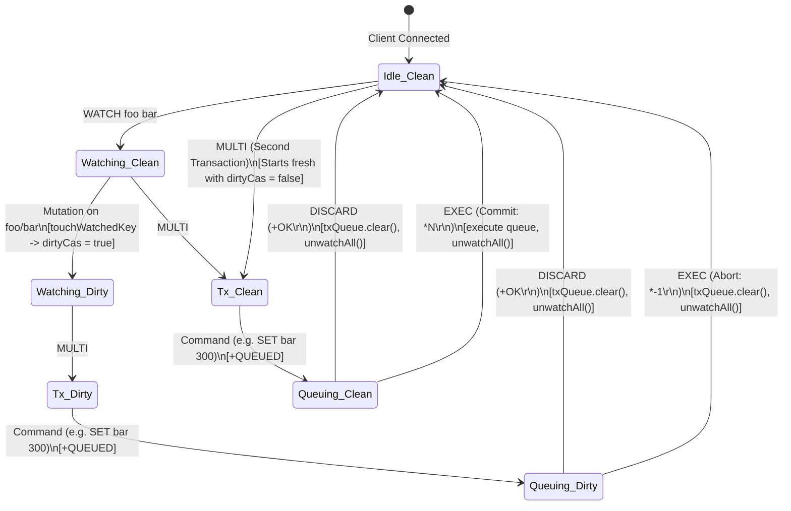
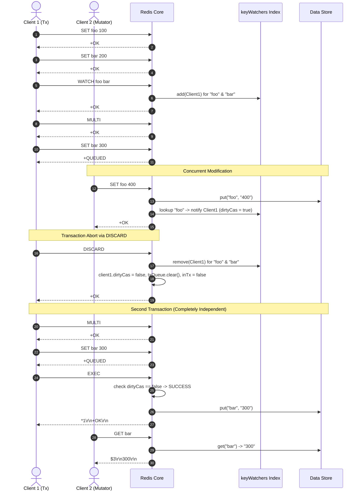
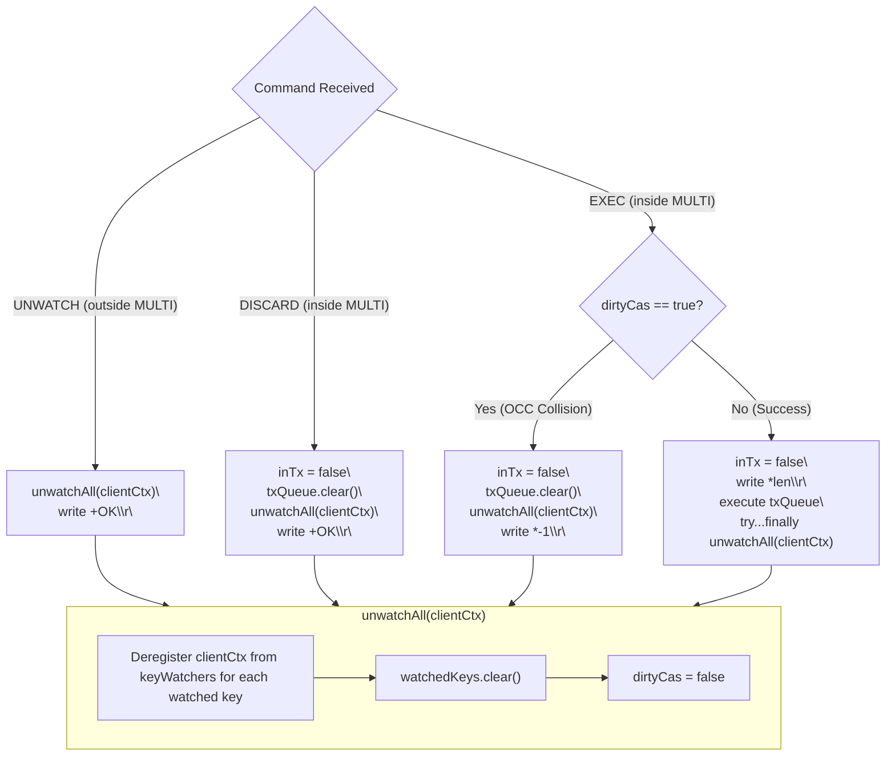

# Stage 50: Unwatch on DISCARD

---

## In one line
Ensure that `DISCARD` aborts the active transaction, drains the queued command buffer, exits transaction mode (`inTx = false`), unconditionally unregisters the client from the global `keyWatchers` inverted index, and resets `dirtyCas = false`, preventing stale watch mutations from poisoning future transactions on the connection.

---

## Self-test (cover the answers below and answer these first)
1. **Why must `DISCARD` perform an automatic unwatch, just like `EXEC`?**
   - *Answer*: `WATCH` is designed solely as an Optimistic Concurrency Control (OCC) guard for the immediately following transaction. When a client abandons a transaction via `DISCARD`, the check-and-set sequence is aborted. If watched keys were not cleared, any past mutations that occurred while the keys were watched would remain recorded in `dirtyCas = true`, causing subsequent, unrelated transactions on that connection to spuriously abort.
2. **What happens if a client executes `WATCH foo`, another client updates `foo`, the first client executes `MULTI`, then `DISCARD`, and then starts a fresh `MULTI ... EXEC` block?**
   - *Answer*: If `DISCARD` correctly performs watch teardown via `unwatchAll`, the client's `dirtyCas` flag is reset to `false` and its entry in `keyWatchers.get("foo")` is removed. When the client executes the second transaction, it starts with a completely clean CAS state. As a result, the second transaction succeeds and commits its operations, completely unaffected by the mutation of `foo` that happened before `DISCARD`.
3. **What is the RESP return value of `DISCARD` when called inside an active transaction? What is the return value when called outside a transaction?**
   - *Answer*: Inside an active transaction (`inTx == true`), `DISCARD` returns Simple String `+OK\r\n`. Outside an active transaction (`inTx == false`), `DISCARD` returns a RESP Simple Error `-ERR DISCARD without MULTI\r\n`.
4. **How does `DISCARD` teardown differ from an aborted `EXEC` teardown?**
   - *Answer*: Both discard the queued commands (`txQueue.clear()`), exit transaction mode (`inTx = false`), and tear down watch state (`unwatchAll`: unregistering from `keyWatchers` and resetting `dirtyCas = false`). However, `DISCARD` is an explicit client abort that unconditionally returns `+OK\r\n`, whereas an aborted `EXEC` is a server-side OCC collision rejection that returns a RESP Null Array `*-1\r\n`.
5. **Why must `unwatchAll` remove the client from the global `keyWatchers` inverted index rather than only clearing the client's local `watchedKeys` set?**
   - *Answer*: If the client is not purged from the global `keyWatchers` set for each key, subsequent write commands (such as `SET`, `INCR`, `LPUSH`) from other clients will iterate over `keyWatchers.get(key)`, encounter the stale `ClientContext`, and flag its `dirtyCas = true`. The client's next transaction would then fail unexpectedly, and retaining orphaned `ClientContext` references in global sets would cause a memory leak.
6. **In production Redis connection pools, why is `DISCARD` critical for connection health when application errors occur during transaction staging?**
   - *Answer*: If an application encounters an error or exception while buffering commands between `MULTI` and `EXEC`, it must issue `DISCARD` before returning the connection to the pool. `DISCARD` flushes partial state, clears transaction mode, and unregisters all watch hooks, guaranteeing the connection is clean and safe for the next worker thread.

---

## Problem Solved

In Stages 43 through 49, we implemented Optimistic Concurrency Control (OCC) using `WATCH`, multi-key monitoring, inverted index registration (`keyWatchers`), and watch cleanup upon `UNWATCH` and `EXEC`.

However, an application is not obligated to conclude every transaction with `EXEC`. Applications frequently encounter conditions where they decide to abandon a transaction before execution:
- Business validation fails midway through staging commands.
- An unexpected error occurs on the client application side before `EXEC`.
- An application timeout triggers a rollback.

When a client aborts with `DISCARD`:
1. The transaction command queue must be discarded.
2. The connection must exit transaction mode (`inTx = false`).
3. **The connection's watch state must be cleared completely** (all keys unwatched, and `dirtyCas` reset to `false`).

### The Bug Without Watch Cleanup on DISCARD

Consider the following execution sequence across two clients:

```text
# Client 1 sets up initial state
Client 1: SET foo 100         -> +OK\r\n
Client 1: SET bar 200         -> +OK\r\n

# Client 1 watches both keys and enters transaction
Client 1: WATCH foo bar       -> +OK\r\n
Client 1: MULTI               -> +OK\r\n
Client 1: SET bar 300         -> +QUEUED\r\n

# Client 2 mutates watched key 'foo'
Client 2: SET foo 400         -> +OK\r\n
# (Server triggers touchWatchedKey("foo") -> Client 1's dirtyCas = true)

# Client 1 decides to abort
Client 1: DISCARD             -> +OK\r\n

# Client 1 immediately starts a new transaction without WATCH
Client 1: MULTI               -> +OK\r\n
Client 1: SET bar 300         -> +QUEUED\r\n
Client 1: EXEC                -> ???
```

- **If `DISCARD` fails to clean up watch state**:
  `Client 1` remains in `keyWatchers["foo"]` and `keyWatchers["bar"]`, and `dirtyCas` remains `true`. When `Client 1` invokes `EXEC` on the second transaction, the server sees `dirtyCas == true` and returns `*-1\r\n`. The second transaction fails even though `Client 1` never called `WATCH` for it!
- **With proper `unwatchAll` on `DISCARD`**:
  `DISCARD` removes `Client 1` from all watcher sets, clears `watchedKeys`, and resets `dirtyCas = false`. When `Client 1` runs the second transaction, `dirtyCas` is `false`, the commands execute, and `EXEC` returns `*1\r\n+OK\r\n`. Subsequent queries confirm `bar` is now `300`.

---

## Thought Process & Architectural Model

### 1. State Machine: Transaction and OCC Lifecycle with DISCARD
A client connection transitions between idle, watched, queued, and aborted states. `DISCARD` acts as a full reset back to `Idle_Clean`:



### 2. Multi-Client Sequence: DISCARD Teardown and Subsequent Transaction Success



### 3. Cleanup Symmetry: DISCARD vs EXEC vs UNWATCH



---

## Full Solution

### 1. The `ClientContext` and Inverted Index

Each client connection holds a dedicated `ClientContext` tracking its watched keys and CAS status. The global inverted index `keyWatchers` maps keys to active watchers:

```java
  private static class ClientContext {
    final Set<String> watchedKeys = ConcurrentHashMap.newKeySet();
    volatile boolean dirtyCas = false;
  }

  private static final Map<String, Set<ClientContext>> keyWatchers = new ConcurrentHashMap<>();
```

### 2. The `unwatchAll` Teardown Primitive

```java
  private static void unwatchAll(ClientContext clientCtx) {
    for (String key : clientCtx.watchedKeys) {
      Set<ClientContext> clients = keyWatchers.get(key);
      if (clients != null) {
        clients.remove(clientCtx);
      }
    }
    clientCtx.watchedKeys.clear();
    clientCtx.dirtyCas = false;
  }
```

### 3. The Command Handler in the Client Loop

In `Main.java`, inside the connection loop:

```java
              String command = parts[0];

              if (inTx[0]) {
                if (command.equalsIgnoreCase("EXEC")) {
                  inTx[0] = false;
                  synchronized (txExecutionLock) {
                    if (clientCtx.dirtyCas) {
                      unwatchAll(clientCtx);
                      txQueue.clear();
                      out.write("*-1\r\n".getBytes(StandardCharsets.UTF_8));
                      out.flush();
                      continue;
                    }
                    out.write(("*" + txQueue.size() + "\r\n").getBytes(StandardCharsets.UTF_8));
                    try {
                      for (String[] cmd : txQueue) {
                        handleCommand(cmd, out);
                      }
                    } finally {
                      unwatchAll(clientCtx);
                      out.flush();
                      txQueue.clear();
                    }
                  }
                  continue;
                } else if (command.equalsIgnoreCase("DISCARD")) {
                  inTx[0] = false;
                  txQueue.clear();
                  unwatchAll(clientCtx);
                  out.write("+OK\r\n".getBytes(StandardCharsets.UTF_8));
                  out.flush();
                  continue;
                } else if (command.equalsIgnoreCase("MULTI")) {
                  out.write("-ERR MULTI calls can not be nested\r\n".getBytes(StandardCharsets.UTF_8));
                  out.flush();
                  continue;
                } else if (command.equalsIgnoreCase("WATCH")) {
                  out.write("-ERR WATCH inside MULTI is not allowed\r\n".getBytes(StandardCharsets.UTF_8));
                  out.flush();
                  continue;
                } else {
                  txQueue.add(parts);
                  out.write("+QUEUED\r\n".getBytes(StandardCharsets.UTF_8));
                  out.flush();
                  continue;
                }
              }

              // Commands outside MULTI
              if (command.equalsIgnoreCase("EXEC")) {
                out.write("-ERR EXEC without MULTI\r\n".getBytes(StandardCharsets.UTF_8));
                out.flush();
              } else if (command.equalsIgnoreCase("DISCARD")) {
                out.write("-ERR DISCARD without MULTI\r\n".getBytes(StandardCharsets.UTF_8));
                out.flush();
              } else if (command.equalsIgnoreCase("MULTI")) {
                inTx[0] = true;
                out.write("+OK\r\n".getBytes(StandardCharsets.UTF_8));
                out.flush();
              } else if (command.equalsIgnoreCase("WATCH")) {
                // ...
              } else if (command.equalsIgnoreCase("UNWATCH")) {
                unwatchAll(clientCtx);
                out.write("+OK\r\n".getBytes(StandardCharsets.UTF_8));
                out.flush();
              } else {
                handleCommand(parts, out);
                out.flush();
              }
```

---

## Concepts (the transferable part)

- **Transaction Rollback vs Abort**:
  In relational databases (ACID), a rollback undoes mutations already written to disk or write-ahead log. In Redis transactions, queued commands are held in memory buffers on the client connection and are not executed until `EXEC`. Therefore, a `DISCARD` does not need to undo mutations; it simply empties the memory queue, resets transaction flags, and releases all locks/guards.
- **OCC Guard Lifecycle Management**:
  Optimistic locks must have a bounded lifespan. In Redis, `WATCH` pins a version check that is consumed by the very next transaction resolution. Both terminal operations of a transaction (`EXEC` and `DISCARD`) terminate the OCC session, restoring the connection to a clean slate.
- **Inverted Index Teardown**:
  A bidirectional association between `Client` and `Key` requires rigorous lifecycle maintenance. Storing references in global lookup structures without explicit deregistration on abort leads to memory leaks and spurious notifications.
- **Protocol Error Boundaries**:
  Commands that have state requirements (e.g. `DISCARD` requiring `MULTI`) must return explicit error codes (`-ERR DISCARD without MULTI\r\n`) when called out of context, keeping state machines strictly aligned between client and server.

---

## What Breaks It (failure modes)

- **Omitting `unwatchAll` on `DISCARD`**:
  The primary defect tested in this stage. If `DISCARD` only executes `txQueue.clear()` and `inTx = false`, any watched keys remain monitored and any `dirtyCas` flag remains `true`. The next `MULTI ... EXEC` block fails immediately.
- **Resetting `inTx` but Not Flushing `txQueue`**:
  If `inTx` is reset without clearing `txQueue`, a subsequent `MULTI` followed by more queued commands would append to the old discarded commands, executing unintended operations on the next `EXEC`.
- **Calling `DISCARD` Outside a Transaction**:
  If a client sends `DISCARD` when not in a transaction, the server must reject it with `-ERR DISCARD without MULTI\r\n`. Blindly clearing watch state or returning `+OK\r\n` outside `MULTI` violates the Redis specification.
- **Thread Safety During `unwatchAll`**:
  Concurrent mutations by other client threads may invoke `touchWatchedKey` while `unwatchAll` is executing. Because `keyWatchers.get(key)` returns a thread-safe `Set` (`ConcurrentHashMap.newKeySet()`), `remove(clientCtx)` is atomic. Resetting `dirtyCas = false` after deregistration ensures that no concurrent write can leave `dirtyCas = true` after `unwatchAll` finishes.

---

## Tradeoffs

- **Immediate Teardown on `DISCARD` vs Deferred Cleanup on Next `MULTI`**:
  - *Immediate Teardown (Redis choice)*: Clearing `watchedKeys` and `keyWatchers` immediately on `DISCARD` releases memory promptly and eliminates unnecessary notifications during subsequent key writes.
  - *Deferred Cleanup*: Waiting until the next `MULTI` would leave stale references in `keyWatchers`, increasing iteration overhead in `touchWatchedKey` for unrelated keys while the connection sits idle.
- **Single Reusable `unwatchAll` Helper vs Inline Logic**:
  - Centralizing cleanup in `unwatchAll` guarantees identical, bug-free teardown across `UNWATCH`, `EXEC` (abort), `EXEC` (commit), `DISCARD`, and client disconnection (`finally` block).

---

## Wire Format / Protocol

The test executes the following RESP communication sequence:

| Step | Client $\to$ Server (Raw Bytes) | Server $\to$ Client (Raw Bytes) | Description |
| :--- | :--- | :--- | :--- |
| 1 | `*3\r\n$3\r\nSET\r\n$3\r\nfoo\r\n$3\r\n100\r\n` | `+OK\r\n` | Client 1 sets initial `foo = 100` |
| 2 | `*3\r\n$3\r\nSET\r\n$3\r\nbar\r\n$3\r\n200\r\n` | `+OK\r\n` | Client 1 sets initial `bar = 200` |
| 3 | `*3\r\n$5\r\nWATCH\r\n$3\r\nfoo\r\n$3\r\nbar\r\n` | `+OK\r\n` | Client 1 watches `foo` and `bar` |
| 4 | `*1\r\n$5\r\nMULTI\r\n` | `+OK\r\n` | Client 1 enters transaction mode |
| 5 | `*3\r\n$3\r\nSET\r\n$3\r\nbar\r\n$3\r\n300\r\n` | `+QUEUED\r\n` | Client 1 queues mutation |
| 6 | *(Client 2)* `*3\r\n$3\r\nSET\r\n$3\r\nfoo\r\n$3\r\n400\r\n` | `+OK\r\n` | Client 2 modifies `foo` (Client 1 `dirtyCas = true`) |
| 7 | `*1\r\n$7\r\nDISCARD\r\n` | `+OK\r\n` | Client 1 aborts! Clears txQueue, inTx, and watch state |
| 8 | `*1\r\n$5\r\nMULTI\r\n` | `+OK\r\n` | Client 1 starts a fresh transaction (no active WATCH) |
| 9 | `*3\r\n$3\r\nSET\r\n$3\r\nbar\r\n$3\r\n300\r\n` | `+QUEUED\r\n` | Client 1 queues command in second transaction |
| 10 | `*1\r\n$4\r\nEXEC\r\n` | `*1\r\n+OK\r\n` | **Succeeds!** DISCARD cleared previous watch state |
| 11 | *(Client 2)* `*2\r\n$3\r\nGET\r\n$3\r\nbar\r\n` | `$3\r\n300\r\n` | Confirms transaction took effect (`300`) |

---

## Java Specifics — lookup, don't memorize

- `ConcurrentHashMap.newKeySet()`: Creates a thread-safe concurrent set backed by a `ConcurrentHashMap`. Enables safe concurrent iteration in `touchWatchedKey` while other threads call `remove(clientCtx)` in `unwatchAll`.
- `volatile boolean dirtyCas`: Provides immediate happens-before visibility across threads so updates in `touchWatchedKey` and resets in `unwatchAll` are observed without stale CPU cache reads.
- `List.clear()`: Empties an `ArrayList` in $O(1)$ amortized time by resetting size and clearing object references to allow garbage collection.

---

## Rebuild Checklist

- [ ] Declare `ClientContext` containing `watchedKeys` (`ConcurrentHashMap.newKeySet()`) and `volatile boolean dirtyCas = false`.
- [ ] Maintain global `keyWatchers = new ConcurrentHashMap<String, Set<ClientContext>>()`.
- [ ] Implement `unwatchAll(ClientContext clientCtx)`:
  - [ ] Loop over `clientCtx.watchedKeys` and remove `clientCtx` from `keyWatchers.get(key)`.
  - [ ] Clear `clientCtx.watchedKeys`.
  - [ ] Set `clientCtx.dirtyCas = false`.
- [ ] Handle `DISCARD` when `inTx` is true:
  - [ ] Set `inTx = false`.
  - [ ] Call `txQueue.clear()`.
  - [ ] Call `unwatchAll(clientCtx)`.
  - [ ] Write `+OK\r\n` and flush.
- [ ] Handle `DISCARD` when `inTx` is false:
  - [ ] Write `-ERR DISCARD without MULTI\r\n` and flush.
- [ ] Ensure `finally` block on client socket disconnect calls `unwatchAll(clientCtx)`.
- [ ] Verify that after `DISCARD`, a second `MULTI ... EXEC` succeeds even if a previously watched key was modified before the `DISCARD`.
