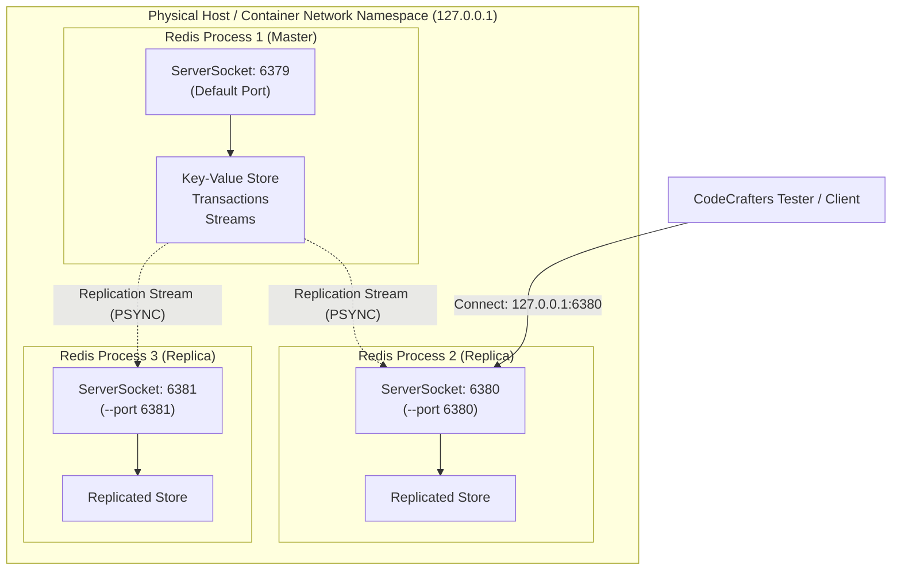

# Stage 51: Configure listening port

---

## In one line
Parse `--port <port_number>` from CLI arguments to dynamically bind the Redis TCP `ServerSocket` to a configurable port while defaulting to standard port `6379`, establishing the foundation for multi-instance leader-follower replication topologies on a single host.

---

## Self-test (cover the answers below and answer these first)
1. **Why does Redis leader-follower replication require configurable listening ports?**
   - *Answer*: In production local testing, benchmarking, or multi-node container environments sharing network namespaces, multiple Redis daemon instances (master and replicas) run concurrently on the same host interface. Since the OS kernel enforces exclusive binding on IP:port tuples (unless `SO_REUSEPORT` with load-balancing semantics is configured), each Redis server instance must bind to a unique TCP port (e.g., master on 6379, replicas on 6380, 6381) to accept independent client and replication traffic.
2. **What is the valid range of TCP port numbers, and what happens if a port outside this range or within the privileged range is requested?**
   - *Answer*: TCP port numbers are 16-bit unsigned integers ranging from `0` to `65535` (`0` requests an OS-assigned ephemeral port; valid server listen ports are `1` to `65535`). Ports `< 1024` are privileged (well-known ports) requiring root/administrator capabilities on POSIX/Windows systems; attempting to bind to them without appropriate privileges results in a `BindException: Permission denied`. Ports `> 65535` or `< 0` trigger an `IllegalArgumentException: Port value out of range`.
3. **What occurs at the OS socket level if two Redis processes attempt to bind to `0.0.0.0:6379` simultaneously?**
   - *Answer*: The first process successfully binds and enters the `LISTEN` state. When the second process executes `bind(2)`, the operating system kernel rejects the syscall with `EADDRINUSE` ("Address already in use"), causing Java to throw `java.net.BindException: Address already in use: JVM_Bind`.
4. **Why is sequential array scanning (`i < args.length`) with bounds-checked lookahead preferred over index assumptions when parsing CLI flags?**
   - *Answer*: CLI arguments can arrive in arbitrary order (e.g., `--port 6380 --dir /tmp` or `--dir /tmp --port 6380`). Sequential iteration allows matching key-value pairs by inspecting `args[i]` and verifying `i + 1 < args.length` before reading the operand, safely avoiding `ArrayIndexOutOfBoundsException` when a flag is placed at the end of the argument list without a value.
5. **Why does `SO_REUSEADDR` matter when restarting a Redis server instance on a custom port?**
   - *Answer*: When a server terminates while client connections are open or immediately after closing them, the underlying TCP sockets enter the `TIME_WAIT` state (typically 30–120 seconds) to ensure in-flight packets and delayed duplicate FIN/ACK segments drain safely. Without `SO_REUSEADDR`, immediately restarting the server on the same port causes `bind()` to fail with `EADDRINUSE`. Calling `setReuseAddress(true)` permits rebinding even if sockets in `TIME_WAIT` linger on that port.
6. **In the RESP protocol layer, does changing the listening port alter the request/response framing?**
   - *Answer*: No. The listening port is purely an OS transport-layer (L4 TCP) concern. Once the 3-way TCP handshake completes and a stream socket is established, the application-layer (L7 RESP) protocol framing (`*<count>\r\n$<len>\r\n...`) is completely invariant to the port number.

---

## Problem Solved

Up to Stage 50, our Redis server hardcoded its listening port to the standard default `6379`:
```java
int port = 6379;
ServerSocket serverSocket = new ServerSocket(port);
```

While sufficient for single-node development, this prevents building distributed systems. In Redis replication:
1. One master instance handles writes and distributes changes.
2. One or more replica instances replicate data from the master and serve read traffic.
3. Multiple instances running on the same development machine or test container must listen on distinct TCP ports (e.g., `--port 6380`, `--port 6381`).

Stage 51 introduces CLI argument parsing to dynamically configure the server's listening port via `--port <port_number>`, defaulting to `6379` if omitted.

---

## Thought Process & Architectural Model

### 1. Multi-Instance Replication Topology on a Single Host

When leader-follower replication is initialized, multiple Redis processes run side by side. Each process binds its own `ServerSocket` to a distinct port:



### 2. Argument Parsing and Socket Initialization Pipeline

The startup sequence processes command-line arguments prior to socket instantiation:

```mermaid
sequenceDiagram
    autonumber
    actor OS as Operating System / Shell
    participant Main as Main.main(String[] args)
    participant Parser as CLI Flag Scanner
    participant Net as ServerSocket(port)
    participant Loop as Client Accept Loop

    OS->>Main: exec java Main --port 6380
    Main->>Parser: scan args for "--port"
    alt Flag "--port" present and valid
        Parser-->>Main: parsed port = 6380
    else Flag absent
        Parser-->>Main: fallback default port = 6379
    else Flag malformed (e.g. non-numeric)
        Parser-->>Main: log warning, retain default 6379
    end

    Main->>Net: new ServerSocket(port)
    Net->>OS: bind(port) + listen(backlog=50)
    OS-->>Net: Socket Descriptor bound
    Main->>Net: setReuseAddress(true)
    Main->>Loop: serverSocket.accept()
    Note over Loop: Ready to accept client TCP handshakes
```

---

## Full Solution

### 1. Class-Level Configuration Storage
Store the configured port in a class-level variable so that future commands (such as `INFO replication` reporting `tcp_port` or replica synchronization handshakes) can reference the active port:

```java
public class Main {
  // ... existing fields ...
  private static int port = 6379;
```

### 2. Argument Parsing in `main(String[] args)`
Scan the argument list sequentially, looking for `--port` and consuming the subsequent argument with bounds and numeric validation:

```java
  public static void main(String[] args) {
    System.out.println("Logs from your program will appear here!");

    for (int i = 0; i < args.length; i++) {
      if ("--port".equalsIgnoreCase(args[i]) && i + 1 < args.length) {
        try {
          port = Integer.parseInt(args[i + 1]);
        } catch (NumberFormatException e) {
          System.err.println("Invalid port number: " + args[i + 1]);
        }
        i++;
      }
    }

    try {
      ServerSocket serverSocket = new ServerSocket(port);
      serverSocket.setReuseAddress(true);

      while (true) {
        Socket clientSocket = serverSocket.accept();
        // Handle client connection...
      }
    } catch (IOException e) {
      System.out.println("IOException: " + e.getMessage());
    }
  }
```

---

## Concepts (the transferable part)

- **TCP Port Multiplexing** — The IP protocol routes packets between hosts; the TCP layer uses 16-bit port numbers to demultiplex incoming byte streams to the appropriate operating system process socket.
- **Default vs Explicit Configuration** — Systems services follow convention-over-configuration: standard well-known default (`6379` for Redis, `5432` for Postgres, `80` for HTTP) when run without arguments, with explicit flag overrides taking highest precedence.
- **Defensive CLI Token Consumption** — Scanning an argument vector `argv` requires lookahead checks (`i + 1 < length`) before dereferencing operands to avoid crashes on trailing flags like `./redis --port`.
- **SO_REUSEADDR and TCP TIME_WAIT** — Closing a TCP socket leaves the 4-tuple in `TIME_WAIT` for $2 \times \text{MSL}$ (Maximum Segment Lifetime). `SO_REUSEADDR` instructs the kernel socket layer to permit immediate rebinding to the local address and port.

---

## Wire Format / Protocol

At the transport layer, client connection establishment proceeds via the standard TCP three-way handshake on the configured port:

| Step | Sender | Receiver | TCP Segment Flags | Description |
| :--- | :--- | :--- | :--- | :--- |
| 1 | Client | Server (`:port`) | `SYN`, `seq = c_init` | Client initiates connection to target port |
| 2 | Server (`:port`) | Client | `SYN-ACK`, `seq = s_init`, `ack = c_init + 1` | Server confirms receipt and synchronizes |
| 3 | Client | Server (`:port`) | `ACK`, `seq = c_init + 1`, `ack = s_init + 1` | Handshake complete; TCP stream established |

Application-level communication then commences using standard RESP2/RESP3 frames unchanged.

---

## What breaks it (failure modes)

1. **Port In Use (`java.net.BindException: Address already in use`)**:
   - *Cause*: Another process (e.g. standard local Redis server or previous test run) is already bound to the specified port.
   - *Remedy*: Terminate conflicting processes, use a different port via `--port <new_port>`, or allow ephemeral port allocation.
2. **Missing Port Value (`ArrayIndexOutOfBoundsException`)**:
   - *Cause*: User specifies `--port` as the last CLI argument without providing a port number.
   - *Remedy*: The condition `i + 1 < args.length` prevents out-of-bounds array access.
3. **Non-Numeric Port (`NumberFormatException`)**:
   - *Cause*: User supplies `--port abc`.
   - *Remedy*: Wrapped in `try-catch (NumberFormatException e)`, logging an error and safely falling back to port `6379`.
4. **Port Out of Valid Range (`IllegalArgumentException`)**:
   - *Cause*: Port `< 0` or `> 65535` passed to `ServerSocket`.
   - *Remedy*: Java's `ServerSocket` constructor checks `port >= 0 && port <= 0xFFFF` and throws `IllegalArgumentException`.
5. **Privileged Port Access (`BindException: Permission denied`)**:
   - *Cause*: Specifying a port `< 1024` on UNIX without root/CAP_NET_BIND_SERVICE privileges.
   - *Remedy*: Run on unprivileged ports (`>= 1024`), or bind via container port mapping (`80:6379`).

---

## Tradeoffs

- **Linear CLI Argument Scanner vs External Library (Picocli / Apache Commons CLI)**:
  - *Linear Scanner*: Zero external dependencies, minimal binary footprint, instant compilation, perfectly sufficient for small flag sets (`--port`, `--replicaof`, `--dir`).
  - *CLI Library*: Declarative syntax and automated `--help` generation, but introduces external JAR dependencies and build complexity.
- **Fallback to Default Port vs Hard Fail on Parse Error**:
  - *Fallback to 6379*: Resilient against minor CLI typos, keeps server available.
  - *Hard Fail (`System.exit(1)`)*: Prevents running with unintended defaults in production automation where a specific port was mandatory.

---

## Java specifics — lookup, don't memorize

- `new ServerSocket(int port)` — Creates a server socket and binds it to the specified local port with default backlog (50 connections).
- `serverSocket.setReuseAddress(true)` — Enables `SO_REUSEADDR` socket option for local address reuse.
- `Integer.parseInt(String s)` — Parses the string argument as a signed decimal integer.
- `String.equalsIgnoreCase(String anotherString)` — Compares two strings ignoring case differences (matches `--port`, `--PORT`).

---

## Rebuild checklist
- [ ] Declare configurable `port` variable defaulting to `6379`.
- [ ] Scan `args` in `main(String[] args)` for `--port`.
- [ ] Safely verify `i + 1 < args.length` before reading the port argument.
- [ ] Parse port using `Integer.parseInt` inside a `NumberFormatException` guard.
- [ ] Advance the loop pointer (`i++`) to skip the consumed port operand.
- [ ] Instantiate `ServerSocket(port)` using the configured port.
