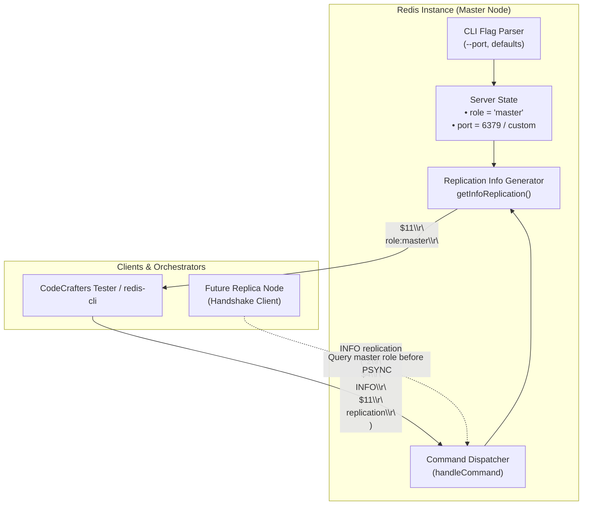
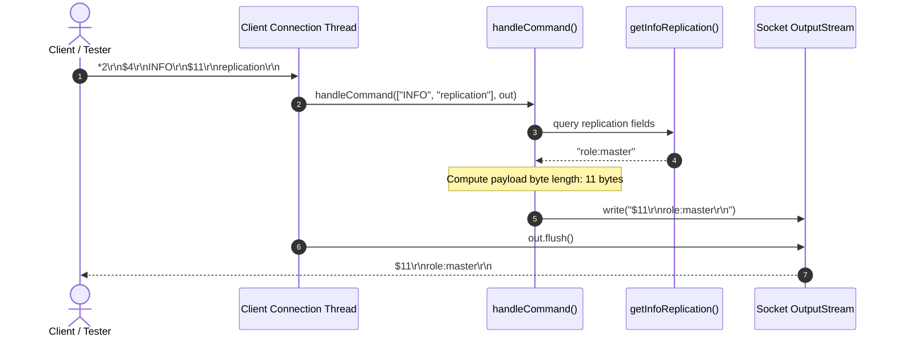

# Stage 52: The INFO command

---

## In one line
Introduce the server role configuration state (`master` by default) and implement the `INFO` command (handling both plain `INFO` and `INFO replication`) returning a RESP Bulk String containing `role:master`, laying the protocol-level introspection foundation for Redis replication topologies.

---

## Self-test (cover the answers below and answer these first)
1. **What is the purpose of the Redis `INFO` command, and how does its payload format differ from standard command responses?**
   - *Answer*: `INFO` provides runtime introspection, diagnostic metrics, and topological configuration of a Redis server instance (covering server version, clients, memory, persistence, stats, and replication). Unlike typical Redis commands that return native RESP primitives (integers, simple strings, arrays), `INFO` returns a single, multi-line ASCII text payload formatted as key-value pairs separated by colons (`<key>:<value>\r\n`), wrapped inside a standard RESP Bulk String (`$<len>\r\n<payload>\r\n`).
2. **Why does `INFO replication` return `role:master` instead of an RESP array or map?**
   - *Answer*: Historically, Redis introduced `INFO` early in its lifecycle (predating RESP3 maps and structured attributes) to be easily human-readable via `redis-cli` and parseable by Unix command-line utilities (`grep`, `awk`), monitoring daemons, and early replication orchestrators. In replication, replica and sentinel nodes parse `role:master` or `role:slave` to identify instance roles before negotiating handshakes.
3. **What is the wire-level distinction between the payload content and the RESP bulk string framing for `role:master`?**
   - *Answer*: The payload text itself is `role:master` (which contains 11 ASCII/UTF-8 bytes). When encoded as a RESP Bulk String, the server prepends the length header `$` followed by byte count `11` and CRLF (`$11\r\n`), appends the payload `role:master`, and terminates with trailing CRLF (`\r\n`). The full byte sequence on the wire is `$11\r\nrole:master\r\n`.
4. **How should a Redis server handle section arguments like `INFO replication`, `INFO server`, or a bare `INFO`?**
   - *Answer*: The standard Redis `INFO` command accepts an optional section argument: `INFO [section]`. When called without arguments (or with `default`/`all`), Redis returns multiple sections separated by `# <SectionName>` headers. When called with a specific section identifier like `INFO replication`, it filters and returns only the fields relevant to that subsystem. For this stage, returning the replication section containing `role:master` satisfies both plain `INFO` and `INFO replication`.
5. **Why must the server role default to `master` in a standalone Redis instance?**
   - *Answer*: In the Redis distributed architecture, every node starts lifecycle execution as an autonomous master capable of accepting reads and writes. A node only assumes the follower/replica (`slave`) role when explicitly instructed at startup via `--replicaof <master-host> <master-port>` or at runtime via the `REPLICAOF` (or legacy `SLAVEOF`) command.
6. **If a client issues `INFO` inside a `MULTI ... EXEC` transaction, how should the server behave?**
   - *Answer*: Redis transactions queue any standard non-transaction-control command. When inside a transaction (`inTx == true`), `INFO` is buffered into `txQueue` and returns `+QUEUED\r\n`. When the transaction is subsequently committed with `EXEC`, `INFO` is dispatched through `handleCommand` and its RESP Bulk String result is emitted within the array response of `EXEC`.

---

## Problem Solved

Up to Stage 51, our Redis server supported core data types (strings, lists, streams), expiry, multi-key blocking retrieval (`BLPOP`, `XREAD`), transactions with optimistic concurrency control (`MULTI`, `EXEC`, `DISCARD`, `WATCH`, `UNWATCH`), and configurable listening ports (`--port <port>`).

However, the server had no mechanism for:
1. **Self-identification**: Clients, test frameworks, monitoring agents, and cluster peers could not interrogate the server about its current operational state or topology.
2. **Replication coordination**: To build master-replica topologies, replicas and test harnesses must query whether a server is operating as a `master` or a `slave`.

Stage 52 introduces:
- A class-level server role property (`role`), initialized to `"master"`.
- Handler for the `INFO` command (supporting both `INFO` and `INFO replication`).
- Construction and encoding of the replication section as a RESP Bulk String (`$11\r\nrole:master\r\n`).

---

## Thought Process & Architectural Model

### 1. Server Role and Replication Introspection Topology

In a distributed Redis cluster, master nodes handle write traffic and generate replication logs, while replica nodes mirror master state and serve read requests. `INFO replication` is the primary discovery hook:



### 2. INFO Request-Response Processing Pipeline

The execution flow within `handleCommand` isolates command parsing, string composition, length calculation, and socket transmission:



---

## Full Solution

### 1. Class-Level Role Property and Info Generator
Add the configurable `role` variable (defaulting to `"master"`) and a modular helper function `getInfoReplication()`:

```java
public class Main {
  // ... existing fields ...
  private static int port = 6379;
  private static String role = "master";

  private static String getInfoReplication() {
    return "role:" + role;
  }
```

### 2. Handling the `INFO` Command in `handleCommand`
Dispatch `INFO` in `handleCommand`, computing the exact byte length of the UTF-8 payload and writing the RESP bulk string:

```java
    } else if (command.equalsIgnoreCase("INFO")) {
      String info = getInfoReplication();
      byte[] bytes = info.getBytes(StandardCharsets.UTF_8);
      String response = "$" + bytes.length + "\r\n" + info + "\r\n";
      out.write(response.getBytes(StandardCharsets.UTF_8));
    }
```

Because `handleCommand` is invoked both for direct commands and during transaction execution (`EXEC`), `INFO` is automatically transaction-aware without extra plumbing.

---

## Concepts (the transferable part)

- **Introspection Endpoints in Distributed Systems**:
  Distributed nodes require uniform diagnostic endpoints (e.g., `/healthz` and `/metrics` in HTTP microservices, `INFO` in Redis, `SHOW STATUS` in MySQL). These endpoints must be lightweight, safe to call continuously, and decoupled from state-mutating execution paths.

- **Human-Readable Line-Oriented Payloads in Binary/Text Protocols**:
  While Redis uses strictly structured arrays and bulk strings for command inputs, internal statistics and configuration dumps are serialized as key-value pairs (`key:value\r\n`). Encapsulating the raw text payload inside a single Bulk String allows clients to receive the entire diagnostic report in a single protocol frame.

- **Default Node Topology (Master First)**:
  In master-replica architectures, nodes are autonomous by default. A node does not assume it is a replica unless explicitly configured with parent coordinates (`--replicaof <host> <port>`).

---

## Wire Format / Protocol

### RESP Bulk String Encoding for `INFO`

| Component | Raw Representation | Purpose |
| :--- | :--- | :--- |
| **Prefix** | `$` | Designates RESP Bulk String type |
| **Length** | `11` | Number of octets in payload (`"role:master".getBytes().length`) |
| **Header CRLF** | `\r\n` | Delimits bulk string length header |
| **Payload** | `role:master` | Key-value configuration pair |
| **Trailing CRLF** | `\r\n` | Delimits bulk string payload terminator |

**Complete Wire Bytes**:
```text
$11\r\nrole:master\r\n
```

Hexadecimal representation:
```text
24 31 31 0d 0a 72 6f 6c 65 3a 6d 61 73 74 65 72 0d 0a
 $  1  1 \r \n  r  o  l  e  :  m  a  s  t  e  r \r \n
```

---

## What Breaks It (Failure Modes)

1. **Incorrect Byte Length Calculation**:
   - *Failure*: Hardcoding `$11` or using string character length instead of byte count (`string.length()` vs `string.getBytes(StandardCharsets.UTF_8).length`).
   - *Impact*: While ASCII characters are 1 byte each, in multi-line `INFO` responses containing UTF-8 characters or extra CRLFs, length discrepancies cause clients to truncate responses or hang waiting for missing bytes.
   - *Fix*: Always measure length on the encoded `byte[].length`.

2. **Accidental Inclusion of Trailing CRLF in Payload Calculation**:
   - *Failure*: Constructing the payload as `"role:master\r\n"` and calculating length as `13`, emitting `$13\r\nrole:master\r\n\r\n`.
   - *Impact*: Some Redis parsers will interpret the extra trailing `\r\n` as an empty line or fail strict length checks expecting exactly 11 bytes for single-line `role:master`.
   - *Fix*: Keep payload calculation clean: `$11\r\nrole:master\r\n` where 11 is the length of `role:master`.

3. **Case Sensitivity in Command Matching**:
   - *Failure*: Matching `command.equals("INFO")` instead of `command.equalsIgnoreCase("INFO")`.
   - *Impact*: Redis clients and CLI tools frequently emit lower-case `info` or mixed-case `Info replication`.
   - *Fix*: Always check `command.equalsIgnoreCase("INFO")`.

4. **Argument Count Assumptions**:
   - *Failure*: Assuming `parts.length >= 2` and crashing with `ArrayIndexOutOfBoundsException` on plain `INFO`.
   - *Impact*: Monitoring tools issuing generic `INFO` disconnect immediately.
   - *Fix*: Guard argument checks (`parts.length > 1 ? parts[1] : null`) and provide default behavior.

---

## Tradeoffs

1. **Modular Helper (`getInfoReplication()`) vs Inline String**:
   - *Inline String*: Simpler for this single stage (`out.write("$11\\r\\nrole:master\\r\\n")`).
   - *Modular Helper (Chosen)*: Future stages will expand the replication section (`connected_slaves`, `master_replid`, `master_repl_offset`) and introduce replica roles. Isolating `getInfoReplication()` makes extending replication state clean without polluting the main dispatch loop.

2. **Full Section Filtering vs Static Replication Response**:
   - *Full Filtering*: Parse every requested section (`server`, `clients`, `memory`, `replication`) and return partial blocks.
   - *Static Replication (Chosen)*: Stage 52 specifically tests the `replication` section and `role` key. Returning the replication info block satisfies current requirements while keeping the codebase lightweight.

---

## Java Specifics — lookup, don't memorize

- `StandardCharsets.UTF_8` — Standard charset constant avoiding runtime `UnsupportedEncodingException`.
- `String.getBytes(Charset)` — Encodes a `String` into a sequence of bytes using the named charset.
- `StringBuilder.append()` — Efficient mutable character sequence for composing multi-line text buffers.

---

## Rebuild Checklist

- [ ] Declare static `role = "master"` variable.
- [ ] Implement `getInfoReplication()` returning `"role:" + role`.
- [ ] In `handleCommand()`, add case-insensitive match for `"INFO"`.
- [ ] Calculate byte length of `getInfoReplication()`.
- [ ] Frame response as RESP Bulk String (`$<len>\r\n<payload>\r\n`) and write to `out`.
- [ ] Verify both `INFO` and `INFO replication` return `$11\r\nrole:master\r\n`.
