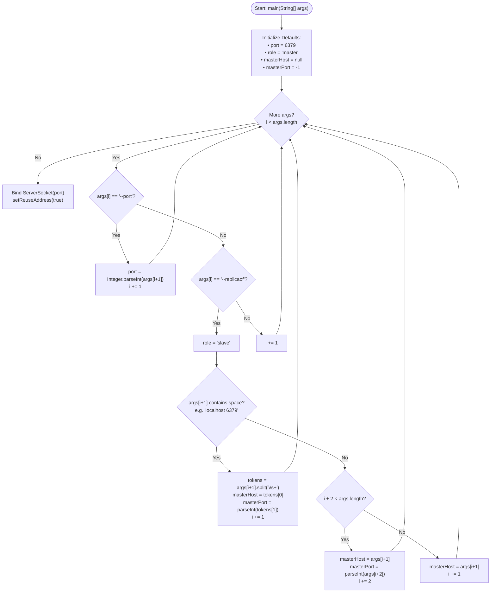
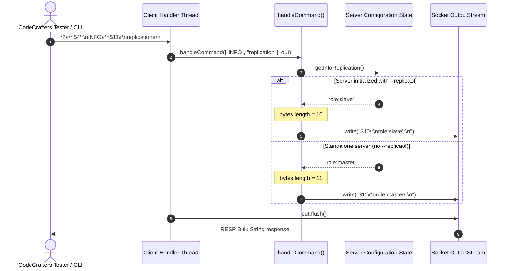

# Stage 53: The INFO command on a replica

---

## In one line
Parse the `--replicaof` CLI flag (supporting both quoted `"<HOST> <PORT>"` and unquoted `<HOST> <PORT>` tokens), transition the server role from `master` to `slave`, store the master host and port coordinates, and emit `$10\r\nrole:slave\r\n` in response to `INFO replication`.

---

## Self-test (cover the answers below and answer these first)
1. **What does the `--replicaof` CLI flag signify in Redis, and what role does the server assume when it is present?**
   - *Answer*: `--replicaof` configures a Redis instance at startup to act as a follower (replica) of an existing master node located at the specified `<host> <port>`. When this flag is passed, the server assumes the replica role (`role:slave` in Redis replication wire format) instead of the default `role:master`.
2. **Why must the argument parser support both `--replicaof "<HOST> <PORT>"` and `--replicaof <HOST> <PORT>`?**
   - *Answer*: Depending on how the process is launched (e.g., shell script wrappers, direct process exec, Docker entrypoints, or test runners), shell word splitting may either treat `"<HOST> <PORT>"` as a single quoted argument containing whitespace (e.g., `args[i+1] = "localhost 6379"`) or pass them as two distinct tokens (`args[i+1] = "localhost"`, `args[i+2] = "6379"`). A robust server CLI parser must detect whitespace within `args[i+1]` or inspect `args[i+2]` to correctly extract the host and port without indexing errors.
3. **What is the exact wire-level RESP encoding for `INFO replication` on a replica server?**
   - *Answer*: The payload text is `role:slave` (10 ASCII/UTF-8 bytes). Wrapped in a RESP Bulk String, the server sends `$` followed by byte count `10` and CRLF (`$10\r\n`), then the payload `role:slave`, and a trailing CRLF (`\r\n`). The full byte sequence is `$10\r\nrole:slave\r\n`.
4. **Why does Redis protocol use `role:slave` in `INFO` replication output even though the flag is named `--replicaof`?**
   - *Answer*: Redis historically used the terms `master` and `slave` (and command `SLAVEOF`). Starting in Redis 5.0, inclusive terminology was introduced (`REPLICAOF`, `--replicaof`), but to maintain strict backward compatibility with existing monitoring tools, client drivers, and replication orchestrators, the key-value representation in `INFO replication` preserved `role:slave`.
5. **Why should the server store `masterHost` and `masterPort` during startup even if it does not immediately connect to the master in this stage?**
   - *Answer*: Separation of configuration and operational lifecycle. Parsing and storing master connection coordinates establishes the replica's target state. In subsequent replication stages, the replica will initiate the three-way replication handshake (`PING`, `REPLCONF`, `PSYNC`) using these exact stored coordinates.
6. **If `--replicaof` is omitted but `--port 6380` is passed, what role should the server report?**
   - *Answer*: The server must report `role:master` (`$11\r\nrole:master\r\n`). Changing the listening port does not alter node topology; an instance remains an autonomous master unless `--replicaof` is explicitly provided.

---

## Problem Solved

In Stage 52, our server gained self-introspection through `INFO` and `INFO replication`, but the role was hardcoded to `master`. Standalone Redis nodes operate as masters by default, but in high-availability, read-scaling, or failover topologies, replica nodes mirror master state and serve read queries.

Stage 53 introduces node specialization at startup:
1. **Command-Line Argument Parsing for `--replicaof`**:
   Accept master topology coordinates passed as either:
   - Quoted single argument: `--replicaof "localhost 6379"`
   - Separate tokens: `--replicaof localhost 6379`
2. **Replica State Transition**:
   - When `--replicaof` is present: Set `role = "slave"`, parse and record `masterHost` and `masterPort`.
   - When `--replicaof` is absent: Maintain default `role = "master"`.
3. **Dynamic Replication Info Emission**:
   `INFO replication` dynamically formats and measures the payload:
   - `master` -> `$11\r\nrole:master\r\n`
   - `slave` -> `$10\r\nrole:slave\r\n`

---

## Thought Process & Architectural Model

### 1. CLI Parsing & State Initialization Architecture

The server startup sequence processes configuration arguments sequentially before opening the listening socket:



### 2. INFO Replication Request Sequence

When a client or test runner issues `INFO replication`, the dispatcher formats the response reflecting the active configuration:



---

## Full Solution

### 1. Server Configuration State
Store the instance role and master connection metadata:

```java
public class Main {
  // ... existing collections and synchronizers ...
  private static int port = 6379;
  private static String role = "master";
  private static String masterHost = null;
  private static int masterPort = -1;

  private static String getInfoReplication() {
    return "role:" + role;
  }
```

### 2. Robust CLI Argument Parsing in `main`
Support both single-string quoted arguments (`--replicaof "localhost 6379"`) and space-separated tokens (`--replicaof localhost 6379`):

```java
  public static void main(String[] args) {
    System.out.println("Logs from your program will appear here!");

    for (int i = 0; i < args.length; i++) {
      if ("--port".equalsIgnoreCase(args[i]) && i + 1 < args.length) {
        try {
          port = Integer.parseInt(args[i + 1]);
        } catch (NumberFormatException e) {
          System.err.println("Invalid port number: " + args[i + 1]);
        }
        i++;
      } else if ("--replicaof".equalsIgnoreCase(args[i]) && i + 1 < args.length) {
        role = "slave";
        String nextArg = args[i + 1];
        if (nextArg.trim().contains(" ")) {
          // Format: --replicaof "<HOST> <PORT>"
          String[] hostPort = nextArg.trim().split("\\s+");
          masterHost = hostPort[0];
          try {
            masterPort = Integer.parseInt(hostPort[1]);
          } catch (NumberFormatException e) {
            System.err.println("Invalid master port: " + hostPort[1]);
          }
          i++;
        } else if (i + 2 < args.length) {
          // Format: --replicaof <HOST> <PORT>
          masterHost = nextArg;
          try {
            masterPort = Integer.parseInt(args[i + 2]);
          } catch (NumberFormatException e) {
            System.err.println("Invalid master port: " + args[i + 2]);
          }
          i += 2;
        } else {
          masterHost = nextArg;
          i++;
        }
      }
    }
```

### 3. Dynamic Bulk String Generation in `handleCommand`
Generate the RESP Bulk String dynamically based on the byte length of `getInfoReplication()`:

```java
    } else if (command.equalsIgnoreCase("INFO")) {
      String info = getInfoReplication();
      byte[] bytes = info.getBytes(StandardCharsets.UTF_8);
      String response = "$" + bytes.length + "\r\n" + info + "\r\n";
      out.write(response.getBytes(StandardCharsets.UTF_8));
    }
```

---

## Concepts (the transferable part)

- **Node Role Specialization at Boot Time**:
  In distributed consensus and replication architectures, nodes often execute identical binary codebases. The node's operational persona (leader vs follower, coordinator vs worker, master vs replica) is determined at initialization by configuration flags or cluster state discovery.
- **Handling Shell Tokenization Inconsistencies**:
  Command-line arguments can be parsed differently depending on whether the invocation was made via interactive shells, process builders (`ProcessBuilder` or `execve`), or container runtimes. When flags accept multiple composite values (such as `<host> <port>`), supporting both single composite strings and discrete sequential arguments ensures portability across deployment environments.
- **Declarative Configuration vs Imperative Execution**:
  Passing `--replicaof` configures the intent to replicate. Bootstrapping separates configuration ingestion from network I/O: the server first establishes its internal state and binds its local port before initiating outbound connections to external peers.

---

## Wire Format / Protocol

### RESP Bulk String Comparison: Master vs Replica

| Metric / Field | Standalone / Master | Replica / Slave |
| :--- | :--- | :--- |\
| **CLI Flag** | *(omitted)* | `--replicaof "<HOST> <PORT>"` |
| **Payload String** | `role:master` | `role:slave` |
| **Payload UTF-8 Octets** | `11` | `10` |
| **RESP Bulk String** | `$11\r\nrole:master\r\n` | `$10\r\nrole:slave\r\n` |

**Replica Wire Bytes**:
```text
$10\r\nrole:slave\r\n
```

Hexadecimal representation:
```text
24 31 30 0d 0a 72 6f 6c 65 3a 73 6c 61 76 65 0d 0a
 $  1  0 \r \n  r  o  l  e  :  s  l  a  v  e \r \n
```

---

## What Breaks It (Failure Modes)

1. **Hardcoding Payload Length as `$11`**:
   - *Failure*: Returning `$11\r\nrole:slave\r\n` because Stage 52 used 11 bytes.
   - *Impact*: `role:slave` is only 10 bytes. The client will read the 10 bytes of `role:slave` plus the first byte of the delimiter (`\r`), leaving the stream desynchronized.
   - *Fix*: Always calculate `bytes.length` dynamically from `getInfoReplication().getBytes(StandardCharsets.UTF_8)`.

2. **Crashing on Unquoted `--replicaof` Arguments**:
   - *Failure*: Only assuming `args[i+1]` has a space (e.g. `"localhost 6379"`). If invoked as `--replicaof localhost 6379`, `args[i+1]` is just `"localhost"`, leading to port parsing failures or `ArrayIndexOutOfBoundsException`.
   - *Fix*: Inspect `nextArg.contains(" ")`. If false, consume `args[i+1]` as host and `args[i+2]` as port, advancing `i += 2`.

3. **Returning `role:replica` Instead of `role:slave`**:
   - *Failure*: Returning `role:replica` matching the flag name `--replicaof`.
   - *Impact*: Standard Redis specifications and CodeCrafters test assertions explicitly require the value `slave` for the `role` key in `INFO replication`.
   - *Fix*: Set `role = "slave"` when `--replicaof` is present.

4. **Argument Loop Index Out of Bounds**:
   - *Failure*: Accessing `args[i + 1]` or `args[i + 2]` without verifying array bounds.
   - *Impact*: Malformed startup arguments cause immediate JVM crash with unhandled exception.
   - *Fix*: Always guard accesses with `i + 1 < args.length` and `i + 2 < args.length`.

---

## Tradeoffs

1. **Two-Format Argument Parser vs Third-Party CLI Library (e.g., Picocli, Commons-CLI)**:
   - *Third-Party Library*: Provides automated help generation, type conversion, and subcommands, but introduces external dependencies and build complexity.
   - *Manual Two-Format Parser (Chosen)*: Zero dependencies, ultra-fast cold start, and directly tailors argument consumption to the exact patterns used by CodeCrafters test harnesses.

2. **Eager Master Connection vs Deferred Handshake**:
   - *Eager Connection*: Attempting to connect to the master during `main` before starting `ServerSocket`. If the master is not yet available, the replica crashes on startup.
   - *Deferred Handshake (Chosen)*: Ingesting configuration first and deferring socket connection allows the replica to start listening on its own port and pass introspection tests independently of master readiness.

---

## Java Specifics — lookup, don't memorize

- `String.split("\\s+")` — Regex splitting on one or more whitespace characters, safely handling multiple consecutive spaces or tabs in quoted CLI strings.
- `String.trim()` — Strips leading and trailing whitespace from string tokens.
- `String.contains(CharSequence)` — Fast substring check without compiling a regular expression.
- `Integer.parseInt(String)` — Converts numeric string into a primitive `int`; throws `NumberFormatException` if non-numeric.

---

## Rebuild Checklist

- [ ] Add static fields `masterHost` (`String`) and `masterPort` (`int`, default `-1`) alongside `role = "master"`.
- [ ] In `main(String[] args)`, add handler for `--replicaof`:
  - [ ] Set `role = "slave"`.
  - [ ] Support composite string: check if `args[i+1]` contains spaces, split on `\\s+`, assign `masterHost` and `masterPort`, advance `i++`.
  - [ ] Support dual tokens: assign `args[i+1]` to `masterHost` and `args[i+2]` to `masterPort`, advance `i += 2`.
- [ ] Verify `getInfoReplication()` returns `"role:" + role`.
- [ ] In `handleCommand()`, confirm `INFO` measures `bytes.length` dynamically.
- [ ] Compile with `javac -d target/classes codecrafters-redis-java/src/main/java/Main.java`.
- [ ] Verify both `role:master` (`$11\r\nrole:master\r\n`) and `role:slave` (`$10\r\nrole:slave\r\n`).
