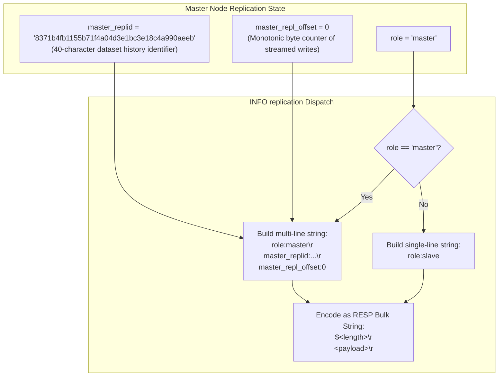
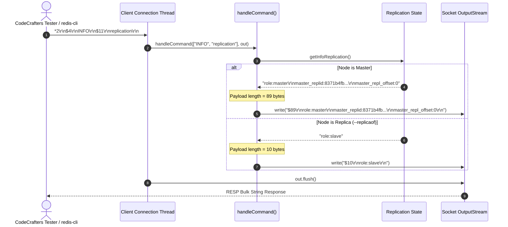

# Stage 54: Initial replication ID and offset

---

## In one line
Initialize the master node's replication state with a 40-character pseudo-random replication ID (`master_replid`) and an initial streaming byte offset of 0 (`master_repl_offset`), returning all three key-value pairs formatted as CRLF-delimited lines wrapped in a RESP Bulk String when queried with `INFO replication`.

---

## Self-test (cover the answers below and answer these first)
1. **What is the purpose of `master_replid` in Redis replication, and when does it change?**
   - *Answer*: `master_replid` (a 40-character hexadecimal string) identifies the specific history/timeline of a master's dataset. When a Redis master starts fresh or is promoted during failover, it generates a new replication ID. If a replica disconnects and reconnects, it presents this ID to the master; if the IDs match and the replica's offset is within the master's backlog, the master can perform a lightweight Partial Resynchronization (PSYNC) instead of an expensive Full Resynchronization.
2. **What does `master_repl_offset` represent, why does it initialize to 0, and how does it advance?**
   - *Answer*: `master_repl_offset` tracks the cumulative number of bytes of replication stream commands (in RESP wire format) the master has emitted to connected replicas. It initializes to `0` because at startup no write commands have been executed or propagated. Every time the master executes a write command that modifies state, it increments this offset by the exact byte length of the serialized RESP command replicated to slaves.
3. **How do replicas use `master_replid` and `master_repl_offset` during reconnects (PSYNC)?**
   - *Answer*: During the PSYNC handshake (`PSYNC <replid> <offset>`), the replica sends the master's replication ID and the replica's current processed offset. If the master confirms the ID matches its current (or secondary) replication ID and the requested offset is still stored in its in-memory replication backlog buffer, the master responds with `+CONTINUE` and streams only the missing bytes. Otherwise, it triggers a full sync (`+FULLRESYNC <replid> <offset>`).
4. **What is the exact wire-level format of `INFO replication` on a master in this stage?**
   - *Answer*: The payload contains three lines delimited by CRLF (`\r\n`):
     ```text
     role:master\r\nmaster_replid:8371b4fb1155b71f4a04d3e1bc3e18c4a990aeeb\r\nmaster_repl_offset:0
     ```
     The payload length is 89 bytes. Wrapped in a RESP Bulk String, the wire representation is:
     `$89\r\nrole:master\r\nmaster_replid:8371b4fb1155b71f4a04d3e1bc3e18c4a990aeeb\r\nmaster_repl_offset:0\r\n`.
5. **Why must a replica (`role:slave`) NOT emit `master_replid` and `master_repl_offset` under these exact keys in this stage?**
   - *Answer*: In Redis replication semantics, a replica reports its own role (`role:slave`) and tracks replication status differently (e.g., `master_link_status`, `slave_repl_offset`). The keys `master_replid` and `master_repl_offset` in `INFO replication` represent the active master instance's stream coordinates. CodeCrafters tests for previous stages verify that replicas continue to return `$10\r\nrole:slave\r\n`.
6. **Why does Redis track replication offset in bytes rather than logical command sequence numbers?**
   - *Answer*: Redis streams raw RESP command sequences directly over the replication TCP stream. Tracking raw byte offsets makes buffer boundary tracking, network slicing, partial retransmission from an in-memory ring buffer (the replication backlog), and lag measurement (`master_repl_offset - slave_repl_offset`) exact and byte-aligned without needing to parse individual commands.

---

## Problem Solved

In Stage 52 and Stage 53, our server learned to identify its node role (`master` vs `slave`) and expose it through `INFO replication`. However, distributed replication requires more than binary role introspection:
1. **Dataset Lineage Identification**: A replica re-establishing a dropped TCP connection cannot know if the server at `<host>:<port>` is the same master with uninterrupted dataset continuity or an entirely new/restarted master instance with empty state.
2. **Replication Progress Tracking**: Replicas and master need a shared coordinate system to determine how much of the command stream has been propagated and acknowledged.

Stage 54 introduces the foundational replication metadata for master nodes:
- **`master_replid`**: A 40-character pseudo-random hexadecimal string (`8371b4fb1155b71f4a04d3e1bc3e18c4a990aeeb`) identifying the dataset's current history.
- **`master_repl_offset`**: An integer offset initialized to `0`, tracking the byte count of replicated writes.
- **Multi-line `INFO replication` formatting**: Returning all three key-value pairs formatted as CRLF-delimited lines within a single RESP Bulk String for master nodes, while preserving `role:slave` for replicas.

---

## Thought Process & Architectural Model

### 1. Master Replication Identity & Replication Backlog State

The master node maintains its replication identity and stream counter as core server state:



### 2. INFO Replication Request Sequence

When a client or CodeCrafters tester queries replication metadata, the server evaluates its role and emits the formatted bulk string:



---

## Full Solution

### 1. Master Replication State Initialization

Add `masterReplId` and `masterReplOffset` as static fields in `Main.java`:

```java
public class Main {
  // ... existing collections and synchronizers ...
  private static int port = 6379;
  private static String role = "master";
  private static String masterHost = null;
  private static int masterPort = -1;
  private static String masterReplId = "8371b4fb1155b71f4a04d3e1bc3e18c4a990aeeb";
  private static long masterReplOffset = 0;
```

### 2. Multi-line Replication Information Generator

Update `getInfoReplication()` to return the complete three-line block when the server operates as a master:

```java
  private static String getInfoReplication() {
    if ("master".equalsIgnoreCase(role)) {
      return "role:master\r\nmaster_replid:" + masterReplId + "\r\nmaster_repl_offset:" + masterReplOffset;
    }
    return "role:" + role;
  }
```

### 3. Wire Response Dispatching in `handleCommand`

The existing `handleCommand` implementation dynamically calculates the UTF-8 byte length of the payload and frames it into a RESP Bulk String:

```java
    } else if (command.equalsIgnoreCase("INFO")) {
      String info = getInfoReplication();
      byte[] bytes = info.getBytes(StandardCharsets.UTF_8);
      String response = "$" + bytes.length + "\r\n" + info + "\r\n";
      out.write(response.getBytes(StandardCharsets.UTF_8));
    }
```

When `role` is `master`:
- `info` is `role:master\r\nmaster_replid:8371b4fb1155b71f4a04d3e1bc3e18c4a990aeeb\r\nmaster_repl_offset:0`
- `bytes.length` is `89`
- `response` is `$89\r\nrole:master\r\nmaster_replid:8371b4fb1155b71f4a04d3e1bc3e18c4a990aeeb\r\nmaster_repl_offset:0\r\n`

When `role` is `slave`:
- `info` is `role:slave`
- `bytes.length` is `10`
- `response` is `$10\r\nrole:slave\r\n`

---

## Concepts (the transferable part)

- **Replication Epochs & Dataset Lineage**:
  In distributed storage (Kafka partitions, Raft terms, Paxos epochs, Redis replication IDs), state machines must identify not just *how much* data they have, but *which branch of history* that data belongs to. An arbitrary node might share an offset of 500 with another, but if their lineage IDs differ, their datasets have diverged.
- **Byte Stream Offsets vs Logical Message IDs**:
  Using byte counts of the serialized wire protocol as the synchronization offset eliminates indexing layers. A master does not need an auxiliary index mapping "message #42" to byte ranges; network writes simply append bytes to a ring buffer, and replicas request slices starting at byte index $N$.
- **Composable Self-Introspection (`INFO`)**:
  Redis protocol uses key-value text blocks delimited by CRLF inside bulk strings for diagnostics and metadata. This decouples introspection schemas from binary protocol versions, allowing new fields to be added without breaking backwards-compatible parsers.

---

## Wire Format / Protocol

### Master vs Replica `INFO replication` Output

| Property | Master (`role = "master"`) | Replica (`role = "slave"`) |
| :--- | :--- | :--- |
| **CLI Flags** | *(none)* or `--port <port>` | `--replicaof <host> <port>` |
| **Payload Content** | `role:master\r\nmaster_replid:8371b4fb1155b71f4a04d3e1bc3e18c4a990aeeb\r\nmaster_repl_offset:0` | `role:slave` |
| **Payload Length** | `89` bytes | `10` bytes |
| **Full RESP Bulk String** | `$89\r\nrole:master\r\nmaster_replid:8371b4fb1155b71f4a04d3e1bc3e18c4a990aeeb\r\nmaster_repl_offset:0\r\n` | `$10\r\nrole:slave\r\n` |

### Hexadecimal Wire Breakdown for Master Output

```text
$ 8 9 \r \n
24 38 39 0d 0a

r  o  l  e  :  m  a  s  t  e  r \r \n
72 6f 6c 65 3a 6d 61 73 74 65 72 0d 0a

m  a  s  t  e  r  _  r  e  p  l  i  d  :  8  3  7  1  b  4  f  b
6d 61 73 74 65 72 5f 72 65 70 6c 69 64 3a 38 33 37 31 62 34 66 62
1  1  5  5  b  7  1  f  4  a  0  4  d  3  e  1  b  c  3  e  1  8
31 31 35 35 62 37 31 66 34 61 30 34 64 33 65 31 62 63 33 65 31 38
c  4  a  9  9  0  a  e  e  b \r \n
63 34 61 39 39 30 61 65 65 62 0d 0a

m  a  s  t  e  r  _  r  e  p  l  _  o  f  f  s  e  t  :  0 \r \n
6d 61 73 74 65 72 5f 72 65 70 6c 5f 6f 66 66 73 65 74 3a 30 0d 0a
```

---

## What Breaks It (Failure Modes)

1. **Using Unix `\n` Instead of Network CRLF `\r\n`**:
   - *Failure*: Joining lines with `\n` (e.g. `"role:master\nmaster_replid:..."`).
   - *Impact*: Redis protocol strictly specifies CRLF (`\r\n`) line terminations. Standard Redis client line scanners and CodeCrafters test assertions split on `\r\n`. Using `\n` causes line merging, causing the parser to see `role:master\nmaster_replid` as an invalid key.
   - *Fix*: Always use explicit `\r\n` between fields.

2. **Hardcoded Length Prefix (`$11` or `$89`)**:
   - *Failure*: Hardcoding `$89` in `handleCommand` while returning `role:slave` (10 bytes), or leaving `$11` from Stage 52.
   - *Impact*: If the bulk string length header does not match the exact byte count of the payload, the client either hangs waiting for missing octets or prematurely truncates the response.
   - *Fix*: Dynamically measure `info.getBytes(StandardCharsets.UTF_8).length`.

3. **Returning Master Replication Fields on Replica Instances**:
   - *Failure*: Emitting `master_replid` and `master_repl_offset` unconditionally, even when `--replicaof` was passed.
   - *Impact*: Breaks previous stage tests (Stage 53) where replicas must report only `role:slave`.
   - *Fix*: Branch in `getInfoReplication()` based on `role.equalsIgnoreCase("master")`.

4. **Accidental Trailing CRLF in Payload vs Frame Framing**:
   - *Failure*: Adding a trailing `\r\n` to `info` AND another `\r\n` in `$" + bytes.length + "\r\n" + info + "\r\n"`.
   - *Impact*: If `info` has an extra `\r\n` at the end, `bytes.length` increases to 91, and a blank line is parsed at the end of the section. While benign in some parsers, strict parsers may treat the trailing empty line as a malformed key-value pair.
   - *Fix*: Delimit internal lines with `\r\n`, leaving the final frame CRLF to the bulk string envelope.

---

## Tradeoffs

1. **Static Hardcoded Replid vs Cryptographically Secure Random Hex Generator**:
   - *Cryptographic Random (Production Redis)*: Generates 40 pseudo-random hex chars using `/dev/urandom` or `SecureRandom`. Ensures every restart produces a unique timeline ID preventing stale replicas from syncing against a new dataset.
   - *Deterministic Hardcoded Replid (Stage Constraint)*: The challenge explicitly recommends a fixed 40-character string (`8371b4fb1155b71f4a04d3e1bc3e18c4a990aeeb`). This guarantees reproducible test assertion matching and eliminates PRNG startup latency.

2. **Atomic Long Offset vs Plain Primitive Long**:
   - *AtomicLong*: Provides thread-safe atomic increments if multiple threads stream write commands concurrently.
   - *Primitive Long*: In our single-command-dispatch architecture, write execution is sequential. A primitive `long` suffices for initial configuration and avoids heap object overhead.

---

## Java Specifics — lookup, don't memorize

- `StandardCharsets.UTF_8` \u2014 Standardized charset instance avoiding string lookup overhead and `UnsupportedEncodingException`.
- `String.getBytes(Charset)` \u2014 Encodes characters into a sequence of bytes using the specified charset.
- `String.equalsIgnoreCase(String)` \u2014 Case-insensitive comparison avoiding manual `.toLowerCase()` object allocations.

---

## Rebuild Checklist

- [ ] Add static fields for master replication metadata:
  ```java
  private static String masterReplId = "8371b4fb1155b71f4a04d3e1bc3e18c4a990aeeb";
  private static long masterReplOffset = 0;
  ```
- [ ] Update `getInfoReplication()` to check role:
  - [ ] If `master`: return `"role:master\r\nmaster_replid:" + masterReplId + "\r\nmaster_repl_offset:" + masterReplOffset`
  - [ ] If `slave`: return `"role:" + role`
- [ ] Ensure `handleCommand` calculates dynamic byte length for `INFO`:
  ```java
  byte[] bytes = info.getBytes(StandardCharsets.UTF_8);
  String response = "$" + bytes.length + "\r\n" + info + "\r\n";
  ```
- [ ] Compile locally with `javac -d target/classes codecrafters-redis-java/src/main/java/Main.java`.
- [ ] Verify both roles:
  - [ ] Standalone master emits `$89\r\nrole:master\r\nmaster_replid:8371b4fb1155b71f4a04d3e1bc3e18c4a990aeeb\r\nmaster_repl_offset:0\r\n`.
  - [ ] Replica (`--replicaof`) emits `$10\r\nrole:slave\r\n`.
