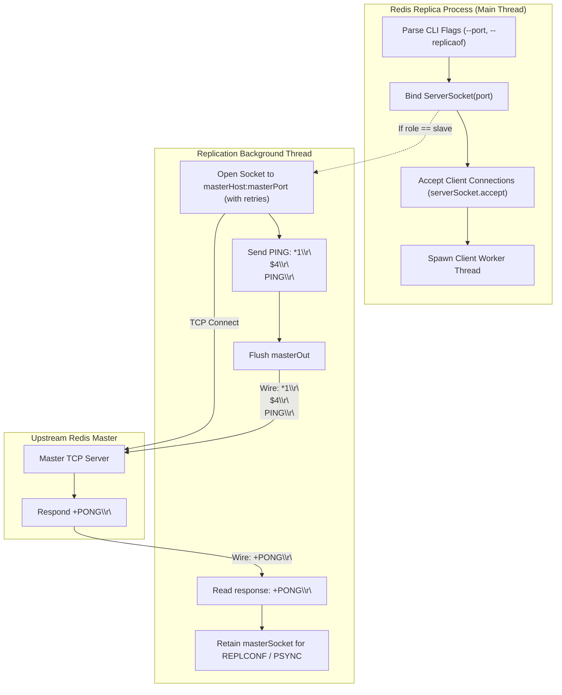
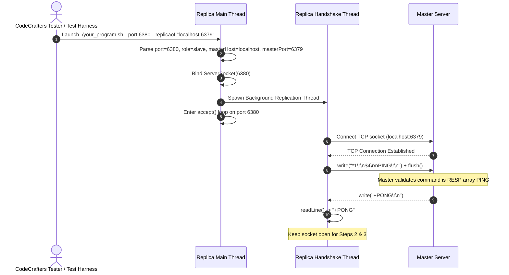

# Stage 55: Send handshake (1 of 3)

---

## In one line
When started in replica mode (`--replicaof <host> <port>`), spawn an asynchronous background thread that connects to the master server via a client TCP socket and initiates the replication handshake by transmitting a RESP array-encoded `PING` command (`*1\r\n$4\r\nPING\r\n`) and reading the response (`+PONG\r\n`), all while the server concurrently accepts client connections on its configured port.

---

## Self-test (cover the answers below and answer these first)
1. **What is the 3-step replication handshake sequence between a Redis replica and its master?**
   - *Answer*:
     1. `PING`: Verifies the network link, master responsiveness, and basic protocol compatibility.
     2. `REPLCONF` (sent twice): Negotiates capabilities (e.g. listening port, replication capabilities).
     3. `PSYNC <replid> <offset>`: Initiates partial resynchronization or full resynchronization of the dataset.
2. **Why must the replication connection be initiated in an asynchronous background thread rather than synchronously in `main()` before `serverSocket.accept()`?**
   - *Answer*: If the replica blocks waiting to establish the master connection, perform handshake rounds, or if the master takes time to accept the socket, the replica cannot bind or accept incoming client commands on its `--port`. Redis replicas are active servers capable of serving read queries and responding to local client connections even while establishing or synchronizing replication streams with upstream masters.
3. **Why is `PING` during the replication handshake encoded as a RESP array (`*1\r\n$4\r\nPING\r\n`) instead of inline plaintext (`PING\r\n`)?**
   - *Answer*: Redis 1.2+ standardized on the RESP (REdis Serialization Protocol) array format for all command transmissions. A command in RESP is an array of bulk strings where the first element is the command name and subsequent elements are arguments. While interactive command-line terminals often support inline commands, programmatic client and server-to-server replication links strictly mandate canonical RESP arrays.
4. **What should happen to the master TCP socket after receiving `+PONG` in Step 1?**
   - *Answer*: The socket must remain open. The replication connection is a persistent, long-lived bidirectional stream. The replica will continue using this exact socket in subsequent handshake steps (`REPLCONF`, `PSYNC`) and then retain it indefinitely to consume the live replication command stream and RDB snapshot emitted by the master.
5. **How does the CLI parser handle the two distinct formats for `--replicaof`?**
   - *Answer*: The flag may be passed as either a single quoted argument containing a space (`--replicaof "localhost 6379"`, where `args[i+1]` is `"localhost 6379"`) or two separate arguments (`--replicaof localhost 6379`, where `args[i+1]` is `"localhost"` and `args[i+2]` is `"6379"`). The argument parser must detect whitespace in `args[i+1]` or inspect `args[i+2]` to correctly extract the master host and master port without throwing `ArrayIndexOutOfBoundsException` or `NumberFormatException`.

---

## Problem Solved

In prior stages (Stages 51–54), our Redis server learned to parse `--port` and `--replicaof`, track its node role (`master` vs `slave`), and report replication identity metrics (`master_replid`, `master_repl_offset`) via `INFO replication`.

However, configuring a replica was purely passive: the server recorded `role = "slave"` and remembered the master's coordinates, but never actually contacted the upstream master.

Stage 55 begins active replication by executing **Step 1 of the 3-step Redis replication handshake**:
1. When `--replicaof <host> <port>` is supplied, the replica actively connects to the master via TCP.
2. As soon as the connection is established, the replica transmits a RESP-encoded `PING` command: `*1\r\n$4\r\nPING\r\n`.
3. The replica listens for the master's response (`+PONG\r\n`).
4. Critically, this handshake happens concurrently in the background so that the replica's main listening socket remains available on its own configured port to accept incoming client connections without blocking.

---

## Thought Process & Architectural Model

### 1. Dual-Role Concurrency Model

A Redis replica acts simultaneously as a **server** (accepting connections from downstream clients on its configured `--port`) and as a **client** (maintaining an outbound TCP socket to the upstream master):



### 2. Handshake Step 1 Sequence Diagram



---

## Full Solution

### 1. Master Socket Field Declaration

In `codecrafters-redis-java/src/main/java/Main.java`:

```java
public class Main {
  // ... existing collections ...
  private static int port = 6379;
  private static String role = "master";
  private static String masterHost = null;
  private static int masterPort = -1;
  private static Socket masterSocket = null;
```

### 2. Handshake Initiation in `main()`

Following port binding on `serverSocket`, if `masterHost` and `masterPort` are configured, spawn a background thread to connect and send `PING`:

```java
    try {
      ServerSocket serverSocket = new ServerSocket(port);
      serverSocket.setReuseAddress(true);

      if (masterHost != null && masterPort != -1) {
        final String host = masterHost;
        final int mPort = masterPort;
        new Thread(() -> {
          try {
            Socket socket = null;
            for (int attempt = 0; attempt < 5; attempt++) {
              try {
                socket = new Socket(host, mPort);
                break;
              } catch (IOException e) {
                try {
                  Thread.sleep(100);
                } catch (InterruptedException ignored) {
                  Thread.currentThread().interrupt();
                  break;
                }
              }
            }
            if (socket == null) {
              socket = new Socket(host, mPort);
            }

            masterSocket = socket;
            OutputStream masterOut = socket.getOutputStream();
            InputStream masterIn = socket.getInputStream();
            BufferedReader masterReader = new BufferedReader(new InputStreamReader(masterIn));

            // Handshake Step 1: Send PING
            masterOut.write("*1\r\n$4\r\nPING\r\n".getBytes(StandardCharsets.UTF_8));
            masterOut.flush();

            String response = masterReader.readLine();
            System.out.println("Master response to PING: " + response);
          } catch (IOException e) {
            System.err.println("Replication handshake failed: " + e.getMessage());
          }
        }).start();
      }

      while (true) {
        Socket clientSocket = serverSocket.accept();
        // ... connection handling ...
```

---

## Concepts (the transferable part)

- **Handshake Negotiation in Distributed Systems**:\
  Before streaming mutations, nodes must verify bidirectional connectivity, check protocol version compatibility, exchange capabilities, and establish baseline offsets. The initial `PING` is a lightweight heartbeat handshake preventing complex sync state machines from initiating over broken or incompatible links.
- **Asynchronous Dual-Mode Socket Architecture**:\
  A node in a distributed cluster frequently operates simultaneously as a TCP server (accepting RPCs or client queries) and a TCP client (connecting to leader nodes or gossip peers). Server loops must never synchronously block on outbound client handshakes.
- **Protocol Canonicalization**:\
  Clients might accept shortcut inline commands (e.g. `PING\r\n`), but internal system-to-system protocols must strictly transmit canonical, unambiguous framing (RESP Arrays `*1\r\n$4\r\nPING\r\n`) to prevent parser ambiguity and guarantee uniform serialization.

---

## Wire Format / Protocol

### Step 1: Handshake `PING` Request & Response

| Direction | Command / Response | Wire Representation (CRLF shown as `\r\n`) | Hex Bytes |
| :--- | :--- | :--- | :--- |
| **Replica &rarr; Master** | `PING` (RESP Array of 1 Bulk String) | `*1\r\n$4\r\nPING\r\n` | `2a 31 0d 0a 24 34 0d 0a 50 49 4e 47 0d 0a` |
| **Master &rarr; Replica** | Simple String `PONG` | `+PONG\r\n` | `2b 50 4f 4e 47 0d 0a` |

### Wire Breakdown for `*1\r\n$4\r\nPING\r\n`
- `*1\r\n` &rarr; Array header: 1 element.
- `$4\r\n` &rarr; Bulk string length prefix: 4 bytes.
- `PING\r\n` &rarr; Bulk string payload + delimiter: 4 ASCII characters followed by CRLF.

---

## What Breaks It (Failure Modes)

1. **Sending Inline `PING\r\n` Instead of RESP Array `*1\r\n$4\r\nPING\r\n`**:
   - *Failure*: Sending `PING\r\n` across the socket.
   - *Impact*: CodeCrafters tester asserts that the command arrives strictly formatted as a RESP Array. Real Redis instances may treat inline commands differently depending on configuration; replication links require standard RESP arrays.
   - *Fix*: Emit `*1\r\n$4\r\nPING\r\n`.

2. **Connecting Synchronously on the Main Thread**:
   - *Failure*: Running `new Socket(host, port)` and `reader.readLine()` before calling `serverSocket.accept()`.
   - *Impact*: If the master is not immediately ready, or if the test runner connects to the replica's listening port concurrently, the replica deadlocks or rejects incoming connections because `serverSocket` has not started accepting.
   - *Fix*: Launch the master handshake in a dedicated background thread.

3. **Forgetting to Flush the Output Stream**:
   - *Failure*: Calling `masterOut.write(...)` without `masterOut.flush()`.
   - *Impact*: Buffered output streams hold the bytes in memory. The packet is never transmitted over TCP, causing the master to wait indefinitely and the handshake to timeout.
   - *Fix*: Always invoke `masterOut.flush()` immediately after writing the command.

4. **Prematurely Closing the Master Socket**:
   - *Failure*: Wrapping `masterSocket` in a try-with-resources block that closes upon exiting Step 1.
   - *Impact*: The replication stream requires a persistent connection. Closing the socket terminates the handshake, causing future stages (`REPLCONF`, `PSYNC`) to fail.
   - *Fix*: Keep `masterSocket` open across the lifetime of the replica process.

---

## Tradeoffs

1. **Dedicated Replication Thread vs Non-blocking NIO Event Loop**:
   - *Thread-per-connection (Chosen)*: Simple, clean, and transparent for blocking I/O models in Java. The handshake logic executes sequentially without complex state-machine callback handlers.
   - *Non-blocking NIO (`Selector` / Netty)*: Higher connection scalability under thousands of replicas, but unnecessary complexity for an individual replica connecting to a single master.

2. **Connection Retry Loop vs Single Attempt**:
   - *Single Attempt*: Relies strictly on the master already listening when replica process begins.
   - *Retry Loop (Chosen)*: Attempts up to 5 times with small backoff (100ms) to ensure stability against OS socket scheduling differences.

---

## Java Specifics — lookup, don't memorize

- `java.net.Socket` — Standard client TCP socket; `new Socket(host, port)` resolves the hostname and establishes a TCP connection.
- `Socket.getOutputStream()` / `Socket.getInputStream()` — Low-level byte streams for socket I/O.
- `BufferedReader(new InputStreamReader(in))` — Convenient line-oriented decoder that reads lines delimited by `\r\n` or `\n`.
- `StandardCharsets.UTF_8` — Constant for UTF-8 charset encoding without string lookup overhead.

---

## Rebuild Checklist

- [ ] Declare `private static Socket masterSocket = null;` to persist the replication connection.
- [ ] In `main()`, after binding `ServerSocket(port)` and parsing `--replicaof`:
  - [ ] Check if `masterHost != null && masterPort != -1`.
  - [ ] Spawn a background thread: `new Thread(() -> { ... }).start()`.
- [ ] Inside the thread:
  - [ ] Connect `new Socket(host, mPort)` with retry resilience.
  - [ ] Write `*1\r\n$4\r\nPING\r\n` to `socket.getOutputStream()`.
  - [ ] Call `.flush()`.
  - [ ] Read response with `reader.readLine()` (`+PONG`).
  - [ ] Keep socket open.
- [ ] Verify local compilation:
  ```powershell
  javac -d target/classes codecrafters-redis-java/src/main/java/Main.java
  ```
- [ ] Confirm the replica concurrently accepts client connections while running the handshake.
