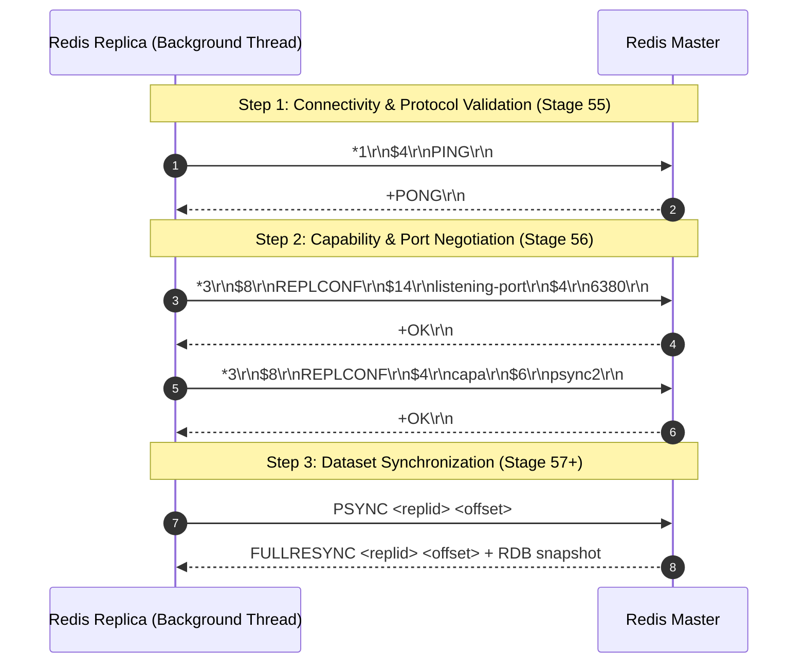
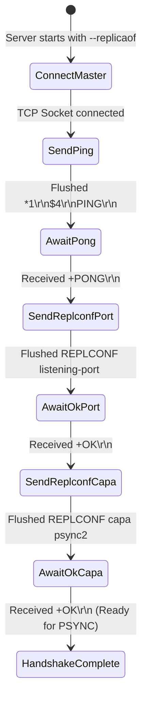

# Stage 56: Send handshake (2 of 3)

---

## In one line
After receiving `+PONG` in the replication handshake, sequentially transmit two RESP-array encoded `REPLCONF` commands over the persistent master TCP connection — first advertising the replica's listening port (`REPLCONF listening-port <PORT>`) and second advertising replication capabilities (`REPLCONF capa psync2`), awaiting and reading the `+OK\r\n` response after each step.

---

## Self-test (cover the answers below and answer these first)
1. **What is the exact sequence and purpose of the two `REPLCONF` commands sent by a Redis replica to its master in Step 2 of the handshake?**
   - *Answer*:
     1. `REPLCONF listening-port <PORT>`: Informs the master of the replica's local listening port for client connections. This port is stored by the master for administrative inspection (e.g., `INFO replication` output) and logging.
     2. `REPLCONF capa psync2`: Advertises the replica's capability to understand the `PSYNC2` protocol (an advanced partial resynchronization protocol allowing failover chaining without full dataset resync).
2. **Why must the replica explicitly announce its listening port via `REPLCONF listening-port <PORT>` instead of the master reading the remote port from the accepted TCP socket?**
   - *Answer*: When the replica connects outbound to the master, the operating system assigns an arbitrary ephemeral client port (e.g. 54321) to that outbound socket. The master's socket API only sees this ephemeral port, *not* the port where the replica is listening for client traffic (e.g. 6380). The application layer must explicitly advertise its server listening port.
3. **What is the expected response from the master for each `REPLCONF` command, and how does the replica process it?**
   - *Answer*: The master responds with a RESP Simple String: `+OK\r\n`. The replica operates in lockstep: it transmits the first `REPLCONF`, flushes the stream, reads and validates `+OK\r\n`, and only then transmits the second `REPLCONF` and reads its `+OK\r\n`.
4. **Why is the length prefix of the port string dynamic rather than hardcoded in RESP serialization?**
   - *Answer*: Port numbers vary in length (e.g., port `80` is 2 characters `$2`, `6380` is 4 characters `$4`, `65535` is 5 characters `$5`). Generating the bulk string length prefix dynamically (`$" + portStr.length() + "\r\n" + portStr + "\r\n"`) guarantees conformance with the RESP specification for any valid port.
5. **How should our Redis server respond if an incoming client or replica sends `REPLCONF` when running in master mode?**
   - *Answer*: When acting as a master, receiving `REPLCONF` should immediately return `+OK\r\n` (RESP simple string) to satisfy downstream replication peers or test suites without raising errors.

---

## Problem Solved

In Stage 55, our Redis replica initiated Step 1 of the replication handshake by establishing an outbound TCP socket to the master, sending a RESP-encoded `PING` command (`*1\r\n$4\r\nPING\r\n`), and receiving `+PONG\r\n`.

However, the handshake remained incomplete:
1. The master had no knowledge of which port the replica was listening on for clients or administrative monitoring.
2. The master did not know what replication protocol capabilities the replica supported (such as `psync2`).
3. If the handshake stopped at `PING`, the master would never transition the replica into synchronization mode.

Stage 56 implements **Step 2 of the 3-step Redis replication handshake**:
1. Following the `+PONG` reply, the replica sends `REPLCONF listening-port <PORT>` formatted as a RESP array of 3 bulk strings.
2. The replica waits for and consumes the master's `+OK\r\n` response.
3. The replica sends `REPLCONF capa psync2` formatted as a RESP array of 3 bulk strings.
4. The replica waits for and consumes the master's second `+OK\r\n` response.
5. The master socket remains open for Step 3 (`PSYNC`).
6. Additionally, our server handles incoming `REPLCONF` commands by acknowledging them with `+OK\r\n`.

---

## Thought Process & Architectural Model

### 1. The Complete Replication Handshake Architecture



### 2. Lockstep Handshake State Machine

The replica handshake executes strictly sequentially in lockstep. Each request must be flushed across the socket, and the matching response must be consumed before the next stage proceeds:



---

## Full Solution

### Code Modifications

In `codecrafters-redis-java/src/main/java/Main.java`:

#### 1. In `handleCommand`: Add `REPLCONF` Acknowledgment for Master Mode
```java
    } else if (command.equalsIgnoreCase("REPLCONF")) {
      out.write("+OK\r\n".getBytes(StandardCharsets.UTF_8));
    } else if (command.equalsIgnoreCase("INFO")) {
      // ...
```

#### 2. In Replication Handshake Thread: Add Sequential `REPLCONF` Steps
```java
            // Handshake Step 1: Send PING
            masterOut.write("*1\r\n$4\r\nPING\r\n".getBytes(StandardCharsets.UTF_8));
            masterOut.flush();

            String response = masterReader.readLine();
            System.out.println("Master response to PING: " + response);

            // Handshake Step 2: Send REPLCONF listening-port <PORT>
            String portStr = String.valueOf(port);
            String replconfPort = "*3\r\n$8\r\nREPLCONF\r\n$14\r\nlistening-port\r\n$" + portStr.length() + "\r\n" + portStr + "\r\n";
            masterOut.write(replconfPort.getBytes(StandardCharsets.UTF_8));
            masterOut.flush();

            response = masterReader.readLine();
            System.out.println("Master response to REPLCONF listening-port: " + response);

            // Handshake Step 2 (cont.): Send REPLCONF capa psync2
            String replconfCapa = "*3\r\n$8\r\nREPLCONF\r\n$4\r\ncapa\r\n$6\r\npsync2\r\n";
            masterOut.write(replconfCapa.getBytes(StandardCharsets.UTF_8));
            masterOut.flush();

            response = masterReader.readLine();
            System.out.println("Master response to REPLCONF capa: " + response);
```

---

## Concepts (the transferable part)

- **Application-Level Port Discovery (Ephemeral Port Decoupling)**:
  - *Problem*: In TCP, a client connecting to a server is bound by the OS kernel to an arbitrary ephemeral port (e.g. 49152–65535). The server's `accept()` returns a remote endpoint representing this ephemeral port.
  - *Systems Solution*: If the client is also a server process that accepts inbound connections on its own port, it must explicitly inform the peer of its listening port at the application protocol layer. This is why Redis uses `REPLCONF listening-port <port>`, BGP exchanges listening addresses, and Kafka brokers register advertised listeners in ZooKeeper/KRaft.
- **Lockstep Handshakes vs. Pipeline Streaming**:
  - *Lockstep*: During connection setup, capability exchange, and authentication, handshakes are performed synchronously in request-response lockstep. Each phase validates that the previous phase succeeded before progressing to the next.
  - *Streaming*: Once the handshake reaches the steady-state replication phase, the protocol transitions from synchronous lockstep to asynchronous streaming of mutation commands.
- **Extensible Feature Negotiation (`capa`)**:
  - Rather than incrementing rigid protocol version numbers (which break when intermediate versions diverge), modern distributed protocols negotiate capabilities via granular feature flags (`capa psync2`, `capa eof`). Nodes ignore unrecognized capabilities or gracefully degrade without breaking backward compatibility.

---

## Wire Format & Protocol Details

### Step 2: `REPLCONF` Requests and Responses

| Message | RESP Array Length & Structure | Wire Encoding (CRLF indicated as `\r\n`) | Hexdump (Example Port 6380) |
| :--- | :--- | :--- | :--- |
| **REPLCONF listening-port** | Array of 3 Bulk Strings: `["REPLCONF", "listening-port", "<PORT>"]` | `*3\r\n$8\r\nREPLCONF\r\n$14\r\nlistening-port\r\n$4\r\n6380\r\n` | `2a 33 0d 0a 24 38 0d 0a 52 45 50 4c 43 4f 4e 46 0d 0a 24 31 34 0d 0a 6c 69 73 74 65 6e 69 6e 67 2d 70 6f 72 74 0d 0a 24 34 0d 0a 36 33 38 30 0d 0a` |
| **Master Response 1** | Simple String `OK` | `+OK\r\n` | `2b 4f 4b 0d 0a` |
| **REPLCONF capa psync2** | Array of 3 Bulk Strings: `["REPLCONF", "capa", "psync2"]` | `*3\r\n$8\r\nREPLCONF\r\n$4\r\ncapa\r\n$6\r\npsync2\r\n` | `2a 33 0d 0a 24 38 0d 0a 52 45 50 4c 43 4f 4e 46 0d 0a 24 34 0d 0a 63 61 70 61 0d 0a 24 36 0d 0a 70 73 79 6e 63 32 0d 0a` |
| **Master Response 2** | Simple String `OK` | `+OK\r\n` | `2b 4f 4b 0d 0a` |

### Wire Breakdown: `REPLCONF listening-port 6380`
- `*3\r\n` &rarr; RESP Array of 3 elements.
- `$8\r\nREPLCONF\r\n` &rarr; 8-byte string `"REPLCONF"`.
- `$14\r\nlistening-port\r\n` &rarr; 14-byte string `"listening-port"`.
- `$4\r\n6380\r\n` &rarr; 4-byte string `"6380"`.

### Wire Breakdown: `REPLCONF capa psync2`
- `*3\r\n` &rarr; RESP Array of 3 elements.
- `$8\r\nREPLCONF\r\n` &rarr; 8-byte string `"REPLCONF"`.
- `$4\r\ncapa\r\n` &rarr; 4-byte string `"capa"`.
- `$6\r\npsync2\r\n` &rarr; 6-byte string `"psync2"`.

---

## What Breaks It (Failure Modes & Edge Cases)

1. **Hardcoding Port Byte Length**:
   - *Bug*: Using `$4\r\n` unconditionally for the port argument.
   - *Failure*: If the port is `80` (length 2) or `10000` (length 5), the RESP framing is malformed. The master reads invalid bulk string boundaries, resulting in a protocol error (`ERR Protocol error: invalid multibulk length`).
   - *Fix*: Calculate `$" + portStr.length() + "\r\n"` dynamically from `String.valueOf(port)`.

2. **Pipelining `REPLCONF` Commands Without Waiting for `+OK`**:
   - *Bug*: Writing both `REPLCONF listening-port` and `REPLCONF capa psync2` before calling `readLine()`.
   - *Failure*: The test harness asserts that each command is sent only after receiving the master's response for the preceding command. Pipelining violates the strict sequential handshake requirement.
   - *Fix*: Call `masterOut.flush()` and `masterReader.readLine()` immediately after each command write.

3. **Buffering Without Flushing (`flush()`)**:
   - *Bug*: Calling `masterOut.write(...)` without `masterOut.flush()`.
   - *Failure*: Operating system socket buffers or Java output stream buffers hold the bytes in user-space memory. The master never receives the command and times out waiting for the handshake.
   - *Fix*: Always invoke `masterOut.flush()` after writing each complete RESP command.

4. **Socket Prematurely Terminated**:
   - *Bug*: Exiting the replication thread without preserving `masterSocket` or letting GC finalize unreferenced socket streams.
   - *Failure*: If the TCP connection resets before Step 3 (`PSYNC`), replication aborts.
   - *Fix*: Assign `masterSocket = socket;` to a static field and maintain the open stream for upcoming replication steps.

---

## Tradeoffs & Design Decisions

1. **Static String Formatting vs Generalized RESP Serializer**:
   - *Static Format String (Chosen)*: Direct string templates with dynamic port length (`*3\r\n$8\r\nREPLCONF\r\n...`) produce zero allocation overhead, zero external dependencies, and crystal-clear byte-for-byte visibility into the wire protocol.
   - *Generic Serializer (`encodeRespArray(String...)`)*: Highly generic, but adds unnecessary object allocations and complexity for a fixed, hardcoded 2-step handshake sequence.

2. **Sequential Handshake in Dedicated Thread vs Non-blocking Event Loop**:
   - *Dedicated Thread (Chosen)*: In Java, standard blocking I/O with sequential reads (`readLine()`) cleanly mirrors the linear flow of the handshake (`PING` &rarr; `REPLCONF 1` &rarr; `REPLCONF 2` &rarr; `PSYNC`) without requiring a state-machine event callback parser.
   - *NIO Selector*: Avoids dedicating a thread to the master link, but introduces non-blocking partial buffer management which is over-engineered for a single upstream master connection.

---

## Java Specifics — Lookup, Don't Memorize

- `String.valueOf(port)` \u2014 Converts integer port to its string representation.
- `String.length()` \u2014 Returns character count, matching the ASCII byte length for numeric strings in RESP `$length`.
- `BufferedReader.readLine()` \u2014 Reads until `\r\n` or `\n` and strips the delimiter, returning the string line content (e.g. `+OK`).
- `OutputStream.flush()` \u2014 Forces any buffered output bytes to be written out to the underlying TCP socket.

---

## Rebuild Checklist (From Scratch)

- [ ] In `handleCommand`:
  - [ ] Add branch for `REPLCONF`: write `+OK\r\n` to output stream and flush.
- [ ] In replica handshake thread (inside `masterHost != null && masterPort != -1`):
  - [ ] After reading `response = masterReader.readLine()` for `PING` (`+PONG`):
  - [ ] Format `REPLCONF listening-port <PORT>`:
    ```java
    String portStr = String.valueOf(port);
    String replconfPort = "*3\r\n$8\r\nREPLCONF\r\n$14\r\nlistening-port\r\n$" + portStr.length() + "\r\n" + portStr + "\r\n";
    masterOut.write(replconfPort.getBytes(StandardCharsets.UTF_8));
    masterOut.flush();
    String response = masterReader.readLine(); // Expect +OK
    ```
  - [ ] Format `REPLCONF capa psync2`:
    ```java
    String replconfCapa = "*3\r\n$8\r\nREPLCONF\r\n$4\r\ncapa\r\n$6\r\npsync2\r\n";
    masterOut.write(replconfCapa.getBytes(StandardCharsets.UTF_8));
    masterOut.flush();
    response = masterReader.readLine(); // Expect +OK
    ```
  - [ ] Ensure socket connection is kept open (`masterSocket = socket`).
- [ ] Verify compilation:
  ```powershell
  javac -d target/classes codecrafters-redis-java/src/main/java/Main.java
  ```
- [ ] Test with CodeCrafters CLI:
  ```powershell
  codecrafters test
  ```
