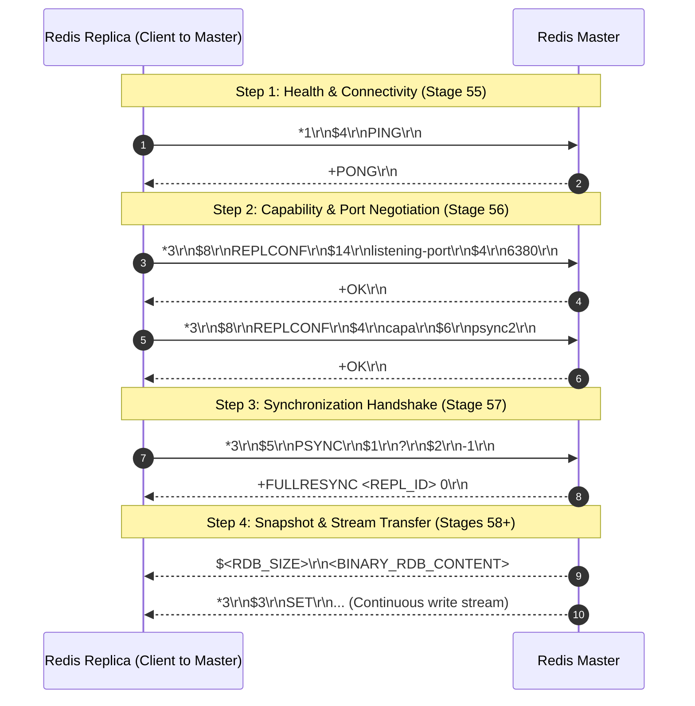
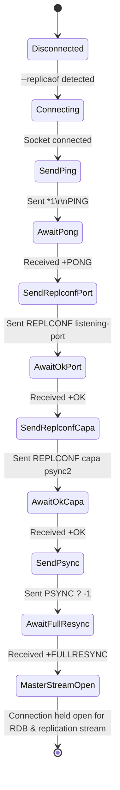

# Stage 57: Send handshake (3 of 3)

---

## In one line
Conclude the three-step replication handshake by sending `PSYNC ? -1` as a RESP array over the persistent master TCP connection to request initial full synchronization, and consume the master's `+FULLRESYNC <REPL_ID> 0\r\n` response while holding the connection open.

---

## Self-test (cover the answers below and answer these first)
1. **What are the arguments passed to `PSYNC` and why does the replica pass `?` and `-1` during the initial handshake?**
   - *Answer*: `PSYNC <replication_id> <offset>`. The replication ID `?` signals to the master that the replica does not know the master's replication ID (it has never synced before). The offset `-1` indicates that the replica has received zero bytes of the replication backlog. Together, `? -1` explicitly requests a full resynchronization (`FULLRESYNC`).
2. **What is the expected response format from the master when receiving `PSYNC ? -1`?**
   - *Answer*: A RESP Simple String starting with `+FULLRESYNC <REPL_ID> 0\r\n`, where `<REPL_ID>` is a 40-character pseudo-random hexadecimal string identifying the master's current replication timeline, and `0` indicates the initial byte offset of the data stream.
3. **What is the difference between a Full Resynchronization and a Partial Resynchronization in Redis?**
   - *Answer*:
     - **Full Resynchronization**: The master creates and transmits a snapshot of its entire dataset (an RDB file) to the replica, followed by newly buffered write commands. Used when replica connects for the first time (`? -1`) or after falling too far behind the master's in-memory replication backlog buffer.
     - **Partial Resynchronization**: The replica presents its previous `<repl_id>` and `<offset>`. If the replication ID matches and the requested offset is still present in the master's circular backlog buffer, the master skips transferring the snapshot and immediately streams only the missing command bytes.
4. **Why must the TCP socket to the master remain open indefinitely after the `PSYNC` response is received?**
   - *Answer*: The connection to the master is not a request-response RPC channel; it is a persistent, unidirectional replication stream. After sending the initial snapshot (RDB file), the master continuously streams live write commands (e.g. `SET`, `DEL`) over this very same TCP connection for the lifetime of the replica. Closing this socket aborts replication.
5. **Why do we read the master's response with `readLine()` instead of reading raw bytes directly at this stage?**
   - *Answer*: The immediate response to `PSYNC` is a single CRLF-terminated simple string line (`+FULLRESYNC <REPL_ID> 0\r\n`). Using `masterReader.readLine()` cleanly consumes this line up to `\r\n`. (In subsequent stages, raw binary reading will be required for the RDB payload that follows).

---

## Problem Solved

In Stages 55 and 56, our Redis replica executed the preliminary phases of the replication handshake:
1. **Step 1**: Sent `PING` and received `+PONG\r\n` (verifying TCP connectivity and basic protocol responsiveness).
2. **Step 2**: Sent `REPLCONF listening-port <PORT>` and `REPLCONF capa psync2`, each acknowledged with `+OK\r\n` (advertising server configuration and protocol capabilities).

However, at the conclusion of Step 2, no actual data synchronization had been initiated. The replica had advertised its capabilities, but had not yet requested the master's state.

Stage 57 implements **Step 3 (the final step) of the Redis replication handshake**:
1. Following the second `+OK\r\n` from `REPLCONF capa psync2`, the replica sends `PSYNC ? -1` formatted as a RESP array of 3 bulk strings (`*3\r\n$5\r\nPSYNC\r\n$1\r\n?\r\n$2\r\n-1\r\n`).
2. The replica flushes the output stream to ensure the packet is immediately dispatched across the wire.
3. The replica consumes the master's response (`+FULLRESYNC <REPL_ID> 0\r\n`) using `masterReader.readLine()`.
4. The master TCP socket is held open for subsequent stages (receiving the RDB file and continuous replication command stream).

---

## Thought Process & Architectural Model

### 1. The Complete 3-Step Replication Handshake



### 2. Handshake State Machine Transitions



---

## Full Solution

### Code Modification in `codecrafters-redis-java/src/main/java/Main.java`

Inside the replica background initialization thread:

```java
            // Handshake Step 2 (cont.): Send REPLCONF capa psync2
            String replconfCapa = "*3\r\n$8\r\nREPLCONF\r\n$4\r\ncapa\r\n$6\r\npsync2\r\n";
            masterOut.write(replconfCapa.getBytes(StandardCharsets.UTF_8));
            masterOut.flush();

            response = masterReader.readLine();
            System.out.println("Master response to REPLCONF capa: " + response);

            // Handshake Step 3: Send PSYNC ? -1
            String psyncCmd = "*3\r\n$5\r\nPSYNC\r\n$1\r\n?\r\n$2\r\n-1\r\n";
            masterOut.write(psyncCmd.getBytes(StandardCharsets.UTF_8));
            masterOut.flush();

            response = masterReader.readLine();
            System.out.println("Master response to PSYNC: " + response);
```

---

## Concepts (the transferable part)

- **Initial State Negotiation (`? -1`)**:
  - In distributed synchronization protocols, clients reconnecting to a primary must convey their lineage and state position.
  - A sentinel ID `?` represents "no prior relationship / unknown primary history".
  - A sentinel offset `-1` represents "zero bytes received / empty state".
  - This pattern appears across distributed systems: Kafka consumers commit offsets and request `earliest` or `latest` when no committed offset exists; Raft nodes send `prevLogIndex` and `prevLogTerm` in `AppendEntries`; Git fetches exchange commit SHAs to determine common ancestors.

- **Replication Epochs & Replication IDs**:
  - Redis instances generate a 40-character hexadecimal pseudo-random replication ID (`master_replid`).
  - This ID, combined with a 64-bit monotonically increasing byte offset (`master_repl_offset`), forms an exact coordinate in the master's stream of changes: `(replid, offset)`.
  - When failover occurs or a replica reconnects, the coordinate indicates whether history has branched or can be resumed incrementally.

- **Persistent Connection Reuse vs Ephemeral Request Connections**:
  - Unlike HTTP/1.0 or standard RPC patterns where connections close after a transaction, replication connections transition from an active handshake negotiation phase into a passive long-lived subscriber stream.
  - The socket must not be closed, garbage collected, or wrapped in a `try-with-resources` that terminates upon method return.

---

## Wire Format & Protocol Details

### Step 3: `PSYNC` Request and Master Response

| Message | RESP Array Length & Structure | Wire Encoding (CRLF indicated as `\r\n`) | Hexdump |
| :--- | :--- | :--- | :--- |
| **PSYNC Request** | Array of 3 Bulk Strings: `["PSYNC", "?", "-1"]` | `*3\r\n$5\r\nPSYNC\r\n$1\r\n?\r\n$2\r\n-1\r\n` | `2a 33 0d 0a 24 35 0d 0a 50 53 59 4e 43 0d 0a 24 31 0d 0a 3f 0d 0a 24 32 0d 0a 2d 31 0d 0a` |
| **Master Response** | Simple String `FULLRESYNC <REPL_ID> 0` | `+FULLRESYNC 8371b4fb1155b71f4a04d3e1bc3e18c4a990aeeb 0\r\n` | `2b 46 55 4c 4c 52 45 53 59 4e 43 20 ... 0d 0a` |

### Wire Breakdown: `PSYNC ? -1`
- `*3\r\n` &rarr; RESP Array of 3 elements.
- `$5\r\nPSYNC\r\n` &rarr; 5-byte string `"PSYNC"`.
- `$1\r\n?\r\n` &rarr; 1-byte string `"?"`.
- `$2\r\n-1\r\n` &rarr; 2-byte string `"-1"`.

---

## What Breaks It (Failure Modes & Edge Cases)

1. **Incorrect Offset Argument Framing (`$1\r\n-1\r\n`)**:
   - *Bug*: Writing `$1\r\n-1\r\n` instead of `$2\r\n-1\r\n`.
   - *Failure*: `-1` consists of 2 ASCII characters (`-` and `1`). Specifying length 1 causes framing desynchronization; the master parser reads `-` and chokes on `1\r\n`, failing the handshake.
   - *Fix*: The byte length for `"-1"` is strictly `2`: `$2\r\n-1\r\n`.

2. **Omitting `flush()` on `masterOut`**:
   - *Bug*: Calling `masterOut.write(...)` without `masterOut.flush()`.
   - *Failure*: Sockets utilize internal write buffers (e.g. Nagle's algorithm, OS kernel buffers, Java stream buffers). Without flushing, the bytes remain in client memory. The master never receives `PSYNC` and the test harness times out.
   - *Fix*: Always invoke `masterOut.flush()` immediately after writing the command bytes.

3. **Closing the Socket After Reading `+FULLRESYNC`**:
   - *Bug*: Wrapping `socket` in a `try-with-resources` block that closes at the end of the handshake method.
   - *Failure*: Closing the socket terminates the replication link before the master can transmit the RDB snapshot or replication commands.
   - *Fix*: Hold the `Socket` instance in a long-lived field (`masterSocket = socket;`) and keep the thread or stream active.

4. **Desynchronized Stream Reading (Reading Partial Lines or Blocking)**:
   - *Bug*: Attempting to read binary RDB data before the `+FULLRESYNC` simple string line has been read and stripped.
   - *Failure*: Corrupts subsequent payload decoding because the string prefix mixes with binary RDB bytes.
   - *Fix*: Consume the complete `+FULLRESYNC` line via `readLine()` first.

---

## Tradeoffs & Design Decisions

1. **Pre-encoded Constant String vs Dynamic Serialization**:
   - *Pre-encoded String (Chosen)*: For initial synchronization, the command is invariant: `*3\r\n$5\r\nPSYNC\r\n$1\r\n?\r\n$2\r\n-1\r\n`. Hardcoding the exact wire format avoids runtime parsing or string allocations while providing 100% predictability.
   - *Dynamic Builder*: Useful once dynamic partial resync (`PSYNC <known_repl_id> <offset>`) is implemented, but introduces unnecessary complexity during the initial full resync handshake.

2. **Single Reader vs Dual Streams**:
   - *BufferedReader (Current)*: Ideal for CRLF line-oriented protocol steps (`+PONG`, `+OK`, `+FULLRESYNC`).
   - *Transitioning to Raw `InputStream`*: In Stage 58+, the master will send an RDB file which is binary data. `BufferedReader` can buffer ahead and swallow binary bytes. When handling binary RDB, reading directly from `InputStream` or carefully handling buffer boundaries is required.

---

## Java Specifics — Lookup, Don't Memorize

- `StandardCharsets.UTF_8` — Charset constant ensuring portable byte conversions between strings and TCP sockets without platform encoding discrepancies.
- `OutputStream.write(byte[])` — Writes an array of bytes to the socket stream.
- `OutputStream.flush()` — Forces all buffered bytes to be dispatched immediately over the underlying TCP connection.
- `BufferedReader.readLine()` — Reads a line of text terminated by `\r\n`, `\r`, or `\n`, returning the content excluding the line termination characters.

---

## Rebuild Checklist (From Scratch)

- [ ] In replica handshake thread (after receiving `+OK\r\n` for `REPLCONF capa psync2`):
  - [ ] Construct the RESP array for `PSYNC ? -1`:
    ```java
    String psyncCmd = "*3\r\n$5\r\nPSYNC\r\n$1\r\n?\r\n$2\r\n-1\r\n";
    ```
  - [ ] Write bytes to `masterOut` with UTF-8 encoding:
    ```java
    masterOut.write(psyncCmd.getBytes(StandardCharsets.UTF_8));
    ```
  - [ ] Flush `masterOut` immediately:
    ```java
    masterOut.flush();
    ```
  - [ ] Read master's response:
    ```java
    response = masterReader.readLine(); // Expects +FULLRESYNC <repl_id> 0
    ```
  - [ ] Keep `masterSocket` open and intact for subsequent replication data.
- [ ] Verify compilation:
  ```powershell
  javac -d target/classes codecrafters-redis-java/src/main/java/Main.java
  ```
- [ ] Test locally with CodeCrafters CLI:
  ```powershell
  codecrafters test
  ```
