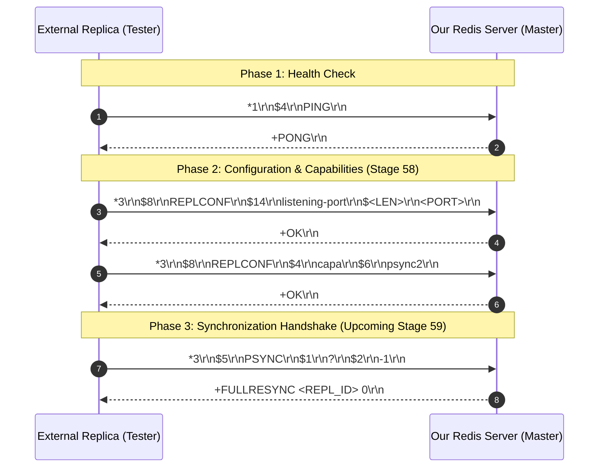
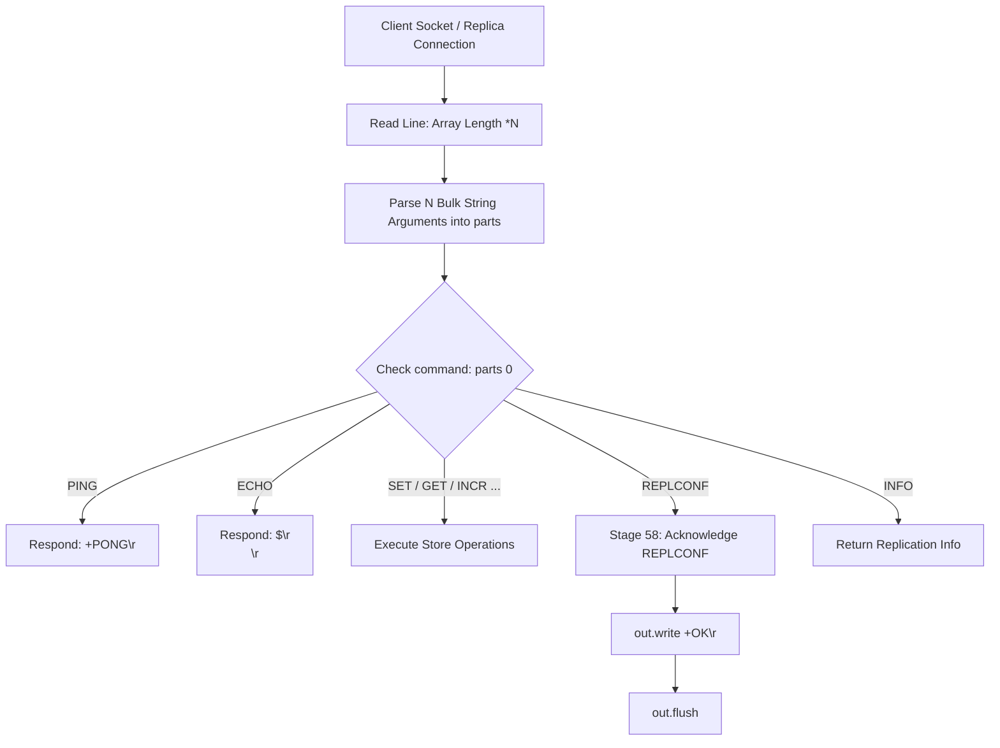

# Stage 58: Receive handshake (1 of 2)

---

## In one line
Implement the master-side handling of the replication handshake by recognizing the `REPLCONF` command and acknowledging replica configuration and capabilities (`listening-port` and `capa psync2`) with RESP simple string `+OK\r\n`.

---

## Self-test (cover the answers below and answer these first)
1. **From the master's perspective, what sequence of commands does a connecting replica execute during the initial handshake?**
   - *Answer*:
     1. `PING` &rarr; Master responds `+PONG\r\n`
     2. `REPLCONF listening-port <PORT>` &rarr; Master responds `+OK\r\n`
     3. `REPLCONF capa psync2` &rarr; Master responds `+OK\r\n`
     4. `PSYNC <REPL_ID> <OFFSET>` (e.g. `PSYNC ? -1`) &rarr; Master responds `+FULLRESYNC <REPL_ID> 0\r\n` followed by RDB payload and replication stream.
2. **Why does the replica send `REPLCONF listening-port <PORT>` to the master, and how does the master use this information?**
   - *Answer*: When a replica establishes an outbound TCP connection to the master, the TCP connection originates from an ephemeral client port assigned by the replica's OS kernel (e.g., 54321), not the port on which the replica listens for Redis client commands (e.g., 6380). By sending `listening-port`, the replica explicitly informs the master of its reachable server port. The master stores this metadata in its replica client registry to display accurate replica addresses in `INFO replication` (e.g. `slave0:ip=127.0.0.1,port=6380,state=online...`).
3. **What does `REPLCONF capa psync2` communicate, and why is capability negotiation essential in protocol evolution?**
   - *Answer*: `capa` stands for "capability". Redis 4.0 introduced `psync2`, which allows chained replication failover and partial resynchronization after a replica is promoted to master. By advertising `capa psync2`, the replica signals to the master that it supports the newer PSYNC2 replication protocol features. If a future replica or older client does not support it, the master can gracefully degrade to legacy sync mechanisms.
4. **Why is `+OK\r\n` formatted as a Simple String rather than a Bulk String (`$2\r\nOK\r\n`)?**
   - *Answer*: Under the Redis Serialization Protocol (RESP), standard status replies without binary metadata or newline characters are represented as Simple Strings, prefixed with `+` and terminated by `\r\n`. The official Redis specification and client test harnesses strictly assert `+OK\r\n` for status acknowledgments; returning a Bulk String violates the expected protocol contract.
5. **Why should `REPLCONF` command parsing be tolerant of variable argument counts and unknown subcommands?**
   - *Answer*: `REPLCONF` is a polymorphic configuration command used for various replication tasks throughout the session lifecycle: `listening-port`, `capa`, `ack <offset>`, and `getack *`. A robust master should gracefully parse `REPLCONF` arguments and acknowledge known handshakes without throwing `IndexOutOfBoundsException` or crashing on optional or unknown flags.

---

## Problem Solved

In Stages 55, 56, and 57, we implemented the replication handshake from the **replica's perspective** (client-side):
- The replica initiated a TCP socket to the master.
- It sequentially transmitted `PING`, `REPLCONF listening-port <PORT>`, `REPLCONF capa psync2`, and `PSYNC ? -1`.
- It awaited and verified each response (`+PONG\r\n`, `+OK\r\n`, `+OK\r\n`, `+FULLRESYNC ...`).

Now in Stage 58, our Redis server acts in its default role as a **master**, receiving connections from external replicas.
1. The test runner connects to our Redis master server as a replica.
2. It sends `PING` &rarr; our existing command loop handles `PING` and responds `+PONG\r\n`.
3. It sends `REPLCONF listening-port <PORT>` &rarr; previously, our master had no handler for `REPLCONF`, which would fail the test or ignore the command.
4. It sends `REPLCONF capa psync2` &rarr; master must acknowledge with `+OK\r\n`.

By implementing `REPLCONF` in `handleCommand` and returning `+OK\r\n`, the master successfully completes the first phase of receiving an inbound replication handshake.

---

## Thought Process & Architectural Model

### 1. Inbound Handshake Sequence (Master Perspective)



### 2. Command Dispatch Pipeline



---

## Full Solution

### Code in `codecrafters-redis-java/src/main/java/Main.java`

Inside `handleCommand(String[] parts, OutputStream out)`:

```java
    } else if (command.equalsIgnoreCase("REPLCONF")) {
      // Stage 58: Replication handshake - master responds +OK to REPLCONF listening-port and REPLCONF capa
      out.write("+OK\r\n".getBytes(StandardCharsets.UTF_8));
    }
```

When commands are processed from client sockets in `main`:
```java
              } else {
                handleCommand(parts, out);
                out.flush();
              }
```

The output stream is flushed after writing `+OK\r\n`, ensuring the handshake acknowledgment is dispatched immediately across the TCP socket to the connecting replica.

---

## Concepts (the transferable part)

- **Asymmetric Handshake Roles**:
  - In peer-to-peer or primary-replica protocols, both sides run state machines, but with inverted responsibilities:
    - **Replica (Initiator / Active)**: Connects outbound, drives the sequence by transmitting requests (`PING` &rarr; `REPLCONF` &rarr; `PSYNC`), and blocks awaiting responses.
    - **Master (Receiver / Passive)**: Accepts inbound TCP connections, receives commands in any order standard clients or replicas send, and dispatches responses synchronously or registers subscriber state.

- **Metadata and Capability Discovery (`REPLCONF`)**:
  - Rather than baking fixed assumptions into binary headers, extensible protocols use key-value or verb-noun negotiation commands (`REPLCONF <parameter> <value>`).
  - This allows forward and backward compatibility: an older master can ignore unrecognized capabilities (`capa psync2`, `capa eof`) without protocol breakage.

- **Ephemeral Sockets vs Advertised Addresses**:
  - An outbound TCP connection from host $A$ to host $B$ uses an ephemeral source port chosen by the OS network stack.
  - A server listening on a public port cannot deduce the peer's listening service port solely from TCP `getsockname()` / `getpeername()`. Application-layer advertising (such as `REPLCONF listening-port <port>`) is a ubiquitous pattern (also seen in SIP, BGP, and BitTorrent).

---

## Wire Format & Protocol Details

### 1. `REPLCONF listening-port <PORT>`
- Structure: RESP Array of 3 Bulk Strings: `["REPLCONF", "listening-port", "<PORT>"]`
- Wire Example (for port 6380):
  ```
  *3\r\n$8\r\nREPLCONF\r\n$14\r\nlistening-port\r\n$4\r\n6380\r\n
  ```
- Hex breakdown:
  ```
  * 3 \r \n $ 8 \r \n R E P L C O N F \r \n $ 1 4 \r \n l i s t e n i n g - p o r t \r \n $ 4 \r \n 6 3 8 0 \r \n
  ```

### 2. `REPLCONF capa psync2`
- Structure: RESP Array of 3 Bulk Strings: `["REPLCONF", "capa", "psync2"]`
- Wire Example:
  ```
  *3\r\n$8\r\nREPLCONF\r\n$4\r\ncapa\r\n$6\r\npsync2\r\n
  ```
- Hex breakdown:
  ```
  * 3 \r \n $ 8 \r \n R E P L C O N F \r \n $ 4 \r \n c a p a \r \n $ 6 \r \n p s y n c 2 \r \n
  ```

### 3. Master Response
- Structure: RESP Simple String `+OK\r\n`
- Wire: `+OK\r\n`
- Hex: `2b 4f 4b 0d 0a`

---

## What Breaks It (Failure Modes & Edge Cases)

1. **Omitting `flush()` on Socket Output**:
   - *Bug*: Writing `+OK\r\n` to `out` without calling `out.flush()`.
   - *Failure*: TCP buffers hold the response in OS/JVM memory. The replica hangs waiting for `+OK\r\n`, causing tester timeout.
   - *Fix*: Call `out.flush()` immediately after writing the command response.

2. **Case Sensitivity in Command Checking**:
   - *Bug*: Using `command.equals("REPLCONF")` instead of `equalsIgnoreCase`.
   - *Failure*: While canonical Redis sends uppercase, clients or tools might send `replconf`. Case-sensitive comparison fails to recognize the command.
   - *Fix*: Always use `command.equalsIgnoreCase("REPLCONF")`.

3. **Wrong RESP Type Prefix**:
   - *Bug*: Sending `$2\r\nOK\r\n` (Bulk String) instead of `+OK\r\n` (Simple String).
   - *Failure*: The replica parser checks the first byte. If expecting `+`, finding `$` causes protocol violation.
   - *Fix*: Ensure status replies use `+OK\r\n`.

4. **Rigid Subcommand Argument Parsing**:
   - *Bug*: Assuming every `REPLCONF` has exactly 3 arguments and crashing if `parts.length < 3` or different subcommands are passed.
   - *Failure*: Throws `ArrayIndexOutOfBoundsException`, aborting client worker thread.
   - *Fix*: Check array boundaries or treat general handshake `REPLCONF` queries gracefully.

---

## Tradeoffs & Design Decisions

1. **Simple Immediate `+OK` vs Full Replica State Tracking**:
   - *Immediate `+OK` (Chosen for Stage 58)*: For initial stages, the master only needs to acknowledge the replica's advertised port and capability to unblock the handshake. Storing replica references before `PSYNC` creates unnecessary coupling.
   - *Full Replica Client Object*: When replication stream fanout (`PSYNC` & write propagation) and offset tracking (`ACK`) are implemented in Stages 59+, the socket is upgraded to a registered replica connection.

2. **Unified Command Dispatch vs Dedicated Replication State Machine**:
   - *Unified Command Dispatch (Chosen)*: In real Redis, a replica connection is just a regular client socket executing regular RESP commands (`PING`, `REPLCONF`, `PSYNC`). Handling `REPLCONF` inside standard `handleCommand` aligns directly with Redis architecture.
   - *Separate Replica Port/Socket Handler*: Would require distinct listening sockets or out-of-band protocols, conflicting with the unified RESP protocol model.

---

## Java Specifics — Lookup, Don't Memorize

- `String.equalsIgnoreCase(String anotherString)` &mdash; Compares two strings ignoring case considerations, according to standard ASCII case mapping.
- `StandardCharsets.UTF_8` &mdash; Standard `Charset` instance for UTF-8 byte conversion without throwing checked `UnsupportedEncodingException`.
- `OutputStream.write(byte[])` &mdash; Writes byte array to underlying socket stream.
- `OutputStream.flush()` &mdash; Flushes buffered output bytes to the network layer.

---

## Rebuild Checklist (From Scratch)

- [ ] In `handleCommand(String[] parts, OutputStream out)`:
  - [ ] Add branch for `REPLCONF`:
    ```java
    else if (command.equalsIgnoreCase("REPLCONF")) {
      out.write("+OK\r\n".getBytes(StandardCharsets.UTF_8));
    }
    ```
  - [ ] Verify that `out.flush()` is invoked in the command processing loop.
- [ ] Verify compilation:
  ```powershell
  javac -d target/classes codecrafters-redis-java/src/main/java/Main.java
  ```
- [ ] Test locally or verify against CodeCrafters CLI:
  ```powershell
  codecrafters test
  ```
