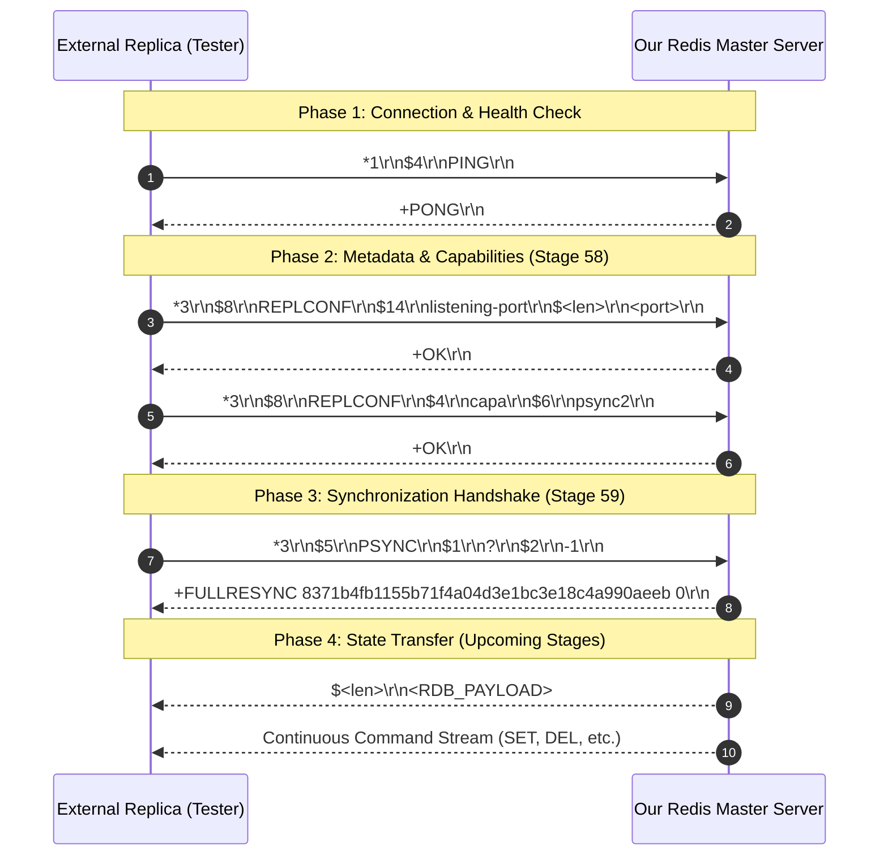

# Stage 59: Receive handshake (2 of 2)

---

## In one line
Implement the master-side response to the `PSYNC` command during the replication handshake, replying with the RESP Simple String `+FULLRESYNC <masterReplId> 0\r\n` to instruct the replica to begin full synchronization.

---

## Self-test (cover the answers below and answer these first)
1. **What is the purpose of the `PSYNC` command in Redis, and what do the arguments `?` and `-1` represent?**
   - *Answer*: `PSYNC` initiates replication synchronization between a replica and a master. The first argument is the master's replication ID, and the second is the processed replication byte offset. When a replica connects for the very first time (or after a restart without cached state), it has no replication history: `?` denotes an unknown replication ID, and `-1` denotes an invalid/empty replication offset.
2. **What does the master's response `+FULLRESYNC <masterReplId> 0\r\n` communicate to the replica?**
   - *Answer*:
     - `FULLRESYNC`: Indicates that the master cannot perform an incremental/partial resynchronization (due to unknown replication ID or missing backlog history) and will execute a full resynchronization.
     - `<masterReplId>`: The 40-character pseudo-random alphanumeric replication ID that identifies the master's current data timeline/dataset history.
     - `0`: The initial replication offset marking the starting position of the replication stream after the initial snapshot (RDB) is loaded.
3. **Why is `+FULLRESYNC ...` sent as a RESP Simple String (`+`) rather than a Bulk String (`$`) or an Array (`*`)?**
   - *Answer*: In Redis protocol semantics, status and state-transition notifications without binary payloads or embedded line breaks are transmitted as Simple Strings (`+<message>\r\n`). Clients and replicas parse the leading `+` byte and interpret the whitespace-delimited tokens (`FULLRESYNC`, `<replid>`, `<offset>`) as a control directive.
4. **How does `PSYNC` compare to the legacy `SYNC` command in earlier Redis versions?**
   - *Answer*: The legacy `SYNC` command (Redis 2.6 and earlier) only supported full resynchronization; any transient network disconnection forced the master to dump its entire memory to disk and stream the entire RDB file again. `PSYNC` (introduced in Redis 2.8 and enhanced as `psync2` in Redis 4.0) introduced partial resynchronization (`+CONTINUE`), allowing reconnecting replicas with matching replication IDs and valid backlog offsets to resume receiving only missing commands.
5. **Why must the master supply its exact configured `masterReplId` in the `+FULLRESYNC` reply?**
   - *Answer*: The replica stores this replication ID in its own state. In subsequent operations (and future reconnections or failovers), the replica uses this ID to identify the shared history. If the master were to respond with an invalid or mismatched ID, the replica would be unable to correlate its replication state with the master or report accurate information in its own `INFO replication`.

---

## Problem Solved

In Stages 55–57, we implemented the client side of replication:
- In Stage 55, a replica server initiated a TCP connection to the master and sent `PING`.
- In Stage 56, the replica sent configuration metadata: `REPLCONF listening-port <PORT>` and `REPLCONF capa psync2`.
- In Stage 57, the replica sent `PSYNC ? -1` to initiate synchronization and parsed the master's response.

In Stage 58, we implemented the first half of the master-side handshake:
- Handling `REPLCONF` commands (`listening-port` and `capa psync2`) and responding with `+OK\r\n`.

Now in Stage 59, we complete the master-side handshake:
- When a replica transmits `PSYNC ? -1`, our master recognizes the `PSYNC` command and responds with `+FULLRESYNC <masterReplId> 0\r\n`.
- This unblocks the replica and establishes the replication session contract, paving the way for RDB file transfer and write command propagation in subsequent stages.

---

## Thought Process & Architectural Model

### 1. Complete Inbound Replication Handshake Flow



### 2. Master Command Processing Pipeline

```mermaid
flowchart TD
    A[Client Connection / Socket] --> B[Read Line: Array Length *N]
    B --> C[Read N Bulk Strings into parts[]]
    C --> D{Evaluate parts[0]}
    D -->|PING| E[out.write: +PONG\r\n]
    D -->|ECHO| F[out.write: Bulk String]
    D -->|SET / GET / ...| G[Execute Store Operations]
    D -->|REPLCONF| H[out.write: +OK\r\n]
    D -->|PSYNC| I[Stage 59: +FULLRESYNC &lt;replId&gt; 0\r\n]
    D -->|INFO| J[out.write: Replication Info]
    E --> K[out.flush()]
    F --> K
    G --> K
    H --> K
    I --> K
    J --> K
```

---

## Full Solution

### Code in `codecrafters-redis-java/src/main/java/Main.java`

Inside `handleCommand(String[] parts, OutputStream out)`:

```java
    } else if (command.equalsIgnoreCase("REPLCONF")) {
      // Stage 58: Replication handshake - master responds +OK to REPLCONF listening-port and REPLCONF capa
      out.write("+OK\r\n".getBytes(StandardCharsets.UTF_8));
    } else if (command.equalsIgnoreCase("PSYNC")) {
      // Stage 59: Replication handshake - master responds +FULLRESYNC <masterReplId> 0\r\n
      String response = "+FULLRESYNC " + masterReplId + " 0\r\n";
      out.write(response.getBytes(StandardCharsets.UTF_8));
    } else if (command.equalsIgnoreCase("INFO")) {
```

### Master State Properties

The `masterReplId` was initialized in Stage 54 for the `INFO replication` command:

```java
  private static String masterReplId = "8371b4fb1155b71f4a04d3e1bc3e18c4a990aeeb";
  private static long masterReplOffset = 0;
```

When `PSYNC` is received, the server formats the simple string using the existing `masterReplId` and offset `0`, writing the bytes directly to the socket output stream, followed by `out.flush()` in the client processing loop.

---

## Concepts (the transferable part)

- **Replication ID (`replid`) as Timeline Identifier**:
  - In distributed systems (Raft, Paxos, Redis, MySQL GTID), state machines need to identify not just the data, but the *specific lineage/timeline* of mutations.
  - Redis generates a 40-character hexadecimal string representing the current master instance's history. Replicas inherit this ID once synchronized. If a master restarts or a replica is promoted, new IDs or dual IDs (in PSYNC2) represent divergence points.

- **Byte Offset as Monotonic Progress Counter**:
  - Rather than tracking operation sequence numbers (like `op_id = 1, 2, 3`), Redis replication tracks *exact byte offsets* in the serialized replication stream.
  - Every byte transmitted to replicas (e.g. `*3\r\n$3\r\nSET\r\n...`) advances the replication offset by the exact byte length.
  - Offset `0` marks the initial boundary right after applying the baseline dataset snapshot.

- **Full vs. Partial Resynchronization**:
  - **Full Resync (`+FULLRESYNC`)**: Required when the replica has no prior relationship with the master (`? -1`), or when the replica's offset has fallen behind the master's circular in-memory replication backlog buffer (`repl-backlog-size`). The master sends an RDB snapshot followed by buffered stream commands.
  - **Partial Resync (`+CONTINUE`)**: When the replica presents a matching `replid` and an offset that still exists within the master's backlog, the master avoids an expensive snapshot dump and simply streams the missing delta bytes.

- **Symmetric Handshake Contracts**:
  - Network protocols require clean state machine alignment. When the master replies `+FULLRESYNC`, both sides atomically transition states:
    - Master registers the client socket as a replica subscriber.
    - Replica enters the `REPL_STATE_RECEIVE_BULK` state to receive the RDB snapshot.

---

## Wire Format & Protocol Specifications

### 1. `PSYNC` Request Wire Format
- Format: RESP Array of 3 Bulk Strings: `["PSYNC", "<replication_id>", "<offset>"]`
- For an initial handshake, `<replication_id>` is `?` and `<offset>` is `-1`:
  ```
  *3\r\n$5\r\nPSYNC\r\n$1\r\n?\r\n$2\r\n-1\r\n
  ```
- Detailed breakdown:
  ```
  * 3 \r \n         --> RESP Array with 3 elements
  $ 5 \r \n         --> Bulk String of 5 bytes
  P S Y N C \r \n   --> Command name
  $ 1 \r \n         --> Bulk String of 1 byte
  ? \r \n           --> Replication ID wildcard ("unknown")
  $ 2 \r \n         --> Bulk String of 2 bytes
  - 1 \r \n         --> Replication offset (-1 = no offset)
  ```

### 2. `+FULLRESYNC` Response Wire Format
- Format: RESP Simple String: `+FULLRESYNC <masterReplId> <initialOffset>\r\n`
- Example:
  ```
  +FULLRESYNC 8371b4fb1155b71f4a04d3e1bc3e18c4a990aeeb 0\r\n
  ```
- Hexadecimal representation:
  ```
  2b 46 55 4c 4c 52 45 53 59 4e 43 20 38 33 37 31  | +FULLRESYNC 8371
  62 34 66 62 31 31 35 35 62 37 31 66 34 61 30 34  | b4fb1155b71f4a04
  64 33 65 31 62 63 33 65 31 38 63 34 61 39 39 30  | d3e1bc3e18c4a990
  61 65 65 62 20 30 0d 0a                          | aeeb 0..
  ```

---

## What Breaks It (Failure Modes & Edge Cases)

1. **Sending Bulk String Instead of Simple String**:
   - *Bug*: Writing `$56\r\nFULLRESYNC ...\r\n`.
   - *Symptom*: Replicas (and the test harness) strictly expect status reply prefix `+`. Reading `$` causes protocol parse errors or premature disconnects.
   - *Fix*: Always prefix with `+` and end with `\r\n`.

2. **Hardcoding Offset or Omitting Space Separators**:
   - *Bug*: Formatting as `+FULLRESYNC<replId>0\r\n` or `+FULLRESYNC <replId>\r\n`.
   - *Symptom*: Token parsing on the replica splits tokens on whitespace (` `). Missing spaces cause the entire string to be parsed as a single token, causing `IndexOutOfBoundsException` or `NumberFormatException`.
   - *Fix*: Ensure exact space delimitation: `+FULLRESYNC <replId> 0\r\n`.

3. **Mismatched Replication ID between `INFO` and `PSYNC`**:
   - *Bug*: Using one constant for `INFO replication` (`master_replid:8371...`) and a different hardcoded or randomly generated ID for `PSYNC`.
   - *Symptom*: Verification tests querying `INFO replication` after `PSYNC` fail consistency assertions.
   - *Fix*: Reference the identical `masterReplId` static variable across both handlers.

4. **Buffered Socket Deadlock**:
   - *Bug*: Writing the response into an unbuffered or buffered stream without flushing.
   - *Symptom*: The bytes stay in the master's OS socket send buffer, leaving the replica blocked indefinitely on `readLine()`.
   - *Fix*: Ensure `out.flush()` is invoked after dispatching the response.

---

## Tradeoffs & Design Decisions

1. **Simple String Reply vs Immediate RDB File Dump**:
   - *Two-Step Protocol (Redis Architecture)*: Redis splits full resync into two discrete phases: first, the `+FULLRESYNC` control message; second, the raw RDB binary payload transfer (`$<len>\r\n<rdb_bytes>`).
   - *Tradeoff*: Stage 59 verifies the first phase (handshake acknowledgment). Deferring RDB payload transmission to subsequent stages isolates protocol parsing from file I/O complexity.

2. **Static vs Dynamic Replication ID**:
   - *Static 40-char ID*: Deterministic, zero overhead, perfectly reliable for testing across container restarts.
   - *Dynamic `SecureRandom` hex generator*: Production Redis generates a random 40-char hex string upon daemon startup. Both satisfy the protocol as long as the ID remains stable throughout the server's lifecycle.

---

## Java Specifics — Lookup, Don't Memorize

- `String.equalsIgnoreCase(String anotherString)` &mdash; Performs case-insensitive matching for command tokens (`"PSYNC"`, `"psync"`).
- `StandardCharsets.UTF_8` &mdash; Constant for the UTF-8 `Charset`, avoiding character encoding ambiguity and checked exceptions.
- `OutputStream.write(byte[] b)` &mdash; Sends raw byte arrays over the socket TCP stream.
- `OutputStream.flush()` &mdash; Forces any buffered output bytes to be pushed onto the network interface.

---

## Rebuild Checklist & Mental Model Verification

- [ ] In `Main.java`:
  - [ ] Confirm `masterReplId` static variable exists:
    ```java
    private static String masterReplId = "8371b4fb1155b71f4a04d3e1bc3e18c4a990aeeb";
    ```
  - [ ] Inside `handleCommand(String[] parts, OutputStream out)`, add handler for `PSYNC`:
    ```java
    } else if (command.equalsIgnoreCase("PSYNC")) {
      String response = "+FULLRESYNC " + masterReplId + " 0\r\n";
      out.write(response.getBytes(StandardCharsets.UTF_8));
    }
    ```
  - [ ] Confirm `out.flush()` is executed after command handling in the connection loop.
- [ ] Test compilation:
  ```powershell
  javac -d target/classes codecrafters-redis-java/src/main/java/Main.java
  ```
- [ ] Verify using the CodeCrafters CLI:
  ```powershell
  & 'C:\Users\jiten\AppData\Local\Programs\codecrafters\codecrafters.exe' test
  ```
