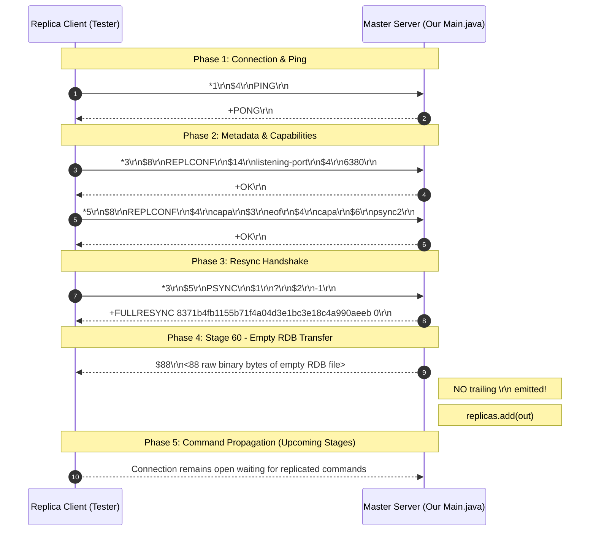

# Stage 60: Empty RDB transfer

---

## In one line
Transmit an empty RDB snapshot to the replica immediately after `+FULLRESYNC` using length-prefixed framing (`$<length>\r\n<bytes>`) without a trailing `\r\n`, and register the replica socket for command propagation.

---

## Self-test (cover the answers below and answer these first)
1. **How is the RDB snapshot formatted on the wire during replication, and how does it critically differ from a standard RESP Bulk String?**
   - *Answer*: It begins identically to a bulk string with `$<length>\r\n<bytes>`, where `<length>` is the exact byte count in ASCII decimal. However, standard RESP Bulk Strings conclude with a trailing `\r\n` delimiter; the replication RDB stream **omits** this trailing `\r\n`. The payload consists strictly of the raw binary RDB bytes.
2. **What happens if a master erroneously appends `\r\n` to the end of the RDB file payload?**
   - *Answer*: The replica's parser reads exactly `<length>` bytes to load the RDB file into memory. The stray `\r\n` remains unread in the socket receive buffer. When the master subsequently begins propagating commands (e.g., `*3\r\n$3\r\nSET...`), the replica attempts to parse the leftover `\r\n` as the beginning of the next RESP frame, resulting in protocol deserialization errors (`Protocol error: expected '*'`) and connection termination.
3. **What is an RDB file, and what are its magic signature and minimal structural elements?**
   - *Answer*: RDB (Redis Database) is Redis's compact binary serialization format for point-in-time database snapshots. It begins with the 9-byte magic signature `REDIS` followed by a 4-digit version number (e.g., `0011` for version 11 in Redis 7.x), followed by optional auxiliary metadata fields (`redis-ver`, `redis-bits`, `ctime`, etc.), database selector/opcodes, and terminates with an end-of-file opcode (`0xFF` / `255`) and an 8-byte CRC64 checksum. An empty RDB file represents a database with zero keys.
4. **Why must the RDB binary payload be sent directly as raw bytes through an `OutputStream` rather than encoded via a `Writer` or `PrintWriter`?**
   - *Answer*: RDB files contain arbitrary 8-bit binary data (compressed opcodes, raw integers, CRC64 bytes). Character streams (`Writer`, `OutputStreamWriter`) perform charset conversions (e.g., UTF-8 or ISO-8859-1). UTF-8 interprets arbitrary high-order bytes as invalid sequences and replaces them with replacement characters (`\uFFFD`, `0xEF 0xBF 0xBD`), fatally corrupting the binary RDB file.
5. **Why should the replica's output stream be added to a thread-safe collection (such as `CopyOnWriteArrayList`) upon completing the `PSYNC` handshake?**
   - *Answer*: Once synchronized, the master must propagate every subsequent mutating write command (`SET`, `DEL`, `LPUSH`, etc.) to all connected replicas. Client requests execute on different threads. A thread-safe collection ensures that iterating over active replicas during command propagation does not suffer `ConcurrentModificationException` when new replicas connect or old ones disconnect.
6. **What is the difference between disk-backed replication and diskless replication in Redis?**
   - *Answer*: In classic disk-backed replication, the master invokes `BGSAVE` to fork a child process, dumps the RDB to a disk file, and then streams the file from disk to the socket. In diskless replication (`repl-diskless-sync yes`), the master forks a child that streams the serialized RDB bytes directly into the replica sockets over TCP without touching secondary storage, saving disk I/O and latency.

---

## Problem Solved

In Stage 59, our master server answered the replica's initial resynchronization handshake (`PSYNC ? -1`) with:
```
+FULLRESYNC 8371b4fb1155b71f4a04d3e1bc3e18c4a990aeeb 0\r\n
```

However, acknowledging a full resync is only step one of the synchronization protocol contract. When a replica connects from scratch with no prior history (`? -1`), it possesses zero state. The master must transfer its entire current dataset to the replica so both nodes start from an identical baseline before continuous replication of write commands can occur.

In Stage 60, we solve:
1. **Initial Dataset Transmission**: Delivering an empty RDB snapshot binary file immediately following the `+FULLRESYNC` reply.
2. **Binary Framing Compliance**: Prefixing the binary snapshot with `$<length>\r\n` and ensuring **no** trailing `\r\n` is sent.
3. **Replica Registry**: Storing the replica's `OutputStream` in an active replica registry so future write commands can be broadcast to all connected replicas.
4. **Connection Lifecycle Safety**: Removing closed or disconnected replica sockets from the registry upon stream termination.

---

## Thought Process & Architectural Model

### 1. Inbound Replication Protocol Flow



### 2. Handshake & Snapshot Transmission State Machine

```mermaid
flowchart TD
    A[Client sends command parts] --> B{parts[0] == PSYNC?}
    B -- No --> C[Normal Command Execution]
    B -- Yes --> D[Step 1: Write +FULLRESYNC masterReplId 0\r\n]
    D --> E[Step 2: Base64 decode empty RDB: 88 bytes]
    E --> F[Step 3: Write header: '$' + 88 + '\r\n']
    F --> G[Step 4: Write raw 88 RDB bytes]
    G --> H[Step 5: out.flush()]
    H --> I[Step 6: Register out into replicas list]
    I --> J[Await subsequent writes / read loop]
    J --> K{Client Disconnect / IOException?}
    K -- Yes --> L[finally: replicas.remove(out) and socket.close()]
```

---

## Full Solution

### 1. The Base64 Empty RDB Snapshot

An empty RDB version 11 file is represented by the 120-character base64 string:
```
UkVESVMwMDEx+glyZWRpcy12ZXIFNy4yLjD6CnJlZGlzLWJpdHPAQPoFY3RpbWXCbQi8ZfoIdXNlZC1tZW3CsMQQAPoIYW9mLWJhc2XAAP/wbjv+wP9aog==
```

When decoded with `java.util.Base64.getDecoder().decode(...)`, this yields exactly 88 bytes:
- Bytes 0–8: `REDIS0011` (ASCII Magic and version)
- Bytes 9–78: Auxiliary fields (`redis-ver` = `7.2.0`, `redis-bits` = 64, `ctime`, `used-mem`, `aof-base`)
- Byte 79: `0xFF` (`255` = RDB EOF Opcode)
- Bytes 80–87: 8-byte CRC64 checksum

### 2. Master Implementation in `codecrafters-redis-java/src/main/java/Main.java`

#### State and Registry Declarations:
```java
  private static String masterReplId = "8371b4fb1155b71f4a04d3e1bc3e18c4a990aeeb";
  private static long masterReplOffset = 0;
  private static final String EMPTY_RDB_BASE64 =
      "UkVESVMwMDEx+glyZWRpcy12ZXIFNy4yLjD6CnJlZGlzLWJpdHPAQPoFY3RpbWXCbQi8ZfoIdXNlZC1tZW3CsMQQAPoIYW9mLWJhc2XAAP/wbjv+wP9aog==";
  private static final List<OutputStream> replicas = new CopyOnWriteArrayList<>();
```

#### Handling `PSYNC` in `handleCommand`:
```java
    } else if (command.equalsIgnoreCase("PSYNC")) {
      // Stage 59: Replication handshake - master responds +FULLRESYNC <masterReplId> 0\r\n
      String response = "+FULLRESYNC " + masterReplId + " 0\r\n";
      out.write(response.getBytes(StandardCharsets.UTF_8));

      // Stage 60: Empty RDB transfer - send snapshot formatted as $<length>\r\n<bytes> (no trailing \r\n)
      byte[] rdbBytes = Base64.getDecoder().decode(EMPTY_RDB_BASE64);
      String rdbHeader = "$" + rdbBytes.length + "\r\n";
      out.write(rdbHeader.getBytes(StandardCharsets.UTF_8));
      out.write(rdbBytes);
      out.flush();

      // Track replica connection for subsequent command propagation
      if (!replicas.contains(out)) {
        replicas.add(out);
      }
    }
```

#### Connection Lifecycle and Cleanup in Client Loop:
```java
      while (true) {
        Socket clientSocket = serverSocket.accept();

        new Thread(() -> {
          ClientContext clientCtx = new ClientContext();
          OutputStream out = null;
          try {
            out = clientSocket.getOutputStream();
            InputStream in = clientSocket.getInputStream();
            BufferedReader reader = new BufferedReader(new InputStreamReader(in));
            // ... command parsing loop ...
          } catch (IOException e) {
            System.out.println("IOException: " + e.getMessage());
          } finally {
            if (out != null) {
              replicas.remove(out);
            }
            unwatchAll(clientCtx);
            try {
              clientSocket.close();
            } catch (IOException ignored) {}
          }
        }).start();
      }
```

---

## Concepts (the transferable part)

- **Snapshot + Delta Replication Pattern**:
  - Almost every distributed data store (Redis, MySQL, PostgreSQL, Cassandra, Kafka) solves node synchronization using two distinct phases:
    1. **Bulk Snapshot (Baseline State)**: High-throughput transfer of frozen state at point $t_0$.
    2. **Log/Command Stream (Incremental Delta)**: Sequential delivery of transactions/operations occurring after $t_0$.
  - Without a snapshot, a replica would have to replay the entire history of the world since the cluster was created.

- **Length-Prefixed Framing vs Delimiter Framing**:
  - Text protocols frequently use delimiters (CRLF `\r\n`, null bytes `\0`).
  - Binary payloads cannot safely use delimiters because the binary content itself can contain `\r\n` (bytes `0x0D 0x0A`) at any position.
  - Length-prefixed framing (`$<length>\r\n<payload>`) informs the receiver precisely how many bytes to read before returning to parsing protocol control frames.

- **The Asymmetric Delimiter Trap**:
  - Standard RESP Bulk Strings use a length prefix **and** a trailing delimiter: `$<len>\r\n<data>\r\n`.
  - The Redis replication protocol consciously omits the trailing `\r\n` on the RDB snapshot stream. Why? Because the RDB file is treated as a raw byte payload streamed directly from disk or memory without protocol framing overhead. If a trailing delimiter were required, streaming a multi-gigabyte RDB would require injecting extra bytes at the EOF boundary, complicating diskless streaming pipelines.

- **Thread-Safe Broadcast Subscriptions**:
  - In a master-replica architecture, multiple client connections execute writes concurrently, and each write must be forwarded to all active replicas.
  - Using `CopyOnWriteArrayList` provides lock-free, safe iteration for broadcasting write commands, even if another thread registers a new replica or removes a failing replica concurrently.

---

## Wire Format & Protocol Specifications

### 1. The Wire Sequence on Master Response

```
Master output:
+FULLRESYNC 8371b4fb1155b71f4a04d3e1bc3e18c4a990aeeb 0\r\n$88\r\n<88 bytes of binary RDB>
```

### 2. Byte-Level Breakdown of the Transfer

| Segment | Wire Content | Hex | Purpose |
| :--- | :--- | :--- | :--- |
| **Resync Status** | `+FULLRESYNC ... 0\r\n` | `2B 46 55 4C ... 30 0D 0A` | Signals full resync starting at offset 0 |
| **RDB Header** | `$88\r\n` | `24 38 38 0D 0A` | Declares exactly 88 bytes of binary payload |
| **Magic Header** | `REDIS0011` | `52 45 44 49 53 30 30 31 31` | RDB signature and format version 11 |
| **Auxiliary Fields** | `redis-ver...` | `FA 09 72 65 64 69 73 2D ...` | Redis server metadata opcodes |
| **EOF Opcode** | `0xFF` | `FF` | Opcode signaling end of database |
| **CRC64 Checksum**| 8 raw bytes | `FE F0 6E 3B FE C0 FF 5A` | Integrity validation checksum |

---

## What Breaks It (Failure Modes & Edge Cases)

1. **The Trailing `\r\n` Hazard**:
   - *Bug*: Writing `out.write(("\r\n").getBytes(...))` after sending `rdbBytes`.
   - *Symptom*: In Stage 60, tests may pass if the tester closes immediately after reading 88 bytes, but Stage 61 (Command Propagation) will fail catastrophically because the replica reads the trailing `\r\n` as garbage before the first command array `*`.
   - *Fix*: Send strictly `$<len>\r\n<bytes>` with no trailing bytes.

2. **Writing RDB via Character Stream (`BufferedWriter` / `PrintWriter`)**:
   - *Bug*: Doing `writer.write(new String(rdbBytes, "UTF-8"))`.
   - *Symptom*: Binary opcodes (such as `0xFF` and checksum bytes) are not valid UTF-8 sequences. Java's encoder replaces them with `0xEF 0xBF 0xBD`, altering the byte count and corrupting the RDB checksum.
   - *Fix*: Always write directly to the raw socket `OutputStream.write(byte[])`.

3. **Buffering Deadlock**:
   - *Bug*: Calling `out.write(...)` without calling `out.flush()`.
   - *Symptom*: If the socket buffer does not fill past its MTU / TCP buffer threshold, the RDB bytes remain in memory. The remote replica blocks on `read()`, resulting in a test timeout.
   - *Fix*: Call `out.flush()` immediately after writing the RDB bytes.

4. **Concurrent Iteration Leaks / Crashes**:
   - *Bug*: Storing replicas in a standard `ArrayList<OutputStream>` without synchronization.
   - *Symptom*: When multiple replicas connect or when a write command arrives while a replica disconnects, `for (OutputStream r : replicas)` throws `ConcurrentModificationException`.
   - *Fix*: Use `CopyOnWriteArrayList<OutputStream>`.

---

## Tradeoffs & Design Decisions

1. **Pre-encoded Base64 Constant vs Runtime Generation**:
   - *Base64 Constant*: Zero CPU overhead, no external file dependencies, guarantees exact compatibility with CodeCrafters tester expectations.
   - *Runtime Generation*: Necessary in full production Redis where an active keyspace must be dynamically serialized via `rdbSave()`. For our server stages where the database starts empty, static generation is optimal and robust.

2. **`CopyOnWriteArrayList` vs `Collections.synchronizedList`**:
   - *`CopyOnWriteArrayList`*: Read/iterate operations are lock-free and never throw `ConcurrentModificationException`. Perfect for replication where write-command propagation is frequent (many iterations) and replica connections/disconnections are rare.
   - *Synchronized List*: Requires holding an explicit lock across the entire broadcast iteration, creating latency spikes on command processing threads.

---

## Java Specifics — Lookup, Don't Memorize

- `Base64.getDecoder().decode(String src)` &mdash; Decodes an RFC 4648 Base64 encoded string into a newly-allocated `byte[]`.
- `CopyOnWriteArrayList<E>` &mdash; A thread-safe variant of `ArrayList` in `java.util.concurrent` where all mutative operations (`add`, `remove`) make a fresh copy of the underlying array. Iterators traverse the snapshot without synchronization.
- `OutputStream.write(byte[] b)` &mdash; Writes `b.length` bytes from the specified byte array to this output stream.

---

## Rebuild Checklist & Mental Model Verification

- [ ] In `Main.java`:
  - [ ] Add `import java.util.Base64;` and `import java.util.concurrent.CopyOnWriteArrayList;`.
  - [ ] Define the base64 empty RDB constant:
    ```java
    private static final String EMPTY_RDB_BASE64 =
        "UkVESVMwMDEx+glyZWRpcy12ZXIFNy4yLjD6CnJlZGlzLWJpdHPAQPoFY3RpbWXCbQi8ZfoIdXNlZC1tZW3CsMQQAPoIYW9mLWJhc2XAAP/wbjv+wP9aog==";
    ```
  - [ ] Define the replica subscriber registry:
    ```java
    private static final List<OutputStream> replicas = new CopyOnWriteArrayList<>();
    ```
  - [ ] In `handleCommand`:
    - [ ] On `PSYNC`, send `+FULLRESYNC <masterReplId> 0\r\n`.
    - [ ] Decode `EMPTY_RDB_BASE64` to `byte[] rdbBytes`.
    - [ ] Send `$<rdbBytes.length>\r\n`.
    - [ ] Send `rdbBytes`.
    - [ ] Call `out.flush()`.
    - [ ] Add `out` to `replicas`.
  - [ ] In client handler `finally` block:
    - [ ] Remove `out` from `replicas`.
- [ ] Verify local compilation:
  ```powershell
  javac -d target/classes src/main/java/Main.java
  ```
- [ ] Submit and verify remote tests:
  ```powershell
  powershell -File scripts\push-redis.ps1 "Stage 60: Empty RDB transfer"
  ```
