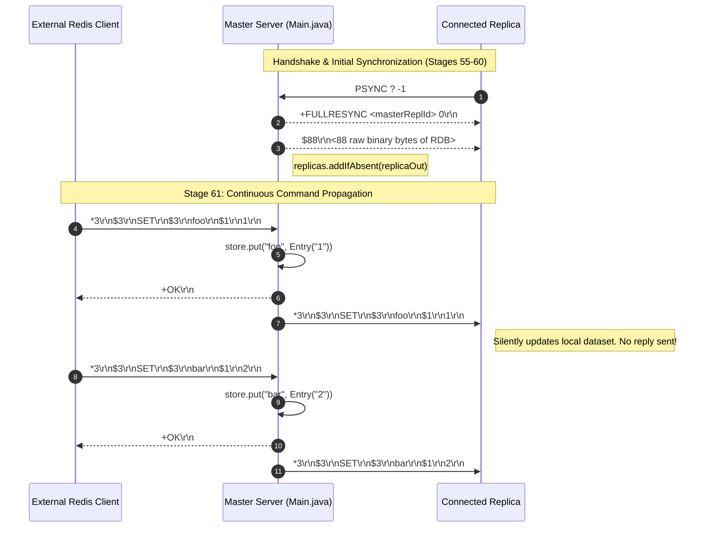
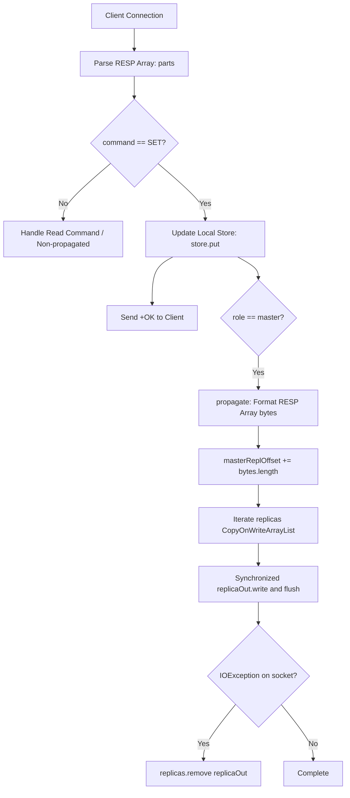

# Stage 61: Single-replica propagation

---

## In one line
Propagate modifying write commands (`SET`) as RESP arrays over the persistent replication connection to all connected replica output streams immediately and asynchronously.

---

## Self-test (cover the answers below and answer these first)
1. **Why does command propagation take place over the exact same connection that completed the handshake rather than the port advertised in `REPLCONF listening-port`?**
   - *Answer*: In Redis replication architecture, the replica initiates an outbound TCP connection to the master. Firewalls, NAT, and container networks often prevent a master from establishing inbound connections back to replicas. By keeping the handshake connection alive and converting it into a continuous downstream stream, Redis multiplexes handshake negotiation, RDB snapshot delivery, and incremental write replication over a single full-duplex TCP stream. The port in `REPLCONF listening-port` is strictly informational for `INFO replication` and cluster topology introspection.
2. **Which commands are propagated to replicas, and which are suppressed? Why?**
   - *Answer*: Only **write commands** (commands that mutate the keyspace or server state, such as `SET`, `DEL`, `INCR`, `LPUSH`) are propagated. Read-only commands (`GET`, `PING`, `ECHO`, `INFO`, `TYPE`) are suppressed because they do not alter the dataset state and propagating them would waste network bandwidth, CPU, and replication buffer capacity without functional benefit.
3. **What is the delivery model of standard Redis replication: synchronous or asynchronous? What are the implications?**
   - *Answer*: Standard Redis command propagation is **asynchronous** and **fire-and-forget**. The master writes the RESP command into its replication stream buffer / replica socket, returns `+OK` to the commanding client immediately, and does not block waiting for the replica to acknowledge receipt or execution. The benefit is ultra-low client write latency; the tradeoff is potential data loss if the master crashes before buffered replication packets reach the replica network stack (unless explicitly guarded with commands like `WAIT`).
4. **How are propagated commands framed on the wire?**
   - *Answer*: They are encoded as standard RESP Array frames: `*<num_elements>\r\n$<len1>\r\n<elem1>\r\n...`. For example, `SET foo 1` becomes:
     `*3\r\n$3\r\nSET\r\n$3\r\nfoo\r\n$1\r\n1\r\n`.
5. **Does the replica send any acknowledgement back to the master immediately upon receiving a propagated `SET` command?**
   - *Answer*: No. Replicas silently ingest, decode, and execute propagated write commands against their local state. They do not send `+OK\r\n` back to the master. Sending acknowledgements for every write would double replication network roundtrips and overwhelm the master's socket buffers. (The only replica feedback occurs when the master periodically issues `REPLCONF GETACK *`).
6. **Why must writes to a replica's `OutputStream` be synchronized or flushed immediately?**
   - *Answer*: In a concurrent server, multiple client threads can process `SET` commands simultaneously. Without synchronizing on the replica's output stream, byte sequences from concurrent commands could be interleaved on the underlying socket buffer, corrupting the RESP frame boundaries. Furthermore, without calling `flush()`, small command packets would languish in the OS TCP Nagle buffer, causing replication lag or test timeouts.

---

## Problem Solved

In Stage 60, our master successfully completed the replication handshake and transferred the initial point-in-time empty RDB snapshot to the replica:
```
Replica -> Master: PSYNC ? -1
Master  -> Replica: +FULLRESYNC <repl_id> 0\r\n$<rdb_len>\r\n<rdb_bytes>
```
Once the snapshot is received, the replica's baseline dataset is synchronized with the master's state at the moment of connection.

However, a database is not static. As soon as clients issue new mutating commands (`SET foo 1`, `SET bar 2`, etc.), the replica immediately falls out of sync unless the master continuously streams every mutating command.

In Stage 61, we solve:
1. **Command Filtering**: Identifying mutating commands (`SET`) that modify the dataset vs read-only operations.
2. **RESP Encoding**: Transforming incoming command arrays into standard RESP Array wire format (`*<n>\r\n$<len>\r\n...`).
3. **Downstream Propagation**: Writing and flushing the encoded commands over the established replica output stream(s).
4. **Replication Offset Tracking**: Incrementing `masterReplOffset` by the exact byte length of the propagated RESP array.

---

## Thought Process & Architectural Model

### 1. Master-Replica Replication Lifecycle



### 2. Propagation Architecture Inside Master



---

## Full Solution

### 1. Propagation Helper Method in `codecrafters-redis-java/src/main/java/Main.java`

```java
  private static synchronized void propagate(String[] parts) {
    if (!"master".equalsIgnoreCase(role)) {
      return;
    }
    StringBuilder sb = new StringBuilder();
    sb.append("*").append(parts.length).append("\r\n");
    for (int i = 0; i < parts.length; i++) {
      String token = (i == 0) ? parts[i].toUpperCase() : parts[i];
      byte[] b = token.getBytes(StandardCharsets.UTF_8);
      sb.append("$").append(b.length).append("\r\n").append(token).append("\r\n");
    }
    byte[] msg = sb.toString().getBytes(StandardCharsets.UTF_8);
    masterReplOffset += msg.length;

    for (OutputStream replicaOut : replicas) {
      try {
        synchronized (replicaOut) {
          replicaOut.write(msg);
          replicaOut.flush();
        }
      } catch (IOException e) {
        replicas.remove(replicaOut);
      }
    }
  }
```

### 2. Hooking Propagation into `SET` Execution

In `handleCommand`:
```java
    } else if (command.equalsIgnoreCase("SET")) {
      String key = parts[1];
      String value = parts[2];
      Long expiresAt = null;

      if (parts.length >= 5) {
        if (parts[3].equalsIgnoreCase("PX")) {
          long pxMillis = Long.parseLong(parts[4]);
          expiresAt = System.currentTimeMillis() + pxMillis;
        } else if (parts[3].equalsIgnoreCase("EX")) {
          long exSeconds = Long.parseLong(parts[4]);
          expiresAt = System.currentTimeMillis() + (exSeconds * 1000);
        }
      }

      store.put(key, new Entry(value, expiresAt));
      touchWatchedKey(key);
      out.write("+OK\r\n".getBytes(StandardCharsets.UTF_8));
      propagate(parts);
    }
```

### 3. Maintaining Thread-Safe Replica Registry

```java
  private static final CopyOnWriteArrayList<OutputStream> replicas = new CopyOnWriteArrayList<>();
```

In `PSYNC` handling:
```java
      // Track replica connection for subsequent command propagation
      replicas.addIfAbsent(out);
```

In connection termination (`finally` block of client worker):
```java
          } finally {
            if (out != null) {
              replicas.remove(out);
            }
            unwatchAll(clientCtx);
            try {
              clientSocket.close();
            } catch (IOException ignored) {}
          }
```

---

## Concepts (the transferable part)

- **Command Sourcing / Write-Ahead Stream**:
  - Replication in modern distributed databases operates on one of two paradigms:
    1. **Physical / Row-level Replication** (e.g., Postgres WAL, MySQL Row-based binlog): Replicates the exact modified storage pages or memory offsets.
    2. **Logical / Statement-level Replication** (e.g., Redis RESP command propagation, Kafka commit logs): Replicates the operations/commands in their canonical wire format.
  - Redis chose logical command propagation because RESP arrays are human-readable, architecture-independent (endianness and pointer sizes don't matter), and easy to route and debug.

- **Asynchronous / Fire-and-Forget Fanout**:
  - In primary-replica replication, synchronous propagation requires waiting for $N$ network roundtrips on every write. Redis defaults to asynchronous fanout: the master modifies local memory, queues the command to all replica buffers, and returns immediately to the client.
  - This decouples client write throughput from replica network latency or temporary replica stalls.

- **Full-Duplex TCP Socket Reuse**:
  - Standard TCP connections are bidirectional (full-duplex). While the master's server thread for the replica connection blocks on `reader.readLine()` waiting for downstream ACKs or heartbeat signals, other threads can simultaneously write into `replicaSocket.getOutputStream()`.
  - There is no need for separate upstream and downstream connections.

- **Atomic Offset Tracking**:
  - Every byte transmitted over the replication stream advances the replication log position (`masterReplOffset`). This global monotonic byte counter is the foundation for partial resynchronization (`PSYNC <repl_id> <offset>`) and quorum wait acknowledgements (`WAIT`).

---

## Wire Format & Protocol Specifications

### Propagated `SET foo 1` Example

```
*3\r\n
$3\r\n
SET\r\n
$3\r\n
foo\r\n
$1\r\n
1\r\n
```

### Wire Byte Breakdown

| Field | Content | Hex (ASCII) | Bytes |
| :--- | :--- | :--- | :--- |
| **Array Header** | `*3\r\n` | `2A 33 0D 0A` | 4 bytes |
| **Cmd Len Prefix** | `$3\r\n` | `24 33 0D 0A` | 4 bytes |
| **Command Name** | `SET\r\n` | `53 45 54 0D 0A` | 5 bytes |
| **Key Len Prefix** | `$3\r\n` | `24 33 0D 0A` | 4 bytes |
| **Key Name** | `foo\r\n` | `66 6F 6F 0D 0A` | 5 bytes |
| **Val Len Prefix** | `$1\r\n` | `24 31 0D 0A` | 4 bytes |
| **Val Content** | `1\r\n` | `31 0D 0A` | 3 bytes |
| **Total Frame Length** | | | **29 bytes** |

The master increments `masterReplOffset += 29`.

---

## What Breaks It (Failure Modes & Edge Cases)

1. **Waiting for Replica Response**:
   - *Bug*: Writing `replicaIn.readLine()` after sending the propagated command.
   - *Symptom*: Deadlock. The replica never sends a response to write commands; the master thread hangs indefinitely.
   - *Fix*: Do not read from the replica during propagation. Propagation is fire-and-forget.

2. **Omitting `replicaOut.flush()`**:
   - *Bug*: Calling `replicaOut.write(msg)` without `replicaOut.flush()`.
   - *Symptom*: Small commands (29 bytes) remain buffered in Java's socket output buffer or OS TCP socket buffer. The tester times out waiting for the replicated command.
   - *Fix*: Explicitly invoke `replicaOut.flush()` immediately after writing each command frame.

3. **Socket Write Interleaving (Race Condition)**:
   - *Bug*: Calling `replicaOut.write(...)` from concurrent client threads without synchronization.
   - *Symptom*: Thread A writes part of `SET foo 1`, Thread B interleaves `SET bar 2`. The replica receives garbled RESP frames and drops the connection with `Protocol Error`.
   - *Fix*: Wrap writes to `replicaOut` in `synchronized (replicaOut) { ... }` or make `propagate` `synchronized`.

4. **Propagating Read Commands**:
   - *Bug*: Calling `propagate(parts)` unconditionally for every command.
   - *Symptom*: Replica receives `GET` or `PING` commands. While replicas tolerate some commands, it violates the replication protocol contract and inflates replication byte offsets erroneously.
   - *Fix*: Gate propagation strictly behind write commands (`SET`).

5. **Silent Ghost Replicas on Network Disconnection**:
   - *Bug*: Ignoring `IOException` on `replicaOut.write()`.
   - *Symptom*: When a replica disconnects abruptly, writing to its socket throws a broken pipe exception. If uncaught, it crashes client threads; if ignored without cleanup, closed streams leak memory in `replicas`.
   - *Fix*: Catch `IOException` and promptly invoke `replicas.remove(replicaOut)`.

---

## Tradeoffs & Design Decisions

1. **Synchronous Fanout in Caller Thread vs Dedicated Replication Worker Queue**:
   - *Caller Thread (Our Choice)*: The thread executing `SET` directly iterates over `replicas` and writes bytes. Clean, zero background worker overhead, minimal latency for 1-5 replicas, and preserves strict sequential ordering across write operations.
   - *Replication Ring Buffer & Worker Thread (Production Redis)*: Production Redis uses an in-memory replication backlog buffer (ring buffer) and an event loop (`aeEventLoop`) that flushes replication buffers via non-blocking socket write handlers. Necessary when managing hundreds of replicas across high-latency WAN links.

2. **`CopyOnWriteArrayList` vs Synchronized Collections**:
   - `CopyOnWriteArrayList` allows thread-safe iteration without blocking new replicas from registering or leaving. Because reads/iterations vastly outnumber replica connections/disconnections, this minimizes synchronization overhead.

---

## Java Specifics — Lookup, Don't Memorize

- `CopyOnWriteArrayList.addIfAbsent(E element)` &mdash; Atomically appends the element if it is not already present in the list.
- `Socket.getOutputStream().flush()` &mdash; Forces any buffered output bytes to be written out to the operating system's TCP socket layer.
- `StandardCharsets.UTF_8` &mdash; Standard constant for the UTF-8 charset, avoiding string-based lookup exceptions (`UnsupportedEncodingException`).

---

## Rebuild Checklist & Mental Model Verification

- [ ] In `Main.java`:
  - [ ] Maintain `CopyOnWriteArrayList<OutputStream> replicas`.
  - [ ] When handling `PSYNC`, register the replica stream: `replicas.addIfAbsent(out)`.
  - [ ] Ensure the replica stream is cleaned up in `finally` when the socket closes: `replicas.remove(out)`.
  - [ ] Implement `propagate(String[] parts)`:
    - [ ] Check if `role` is `"master"`.
    - [ ] Encode the parts array into a RESP array (`*<n>\r\n$<len>\r\n<arg>\r\n...`).
    - [ ] Track `masterReplOffset += msg.length`.
    - [ ] Loop over each `OutputStream` in `replicas`:
      - [ ] `replicaOut.write(msg);`
      - [ ] `replicaOut.flush();`
      - [ ] Catch `IOException` and remove dead replicas.
  - [ ] In `handleCommand` for `SET`:
    - [ ] Call `propagate(parts);`.
- [ ] Compile locally:
  ```powershell
  javac -d target/classes src/main/java/Main.java
  ```
- [ ] Push to monorepo and submit to CodeCrafters:
  ```powershell
  git add .
  git commit -m "Solve Stage 61: Single-replica propagation"
  git push origin master
  powershell -File scripts\push-redis.ps1 "Stage 61: Single-replica propagation"
  ```
