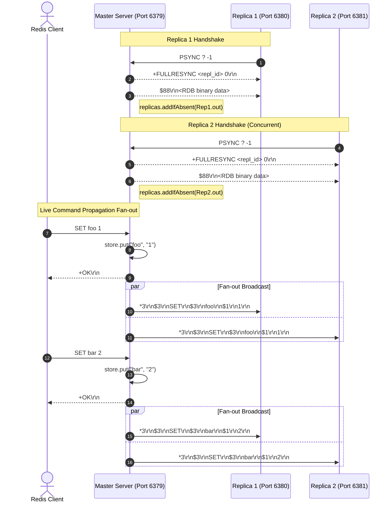
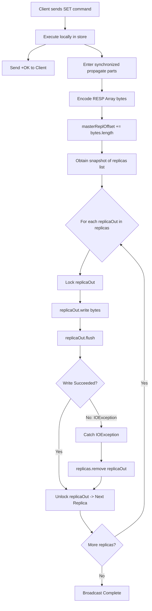

# Stage 62: Multi-replica propagation

---

## In one line
Fan out mutating write commands in strict sequential order to all registered replica downstream connections over thread-safe, isolated TCP streams.

---

## Self-test (cover the answers below and answer these first)
1. **Why must a replica only be registered into the active broadcast collection AFTER the RDB snapshot transfer completes, rather than during initial connection or PSYNC receipt?**
   - *Answer*: If the replica is registered before or during snapshot transmission, any concurrent client write command propagated to the replica would be written to the socket while the RDB snapshot bytes are still streaming. This would corrupt the RDB payload or inject RESP command frames prematurely before the replica has initialized its memory dataset from the RDB baseline.
2. **How does a master maintain a broadcast registry of multiple replicas in a multithreaded server without race conditions?**
   - *Answer*: By using a concurrent, thread-safe collection such as `CopyOnWriteArrayList<OutputStream>`. Multiple replica handshake threads can register their streams via `replicas.addIfAbsent(out)` without locking read iterations, and client worker threads can safely iterate through active replica streams during propagation without `ConcurrentModificationException`.
3. **What happens if one replica encounters an `IOException` (e.g., abrupt network failure or broken pipe) during broadcast? How must the master handle this?**
   - *Answer*: The master must catch the `IOException` per replica, remove the broken stream from the replica collection (`replicas.remove(replicaOut)`), and continue propagating the command to all other healthy replicas. One replica's failure must never abort or block command delivery to the rest of the cluster (fault isolation).
4. **Why is sequential ordering of propagated commands critical across all replicas, and how does serialization prevent replication drift?**
   - *Answer*: In statement-level replication, operations are non-commutative (e.g., `SET x 1` followed by `SET x 2` results in `x=2`; inverted execution results in `x=1`). If multiple client threads interleave write commands out of order across different replicas, replicas will diverge into inconsistent states. Synchronizing the broadcast routine ensures a single total order of write operations across all replicas.
5. **Does the master wait for acknowledgements from all replicas before returning `+OK` to the commanding client in standard propagation?**
   - *Answer*: No. Standard Redis replication propagation is asynchronous and non-blocking (fire-and-forget). The master returns `+OK` immediately after writing the mutation to local memory and queueing/flushing the bytes to replica socket buffers. (Synchronous durability across $N$ replicas requires explicit synchronization primitives like the `WAIT` command).
6. **Why is `CopyOnWriteArrayList` well-suited for the replica registry in this architecture?**
   - *Answer*: Replicas connect and disconnect infrequently (rare writes/mutations to the list), but write commands are propagated frequently (continuous high-frequency reads/iterations through the list). `CopyOnWriteArrayList` provides lock-free, snapshot-style iterations for high-throughput broadcast while remaining completely thread-safe during connection lifecycle events.

---

## Problem Solved

In Stage 61 (*Single-replica propagation*), we propagated mutating `SET` commands to a single replica over its persistent replication connection.

However, real-world Redis deployments use replication topologies with multiple read replicas (e.g., 2, 3, or dozens of replicas) to scale read throughput, provide redundancy, and support high-availability failover.

In Stage 62, we scale command propagation from 1-to-1 to 1-to-N:
1. **Concurrent Multi-Replica Handshakes**: Multiple replicas connect simultaneously, execute the 3-step handshake (`PING`, `REPLCONF`, `PSYNC`), and receive the initial RDB snapshot concurrently.
2. **Dynamic Replica Registry**: The master safely registers each replica's output stream into an active broadcast set once its RDB transfer completes.
3. **Total Order Broadcast**: When clients issue sequential write commands (`SET foo 1`, `SET bar 2`, `SET baz 3`), every connected replica receives all commands in the exact same order.
4. **Fault-Tolerant Delivery**: If one replica socket disconnects, stalls, or throws an `IOException`, the master isolates the failure, deregisters the faulty replica, and continues streaming to the remaining healthy replicas without crashing client threads.

---

## Thought Process & Architectural Model

### 1. Multi-Replica Lifecycle & Handshake Synchronization



### 2. Broadcast Fan-out Engine Inside Master



---

## Full Solution

Here is the complete multi-replica propagation architecture implemented in [`codecrafters-redis-java/src/main/java/Main.java`](file:///C:/Users/jiten/Documents/Codecrafters-Build-from-scratch/codecrafters-redis-java/src/main/java/Main.java).

### 1. Thread-Safe Replica Registry

```java
  // Thread-safe collection holding output streams for all active replicas
  private static final CopyOnWriteArrayList<OutputStream> replicas = new CopyOnWriteArrayList<>();
```

### 2. Registration After Full RDB Snapshot Transfer

In `handleCommand`:
```java
    } else if (command.equalsIgnoreCase("PSYNC")) {
      // Stage 59: Send FULLRESYNC header
      String response = "+FULLRESYNC " + masterReplId + " 0\r\n";
      out.write(response.getBytes(StandardCharsets.UTF_8));

      // Stage 60: Send initial point-in-time empty RDB snapshot
      byte[] rdbBytes = Base64.getDecoder().decode(EMPTY_RDB_BASE64);
      String rdbHeader = "$" + rdbBytes.length + "\r\n";
      out.write(rdbHeader.getBytes(StandardCharsets.UTF_8));
      out.write(rdbBytes);
      out.flush();

      // Stage 61 & 62: Register replica connection ONLY AFTER snapshot is fully transmitted
      replicas.addIfAbsent(out);
    }
```

### 3. Synchronized Fan-Out Broadcast (`propagate`)

```java
  private static synchronized void propagate(String[] parts) {
    if (!"master".equalsIgnoreCase(role)) {
      return;
    }
    // Encode command as standard RESP array: *<argc>\r\n$<len>\r\n<arg>\r\n...
    StringBuilder sb = new StringBuilder();
    sb.append("*").append(parts.length).append("\r\n");
    for (int i = 0; i < parts.length; i++) {
      String token = (i == 0) ? parts[i].toUpperCase() : parts[i];
      byte[] b = token.getBytes(StandardCharsets.UTF_8);
      sb.append("$").append(b.length).append("\r\n").append(token).append("\r\n");
    }
    byte[] msg = sb.toString().getBytes(StandardCharsets.UTF_8);
    masterReplOffset += msg.length;

    // Fan out to all connected replicas
    for (OutputStream replicaOut : replicas) {
      try {
        synchronized (replicaOut) {
          replicaOut.write(msg);
          replicaOut.flush();
        }
      } catch (IOException e) {
        // Isolate failure: prune dead replica so future writes don't stall
        replicas.remove(replicaOut);
      }
    }
  }
```

### 4. Connection Termination & Pruning in Worker Thread

In `main` client handling thread:
```java
          } catch (IOException e) {
            System.out.println("IOException: " + e.getMessage());
          } finally {
            if (out != null) {
              replicas.remove(out);
            }
            unwatchAll(clientCtx);
            try {
              clientSocket.close();
            } catch (IOException ignored) {}
          }
```

---

## Concepts (the transferable part)

- **Total Order Broadcast (Atomic Broadcast)**:
  - In distributed systems, a set of state machines stays synchronized if and only if all nodes execute the exact same set of deterministic transitions in the exact same sequence.
  - Making `propagate` synchronized establishes a global serial order across multiple client threads. Even if 10 clients execute writes concurrently, all replicas observe the mutations in identical order ($c_1, c_2, \dots, c_k$).

- **Fan-Out & Failure Domains**:
  - In a 1-to-$N$ broadcast topology, slow or failing consumers are a primary failure mode.
  - If a master uses unhandled socket writes, a single crashed replica throws an unhandled `IOException` (e.g. `Connection reset by peer` or `Broken pipe`), which would abort the broadcast loop and starve remaining replicas.
  - Per-stream error isolation ensures the blast radius of any single network failure is confined strictly to that connection.

- **Copy-on-Write (COW) Concurrency Pattern**:
  - Read operations (iterating over `replicas` on every write command) vastly outnumber write operations (adding/removing a replica when a server boots or disconnects).
  - `CopyOnWriteArrayList` makes iteration completely lock-free and immune to `ConcurrentModificationException` because the iterator walks an immutable snapshot of the underlying array taken at iteration start. Modifications make a fresh copy of the array.

- **Asynchronous Replication Decoupling**:
  - The client response (`+OK\r\n`) is written before or independently of replica ACKs. This guarantees client write latency is $O(1)$ relative to the number of replicas $N$, avoiding head-of-line network blocking across WAN or high-latency nodes.

---

## Wire Format & Protocol Specifications

### Multi-Replica Propagation Trace

When the master receives:
```
Client: SET foo 1
Client: SET bar 2
Client: SET baz 3
```

The master broadcasts three consecutive RESP Arrays to every replica:

#### Frame 1: `SET foo 1` (29 bytes)
```
*3\r\n$3\r\nSET\r\n$3\r\nfoo\r\n$1\r\n1\r\n
```

#### Frame 2: `SET bar 2` (29 bytes)
```
*3\r\n$3\r\nSET\r\n$3\r\nbar\r\n$1\r\n2\r\n
```

#### Frame 3: `SET baz 3` (29 bytes)
```
*3\r\n$3\r\nSET\r\n$3\r\nbaz\r\n$1\r\n3\r\n
```

### Cumulative Byte Offset Progression

| Sequence | Command | Frame Bytes | Cumulative `masterReplOffset` |
| :--- | :--- | :--- | :--- |
| Handshake | Baseline RDB | 88 bytes | 0 (RDB does not increment command offset) |
| Write 1 | `SET foo 1` | 29 bytes | 29 |
| Write 2 | `SET bar 2` | 29 bytes | 58 |
| Write 3 | `SET baz 3` | 29 bytes | 87 |

---

## What Breaks It (Failure Modes & Edge Cases)

1. **Premature Replica Registration**:
   - *Failure*: Registering `replicas.add(out)` inside `REPLCONF` or before sending the RDB snapshot.
   - *Consequence*: A write command arriving while the RDB snapshot is being sent gets written to the socket mid-stream. The replica parses raw RDB bytes as RESP or vice-versa and crashes with protocol errors.
   - *Fix*: Only call `replicas.addIfAbsent(out)` after the final byte of the RDB snapshot has been written and flushed.

2. **Unsynchronized Interleaving Across Client Threads**:
   - *Failure*: Making `propagate` non-synchronized.
   - *Consequence*: Client Thread A and Client Thread B write to `replicaOut` simultaneously. Chunks of `SET foo 1` and `SET bar 2` interleave on the TCP stream, producing corrupted frames like `*3\r\n*3\r\n$3\r\n...`.
   - *Fix*: Synchronize `propagate` (or `synchronized(replicaOut)`).

3. **Loop Abortion on Closed Socket**:
   - *Failure*: Iterating `for (OutputStream replicaOut : replicas)` without a `try/catch` around individual socket writes.
   - *Consequence*: If Replica 1 abruptly closes its connection, writing throws `IOException: Broken pipe`. If uncaught inside the loop, the exception unwinds, skipping Replica 2 and Replica 3!
   - *Fix*: Wrap each individual replica write in its own `try-catch` block.

4. **Missing Buffer Flush**:
   - *Failure*: Forgetting `replicaOut.flush()`.
   - *Consequence*: Small commands remain queued in Java's socket output buffer. The tester assertions for Replica 2 time out waiting for packets.
   - *Fix*: Always invoke `replicaOut.flush()` immediately after `replicaOut.write(...)`.

---

## Tradeoffs & Design Decisions

1. **Iterative Blocking Fan-Out vs Async Channel / Non-blocking NIO**:
   - *Iterative Blocking (Our Choice)*: Clean, straightforward, zero external dependencies, robust for small-to-medium numbers of replicas ($N \le 10$).
   - *Non-blocking NIO (Production Redis)*: Production Redis handles fan-out through non-blocking I/O event loops and output client buffers (`client->buf`). If a replica's socket buffer is full, Redis buffers commands up to `client-output-buffer-limit replica`. This prevents a slow replica from stalling master event loop iterations.

2. **`CopyOnWriteArrayList` vs Synchronized Set**:
   - *`CopyOnWriteArrayList`*: Iteration never throws `ConcurrentModificationException` and requires no locks on iteration. Perfect for read-heavy topologies where replicas connect once and remain connected for hours.
   - *Synchronized Set / Mutex*: Requires locking the entire collection during iteration, which would block new replicas from connecting during a broadcast.

---

## Java Specifics & Standard Library Primitives

- `CopyOnWriteArrayList<E>`: A thread-safe variant of `ArrayList` in `java.util.concurrent` where all mutative operations (`add`, `set`, `remove`) are implemented by making a fresh copy of the underlying array.
- `synchronized (monitor)`: Enforces mutual exclusion on a specific object monitor, ensuring that only one thread can execute code guarded by that monitor at any given instant.
- `StandardCharsets.UTF_8`: Predefined `Charset` instance representing UTF-8 encoding. Eliminates the need to handle `UnsupportedEncodingException`.

---

## Rebuild Checklist & Verification

- [ ] Maintain a thread-safe list of active replicas:
  ```java
  private static final CopyOnWriteArrayList<OutputStream> replicas = new CopyOnWriteArrayList<>();
  ```
- [ ] During `PSYNC` handling:
  - [ ] Write `+FULLRESYNC <repl_id> 0\r\n`.
  - [ ] Write RDB header `$<len>\r\n` and raw RDB bytes.
  - [ ] Flush output stream.
  - [ ] Register replica: `replicas.addIfAbsent(out)`.
- [ ] During client connection termination (`finally` block):
  - [ ] Remove replica stream: `replicas.remove(out)`.
- [ ] In `propagate(String[] parts)`:
  - [ ] Gate by role: `if (!"master".equalsIgnoreCase(role)) return;`.
  - [ ] Format RESP array bytes: `*<n>\r\n$<len>\r\n<part>\r\n...`.
  - [ ] Increment `masterReplOffset += msg.length`.
  - [ ] Loop over `replicas`:
    - [ ] `synchronized (replicaOut) { replicaOut.write(msg); replicaOut.flush(); }`
    - [ ] Catch `IOException` and invoke `replicas.remove(replicaOut)`.
- [ ] In `handleCommand` for `SET`:
  - [ ] Store key-value entry.
  - [ ] Respond `+OK\r\n` to client.
  - [ ] Call `propagate(parts)`.
- [ ] Verify local compilation:
  ```powershell
  javac -d target/classes codecrafters-redis-java/src/main/java/Main.java
  ```
