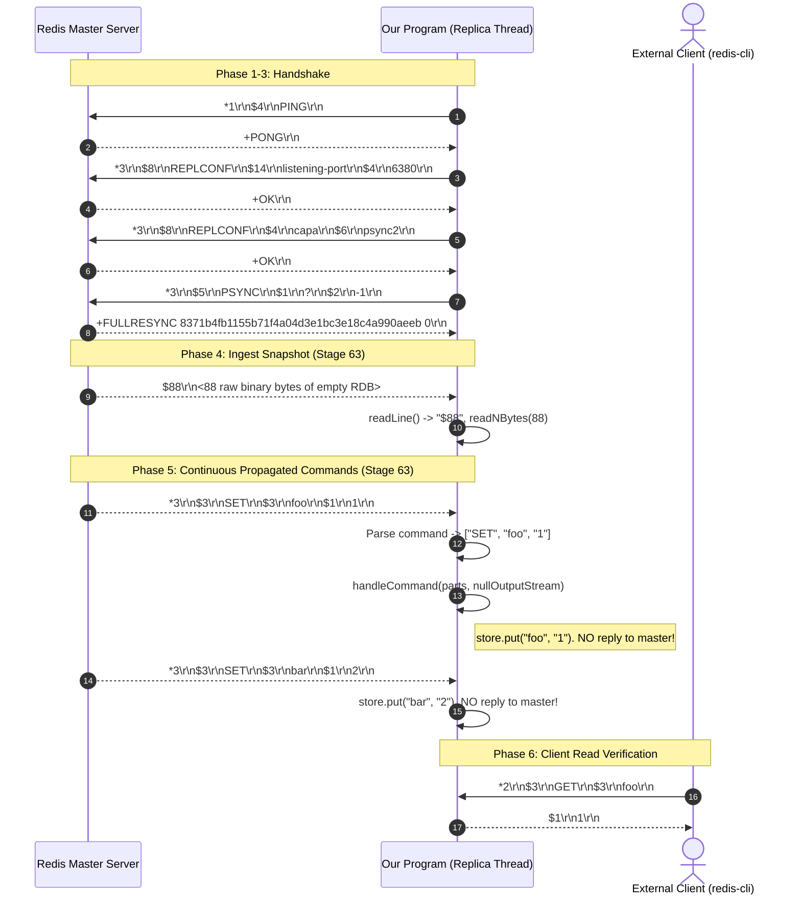
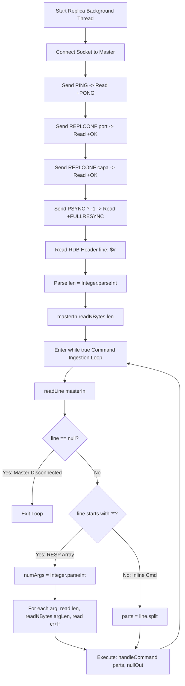

# Stage 63: Command processing

---

## In one line
Ingest the master's binary RDB snapshot and enter an unbuffered continuous replication loop to parse propagated RESP write commands and apply mutations to local state silently without replying to master.

---

## Self-test (cover the answers below and answer these first)
1. **Why is using a `BufferedReader` on the replica's master connection hazardous when transitioning from the handshake to the RDB snapshot transfer?**
   - *Answer*: `BufferedReader` eagerly reads ahead (buffering up to 8 KB of data into an internal character buffer) and converts bytes to Java `char`s via a character decoder. When the master streams `+FULLRESYNC ...\r\n` followed immediately by `$<len>\r\n<raw_rdb_bytes>`, the `BufferedReader` swallows the RDB length prefix and raw binary bytes into its internal character buffer. This leaves the underlying `InputStream` drained and corrupts arbitrary binary bytes through UTF-8 character transcoding.
2. **How does the replication RDB framing differ from standard RESP Bulk Strings, and how does the replica transition from RDB ingestion to command processing?**
   - *Answer*: Standard RESP Bulk Strings end with a trailing `\r\n`. In replication, the master sends `$<len>\r\n<bytes>` with **no** trailing `\r\n`. The replica reads the length header line `$<len>\r\n`, reads exactly `<len>` raw bytes via `readNBytes(len)`, and the very next byte remaining on the wire is the `*` prefix of the first propagated RESP command.
3. **Why must the replica NEVER send responses (such as `+OK\r\n`) back to the master when executing propagated commands?**
   - *Answer*: In Redis replication, command propagation is unidirectional downstream. The master's replication thread is not listening for client-style RESP replies from replicas. If replicas send `+OK\r\n`, those unexpected bytes accumulate in the master's inbound socket buffer, causing protocol deserialization errors or connection teardown. Responses are discarded (e.g. by executing against `OutputStream.nullOutputStream()`).
4. **Why must replicas be gated from calling `propagate(parts)` when executing write commands?**
   - *Answer*: A replica does not own write authority and (in linear replication topologies) does not have subordinate downstream replicas. If a replica attempts to fan out incoming replicated commands, it would either propagate redundant data or fail with socket errors. Guarding propagation behind `if (!"master".equalsIgnoreCase(role)) return;` prevents infinite loops and invalid replication fan-out.
5. **How should a replica handle multiple RESP commands arriving within a single TCP packet or segment?**
   - *Answer*: TCP is a continuous byte stream with no application message boundaries. Multiple commands like `*3\r\n$3\r\nSET\r\n$3\r\nfoo\r\n$1\r\n1\r\n*3\r\n$3\r\nSET\r\n$3\r\nbar\r\n$1\r\n2\r\n` frequently arrive in a single packet. By using an unbuffered, exact-byte parser that reads the command array length, each bulk argument, and its trailing `\r\n`, the parser naturally consumes one command frame and immediately positions the stream at the start of the next command.
6. **How does client query visibility work on the replica once propagated write commands are processed?**
   - *Answer*: Propagated commands update the shared in-memory database (`store` / `ConcurrentHashMap`). When external clients subsequently connect to the replica's listening port and issue `GET foo`, the client worker threads read directly from the same thread-safe `store`, returning the updated value `1` immediately.

---

## Problem Solved

In Stage 62 (*Multi-replica propagation*), we implemented master-side fan-out: broadcasting mutating write commands sequentially to all registered replica downstream streams.

However, replication is a two-sided contract. When running as a replica (`--replicaof <host> <port>`):
1. The replica completed the 3-step handshake (`PING`, `REPLCONF listening-port`, `REPLCONF capa`, `PSYNC ? -1`).
2. But upon receiving `+FULLRESYNC`, the replica previously stalled and did not consume the RDB snapshot or listen for incoming commands.
3. Consequently, the master's propagated commands (`SET foo 1`, `SET bar 2`, `SET baz 3`) went unread, the replica's dataset remained empty, and client read requests (`GET foo`) failed.

In Stage 63, we complete the replica ingestion pipeline:
1. **Unbuffered Handshake Transition**: Eliminate `BufferedReader` to prevent buffered read-ahead and binary corruption.
2. **RDB Snapshot Parsing**: Read `$<len>\r\n` and read exactly `<len>` raw bytes from the master socket.
3. **Continuous Replicated Command Ingestion**: Enter a continuous loop decoding RESP command arrays (`*<n>\r\n...`) from the master stream.
4. **Silent State Mutation**: Execute propagated commands against local database state while routing output to `OutputStream.nullOutputStream()`.
5. **Read Verification**: Serve client read queries (`GET foo`) reflecting updates applied from the replication stream.

---

## Thought Process & Architectural Model

### 1. Replica Handshake to Propagation Transition Flow



### 2. Replica Stream Ingestion Engine



---

## Full Solution

The full solution is implemented in [`codecrafters-redis-java/src/main/java/Main.java`](file:///C:/Users/jiten/Documents/Codecrafters-Build-from-scratch/codecrafters-redis-java/src/main/java/Main.java).

### 1. Unbuffered Byte-Level Line Reader

To safely read CRLF-delimited lines from `InputStream` without internal read-ahead buffering:

```java
  private static String readLine(InputStream in) throws IOException {
    ByteArrayOutputStream baos = new ByteArrayOutputStream();
    int b;
    while ((b = in.read()) != -1) {
      if (b == '\r') {
        int next = in.read();
        if (next == '\n') {
          break;
        }
        baos.write(b);
        if (next != -1) {
          baos.write(next);
        }
      } else if (b == '\n') {
        break;
      } else {
        baos.write(b);
      }
    }
    if (b == -1 && baos.size() == 0) {
      return null;
    }
    return baos.toString(StandardCharsets.UTF_8);
  }
```

### 2. Snapshot Ingestion and Continuous Propagation Loop

```java
            // Handshake Step 3: Send PSYNC ? -1
            String psyncCmd = "*3\r\n$5\r\nPSYNC\r\n$1\r\n?\r\n$2\r\n-1\r\n";
            masterOut.write(psyncCmd.getBytes(StandardCharsets.UTF_8));
            masterOut.flush();

            response = readLine(masterIn);
            System.out.println("Master response to PSYNC: " + response);

            // Stage 63: Parse RDB file transfer from master
            String rdbHeader = readLine(masterIn);
            while (rdbHeader != null && !rdbHeader.startsWith("$")) {
              rdbHeader = readLine(masterIn);
            }
            if (rdbHeader != null && rdbHeader.startsWith("$")) {
              int rdbLen = Integer.parseInt(rdbHeader.substring(1).trim());
              byte[] rdbBytes = masterIn.readNBytes(rdbLen);
              System.out.println("Received RDB file: " + rdbBytes.length + " bytes");
            }

            // Stage 63: Enter continuous command processing loop for propagated commands
            OutputStream nullOut = OutputStream.nullOutputStream();
            while (true) {
              String line = readLine(masterIn);
              if (line == null) {
                break; // Master disconnected
              }
              if (line.isEmpty()) {
                continue;
              }
              if (line.startsWith("*")) {
                int numArgs = Integer.parseInt(line.substring(1).trim());
                String[] parts = new String[numArgs];
                boolean complete = true;
                for (int i = 0; i < numArgs; i++) {
                  String lenLine = readLine(masterIn);
                  if (lenLine == null) {
                    complete = false;
                    break;
                  }
                  int argLen = Integer.parseInt(lenLine.substring(1).trim());
                  byte[] argBytes = masterIn.readNBytes(argLen);
                  parts[i] = new String(argBytes, StandardCharsets.UTF_8);
                  int cr = masterIn.read();
                  int lf = masterIn.read();
                  if (cr == -1 || lf == -1) {
                    complete = false;
                    break;
                  }
                }
                if (complete) {
                  try {
                    handleCommand(parts, nullOut);
                  } catch (Exception e) {
                    System.err.println("Error processing propagated command: " + e.getMessage());
                  }
                }
              } else {
                String[] parts = line.split("\\s+");
                try {
                  handleCommand(parts, nullOut);
                } catch (Exception e) {
                  System.err.println("Error processing inline command: " + e.getMessage());
                }
              }
            }
```

### 3. Gating Replication Fan-out

```java
  private static synchronized void propagate(String[] parts) {
    if (!"master".equalsIgnoreCase(role)) {
      return;
    }
    // ... master-only broadcast logic ...
  }
```

---

## Concepts (the transferable part)

- **The Buffering Boundary Hazard in Hybrid Protocols**:
  - Many protocols mix line-oriented text framing with raw binary payloads (e.g., HTTP/1.1 chunked bodies, Redis PSYNC RDB transfer, SMTP attachments).
  - Wrapping a transport `InputStream` in a higher-level buffering abstraction (`BufferedReader`, `Scanner`) causes the reader to read past the text boundary into the binary payload. Once buffered in character format, binary bytes are irreversibly transcoded and inaccessible to raw byte readers.
  - *Systems Rule*: When a protocol transitions between text lines and raw binary, the line reader must read strictly byte-by-byte up to the delimiter without reading ahead, or the entire stream must use a unified byte buffer.

- **Unidirectional Command Streams**:
  - Replicas in event-sourced or statement-replicated systems act as sinks. Unlike RPCs or client-server patterns where every request demands a reply, replication streams decouple execution from response. Replicas silently ingest operations to match the primary node's write log without amplifying network traffic.

- **TCP Byte-Stream Framing**:
  - TCP does not preserve application message boundaries. A single TCP packet may contain an RDB snapshot chunk and five RESP commands, or a single command may be fragmented across multiple TCP packets. Exact length-prefix framing (`$<len>` and `*<num>`) guarantees correct framing regardless of network segmentation.

- **State Sharing Across Independent Threads**:
  - The replica maintains two independent connection endpoints:
    1. The outbound client socket connected to the master (updating state via background ingestion loop).
    2. The inbound server socket listening for client connections (serving reads via worker threads).
  - Storing data in thread-safe data structures (`ConcurrentHashMap`) ensures that updates made by the replication thread are immediately visible to client query threads with full memory barriers.

---

## Wire Format & Protocol Specifications

### Replica Inbound Byte Stream Progression

| Phase | Wire Payload | Type | Delimiter / Framing |
| :--- | :--- | :--- | :--- |
| **Resync Ack** | `+FULLRESYNC 8371... 0\r\n` | Simple String | CRLF (`\r\n`) |
| **RDB Header** | `$88\r\n` | Length Prefix | CRLF (`\r\n`) |
| **RDB Body** | `REDIS0011...` (88 raw bytes) | Raw Binary | Exactly 88 bytes (**No** trailing CRLF) |
| **Command 1** | `*3\r\n$3\r\nSET\r\n$3\r\nfoo\r\n$1\r\n1\r\n` | RESP Array | Standard Bulk String framing |
| **Command 2** | `*3\r\n$3\r\nSET\r\n$3\r\nbar\r\n$1\r\n2\r\n` | RESP Array | Standard Bulk String framing |

---

## What Breaks It (Failure Modes & Edge Cases)

1. **`BufferedReader` Swallowing Binary Bytes**:
   - *Bug*: Using `BufferedReader.readLine()` to read `+FULLRESYNC`, and then trying to read RDB bytes from `masterIn`.
   - *Symptom*: Deadlock or EOF. `BufferedReader` reads ahead into its 8 KB buffer, swallowing `$88\r\n` and all RDB bytes. `masterIn.readNBytes()` hangs waiting for bytes that were already consumed into the buffer.
   - *Fix*: Use `readLine(InputStream)` directly reading byte-by-byte from `masterIn`.

2. **Expecting `\r\n` After RDB Snapshot**:
   - *Bug*: Calling `masterIn.read()` twice to consume CRLF after `masterIn.readNBytes(rdbLen)`.
   - *Symptom*: Corruption of subsequent commands. The RDB payload has no trailing CRLF. Consuming two extra bytes swallows the `*` and `3` of the first propagated command (`*3\r\n...`), leading to parse errors.
   - *Fix*: Consume exactly `rdbLen` bytes, then parse the next line directly.

3. **Replying `+OK\r\n` to Master**:
   - *Bug*: Passing `masterOut` to `handleCommand(parts, masterOut)`.
   - *Symptom*: Master socket errors. The master does not expect responses to propagated commands and will close the connection or fail tester assertions.
   - *Fix*: Use `OutputStream.nullOutputStream()` to discard all execution replies.

4. **Replicas Re-propagating Replicated Commands**:
   - *Bug*: Calling `propagate(parts)` unconditionally on replica.
   - *Symptom*: Infinite loops or invalid socket operations when replicas try to act as masters.
   - *Fix*: Guard propagation behind `if (!"master".equalsIgnoreCase(role)) return;`.

5. **Multiple Commands in Single TCP Segment**:
   - *Bug*: Assuming one TCP read contains at most one command.
   - *Symptom*: Commands are delayed or dropped when the master bursts multiple commands in a single TCP window.
   - *Fix*: Process commands continuously in a `while (true)` loop directly from the stream.

---

## Tradeoffs & Design Decisions

1. **Byte-by-Byte Line Reader vs Buffered ByteBuffer**:
   - *Byte-by-Byte `readLine(InputStream)` (Our Choice)*: Reads one byte at a time up to `\r\n`. Zero look-ahead buffer state, trivial to implement, guarantees zero bytes of subsequent payloads are accidentally buffered. For command handshake and control streams over LAN/loopback, per-byte syscall overhead is negligible (a few microseconds).
   - *Custom Buffered Lookahead / `ByteBuffer`*: Maintains a sliding buffer window. Maximizes throughput for gigabit networks, but requires tracking buffer offsets and residual slices across text/binary transitions.

2. **`OutputStream.nullOutputStream()` vs Method Parameter Suppression**:
   - *`nullOutputStream()` (Our Choice)*: Leaves `handleCommand(parts, out)` untouched. Reuses identical execution pathways for both clients and replication without adding boolean flags or conditionals to every command handler.
   - *Response Suppression Flag*: Passing a `boolean reply` parameter to all command methods. Avoids unnecessary byte array formatting, but pollutes the command interface with replication-specific branching.

---

## Java Specifics — Lookup, Don't Memorize

- `InputStream.readNBytes(int len)` &mdash; Reads up to `len` bytes from the input stream, blocking until all bytes are read or EOF is detected (Java 9+).
- `OutputStream.nullOutputStream()` &mdash; Returns an `OutputStream` that silently discards all written bytes (Java 11+).
- `ByteArrayOutputStream` &mdash; In-memory output stream that captures written bytes into an auto-expanding byte array, convertable to String via `.toString(StandardCharsets.UTF_8)`.

---

## Rebuild Checklist & Mental Model Verification

- [ ] Implement unbuffered line reading:
  - [ ] Create `readLine(InputStream in)` helper using `ByteArrayOutputStream`.
  - [ ] Detect `\r` followed by `\n` without reading any subsequent bytes.
- [ ] Connect replica to master:
  - [ ] Send `PING` -> `readLine` for `+PONG`.
  - [ ] Send `REPLCONF listening-port` -> `readLine` for `+OK`.
  - [ ] Send `REPLCONF capa psync2` -> `readLine` for `+OK`.
  - [ ] Send `PSYNC ? -1` -> `readLine` for `+FULLRESYNC ...`.
- [ ] Consume RDB snapshot:
  - [ ] Read length header `$<len>\r\n`.
  - [ ] Read exactly `<len>` raw bytes using `masterIn.readNBytes(rdbLen)`.
  - [ ] Note: Do **not** read trailing CRLF after RDB bytes.
- [ ] Loop over propagated commands:
  - [ ] Read next line; if `*<n>`, parse `n` bulk strings.
  - [ ] For each bulk string: read `$<len>`, read `<len>` bytes, read trailing `\r\n`.
  - [ ] Dispatch to `handleCommand(parts, OutputStream.nullOutputStream())`.
- [ ] Ensure `propagate` is gated: `if (!"master".equalsIgnoreCase(role)) return;`.
- [ ] Verify compilation:
  ```powershell
  javac -d target/classes codecrafters-redis-java/src/main/java/Main.java
  ```
