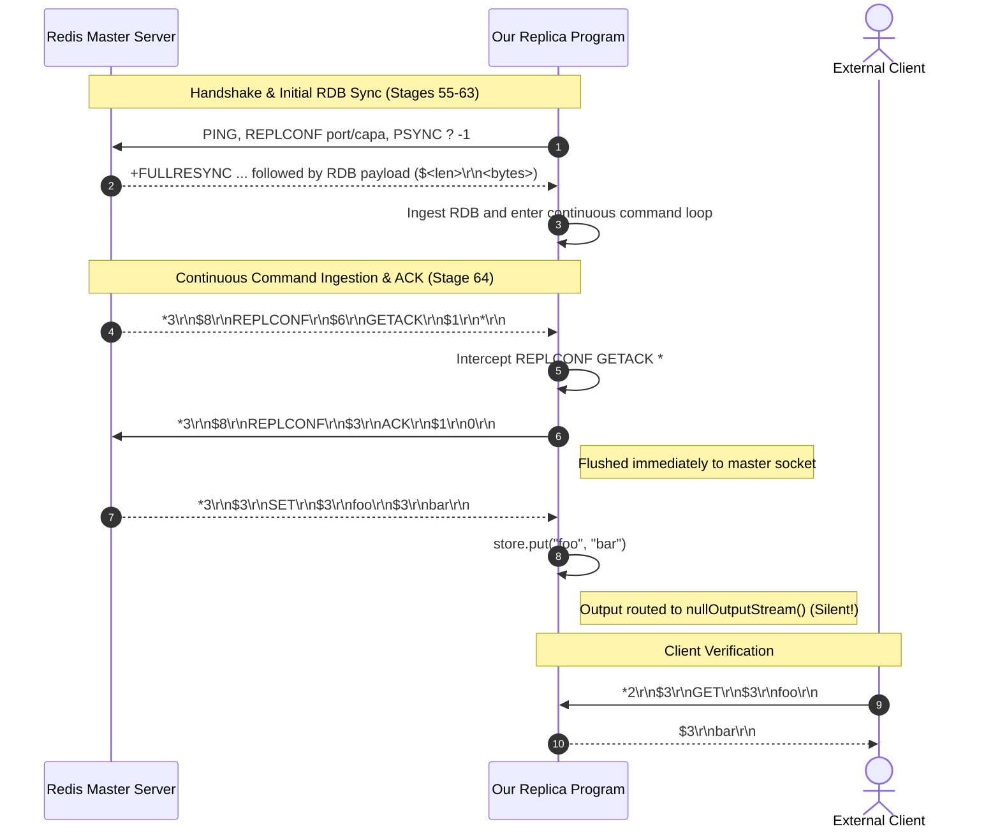
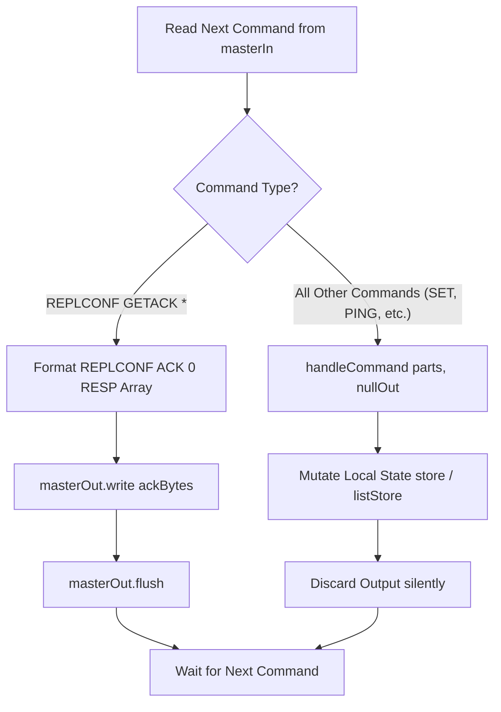

# Stage 64: ACKs with no commands

---

## In one line
Respond to `REPLCONF GETACK *` interrogations from the master by transmitting `REPLCONF ACK 0` encoded as a 3-element RESP bulk string array over the replication socket while continuing to process all other commands silently.

---

## Self-test (cover the answers below and answer these first)
1. **What is the fundamental purpose of the `REPLCONF GETACK *` command in Redis replication?**
   - *Answer*: It allows the master to poll connected replicas to determine their replication progress (replication offset). By collecting ACKs, the master verifies which replicas are alive, detects replication lag, and evaluates quorum during commands like `WAIT`.
2. **How does `REPLCONF GETACK *` break the otherwise unidirectional, silent nature of propagated commands on the replica's connection?**
   - *Answer*: Normal propagated commands (`SET`, `PING`, etc.) flow unidirectionally from master to replica, and the replica executes them silently without replying. `REPLCONF GETACK *` is the sole exception: it is a control interrogation explicitly demanding an immediate acknowledgment (`REPLCONF ACK <offset>`) back over the replication socket.
3. **What is the exact RESP wire encoding expected by the master for the replica's ACK response?**
   - *Answer*: A 3-element RESP array of bulk strings: `*3\r\n$8\r\nREPLCONF\r\n$3\r\nACK\r\n$1\r\n0\r\n`. Simple strings (such as `+OK\r\n` or `+ACK 0\r\n`) are rejected by the master parser.
4. **What failure occurs if a replica sends replies (like `+OK\r\n` or `+PONG\r\n`) for all commands received from the master?**
   - *Answer*: The master does not expect client-style responses on replication links. If the replica sends replies to normal write commands, those bytes accumulate in the master's inbound socket buffer, corrupting subsequent protocol exchanges or causing the master to abort the replication link with protocol errors.
5. **Why is calling `flush()` on `masterOut` essential after transmitting the ACK frame?**
   - *Answer*: Network sockets and buffered I/O streams buffer outgoing bytes until internal thresholds are reached or until forced by `flush()`. Without `flush()`, the small ACK frame (37 bytes) may remain buffered in memory or delayed by Nagle's algorithm, causing the master's ACK timeout to fire and failing the test.
6. **Why is the initial offset reported as `0` in this stage, and what will it represent in subsequent stages?**
   - *Answer*: In this stage, offset tracking has not yet been introduced, so offset 0 satisfies the tester requirement. In subsequent stages, the offset represents the cumulative byte count of all replication stream commands received and processed by the replica since completion of the initial RDB synchronization.

---

## Problem Solved

In Stage 63 (*Command processing*), our replica learned how to ingest the master's initial binary RDB snapshot and enter an unbuffered continuous replication loop. In that loop, every propagated command (`SET`, `PING`, etc.) was decoded and applied to local storage silently, routing responses to `OutputStream.nullOutputStream()`.

However, silent execution alone leaves the master blind:
1. The master has no way to distinguish a healthy, up-to-date replica from one that has frozen, disconnected, or fallen thousands of writes behind.
2. High-availability features and synchronization primitives (such as the Redis `WAIT numreplicas timeout` command) require master-replica acknowledgments to confirm data durability.

To solve this, Redis implements an active acknowledgment mechanism:
- The master periodically sends `REPLCONF GETACK *` downstream to replicas.
- The replica must intercept this specific command and immediately reply over its replication socket with:
  ```text
  REPLCONF ACK <offset>
  ```
- All other commands must remain strictly silent.

In Stage 64, we implement this control-plane reply mechanism on the replica, hardcoding the initial acknowledgment offset to `0`.

---

## Thought Process & Architectural Model

### 1. Master-Replica Acknowledgment Sequence



### 2. Replica Command Demultiplexing Architecture



---

## Full Solution

The implementation is located in [`codecrafters-redis-java/src/main/java/Main.java`](file:///C:/Users/jiten/Documents/Codecrafters-Build-from-scratch/codecrafters-redis-java/src/main/java/Main.java).

### 1. Intercepting Control Commands with `processReplicaCommand`

We decouple normal client command handling from replication stream command demultiplexing. For the replica socket, all commands pass through `processReplicaCommand`:

```java
  private static void processReplicaCommand(String[] parts, OutputStream masterOut, OutputStream nullOut) throws IOException {
    if (parts.length >= 2 && parts[0].equalsIgnoreCase("REPLCONF") && parts[1].equalsIgnoreCase("GETACK")) {
      // Stage 64: Respond to REPLCONF GETACK * with REPLCONF ACK 0
      String ack = "*3\r\n$8\r\nREPLCONF\r\n$3\r\nACK\r\n$1\r\n0\r\n";
      masterOut.write(ack.getBytes(StandardCharsets.UTF_8));
      masterOut.flush();
    } else {
      handleCommand(parts, nullOut);
    }
  }
```

### 2. Continuous Command Dispatch in Replica Ingestion Loop

Inside the replica background worker thread, parsed RESP arrays and inline commands are forwarded to `processReplicaCommand`:

```java
            // Stage 63 & 64: Continuous command processing loop for replication stream
            OutputStream nullOut = OutputStream.nullOutputStream();
            while (true) {
              String line = readLine(masterIn);
              if (line == null) {
                break; // Master disconnected
              }
              if (line.isEmpty()) {
                continue;
              }
              if (line.startsWith("*")) {
                int numArgs = Integer.parseInt(line.substring(1).trim());
                String[] parts = new String[numArgs];
                boolean complete = true;
                for (int i = 0; i < numArgs; i++) {
                  String lenLine = readLine(masterIn);
                  if (lenLine == null) {
                    complete = false;
                    break;
                  }
                  int argLen = Integer.parseInt(lenLine.substring(1).trim());
                  byte[] argBytes = masterIn.readNBytes(argLen);
                  parts[i] = new String(argBytes, StandardCharsets.UTF_8);
                  int cr = masterIn.read();
                  int lf = masterIn.read();
                  if (cr == -1 || lf == -1) {
                    complete = false;
                    break;
                  }
                }
                if (complete) {
                  try {
                    processReplicaCommand(parts, masterOut, nullOut);
                  } catch (Exception e) {
                    System.err.println("Error processing propagated command: " + e.getMessage());
                  }
                }
              } else {
                String[] parts = line.split("\\s+");
                try {
                  processReplicaCommand(parts, masterOut, nullOut);
                } catch (Exception e) {
                  System.err.println("Error processing inline command: " + e.getMessage());
                }
              }
            }
```

---

## Concepts (the transferable part)

- **Two-Way Control Signaling over One-Way Data Pipelines**: In streaming architectures (replication logs, video streaming, telemetry ingestion), data payloads flow primarily in one direction. However, reliable systems always require a reverse control plane for flow control, window acknowledgments, and health monitoring.
- **Heartbeat & Liveness Interrogation**: In distributed master-replica topologies, the leader cannot assume absence of news is good news. Explicit interrogation (`GETACK *`) forces replicas to assert liveness and stream synchronization progress without altering data store state.
- **Replication Log Offsets (Watermarks)**: The offset returned in `REPLCONF ACK <offset>` serves as a distributed logical clock or high watermark. It communicates the exact boundary in the linear byte stream up to which the replica has successfully committed mutations.
- **Sink Demultiplexing**: Rather than complicating the core state-machine executor (`handleCommand`) with conditional socket references, we pass destination sinks (`nullOut` vs `masterOut`). Write output goes to a bit-bucket (`OutputStream.nullOutputStream()`), while specific protocol hooks intercept control requests.

---

## Wire Format

### 1. Inbound Command: `REPLCONF GETACK *`

The master transmits `REPLCONF GETACK *` as a 3-element RESP Array of Bulk Strings:

| Component | RESP Representation | Raw Hex / Bytes | Description |
|---|---|---|---|
| Array Header | `*3\r\n` | `2A 33 0D 0A` | Array with 3 elements |
| Element 1 Header | `$8\r\n` | `24 38 0D 0A` | Bulk string of length 8 |
| Element 1 Value | `REPLCONF\r\n` | `52 45 50 4C 43 4F 4E 46 0D 0A` | Command name (case-insensitive) |
| Element 2 Header | `$6\r\n` | `24 36 0D 0A` | Bulk string of length 6 |
| Element 2 Value | `GETACK\r\n` | `47 45 54 41 43 4B 0D 0A` | Subcommand |
| Element 3 Header | `$1\r\n` | `24 31 0D 0A` | Bulk string of length 1 |
| Element 3 Value | `*\r\n` | `2A 0D 0A` | Parameter wildcard |

### 2. Outbound Response: `REPLCONF ACK 0`

The replica responds over `masterOut` with a 3-element RESP Array of Bulk Strings:

```text
*3\r\n$8\r\nREPLCONF\r\n$3\r\nACK\r\n$1\r\n0\r\n
```

| Component | RESP Representation | Raw Bytes | Description |
|---|---|---|---|
| Array Header | `*3\r\n` | `*3\r\n` | Array containing 3 elements |
| Element 1 | `$8\r\nREPLCONF\r\n` | `REPLCONF` | Replication configuration command |
| Element 2 | `$3\r\nACK\r\n` | `ACK` | Acknowledgment subcommand |
| Element 3 | `$1\r\n0\r\n` | `0` | Processed byte offset (0 for this stage) |

---

## Failure Modes

- **Responding to Regular Propagated Commands**:
  - *Cause*: Routing `handleCommand(parts, masterOut)` instead of `handleCommand(parts, nullOut)`.
  - *Symptom*: When the master replicates `SET foo bar`, the replica writes `+OK\r\n` to `masterOut`. The master reads this unexpected frame during its next protocol step and terminates the replica connection.
- **Unflushed Master Output Stream**:
  - *Cause*: Omitting `masterOut.flush()`.
  - *Symptom*: Java's `SocketOutputStream` or internal OS TCP buffers hold the 37-byte response. The master's polling wait times out, leading to test failure: `Timed out waiting for REPLCONF ACK`.
- **Invalid Protocol Framing**:
  - *Cause*: Emitting a simple string (`+REPLCONF ACK 0\r\n`) or plain text (`REPLCONF ACK 0\r\n`).
  - *Symptom*: The master's replication parser expects a RESP array `*3\r\n...` and rejects anything else with a protocol error.
- **Case Sensitivity Bugs**:
  - *Cause*: Using `parts[0].equals("REPLCONF")` instead of `equalsIgnoreCase`.
  - *Symptom*: The Redis master or test suite may send lowercase `replconf getack *`. Strict equality fails to match, treating `replconf` as a normal command and swallowing it silently.

---

## Tradeoffs

- **Dedicated `processReplicaCommand` Adapter vs Modifying `handleCommand`**:
  - *Modifying `handleCommand`*: Would require passing the client's role or socket context into `handleCommand` and adding special-case branching inside the general command dispatcher.
  - *Dedicated Adapter (`processReplicaCommand`)*: Keeps `handleCommand` clean and focused on database mutations and client responses. The replication ingestion loop intercepts replication-specific control frames before touching the database state machine.

---

## Java Specifics — lookup, don't memorize

- `OutputStream.nullOutputStream()` — Factory introduced in Java 11 returning an `OutputStream` that discards all bytes written to it, functioning as `/dev/null`.
- `OutputStream.flush()` — Forces any buffered output bytes to be written out to the underlying network socket immediately.
- `String.equalsIgnoreCase(String anotherString)` — Compares two strings ignoring case differences, essential for RFC/Redis command token parsing.
- `StandardCharsets.UTF_8` — Standard charset constant avoiding character encoding ambiguity and exceptions when calling `String.getBytes()`.

---

## Rebuild Checklist

- [ ] Connect replica socket to master and execute complete 3-step replication handshake (`PING`, `REPLCONF`, `PSYNC`).
- [ ] Ingest length-delimited RDB snapshot file (`$<len>\r\n<raw_bytes>`).
- [ ] Initialize `OutputStream nullOut = OutputStream.nullOutputStream()` for silent command execution.
- [ ] In the replication command ingestion loop, inspect parsed command tokens for `REPLCONF GETACK`.
- [ ] If matched, write `*3\r\n$8\r\nREPLCONF\r\n$3\r\nACK\r\n$1\r\n0\r\n` to `masterOut`.
- [ ] Immediately call `masterOut.flush()`.
- [ ] If not matched, execute command via `handleCommand(parts, nullOut)` without replying to master.
