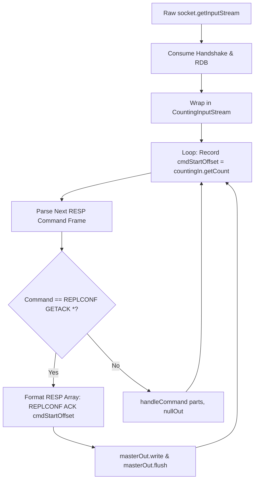

# Stage 65: ACKs with commands

---

## In one line
Track the cumulative byte offset of all commands consumed from the master replication stream using a `CountingInputStream` decorator, responding to `REPLCONF GETACK *` with `REPLCONF ACK <cmdStartOffset>` reflecting the exact offset *prior* to the interrogation frame.

---

## Self-test (cover the answers below and answer these first)
1. **Why must the replication offset reported in `REPLCONF ACK <offset>` exclude the bytes of the `REPLCONF GETACK *` command itself?**
   - *Answer*: The master queries the replica for the high-water mark of commands the replica has successfully processed *up to that interrogation point*. When the master issues `REPLCONF GETACK *`, it compares the returned offset against its own write offset generated prior to that GETACK command. If the replica included the GETACK command bytes in the ACK, the offset would exceed the master's accumulated write log offset, causing synchronization errors.
2. **At what exact point in the replica connection lifecycle must offset tracking start at 0?**
   - *Answer*: Immediately after fully ingesting the master's binary RDB snapshot payload (i.e. right after consuming the length-delimited `$<len>\r\n<rdb_bytes>`). The handshake commands (`PING`, `REPLCONF listening-port`, `REPLCONF capa`, `PSYNC`) and the RDB transfer itself are synchronization setup and do not count toward the replication stream offset.
3. **What is the Decorator Pattern in I/O streams, and why is `FilterInputStream` ideal for tracking byte offsets?**
   - *Answer*: `FilterInputStream` wraps an existing `InputStream` and intercepts read calls (`read()`, `read(byte[], int, int)`). By overriding these methods to increment an internal `count` before returning bytes, any consumer calling standard read methods or high-level helpers (like `readNBytes()` or custom line parsers) automatically updates the cumulative byte count without needing manual calculation.
4. **How does `InputStream.readNBytes(int len)` behave when wrapped inside a custom `CountingInputStream`?**
   - *Answer*: In `java.io.InputStream`, `readNBytes(int len)` is implemented by repeatedly calling `read(byte[], int, int)` on `this`. Therefore, when `CountingInputStream` overrides `read(byte[], int, int)` to increment the counter, `readNBytes` automatically increments the counter by the exact number of bytes read without requiring a separate override. Overriding both naively would result in double counting.
5. **How are non-write commands such as `PING` handled with respect to the replication offset?**
   - *Answer*: Although `PING` does not mutate database keys, master heartbeats sent over the replication link are part of the raw replication stream byte sequence. Both write commands (`SET`, `DEL`) and non-write commands (`PING`, `REPLCONF GETACK *`) consume stream bytes and must increment the running offset.
6. **What is the exact RESP wire encoding expected for `REPLCONF ACK 88`?**
   - *Answer*: A 3-element RESP array of bulk strings: `*3\r\n$8\r\nREPLCONF\r\n$3\r\nACK\r\n$2\r\n88\r\n`.

---

## Problem Solved

In Stage 64 (*ACKs with no commands*), our replica learned how to intercept `REPLCONF GETACK *` interrogations from the master and return a hardcoded acknowledgment `REPLCONF ACK 0`. This proved that our replica could establish a bidirectional control channel over an otherwise unidirectional replication socket.

However, hardcoding `ACK 0` fails as soon as real traffic flows:
1. In a live cluster, the master replicates write commands (`SET`, `DEL`, `HSET`) and periodic heartbeats (`PING`) to keep replicas synchronized.
2. The master periodically interrogates replicas with `REPLCONF GETACK *` to measure **replication lag**—the difference between the master's current replication offset (`master_repl_offset`) and the replica's reported offset.
3. If multiple commands have been ingested (e.g., `PING` of 14 bytes, `SET foo 1` of 29 bytes, `SET bar 2` of 29 bytes), an ACK returning `0` falsely signals that the replica has stalled or fallen infinitely far behind.

Stage 65 solves this by implementing dynamic byte offset tracking. Immediately after consuming the RDB snapshot, the replica begins tracking every single byte read from the replication socket. When `REPLCONF GETACK *` arrives, the replica answers with the exact byte count of all commands processed **before** that GETACK request.

---

## Thought Process & Architectural Model

### 1. Cumulative Replication Stream Offset Model

The master replication stream is an append-only linear byte sequence. The offset represents the zero-indexed pointer in that byte stream:

```text
Stream:  [  PING (14 bytes)  ][ REPLCONF GETACK * (37 B) ][  SET foo 1 (29 B)  ][  SET bar 2 (29 B)  ][ REPLCONF GETACK * (37 B) ]
Offset:  0                  14                          51                     80                   109                         146
                              ▲                           ▲
                              │                           │
          ACK 0 at start      ACK 14 before 2nd GETACK    ACK 109 before 3rd GETACK
```

Key rule: **When responding to `REPLCONF GETACK *`, the ACK payload must equal the offset at the start of that GETACK command.**

### 2. Sequence Diagram: Interleaved Replication & Dynamic Acknowledgment

```mermaid
sequenceDiagram
    autonumber
    participant Master as Redis Master
    participant InStream as CountingInputStream
    participant Replica as Replica Event Loop

    Note over Master,InStream: RDB sync finished; offset begins at 0
    Master->>InStream: *3\r\n$8\r\nREPLCONF\r\n$6\r\nGETACK\r\n$1\r\n*\r\n (37 bytes)
    Note right of Replica: Record cmdStartOffset = 0
    InStream->>Replica: Parsed ["REPLCONF", "GETACK", "*"] (offset now 37)
    Replica->>Master: *3\r\n$8\r\nREPLCONF\r\n$3\r\nACK\r\n$1\r\n0\r\n

    Master->>InStream: *1\r\n$4\r\nPING\r\n (14 bytes)
    Note right of Replica: Record cmdStartOffset = 37
    InStream->>Replica: Parsed ["PING"] (offset now 51)
    Replica->>Replica: handleCommand(PING, nullOut) [Silent]

    Master->>InStream: *3\r\n$8\r\nREPLCONF\r\n$6\r\nGETACK\r\n$1\r\n*\r\n (37 bytes)
    Note right of Replica: Record cmdStartOffset = 51
    InStream->>Replica: Parsed ["REPLCONF", "GETACK", "*"] (offset now 88)
    Replica->>Master: *3\r\n$8\r\nREPLCONF\r\n$3\r\nACK\r\n$2\r\n51\r\n

    Master->>InStream: *3\r\n$3\r\nSET\r\n$3\r\nfoo\r\n$1\r\n1\r\n (29 bytes)
    Note right of Replica: Record cmdStartOffset = 88
    InStream->>Replica: Parsed ["SET", "foo", "1"] (offset now 117)
    Replica->>Replica: handleCommand(SET, nullOut) [Silent]

    Master->>InStream: *3\r\n$3\r\nSET\r\n$3\r\nbar\r\n$1\r\n2\r\n (29 bytes)
    Note right of Replica: Record cmdStartOffset = 117
    InStream->>Replica: Parsed ["SET", "bar", "2"] (offset now 146)
    Replica->>Replica: handleCommand(SET, nullOut) [Silent]

    Master->>InStream: *3\r\n$8\r\nREPLCONF\r\n$6\r\nGETACK\r\n$1\r\n*\r\n (37 bytes)
    Note right of Replica: Record cmdStartOffset = 146
    InStream->>Replica: Parsed ["REPLCONF", "GETACK", "*"] (offset now 183)
    Replica->>Master: *3\r\n$8\r\nREPLCONF\r\n$3\r\nACK\r\n$3\r\n146\r\n
```

### 3. Parsing & Acknowledgment Architecture



---

## Full Solution

The implementation is located in [`codecrafters-redis-java/src/main/java/Main.java`](file:///C:/Users/jiten/Documents/Codecrafters-Build-from-scratch/codecrafters-redis-java/src/main/java/Main.java).

### 1. The `CountingInputStream` Decorator

We extend `FilterInputStream` to transparently intercept all read calls and increment a monotonic byte counter:

```java
  private static class CountingInputStream extends FilterInputStream {
    private long count = 0;

    CountingInputStream(InputStream in) {
      super(in);
    }

    public long getCount() {
      return count;
    }

    @Override
    public int read() throws IOException {
      int b = in.read();
      if (b != -1) {
        count++;
      }
      return b;
    }

    @Override
    public int read(byte[] b, int off, int len) throws IOException {
      int n = in.read(b, off, len);
      if (n > 0) {
        count += n;
      }
      return n;
    }

    @Override
    public long skip(long n) throws IOException {
      long skipped = in.skip(n);
      if (skipped > 0) {
        count += skipped;
      }
      return skipped;
    }
  }
```

### 2. Passing the Pre-Command Offset to `processReplicaCommand`

`processReplicaCommand` takes `cmdStartOffset`, formats the 3-element RESP array, and writes it to `masterOut`:

```java
  private static void processReplicaCommand(String[] parts, OutputStream masterOut, OutputStream nullOut, long cmdStartOffset) throws IOException {
    if (parts.length >= 2 && parts[0].equalsIgnoreCase("REPLCONF") && parts[1].equalsIgnoreCase("GETACK")) {
      // Stage 65: Respond to REPLCONF GETACK * with REPLCONF ACK <cmdStartOffset>
      String offsetStr = String.valueOf(cmdStartOffset);
      String ack = "*3\r\n$8\r\nREPLCONF\r\n$3\r\nACK\r\n$" + offsetStr.length() + "\r\n" + offsetStr + "\r\n";
      masterOut.write(ack.getBytes(StandardCharsets.UTF_8));
      masterOut.flush();
    } else {
      handleCommand(parts, nullOut);
    }
  }
```

### 3. Continuous Replication Loop with Offset Tracking

Immediately after consuming the RDB file, `masterIn` is wrapped in `CountingInputStream`. At each iteration, before reading the command, we snapshot `cmdStartOffset = countingIn.getCount()`:

```java
            // Stage 63 & 65: Enter continuous command processing loop with offset tracking
            CountingInputStream countingIn = new CountingInputStream(masterIn);
            OutputStream nullOut = OutputStream.nullOutputStream();
            while (true) {
              long cmdStartOffset = countingIn.getCount();
              String line = readLine(countingIn);
              if (line == null) {
                break; // Master disconnected
              }
              if (line.isEmpty()) {
                continue;
              }
              if (line.startsWith("*")) {
                int numArgs = Integer.parseInt(line.substring(1).trim());
                String[] parts = new String[numArgs];
                boolean complete = true;
                for (int i = 0; i < numArgs; i++) {
                  String lenLine = readLine(countingIn);
                  if (lenLine == null) {
                    complete = false;
                    break;
                  }
                  int argLen = Integer.parseInt(lenLine.substring(1).trim());
                  byte[] argBytes = countingIn.readNBytes(argLen);
                  parts[i] = new String(argBytes, StandardCharsets.UTF_8);
                  int cr = countingIn.read();
                  int lf = countingIn.read();
                  if (cr == -1 || lf == -1) {
                    complete = false;
                    break;
                  }
                }
                if (complete) {
                  try {
                    processReplicaCommand(parts, masterOut, nullOut, cmdStartOffset);
                  } catch (Exception e) {
                    System.err.println("Error processing propagated command: " + e.getMessage());
                  }
                }
              } else {
                String[] parts = line.split("\\s+");
                try {
                  processReplicaCommand(parts, masterOut, nullOut, cmdStartOffset);
                } catch (Exception e) {
                  System.err.println("Error processing inline command: " + e.getMessage());
                }
              }
            }
```

---

## Concepts (the transferable part)

- **Replication Offset as a Monotonic Logical Clock / Watermark**: In distributed state-machine replication (e.g., Raft log indices, Kafka partition offsets, Redis replication offsets), continuous offsets identify exactly how much of the leader's write log has been applied. This provides a total ordering and enables fast catch-up or resynchronization without rescanning entire datasets.
- **The Decorator Pattern in I/O Pipelines**: Instead of cluttering tokenizers and command parsers with byte-length bookkeeping (or re-serializing commands to calculate how long they were), the input stream itself is decorated. Tracking bytes at the physical transport boundary guarantees 100% accuracy regardless of how commands are parsed.
- **Pre-Command Snapshotting (High-Water Mark Semantics)**: Capturing `cmdStartOffset = stream.count` *before* consuming a frame cleanly separates the current control inquiry from the state history. When the query asks *"Where are you right now?"*, the answer is the byte boundary *before* the question was read.
- **Protocol Symmetry and Delimiters**: In RESP, carriage return and line feed delimiters (`\r\n`), length headers (`$<len>`), and array headers (`*<count>`) are integral parts of the byte stream. Because `CountingInputStream` wraps the raw network stream, every delimiter byte is counted without bespoke offset arithmetic.

---

## Wire Format

### 1. Inbound Command Frame Byte Breakdown

| Command Frame | Raw RESP Encoding | Byte Length | Cumulative Offset After Command |
|---|---|---|---|
| Handshake & RDB | (PSYNC, RDB file payload) | N/A | **0** (offset initialized to 0 post-RDB) |
| `REPLCONF GETACK *` (1st) | `*3\r\n$8\r\nREPLCONF\r\n$6\r\nGETACK\r\n$1\r\n*\r\n` | **37** | 37 (Replica responds with ACK **0**) |
| `PING` | `*1\r\n$4\r\nPING\r\n` | **14** | 51 (Silent execution) |
| `REPLCONF GETACK *` (2nd) | `*3\r\n$8\r\nREPLCONF\r\n$6\r\nGETACK\r\n$1\r\n*\r\n` | **37** | 88 (Replica responds with ACK **51**) |
| `SET foo 1` | `*3\r\n$3\r\nSET\r\n$3\r\nfoo\r\n$1\r\n1\r\n` | **29** | 117 (Silent execution) |
| `SET bar 2` | `*3\r\n$3\r\nSET\r\n$3\r\nbar\r\n$1\r\n2\r\n` | **29** | 146 (Silent execution) |
| `REPLCONF GETACK *` (3rd) | `*3\r\n$8\r\nREPLCONF\r\n$6\r\nGETACK\r\n$1\r\n*\r\n` | **37** | 183 (Replica responds with ACK **146**) |

### 2. Outbound `REPLCONF ACK <offset>` Wire Format

| Field | RESP Representation | Raw Hex / Bytes | Purpose |
|---|---|---|---|
| Array Header | `*3\r\n` | `2A 33 0D 0A` | 3-element RESP Array |
| Arg 0 Header | `$8\r\n` | `24 38 0D 0A` | Length 8 bulk string |
| Arg 0 Payload | `REPLCONF\r\n` | `52 45 50 4C 43 4F 4E 46 0D 0A` | Replication command |
| Arg 1 Header | `$3\r\n` | `24 33 0D 0A` | Length 3 bulk string |
| Arg 1 Payload | `ACK\r\n` | `41 43 4B 0D 0A` | Acknowledgment subcommand |
| Arg 2 Header | `$<len>\r\n` | e.g. `$3\r\n` for "146" | Length of offset string |
| Arg 2 Payload | `<cmdStartOffset>\r\n` | e.g. `146\r\n` | Processed replication offset |

---

## Failure Modes

- **Reporting Post-Command Offset Instead of Pre-Command Offset**:
  - *Cause*: Reporting `countingIn.getCount()` *after* parsing `REPLCONF GETACK *`.
  - *Symptom*: When the first `GETACK` arrives, the replica replies with `ACK 37` instead of `ACK 0`. The master rejects the response because it expects an offset matching what was replicated prior to the GETACK frame.
- **Double Counting in `FilterInputStream` Overrides**:
  - *Cause*: Overriding `readNBytes` and adding `count += len` while also overriding `read(byte[], int, int)` with `count += n`.
  - *Symptom*: In standard OpenJDK implementations, `InputStream.readNBytes` delegates to `read(byte[], int, int)`. Overriding both increments `count` twice for bulk arguments, producing wildly inflated offsets.
- **Offset Counter Initialized Before RDB Ingestion**:
  - *Cause*: Wrapping `masterIn` in `CountingInputStream` before sending `PING` or before reading the RDB file.
  - *Symptom*: Handshake frames (dozens of bytes) and the RDB payload (hundreds of bytes) inflate the initial offset well beyond 0.
- **Buffer Lookahead Desynchronization**:
  - *Cause*: Wrapping `masterIn` in a `BufferedReader` or `BufferedInputStream` before creating `CountingInputStream`.
  - *Symptom*: The buffered reader reads ahead from the kernel socket into its internal memory buffer. Bytes sit inside the buffer without being accounted for by the offset counter until actually consumed, corrupting offset values.
- **Missing `masterOut.flush()`**:
  - *Cause*: Writing the ACK frame to `masterOut` without flushing.
  - *Symptom*: The ACK frame sits in user-space socket buffers. The master's replication timeout fires, aborting the test.

---

## Tradeoffs

- **Decorator Pattern (`CountingInputStream`) vs Re-Serializing Processed Commands**:
  - *Re-serialization*: Take parsed command strings `["SET", "foo", "1"]` and manually compute length: `*3\r\n$3\r\n...`.
  - *Why Decorator Wins*: Re-serialization is brittle and error-prone; any minor whitespace discrepancy, case variance, or protocol nuance between what the master sent and what we re-serialize leads to cumulative drift. Measuring raw wire bytes directly at the stream layer is infallible.
- **Decorator Pattern vs NIO / Netty `ByteBuf`**:
  - *NIO / Netty*: Modern high-performance servers use Netty or native epoll with reference-counted buffers (`ByteBuf.readerIndex()`).
  - *Why Decorator Wins Here*: In standard blocking I/O (`java.io`), `FilterInputStream` is zero-dependency, lightweight, idiomatic, and fits seamlessly into existing synchronous socket threads.

---

## Java Specifics — lookup, don't memorize

- `java.io.FilterInputStream` — Base class for stream decorators; forwards all read/skip requests to the underlying `InputStream`.
- `InputStream.readNBytes(int len)` — Reads up to `len` bytes from the stream, blocking until all requested bytes are read or EOF is reached. Delegates directly to `read(byte[], int, int)`.
- `String.valueOf(long l)` — Converts a primitive integer/long to its decimal string representation.
- `StandardCharsets.UTF_8` — Thread-safe constant representing UTF-8 character encoding, eliminating charset lookup overhead.

---

## Rebuild Checklist

- [ ] Complete 3-step replication handshake (`PING`, `REPLCONF listening-port`, `REPLCONF capa`, `PSYNC ? -1`).
- [ ] Consume length-delimited RDB snapshot file (`$<len>\r\n<bytes>`).
- [ ] Implement `CountingInputStream extends FilterInputStream` tracking cumulative bytes read via `read()` and `read(byte[], int, int)`.
- [ ] Wrap `masterIn` in `CountingInputStream` immediately after the RDB file payload is read.
- [ ] In the continuous replica command loop, record `long cmdStartOffset = countingIn.getCount()` *before* invoking `readLine(countingIn)`.
- [ ] When parsed command is `REPLCONF GETACK *`, format and write `*3\r\n$8\r\nREPLCONF\r\n$3\r\nACK\r\n$<len>\r\n<cmdStartOffset>\r\n` to `masterOut` and call `masterOut.flush()`.
- [ ] Process non-control commands silently using `handleCommand(parts, OutputStream.nullOutputStream())`.
