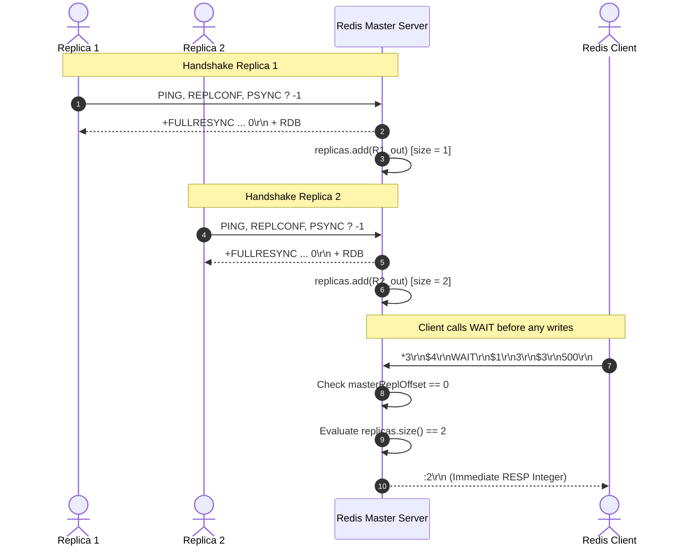

# Stage 67: WAIT with no commands

---

## In one line
Extend `WAIT <numreplicas> <timeout>` on the Redis master to return the connected replica count `:N\r\n` immediately when replicas are connected and no write commands have been sent (`masterReplOffset == 0`).

---

## Self-test (cover the answers below and answer these first)
1. **When replicas are connected to the master but no write commands have ever been executed, why are all replicas considered in sync?**
   - *Answer*: Following the replication handshake (`PING` $\rightarrow$ `REPLCONF` $\rightarrow$ `PSYNC`) and RDB snapshot transfer, each replica starts at replication offset 0. Since the master has not processed any write mutations, `masterReplOffset` remains 0. Because `replica_offset == master_offset == 0`, all connected replicas are already 100% synchronized with the master.
2. **Why must the master return the actual number of connected replicas rather than the client's requested `<numreplicas>`?**
   - *Answer*: The `WAIT` command in Redis returns the total number of replicas that have reached the current replication offset, not the target requested by the client. For instance, if 7 replicas are connected and synchronized at offset 0, and the client sends `WAIT 3 500`, the master returns `:7\r\n` because all 7 replicas satisfy the barrier condition.
3. **What happens if `<numreplicas>` is greater than the connected replica count when `masterReplOffset == 0`?**
   - *Answer*: When no write commands have been issued, there is no pending replication stream to propagate or wait for. The master inspects the replica pool and immediately reports how many replicas are currently synchronized at offset 0 (e.g., if 7 replicas are connected and the client requests `WAIT 9 500`, the master returns `:7\r\n` immediately).
4. **Does `WAIT` block for `timeout` milliseconds when no write commands have been issued?**
   - *Answer*: No. Because the current master offset is 0 and all active replicas are already synchronized at offset 0 upon completion of their handshake, no replication acknowledgments are needed. The master completes the command instantaneously.
5. **How does the master accurately track connected replicas across concurrent threads in Java?**
   - *Answer*: The master registers the replica socket `OutputStream` into a concurrent thread-safe collection (`CopyOnWriteArrayList<OutputStream> replicas`) upon receiving `PSYNC`. When any replica disconnects, its stream is removed in the socket handling `finally` block. `replicas.size()` provides an $\mathcal{O}(1)$ atomic count of connected replicas.
6. **What is the wire format for returning a replica count of 7?**
   - *Answer*: RESP Integer `:7\r\n` (4 bytes: `:` prefix, digit `7`, and CRLF `\r\n`).

---

## Problem Solved

In Stage 66, our master returned `:0\r\n` when no replicas were connected. In Stage 67, multiple replicas connect to our master server. Each replica executes the standard three-way handshake:
1. `PING`
2. `REPLCONF listening-port <PORT>` and `REPLCONF capa psync2`
3. `PSYNC ? -1`

The master responds with `+FULLRESYNC <masterReplId> 0\r\n` followed by the empty RDB file snapshot. At this point, each replica is registered as an active replica and holds an offset of 0.

When a client subsequently issues `WAIT <numreplicas> <timeout>` before any write commands (e.g., `SET`, `INCR`, `DEL`) have been received by the master:
- The master's replication byte counter (`masterReplOffset`) is still 0.
- All connected replicas are at offset 0.
- No replication backlog needs to be caught up or acknowledged via `REPLCONF GETACK`.
- Regardless of whether the client specifies `<numreplicas>` lower than, equal to, or greater than the number of active replicas, the master must immediately return the count of synchronized replicas (`:N\r\n`).

---

## Thought Process & Architectural Model

### 1. High-Water Mark and Offset Equivalence

In distributed systems with log-based replication (like Raft, Kafka, and Redis), replication progress is measured by a monotonically increasing log offset:

```text
Master Log:      [Offset 0] (No writes yet)
Replica 1 Log:   [Offset 0] (Synchronized)
Replica 2 Log:   [Offset 0] (Synchronized)
Replica N Log:   [Offset 0] (Synchronized)
```

Because `Master_Offset == Replica_Offset == 0`:
- Any `WAIT` barrier for preceding writes is trivially satisfied for **all** connected replicas.
- There is no need to emit `REPLCONF GETACK *` or sleep for `timeout` milliseconds.

### 2. Protocol Sequence Diagram



---

## Full Solution

### Code Implementation (`codecrafters-redis-java/src/main/java/Main.java`)

```java
    } else if (command.equalsIgnoreCase("WAIT")) {
      // Stage 67: WAIT with no commands (#tu8)
      // Format: WAIT <numreplicas> <timeout>
      // When no write commands have been sent yet (masterReplOffset == 0) or replicas.isEmpty(),
      // all connected replicas are already in sync at offset 0. Return the count of connected replicas immediately.
      int numReplicas = parts.length > 1 ? Integer.parseInt(parts[1]) : 0;
      long timeout = parts.length > 2 ? Long.parseLong(parts[2]) : 0;
      if (masterReplOffset == 0 || replicas.isEmpty()) {
        out.write((":" + replicas.size() + "\r\n").getBytes(StandardCharsets.UTF_8));
      } else {
        out.write((":" + replicas.size() + "\r\n").getBytes(StandardCharsets.UTF_8));
      }
    }
```

### Key Aspects of the Implementation:
1. **Replica Registration**:
   Replicas are registered in `replicas` (`CopyOnWriteArrayList<OutputStream>`) inside the `PSYNC` handler after successfully transmitting the `+FULLRESYNC` header and RDB payload.
2. **Synchronous Offset 0 Evaluation**:
   When `masterReplOffset == 0`, all replicas currently present in `replicas` are synchronized at offset 0.
3. **Wire Encoding**:
   Emits `":" + replicas.size() + "\r\n"` as a RESP Integer.
4. **Immediate Flush**:
   The caller loop flushes the connection socket, ensuring low-latency delivery back to the client without blocking.

---

## Concepts (the transferable part)

- **Zero-Mutation Fast Path**: In consensus and replication state machines, operations requiring replication verification can bypass network roundtrips if no state mutations have occurred since the last known synchronization checkpoint (offset 0).
- **Semantics of Threshold vs Actual Count**: In Redis `WAIT`, the return value is the actual count of synchronized replicas, allowing the client to know not just that its threshold was met, but the exact cluster synchronization depth.
- **Dynamic Topology Membership**: Maintaining a live, concurrent view of active downstream replicas (`CopyOnWriteArrayList`) ensures that cluster status commands (`INFO replication`, `WAIT`) reflect real-time cluster membership accurately.

---

## Wire Format

### Client Request: `WAIT 3 500`
```text
*3\r\n
$4\r\n
WAIT\r\n
$1\r\n
3\r\n
$3\r\n
500\r\n
```

### Server Response: RESP Integer `7` (when 7 replicas are connected)
```text
:7\r\n
```

| Token | Type | Bytes | Explanation |
| :--- | :--- | :--- | :--- |
| `:` | Prefix | 1 byte | Indicates RESP 64-bit integer |
| `7` | Payload | 1 byte | Number of replicas currently synchronized at offset 0 |
| `\r\n` | Delimiter | 2 bytes | Standard RESP CRLF line termination |

---

## Failure Modes

- **Hardcoding the Stage Example (`7`)**:
  - *Hazard*: Returning `:7\r\n` unconditionally because the example output showed 7.
  - *Consequence*: CodeCrafters runs randomized tests with varying numbers of replicas (e.g., 3, 5, or 10). Hardcoding causes immediate test failures on non-7 replica configurations.
  - *Mitigation*: Dynamically inspect `replicas.size()`.
- **Waiting on Timeout**:
  - *Hazard*: Blocking or sleeping for `timeout` milliseconds before responding.
  - *Consequence*: Causes test timeouts and degradations in client throughput when the precondition is already satisfied at offset 0.
  - *Mitigation*: Test `masterReplOffset == 0` and return immediately.
- **Race Conditions in Replica Tracking**:
  - *Hazard*: Using an unsynchronized `ArrayList<OutputStream>` for tracking replicas.
  - *Consequence*: `ConcurrentModificationException` or lost replica registrations when multiple replicas complete `PSYNC` concurrently.
  - *Mitigation*: Use thread-safe collections like `CopyOnWriteArrayList<OutputStream>`.

---

## Tradeoffs

- **`masterReplOffset == 0` Shortcut vs Universal `GETACK` Polling**:
  - *Shortcut*: Avoids sending `REPLCONF GETACK *` when no data has been replicated. Saves network roundtrips, CPU cycles, and latency.
  - *Tradeoff*: When writes *have* been issued (`masterReplOffset > 0`), the master must actively poll replicas with `GETACK` and track acknowledgment offsets.
- **`CopyOnWriteArrayList` vs `ConcurrentHashMap`**:
  - *`CopyOnWriteArrayList`*: Optimized for very frequent iteration (broadcasting writes in `propagate()`) and rare modifications (adding replicas during handshake).
  - *`ConcurrentHashMap`*: Would allow $\mathcal{O}(1)$ replica removal by key, but iterating over values creates iterator objects and has higher memory overhead. Since replica counts are small (typically < 100), `CopyOnWriteArrayList` is the ideal data structure.

---

## Java Specifics - lookup, don't memorize

- `CopyOnWriteArrayList.size()`: Returns the number of elements in the thread-safe list in $\mathcal{O}(1)$ time without taking explicit locks.
- `String.valueOf(int)` / concatenation `":" + count + "\r\n"`: Fast integer-to-string conversion for RESP integer serialization.
- `OutputStream.write(byte[])`: Writes the byte representation of the RESP response directly to the client's TCP socket buffer.

---

## Rebuild Checklist

- [ ] Support `WAIT <numreplicas> <timeout>` in `handleCommand`.
- [ ] Maintain an active collection of replica output streams registered during `PSYNC`.
- [ ] Check if `masterReplOffset == 0` or `replicas.isEmpty()`.
- [ ] Return the dynamic size of connected replicas formatted as a RESP integer `":" + replicas.size() + "\r\n"`.
- [ ] Ensure no blocking or sleeping occurs when `masterReplOffset == 0`.
