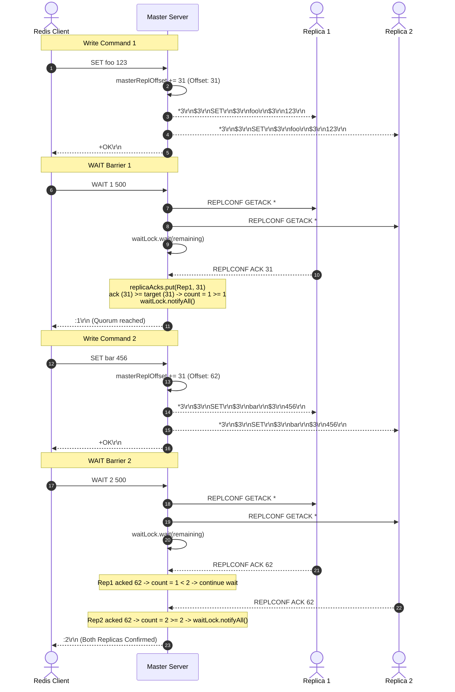

# Stage 68: WAIT with multiple commands

---

## In one line
Implement semi-synchronous durability barriers in Redis by broadcasting `REPLCONF GETACK *` during `WAIT <numreplicas> <timeout>`, tracking per-replica acknowledgment offsets from incoming `REPLCONF ACK <offset>` frames, and unblocking the waiting client thread as soon as the quorum threshold is reached or the timeout expires.

---

## Self-test (cover the answers below and answer these first)
1. **Why does the Redis master send `REPLCONF GETACK *` to replicas during a `WAIT` command instead of waiting for replicas to send offsets on their own?**
   - *Answer*: In the Redis replication protocol, replicas do not periodically stream ACK messages during idle times or standard command propagation to save bandwidth and reduce TCP overhead. Instead, replication acknowledgments are *demand-driven*: the master explicitly requests replica offsets on-demand by fanning out `REPLCONF GETACK *` (`*3\r\n$8\r\nREPLCONF\r\n$6\r\nGETACK\r\n$1\r\n*\r\n`) when a client invokes `WAIT`.
2. **Why must the master NOT reply with `+OK\r\n` when receiving a `REPLCONF ACK <offset>` from a replica?**
   - *Answer*: `REPLCONF ACK <offset>` is a unidirectional telemetry and offset acknowledgment packet sent from replica to master. Unlike handshake negotiation messages (such as `listening-port` or `capa`), which expect `+OK\r\n` acknowledgments, sending `+OK\r\n` back to a replica upon `REPLCONF ACK` would violate the replication wire protocol and corrupt the replica's downstream command stream parser.
3. **What is the condition that determines whether a replica has satisfied the `WAIT` barrier?**
   - *Answer*: A replica satisfies the durability barrier for the waiting client if its reported acknowledgment offset is greater than or equal to the target replication offset at the moment `WAIT` was initiated: `ackOffset >= targetOffset` (where `targetOffset` equals the master's accumulated write byte count `masterReplOffset`).
4. **Why should `REPLCONF GETACK *` sent during `WAIT` NOT advance `masterReplOffset`?**
   - *Answer*: `masterReplOffset` measures the cumulative byte offset of dataset-mutating write commands (such as `SET`, `DEL`, `INCR`). `REPLCONF GETACK *` is a read-only replication control frame emitted during barrier coordination. Furthermore, replicas acknowledge the byte count of commands received *before* processing `GETACK`. If the master were to add `GETACK`'s 37 bytes to `masterReplOffset`, the replica's reported ACK offset would always lag behind `masterReplOffset`, causing durability barriers to erroneously timeout.
5. **How does multithreaded synchronization work between the client executing `WAIT` and the threads receiving `REPLCONF ACK`s?**
   - *Answer*: The waiting client thread computes a deadline (`System.currentTimeMillis() + timeout`) and enters a monitor wait loop (`synchronized (waitLock) { waitLock.wait(remaining); }`). Whenever any replica socket thread reads a `REPLCONF ACK <offset>`, it updates the shared `replicaAcks` map and issues `waitLock.notifyAll()`. This wakes up the waiting client thread to recount satisfied replicas and break immediately once `count >= numreplicas`.
6. **What happens if `<numreplicas>` is larger than the number of connected replicas, or some replicas are slow/unresponsive?**
   - *Answer*: The master waits on `waitLock` until the `timeout` duration expires (`remaining <= 0`). Upon timeout, the master stops waiting and returns the actual count of replicas that succeeded in acknowledging all commands up to the target offset as a RESP integer `:<actual_count>\r\n`.

---

## Problem Solved

In previous stages, our master handled edge cases for `WAIT`:
1. **Stage 66**: When no replicas were connected (`replicas.isEmpty()`), the master returned `:0\r\n` immediately.
2. **Stage 67**: When replicas were connected but no write commands had been issued (`masterReplOffset == 0`), all replicas were trivially synchronized at offset 0, and the master immediately returned the connected replica count `:<replicas.size()>\r\n`.

In **Stage 68**, write commands (e.g., `SET foo 123`, `SET bar 456`) are interleaved with `WAIT` barriers:
```text
$ redis-cli SET foo 123
$ redis-cli WAIT 1 500
$ redis-cli SET bar 456
$ redis-cli WAIT 2 500
```
Because `masterReplOffset > 0`, the master cannot assume replicas have received or applied the commands yet. Network latency, socket buffering, and replica execution time mean replicas are asynchronously catching up.

To satisfy the `WAIT` barrier, the master must:
1. Identify the high-water replication target offset (`targetOffset = masterReplOffset`).
2. Broadcast `REPLCONF GETACK *` across all active replica socket connections.
3. Asynchronously listen for incoming `REPLCONF ACK <offset>` responses on replica client threads.
4. Update the per-replica acknowledged offset registry without replying `+OK\r\n`.
5. Block the calling client thread on a concurrency monitor (`waitLock`) until either:
   - At least `numreplicas` replicas report an offset `ackOffset >= targetOffset`, or
   - The client-specified `timeout` expires.
6. Return the total count of synchronized replicas as a RESP integer `:<count>\r\n`.

---

## Thought Process & Architectural Model

### 1. Durability Barriers in Log-Structured Replication

Replication in Redis follows an asynchronous primary-backup streaming pattern. The master maintains a monotonically increasing write stream offset (`masterReplOffset`). Every mutation appends bytes to this stream.

When a client calls `WAIT <numreplicas> <timeout>`:
- The master captures the barrier offset $O_{target} = \text{masterReplOffset}$.
- The master requests each replica to report its currently consumed offset $O_{replica}$ via `GETACK`.
- Any replica where $O_{replica} \ge O_{target}$ counts toward the quorum.

```text
Time -------------------------------------------------------------------->
Master:   --[SET foo 123 (31B)]--[Offset 31]----[WAIT 1 500: GETACK *]----
                  \                                  \
Replica 1: --------[Recv SET foo (31B)]----------------[Recv GETACK]-----> Sends ACK 31
Replica 2: --------[In flight / Lagging]--------------[Recv GETACK]-----> Lagging / Delayed
```

### 2. End-to-End Replication Barrier Protocol



---

## Full Solution

### Code Implementation (`codecrafters-redis-java/src/main/java/Main.java`)

#### 1. Shared Thread-Safe Replica State and Monitor
```java
  private static volatile long masterReplOffset = 0;
  private static final CopyOnWriteArrayList<OutputStream> replicas = new CopyOnWriteArrayList<>();
  private static final Map<OutputStream, Long> replicaAcks = new ConcurrentHashMap<>();
  private static final Object waitLock = new Object();
```

#### 2. Quorum Counting Helper
```java
  private static int countAcknowledgedReplicas(long targetOffset) {
    int count = 0;
    for (OutputStream replicaOut : replicas) {
      Long ack = replicaAcks.get(replicaOut);
      if (ack != null && ack >= targetOffset) {
        count++;
      }
    }
    return count;
  }
```

#### 3. Command Propagation Tracking
```java
  private static synchronized void propagate(String[] parts) {
    if (!"master".equalsIgnoreCase(role)) {
      return;
    }
    StringBuilder sb = new StringBuilder();
    sb.append("*").append(parts.length).append("\r\n");
    for (int i = 0; i < parts.length; i++) {
      String token = (i == 0) ? parts[i].toUpperCase() : parts[i];
      byte[] b = token.getBytes(StandardCharsets.UTF_8);
      sb.append("$").append(b.length).append("\r\n").append(token).append("\r\n");
    }
    byte[] msg = sb.toString().getBytes(StandardCharsets.UTF_8);
    masterReplOffset += msg.length;

    for (OutputStream replicaOut : replicas) {
      try {
        synchronized (replicaOut) {
          replicaOut.write(msg);
          replicaOut.flush();
        }
      } catch (IOException e) {
        replicas.remove(replicaOut);
        replicaAcks.remove(replicaOut);
        synchronized (waitLock) {
          waitLock.notifyAll();
        }
      }
    }
  }
```

#### 4. Handling `REPLCONF ACK <offset>` on Master
```java
    } else if (command.equalsIgnoreCase("REPLCONF")) {
      // Stage 58 & 68: Replication handshake and ACK handling
      if (parts.length >= 3 && parts[1].equalsIgnoreCase("ACK")) {
        try {
          long ackOffset = Long.parseLong(parts[2].trim());
          replicaAcks.put(out, ackOffset);
          synchronized (waitLock) {
            waitLock.notifyAll();
          }
        } catch (NumberFormatException ignored) {}
      } else {
        out.write("+OK\r\n".getBytes(StandardCharsets.UTF_8));
      }
    }
```

#### 5. Executing `WAIT <numreplicas> <timeout>`
```java
    } else if (command.equalsIgnoreCase("WAIT")) {
      // Stage 68: WAIT with multiple commands (#na2)
      // Format: WAIT <numreplicas> <timeout>
      int numReplicas = parts.length > 1 ? Integer.parseInt(parts[1]) : 0;
      long timeout = parts.length > 2 ? Long.parseLong(parts[2]) : 0;

      if (replicas.isEmpty()) {
        out.write(":0\r\n".getBytes(StandardCharsets.UTF_8));
        out.flush();
        return;
      }

      if (masterReplOffset == 0 || numReplicas == 0) {
        out.write((":" + replicas.size() + "\r\n").getBytes(StandardCharsets.UTF_8));
        out.flush();
        return;
      }

      long targetOffset = masterReplOffset;

      // Send REPLCONF GETACK * to all connected replicas
      byte[] getackMsg = "*3\r\n$8\r\nREPLCONF\r\n$6\r\nGETACK\r\n$1\r\n*\r\n".getBytes(StandardCharsets.UTF_8);
      for (OutputStream replicaOut : replicas) {
        try {
          synchronized (replicaOut) {
            replicaOut.write(getackMsg);
            replicaOut.flush();
          }
        } catch (IOException e) {
          replicas.remove(replicaOut);
          replicaAcks.remove(replicaOut);
          synchronized (waitLock) {
            waitLock.notifyAll();
          }
        }
      }

      long deadline = (timeout > 0) ? System.currentTimeMillis() + timeout : Long.MAX_VALUE;
      synchronized (waitLock) {
        while (countAcknowledgedReplicas(targetOffset) < numReplicas) {
          if (replicas.isEmpty()) {
            break;
          }
          if (timeout > 0) {
            long remaining = deadline - System.currentTimeMillis();
            if (remaining <= 0) {
              break;
            }
            try {
              waitLock.wait(remaining);
            } catch (InterruptedException e) {
              Thread.currentThread().interrupt();
              break;
            }
          } else {
            try {
              waitLock.wait();
            } catch (InterruptedException e) {
              Thread.currentThread().interrupt();
              break;
            }
          }
        }
      }

      int ackedCount = countAcknowledgedReplicas(targetOffset);
      out.write((":" + ackedCount + "\r\n").getBytes(StandardCharsets.UTF_8));
      out.flush();
    }
```

---

## Concepts (the transferable part)

- **Semi-Synchronous Replication (Durability Barrier)**: In asynchronous replication, write throughput is high because operations return immediately to clients. `WAIT` transforms this into tunable consistency: clients decide per-operation whether to incur network roundtrip latency in exchange for replica durability guarantees.
- **Polling vs Push Telemetry**: Continuous push heartbeats consume significant bandwidth in large topologies. Redis uses demand-driven offset polling (`GETACK`) initiated during barriers to measure replication progress with zero steady-state telemetry overhead.
- **Monitor Wait/Notify Pattern**: Thread coordination between reader loops (network I/O event producers) and client commands (barrier consumers) is achieved through condition variables (`wait()` / `notifyAll()`) with timeout limits, avoiding busy-wait spinning.
- **Snapshot Target Capture**: Capturing `targetOffset = masterReplOffset` at barrier invocation isolates the client's wait condition from subsequent concurrent writes performed by other clients.

---

## Wire Format

### 1. Master Request to Replicas: `REPLCONF GETACK *`
```text
*3\r\n
$8\r\n
REPLCONF\r\n
$6\r\n
GETACK\r\n
$1\r\n
*\r\n
```
Total size: 37 bytes.

### 2. Replica Response to Master: `REPLCONF ACK <offset>`
```text
*3\r\n
$8\r\n
REPLCONF\r\n
$3\r\n
ACK\r\n
$2\r\n
31\r\n
```

### 3. Server Response to Client: RESP Integer `:<count>\r\n`
```text
:2\r\n
```

---

## Failure Modes

- **Replying `+OK\r\n` to `REPLCONF ACK`**:
  - *Hazard*: Master writes `+OK\r\n` back to the replica whenever it parses `REPLCONF ACK <offset>`.
  - *Consequence*: The replica expects only propagated commands or `GETACK` requests from the master. Receiving an unexpected `+OK\r\n` corrupts the replica's command frame decoder and crashes replication.
  - *Mitigation*: Strictly check `parts[1].equalsIgnoreCase("ACK")` and suppress all socket writes.
- **Advancing `masterReplOffset` on `GETACK`**:
  - *Hazard*: Incrementing `masterReplOffset += 37` when sending `REPLCONF GETACK *`.
  - *Consequence*: A replica responds with its offset *before* reading `GETACK`. If the master adds 37 bytes to `masterReplOffset`, the condition `ackOffset >= masterReplOffset` evaluates to false, causing tests to wait until full timeout.
  - *Mitigation*: Only write mutations (`propagate()`) advance `masterReplOffset`.
- **Busy-Wait Spinning**:
  - *Hazard*: Polling `countAcknowledgedReplicas()` inside a tight `while` loop without `wait()` or sleeping.
  - *Consequence*: 100% CPU core saturation and starvation of replica I/O threads reading network socket buffers.
  - *Mitigation*: Use `waitLock.wait(remaining)` combined with `waitLock.notifyAll()` in the ACK handler.
- **Deadlock on Disconnect**:
  - *Hazard*: A replica disconnects while a client is waiting for its ACK.
  - *Consequence*: If the client waits forever or the list is never updated, the barrier could hang.
  - *Mitigation*: Remove disconnected replicas in `finally` and `IOException` blocks, and notify `waitLock`.

---

## Tradeoffs

- **Single Lock vs Per-Client Waiters**:
  - *Single `waitLock` with `notifyAll()`*: Simple, robust, low overhead when `WAIT` concurrency is low. All waiters re-check their respective target offsets on wakeup.
  - *Per-Client `CompletableFuture`*: More scalable for thousands of concurrent `WAIT` invocations, but introduces higher memory allocations and complex map management.
- **`synchronized (replicaOut)` vs Dedicated Replication Worker**:
  - *`synchronized (replicaOut)`*: Ensures frames sent to replicas (`SET`, `GETACK`) are never interleaved across concurrent threads without spawning background queues.
  - *Replication Worker Thread per Replica*: Decouples client write latency from replica network buffer fullness, but requires unbounded queue memory management and backpressure controls.

---

## Java Specifics - lookup, don't memorize

- `waitLock.wait(long timeoutMillis)`: Causes the current thread to release the monitor and block until another thread calls `notify()` / `notifyAll()`, or the specified time elapses.
- `waitLock.notifyAll()`: Wakes up all threads that are waiting on this object's monitor.
- `ConcurrentHashMap.put(K, V)` / `get(K)`: Thread-safe atomic key-value operations without requiring whole-map external synchronization.
- `volatile long`: Guarantees memory visibility across different threads without mutual exclusion locking for read accesses.

---

## Rebuild Checklist

- [ ] Declare `replicaAcks = new ConcurrentHashMap<OutputStream, Long>()` and `waitLock = new Object()`.
- [ ] Initialize `replicaAcks.put(out, 0L)` upon successful `PSYNC` and RDB transmission.
- [ ] In `REPLCONF`, detect `ACK` subcommand: parse offset, update `replicaAcks`, notify `waitLock`, and do NOT return `+OK`.
- [ ] In `WAIT`:
  - [ ] Return `:0\r\n` immediately if `replicas.isEmpty()`.
  - [ ] Return `":" + replicas.size() + "\r\n"` if `masterReplOffset == 0` or `numReplicas == 0`.
  - [ ] Capture `targetOffset = masterReplOffset`.
  - [ ] Transmit `*3\r\n$8\r\nREPLCONF\r\n$6\r\nGETACK\r\n$1\r\n*\r\n` to all connected replicas and flush.
  - [ ] Enter `synchronized (waitLock)` loop with deadline tracking.
  - [ ] Count replicas satisfying `ackOffset >= targetOffset`.
  - [ ] Return RESP Integer `:<count>\r\n`.
- [ ] In replica disconnect / error handlers, deregister from `replicaAcks` and notify `waitLock`.
