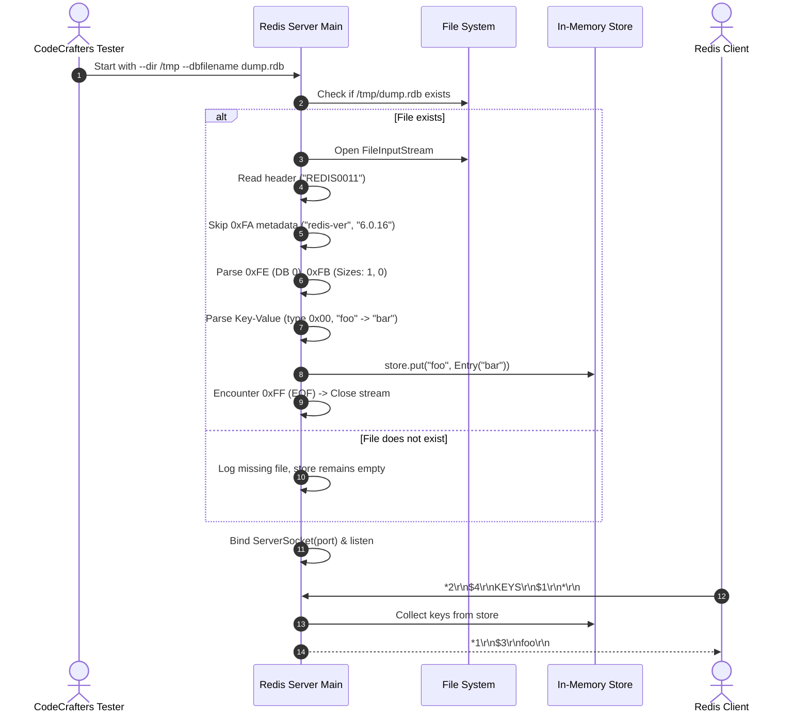

# Stage 69: Read a key

---

## In one line
Parse persistent on-disk RDB snapshot files at server boot—handling the 9-byte header, variable metadata subsections (`0xFA`), database selectors (`0xFE`), hash table resize hints (`0xFB`), and length-prefixed key-value pairs—populating the in-memory database store so the `KEYS "*"` command can inspect and return all stored keys.

---

## Self-test (cover the answers below and answer these first)
1. **What is the structure and purpose of the 9-byte RDB header section?**
   - *Answer*: The header is exactly 9 ASCII bytes: 5 bytes for the magic string `REDIS` followed by a 4-digit ASCII version string (e.g., `0011` for version 11). It serves as a magic signature and protocol version check before processing any binary data.
2. **How does RDB "length encoding" use the first 2 bits of a byte to distinguish different integer size formats?**
   - *Answer*: The two most significant bits (`(b & 0xC0) >> 6`) indicate the encoding type:
     - `0b00` (`0`): The length is the remaining 6 bits (`b & 0x3F`) (values 0–63).
     - `0b01` (`1`): The length is 14 bits, formed by combining the remaining 6 bits of the first byte with the entire next byte in big-endian (`((b & 0x3F) << 8) | nextByte`) (values 64–16383).
     - `0b10` (`2`): The remaining 6 bits are discarded, and the length is stored in the next 4 bytes in big-endian (values up to $2^{32}-1$).
     - `0b11` (`3`): The remaining 6 bits specify a special format (such as an integer encoded as a string: `0xC0` for 8-bit int, `0xC1` for 16-bit int, `0xC2` for 32-bit int).
3. **What are the RDB opcodes encountered before the actual key-value data in a database subsection?**
   - *Answer*:
     - `0xFA`: Auxiliary metadata attribute (followed by a length-encoded string key and a length-encoded string value, such as `redis-ver 6.0.16`).
     - `0xFE`: Database selector (followed by a length-encoded database index, typically `0x00`).
     - `0xFB`: Hash table resize information (followed by two length-encoded integers: total key-value pairs count, and count of keys with expiry).
4. **Why must string reading in an RDB parser handle both raw byte arrays and integer encodings (`0xC0`, `0xC1`, `0xC2`)?**
   - *Answer*: Redis optimizes memory and disk storage by packing numeric strings (like `"123"` or `"1234567"`) as 8-bit, 16-bit, or 32-bit little-endian integers when length encoding starts with `0b11`. A compliant string decoder must recognize these sub-opcodes and convert them back into string format (`"123"`).
5. **How should a Redis server behave if the RDB file specified by `--dir` and `--dbfilename` does not exist on disk?**
   - *Answer*: If the specified file does not exist, the server must not crash or fail startup; it simply starts with an empty in-memory store (`store.isEmpty() == true`). Subsequent `KEYS "*"` commands return an empty RESP array `*0\r\n`.
6. **What is the RESP wire format returned by `KEYS "*"` when keys exist in the store?**
   - *Answer*: An array containing bulk strings for each key: `*<count>\r\n$<len>\r\n<key1>\r\n...`. For example, for key `"foo"`, the response is `*1\r\n$3\r\nfoo\r\n`.

---

## Problem Solved

In previous stages, our Redis server stored data purely in volatile memory. If restarted, all keys, streams, and configurations were lost. In a real-world database, persistence is achieved via snapshotting (RDB: Redis Database) or append-only logs (AOF).

In **Stage 69: Read a key**, we implement the first step of point-in-time snapshot recovery:
1. Parse startup CLI flags: `--dir <directory>` and `--dbfilename <filename>`.
2. Inspect the file system for `<dir>/<filename>`. If absent, gracefully boot with an empty dataset.
3. If present, sequentially decode the binary RDB stream:
   - Verify header `REDIS0011`.
   - Skip auxiliary metadata pairs (`0xFA`).
   - Read the database index (`0xFE`) and hash table size hints (`0xFB`).
   - Decode key-value pairs (`0x00` value type, length-encoded strings).
   - Stop at the `0xFF` EOF marker.
4. Populate `store` before opening the TCP server socket to incoming clients.
5. Implement the `KEYS "*"` command to query and inspect all loaded keys.

---

## Thought Process & Architectural Model

### 1. The RDB Binary Stream Layout

An RDB file is a compact, binary-packed representation of memory data structures:

```text
+-----------------------+-----------------------------+-----------------------+---------+
|     Header (9B)       |    Metadata (0xFA ...)      |   Database (0xFE ...) | EOF 0xFF|
| "REDIS" + Version(4B) | Opcode + Key(Str) + Val(Str)| DB Index + Key-Values | + CRC64 |
+-----------------------+-----------------------------+-----------------------+---------+
```

Each section is demarcated by a single 1-byte opcode:
- `0xFA`: Auxiliary metadata attribute. Followed by attribute name string, then attribute value string.
- `0xFE`: `SELECTDB`. Followed by length-encoded DB index.
- `0xFB`: `RESIZEDB`. Followed by 2 length-encoded integers (hash table size, expiry table size).
- `0xFC`: Expiry timestamp in milliseconds (8-byte unsigned integer, little-endian).
- `0xFD`: Expiry timestamp in seconds (4-byte unsigned integer, little-endian).
- `0x00`: String value type flag. Followed by key string, then value string.
- `0xFF`: End of file marker. Followed by 8-byte CRC64 checksum.

### 2. Length and String Encoding Finite State Machine

RDB string decoding depends on length encoding bits:

```mermaid
flowchart TD
    Start[Read 1st Byte 'b'] --> MaskBits["Examine high bits: (b & 0xC0) >> 6"]
    MaskBits -->|0b00 (0)| Len6["Length = b & 0x3F (6 bits)<br/>Read len bytes"]
    MaskBits -->|0b01 (1)| Len14["Read 2nd byte b2<br/>Length = ((b & 0x3F) << 8) | b2 (14 bits)<br/>Read len bytes"]
    MaskBits -->|0b10 (2)| Len32["Read next 4 bytes (big-endian int32)<br/>Length = 32-bit int<br/>Read len bytes"]
    MaskBits -->|0b11 (3)| Special["Integer Encoding: sub = b & 0x3F"]
    Special -->|sub == 0 (0xC0)| Int8["Read 1 byte signed int8<br/>Return String.valueOf(val)"]
    Special -->|sub == 1 (0xC1)| Int16["Read 2 bytes little-endian int16<br/>Return String.valueOf(val)"]
    Special -->|sub == 2 (0xC2)| Int32["Read 4 bytes little-endian int32<br/>Return String.valueOf(val)"]
```

### 3. Startup and Command Flow Architecture



---

## Full Solution

### 1. RDB Parsing Helpers (`readSizeEncoded` & `readRdbString`)

```java
  private static long readSizeEncoded(InputStream in) throws IOException {
    int b = in.read();
    if (b == -1) throw new IOException("Unexpected EOF in size encoding");
    int type = (b & 0xC0) >> 6;
    if (type == 0) return b & 0x3F;
    if (type == 1) {
      int b2 = in.read();
      if (b2 == -1) throw new IOException("Unexpected EOF in size encoding");
      return ((b & 0x3F) << 8) | (b2 & 0xFF);
    }
    if (type == 2) {
      long val = 0;
      for (int i = 0; i < 4; i++) {
        int byteVal = in.read();
        if (byteVal == -1) throw new IOException("Unexpected EOF in size encoding");
        val = (val << 8) | (byteVal & 0xFF);
      }
      return val;
    }
    // type == 3: special integer encoding
    int sub = b & 0x3F;
    if (sub == 0) return in.read() & 0xFF;
    if (sub == 1) {
      int lo = in.read() & 0xFF;
      int hi = in.read() & 0xFF;
      return lo | (hi << 8);
    }
    if (sub == 2) {
      long v = 0;
      for (int i = 0; i < 4; i++) v |= (((long) (in.read() & 0xFF)) << (i * 8));
      return v;
    }
    throw new IOException("Unsupported RDB special encoding: " + sub);
  }

  private static String readRdbString(InputStream in) throws IOException {
    int b = in.read();
    if (b == -1) throw new IOException("Unexpected EOF in string read");
    int type = (b & 0xC0) >> 6;
    if (type == 3) {
      int sub = b & 0x3F;
      long val;
      if (sub == 0) {
        int v = in.read();
        if (v == -1) throw new IOException("Unexpected EOF in string int8");
        val = (byte) v;
      } else if (sub == 1) {
        int b1 = in.read();
        int b2 = in.read();
        if (b1 == -1 || b2 == -1) throw new IOException("Unexpected EOF in string int16");
        val = (short) ((b1 & 0xFF) | ((b2 & 0xFF) << 8));
      } else if (sub == 2) {
        long v = 0;
        for (int i = 0; i < 4; i++) {
          int byteVal = in.read();
          if (byteVal == -1) throw new IOException("Unexpected EOF in string int32");
          v |= (((long) (byteVal & 0xFF)) << (i * 8));
        }
        val = (int) v;
      } else {
        throw new IOException("Unsupported RDB integer encoding: " + sub);
      }
      return String.valueOf(val);
    }
    int len;
    if (type == 0) {
      len = b & 0x3F;
    } else if (type == 1) {
      int b2 = in.read();
      if (b2 == -1) throw new IOException("Unexpected EOF in string len14");
      len = ((b & 0x3F) << 8) | (b2 & 0xFF);
    } else {
      len = 0;
      for (int i = 0; i < 4; i++) {
        int byteVal = in.read();
        if (byteVal == -1) throw new IOException("Unexpected EOF in string len32");
        len = (len << 8) | (byteVal & 0xFF);
      }
    }
    byte[] bytes = in.readNBytes(len);
    return new String(bytes, StandardCharsets.UTF_8);
  }
```

### 2. Loading the RDB File at Boot

```java
  private static void loadRdb() {
    if (rdbDbFilename == null || rdbDbFilename.isEmpty()) return;
    java.io.File rdbFile = (rdbDir != null && !rdbDir.isEmpty())
        ? new java.io.File(rdbDir, rdbDbFilename)
        : new java.io.File(rdbDbFilename);
    if (!rdbFile.exists() || !rdbFile.isFile()) {
      System.out.println("RDB file not found: " + rdbFile.getAbsolutePath());
      return;
    }
    try (InputStream in = new java.io.FileInputStream(rdbFile)) {
      // Skip 9-byte header: "REDIS" + 4-char version (e.g. "0011")
      byte[] header = in.readNBytes(9);
      System.out.println("RDB header: " + new String(header, StandardCharsets.UTF_8));

      while (true) {
        int opcode = in.read();
        if (opcode == -1) break;

        if (opcode == 0xFA) {
          // Auxiliary field: key + value strings — skip both
          readRdbString(in);
          readRdbString(in);
        } else if (opcode == 0xFE) {
          // SELECTDB: size-encoded DB index — skip
          readSizeEncoded(in);
        } else if (opcode == 0xFB) {
          // RESIZEDB: two size-encoded ints (hashtable sizes) — skip
          readSizeEncoded(in);
          readSizeEncoded(in);
        } else if (opcode == 0xFF) {
          // EOF marker — done (followed by 8-byte CRC64, but we stop here)
          break;
        } else if (opcode == 0xFC) {
          // Expiry in milliseconds (8-byte little-endian)
          long expiresAt = 0;
          for (int i = 0; i < 8; i++) {
            int byteVal = in.read();
            if (byteVal == -1) throw new IOException("Unexpected EOF in 0xFC expiry");
            expiresAt |= ((long) (byteVal & 0xFF)) << (i * 8);
          }
          int valueType = in.read();
          String key = readRdbString(in);
          String value = readRdbString(in);
          if (expiresAt <= System.currentTimeMillis()) {
            // Already expired — don't load
          } else {
            store.put(key, new Entry(value, expiresAt));
          }
        } else if (opcode == 0xFD) {
          // Expiry in seconds (4-byte little-endian)
          long expirySec = 0;
          for (int i = 0; i < 4; i++) {
            int byteVal = in.read();
            if (byteVal == -1) throw new IOException("Unexpected EOF in 0xFD expiry");
            expirySec |= ((long) (byteVal & 0xFF)) << (i * 8);
          }
          long expiresAt = expirySec * 1000L;
          int valueType = in.read();
          String key = readRdbString(in);
          String value = readRdbString(in);
          if (expiresAt <= System.currentTimeMillis()) {
            // Already expired — don't load
          } else {
            store.put(key, new Entry(value, expiresAt));
          }
        } else {
          // The opcode byte IS the value type (e.g., 0x00 = string)
          int valueType = opcode;
          String key = readRdbString(in);
          String value = readRdbString(in);
          store.put(key, new Entry(value, null));
        }
      }
      System.out.println("RDB loaded: " + store.size() + " keys");
    } catch (IOException e) {
      System.err.println("Failed to load RDB file: " + e.getMessage());
    }
  }
```

### 3. Handling the `KEYS "*"` Command

```java
    } else if (command.equalsIgnoreCase("KEYS")) {
      String pattern = parts.length > 1 ? parts[1] : "*";
      List<String> keys = new ArrayList<>();
      for (Map.Entry<String, Entry> e : store.entrySet()) {
        if (!e.getValue().isExpired()) {
          if (matchesPattern(pattern, e.getKey())) {
            keys.add(e.getKey());
          }
        }
      }
      StringBuilder sb = new StringBuilder();
      sb.append("*").append(keys.size()).append("\r\n");
      for (String k : keys) {
        byte[] kb = k.getBytes(StandardCharsets.UTF_8);
        sb.append("$").append(kb.length).append("\r\n").append(k).append("\r\n");
      }
      out.write(sb.toString().getBytes(StandardCharsets.UTF_8));
      out.flush();
    }
```

---

## Concepts (the transferable part)

- **Self-Describing Binary Serialization**: RDB format is a compact binary serialization format where opcodes (`0xFA`, `0xFE`, `0xFB`, `0xFF`) act as stream tags. The parser reads tags sequentially without needing external schemas or IDLs (like Protobuf).
- **Variable-Length Bit-Packed Encodings**: Redis uses bit prefixing in length encodings (the top 2 bits specify 1 byte, 2 bytes, 5 bytes, or integer escape). This achieves maximum space efficiency: small lengths take only 1 byte while large data structures can scale to gigabytes.
- **Endianness Duality**: Network protocols and standard serialization formats are almost universally big-endian. However, RDB uses big-endian for length prefixes (`0b01` and `0b10`), but little-endian for raw integer encodings (`0xC1`, `0xC2`) and expiry timestamps (`0xFD`, `0xFC`) to match x86 architecture memory layouts.
- **Fail-Open Non-Existent Persistence**: In database systems, missing snapshot files represent a fresh/uninitialized node rather than a fatal fault. Booting with an empty store ensures automatic node bootstrap without requiring manual file initialization.

---

## Wire Format / Binary Protocol

### 1. RDB Binary Stream Layout Table

| Byte(s) | Representation | Section | Description |
|---|---|---|---|
| `52 45 44 49 53` | `"REDIS"` | Header | Magic signature string (5 bytes ASCII) |
| `30 30 31 31` | `"0011"` | Header | RDB format version number (4 bytes ASCII) |
| `FA` | Opcode | Metadata | Start of metadata subsection |
| `09 72 65 64 ...` | String | Metadata | Metadata key (`redis-ver`) |
| `06 36 2E 30 ...` | String | Metadata | Metadata value (`6.0.16`) |
| `FE` | Opcode | Database | SELECTDB marker |
| `00` | Size | Database | Database index (0) |
| `FB` | Opcode | Database | RESIZEDB hash table size information |
| `01` | Size | Database | Total key-value pairs count in hash table |
| `00` | Size | Database | Total keys with expiry count |
| `00` | Flag | Key-Value | Value type flag (`0x00` = String) |
| `03 66 6F 6F` | String | Key-Value | Key name: length 3, ASCII `"foo"` |
| `03 62 61 72` | String | Key-Value | Value: length 3, ASCII `"bar"` |
| `FF` | Opcode | End of File | EOF marker |
| `8B ... (8B)` | Checksum | End of File | 8-byte CRC64 checksum of file |

### 2. Length Encoding Truth Table

| High 2 Bits (`b & 0xC0`) | Binary Pattern | Additional Bytes Read | Decoded Length Calculation | Length Range |
|---|---|---|---|---|
| `0b00` | `00xxxxxx` | 0 | `b & 0x3F` | 0 to 63 |
| `0b01` | `01xxxxxx` | 1 (`b2`) | `((b & 0x3F) << 8) \| b2` (Big-Endian) | 64 to 16,383 |
| `0b10` | `10000000` | 4 (`b1..b4`) | `(b1 << 24) \| (b2 << 16) \| (b3 << 8) \| b4` | 0 to $2^{32}-1$ |
| `0b11` | `11xxxxxx` | Varies | Special integer encoding (`0xC0`, `0xC1`, `0xC2`) | Numeric string |

---

## What Breaks It (Failure Modes & Edge Cases)

1. **Sign-Extension in Byte Shifts**: In Java, byte operations promote to signed 32-bit `int`. If `in.read()` is cast or shifted directly without masking (`& 0xFF`), bytes greater than `0x7F` (such as `0x80` or `0xFF`) sign-extend to negative numbers, corrupting lengths and little-endian integer values.
2. **Missing or Relative RDB Paths**: If the user passes `--dir ""` or a relative path, constructing `new File(dir, filename)` could point to an unexpected location. Resolving paths cleanly prevents unexpected `FileNotFoundException`.
3. **Partial RDB Files / Truncated Streams**: An incomplete RDB file (e.g., interrupted write during crash) could hit EOF before opcode `0xFF`. The parser checks for `-1` from `in.read()` and raises an `IOException` without hanging or crashing the server process.
4. **Non-String Value Types in RDB**: Value types other than `0x00` (e.g., lists `0x01`, sets `0x02`, hashes `0x04`) require distinct deserialization logic. In this stage, keys tested are strings; future stages handle complex data structures.

---

## Tradeoffs

- **Pre-Loading at Boot vs. Lazy Loading**:
  - *Pre-loading (our choice)*: Parse the entire RDB snapshot synchronously before calling `serverSocket.accept()`. The server starts accepting connections only when the dataset is fully initialized and consistent.
  - *Lazy loading*: Serve read/write commands concurrently while background threads stream keys from disk. Provides faster boot times for terabyte datasets, but introduces massive locking and consistency complexities.
- **In-Memory Copy vs. Direct Memory-Mapped File (mmap)**:
  - *In-memory store (`ConcurrentHashMap<String, Entry>`)*: Simple, fast reads and mutations, portable across OS platforms.
  - *Memory-mapped RDB file*: Zero-copy reads directly from page cache, but prevents dynamic in-place mutations without copy-on-write semantics.

---

## Java Specifics — Lookup, Don't Memorize

- `InputStream.readNBytes(int len)`: Reads exactly `len` bytes from the input stream into a newly allocated `byte[]`. Blocks until all bytes are read or EOF is reached (Java 9+).
- `java.io.File(String parent, String child)`: Constructs a path safely handling OS-specific path separators (Windows `\` vs Linux `/`).
- `File.isFile() && File.exists()`: Verifies that the path points to an existing regular file rather than a directory or dangling symlink.
- `(b & 0xFF)`: Idiomatic Java pattern to convert a signed byte/int into an unsigned integer range ($0..255$).

---

## Rebuild Checklist

- [ ] Parse `--dir` and `--dbfilename` from CLI arguments and support `CONFIG GET dir` and `CONFIG GET dbfilename`.
- [ ] Implement `readSizeEncoded(InputStream in)` supporting `0b00`, `0b01`, and `0b10` bit encodings.
- [ ] Implement `readRdbString(InputStream in)` supporting raw length-prefixed strings and `0xC0`, `0xC1`, `0xC2` integer encodings.
- [ ] Implement `loadRdb()`: check file existence, verify header, skip `0xFA` metadata, skip `0xFE`/`0xFB` database descriptors, parse `0x00` string keys, and stop at `0xFF`.
- [ ] Store parsed keys into `store` prior to accepting incoming TCP client connections.
- [ ] Implement `KEYS "*"` command to iterate over `store` and return a RESP array of keys.
