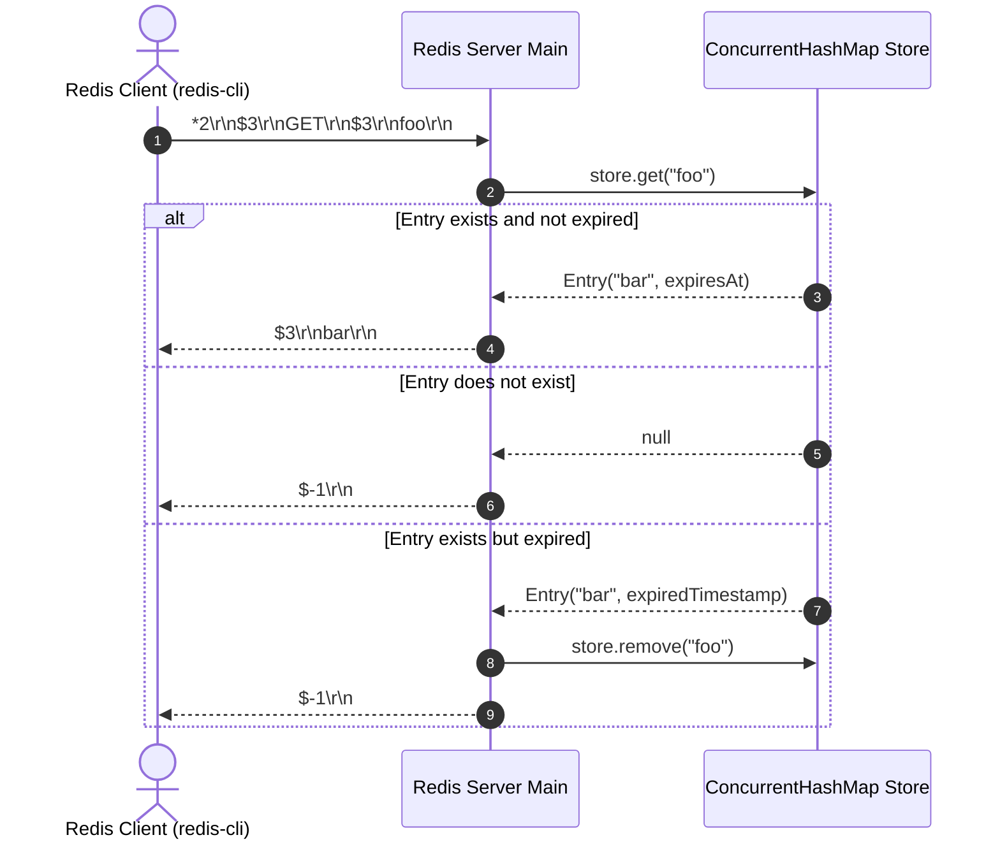

# Stage 70: Read a string value

---

## In one line
Deserialize string values associated with keys from the on-disk binary RDB file into the server's key-value store at startup, and serve them to clients via the RESP Bulk String wire format in response to `GET <key>`.

---

## Self-test (cover the answers below and answer these first)
1. **In the RDB file format, what byte identifies a string-encoded value type in a key-value entry?**
   - *Answer*: A value type byte of `0x00`. When no expiry opcode (`0xFC` or `0xFD`) precedes the entry, this byte directly follows the hash table resize opcode (`0xFB`) or the preceding key-value entry.
2. **What is the exact sequence of bytes for an unexpired string key-value pair in an RDB database subsection?**
   - *Answer*: `[1-byte Value Type: 0x00] [Length-Encoded Key String] [Length-Encoded Value String]`. If an expiry is present, it is preceded by `[0xFC or 0xFD] [Expiry Timestamp]`.
3. **What are the three ways strings can be encoded in an RDB snapshot? Which one is required for this stage?**
   - *Answer*:
     1. Length-prefixed raw strings (required for this stage).
     2. Integers as strings (`0xC0`, `0xC1`, `0xC2`).
     3. LZF-compressed strings.
4. **How does the server differentiate between a non-existent key and an existing key with a string value when responding to `GET`?**
   - *Answer*: If the key is present and not expired, the server returns a RESP Bulk String `$<len>\r\n<value>\r\n` (e.g. `$3\r\nbar\r\n`). If the key does not exist in the store (or has expired), the server returns a RESP Null Bulk String `$-1\r\n`.
5. **What should happen if an entry read from the RDB file is already expired according to its timestamp?**
   - *Answer*: If an entry's expiry timestamp (`expiresAt <= System.currentTimeMillis()`), the server should discard it immediately and not load it into the in-memory store, saving memory and avoiding stale lookups.
6. **What is the difference in endianness between length prefixes and integer values in an RDB file?**
   - *Answer*: Length prefixes for multi-byte lengths (`0b01` 14-bit and `0b10` 32-bit) are encoded in **big-endian** (network byte order), whereas integer values (`0xC1` 16-bit, `0xC2` 32-bit) and timestamps (`0xFC` 64-bit, `0xFD` 32-bit) are encoded in **little-endian** (x86 host byte order).

---

## Problem Solved

In Stage 69, we parsed the RDB file header, auxiliary metadata (`0xFA`), database selectors (`0xFE`), and extracted keys to answer `KEYS "*"`. However, the values associated with those keys were either discarded or not queried individually.

In **Stage 70: Read a string value**, we complete the read path for string data:
1. When booting, the server reads the specified RDB file (`--dir <dir> --dbfilename <filename>`).
2. For each key-value pair, it decodes the value type (`0x00` for strings), decodes the length-prefixed key string, and decodes the length-prefixed value string.
3. It inserts the key-value pair into the memory store (`ConcurrentHashMap<String, Entry>`).
4. When a client issues `GET <key>`, the server searches the store:
   - If found and not expired: emits bulk string `$<length>\r\n<value>\r\n`.
   - If missing: emits null bulk string `$-1\r\n`.
   - If present but expired: lazily purges the key and emits `$-1\r\n`.

---

## Thought Process & Architectural Model

### 1. Key-Value Deserialization in RDB

An RDB database block consists of an optional DB selector (`0xFE`), optional hash table size hints (`0xFB`), and a sequence of key-value pairs ending at opcode `0xFF` (EOF):

```text
+------+---------+------+-------------+------+------------+--------------+-----+
| 0xFE | DB Num  | 0xFB | Sizes (2x)  | 0x00 | Key String | Value String | ... |
+------+---------+------+-------------+------+------------+--------------+-----+
                                      ^
                                      Value Type Flag (0x00 = String)
```

If an entry has an expiry, it begins with an expiry opcode before the value type:

```text
+------+--------------------+------+------------+--------------+
| 0xFC | 8-byte ms (int64)  | 0x00 | Key String | Value String |
+------+--------------------+------+------------+--------------+
  - OR -
+------+--------------------+------+------------+--------------+
| 0xFD | 4-byte sec (int32) | 0x00 | Key String | Value String |
+------+--------------------+------+------------+--------------+
```

### 2. State Machine for RDB Entry Parsing

```mermaid
flowchart TD
    ReadOpcode[Read Next Opcode Byte] --> CheckOpcode{Opcode Byte}
    CheckOpcode -->|0xFA| SkipAux[Skip Metadata Key + Value Strings] --> ReadOpcode
    CheckOpcode -->|0xFE| SkipDB[Skip DB Number] --> ReadOpcode
    CheckOpcode -->|0xFB| SkipResize[Skip Total & Expiry Hash Sizes] --> ReadOpcode
    CheckOpcode -->|0xFF| StopEOF[Stop Parsing: EOF Marker]
    CheckOpcode -->|0xFC| ReadMsExpiry[Read 8-byte LE Millis Expiry] --> ReadValType1[Read Value Type Byte]
    CheckOpcode -->|0xFD| ReadSecExpiry[Read 4-byte LE Seconds Expiry] --> ReadValType2[Read Value Type Byte]
    CheckOpcode -->|Other (0x00)| RawType[Opcode IS Value Type: No Expiry]

    ReadValType1 --> ReadKV[Read Key String & Value String]
    ReadValType2 --> ReadKV
    RawType --> ReadKV

    ReadKV --> ExpiredCheck{Is Expired?}
    ExpiredCheck -->|Yes| Discard[Discard Key-Value] --> ReadOpcode
    ExpiredCheck -->|No| StorePut[store.put key, new Entry value, expiry] --> ReadOpcode
```

### 3. Client `GET` Request-Response Lifecycle



---

## Full Solution

### 1. RDB String Deserialization

```java
  private static long readSizeEncoded(InputStream in) throws IOException {
    int b = in.read();
    if (b == -1) throw new IOException("Unexpected EOF in size encoding");
    int type = (b & 0xC0) >> 6;
    if (type == 0) return b & 0x3F;
    if (type == 1) {
      int b2 = in.read();
      if (b2 == -1) throw new IOException("Unexpected EOF in size encoding");
      return ((b & 0x3F) << 8) | (b2 & 0xFF);
    }
    if (type == 2) {
      long val = 0;
      for (int i = 0; i < 4; i++) {
        int byteVal = in.read();
        if (byteVal == -1) throw new IOException("Unexpected EOF in size encoding");
        val = (val << 8) | (byteVal & 0xFF);
      }
      return val;
    }
    // type == 3: special integer encoding
    int sub = b & 0x3F;
    if (sub == 0) return in.read() & 0xFF;
    if (sub == 1) {
      int lo = in.read() & 0xFF;
      int hi = in.read() & 0xFF;
      return lo | (hi << 8);
    }
    if (sub == 2) {
      long v = 0;
      for (int i = 0; i < 4; i++) v |= (((long) (in.read() & 0xFF)) << (i * 8));
      return v;
    }
    throw new IOException("Unsupported RDB special encoding: " + sub);
  }

  private static String readRdbString(InputStream in) throws IOException {
    int b = in.read();
    if (b == -1) throw new IOException("Unexpected EOF in string read");
    int type = (b & 0xC0) >> 6;
    if (type == 3) {
      int sub = b & 0x3F;
      long val;
      if (sub == 0) {
        int v = in.read();
        if (v == -1) throw new IOException("Unexpected EOF in string int8");
        val = (byte) v;
      } else if (sub == 1) {
        int b1 = in.read();
        int b2 = in.read();
        if (b1 == -1 || b2 == -1) throw new IOException("Unexpected EOF in string int16");
        val = (short) ((b1 & 0xFF) | ((b2 & 0xFF) << 8));
      } else if (sub == 2) {
        long v = 0;
        for (int i = 0; i < 4; i++) {
          int byteVal = in.read();
          if (byteVal == -1) throw new IOException("Unexpected EOF in string int32");
          v |= (((long) (byteVal & 0xFF)) << (i * 8));
        }
        val = (int) v;
      } else {
        throw new IOException("Unsupported RDB integer encoding: " + sub);
      }
      return String.valueOf(val);
    }
    int len;
    if (type == 0) {
      len = b & 0x3F;
    } else if (type == 1) {
      int b2 = in.read();
      if (b2 == -1) throw new IOException("Unexpected EOF in string len14");
      len = ((b & 0x3F) << 8) | (b2 & 0xFF);
    } else {
      len = 0;
      for (int i = 0; i < 4; i++) {
        int byteVal = in.read();
        if (byteVal == -1) throw new IOException("Unexpected EOF in string len32");
        len = (len << 8) | (byteVal & 0xFF);
      }
    }
    byte[] bytes = in.readNBytes(len);
    if (bytes.length < len) {
      throw new IOException("Unexpected EOF reading string of length " + len);
    }
    return new String(bytes, StandardCharsets.UTF_8);
  }
```

### 2. Loading Keys and Values into `store` at Boot

```java
  private static void loadRdb() {
    if (rdbDbFilename == null || rdbDbFilename.isEmpty()) return;
    java.io.File rdbFile = (rdbDir != null && !rdbDir.isEmpty())
        ? new java.io.File(rdbDir, rdbDbFilename)
        : new java.io.File(rdbDbFilename);
    if (!rdbFile.exists() || !rdbFile.isFile()) {
      System.out.println("RDB file not found: " + rdbFile.getAbsolutePath());
      return;
    }
    try (InputStream in = new java.io.FileInputStream(rdbFile)) {
      // Skip 9-byte header: "REDIS" + 4-char version (e.g. "0011")
      byte[] header = in.readNBytes(9);
      System.out.println("RDB header: " + new String(header, StandardCharsets.UTF_8));

      while (true) {
        int opcode = in.read();
        if (opcode == -1) break;

        if (opcode == 0xFA) {
          // Auxiliary field: key + value strings — skip both
          readRdbString(in);
          readRdbString(in);
        } else if (opcode == 0xFE) {
          // SELECTDB: size-encoded DB index — skip
          readSizeEncoded(in);
        } else if (opcode == 0xFB) {
          // RESIZEDB: two size-encoded ints (hashtable sizes) — skip
          readSizeEncoded(in);
          readSizeEncoded(in);
        } else if (opcode == 0xFF) {
          // EOF marker — done (followed by 8-byte CRC64, but we stop here)
          break;
        } else if (opcode == 0xFC) {
          // Expiry in milliseconds (8-byte little-endian)
          long expiresAt = 0;
          for (int i = 0; i < 8; i++) {
            int byteVal = in.read();
            if (byteVal == -1) throw new IOException("Unexpected EOF in 0xFC expiry");
            expiresAt |= ((long) (byteVal & 0xFF)) << (i * 8);
          }
          int valueType = in.read();
          String key = readRdbString(in);
          String value = readRdbString(in);
          if (expiresAt <= System.currentTimeMillis()) {
            // Already expired — don't load
          } else {
            store.put(key, new Entry(value, expiresAt));
          }
        } else if (opcode == 0xFD) {
          // Expiry in seconds (4-byte little-endian)
          long expirySec = 0;
          for (int i = 0; i < 4; i++) {
            int byteVal = in.read();
            if (byteVal == -1) throw new IOException("Unexpected EOF in 0xFD expiry");
            expirySec |= ((long) (byteVal & 0xFF)) << (i * 8);
          }
          long expiresAt = expirySec * 1000L;
          int valueType = in.read();
          String key = readRdbString(in);
          String value = readRdbString(in);
          if (expiresAt <= System.currentTimeMillis()) {
            // Already expired — don't load
          } else {
            store.put(key, new Entry(value, expiresAt));
          }
        } else {
          // The opcode byte IS the value type (e.g., 0x00 = string)
          int valueType = opcode;
          String key = readRdbString(in);
          String value = readRdbString(in);
          store.put(key, new Entry(value, null));
        }
      }
      System.out.println("RDB loaded: " + store.size() + " keys");
    } catch (IOException e) {
      System.err.println("Failed to load RDB file: " + e.getMessage());
    }
  }
```

### 3. Serving `GET <key>` via RESP Protocol

```java
    } else if (command.equalsIgnoreCase("GET")) {
      String key = parts[1];
      Entry entry = store.get(key);

      if (entry != null && !entry.isExpired()) {
        byte[] bytes = entry.value.getBytes(StandardCharsets.UTF_8);
        String response = "$" + bytes.length + "\r\n" + entry.value + "\r\n";
        out.write(response.getBytes(StandardCharsets.UTF_8));
      } else {
        if (entry != null && entry.isExpired()) {
          store.remove(key);
        }
        out.write("$-1\r\n".getBytes(StandardCharsets.UTF_8));
      }
      out.flush();
    }
```

---

## Concepts (the transferable part)

- **Point-in-Time State Recovery**: Bootstrapping an in-memory database requires hydrating internal state structures prior to exposing network endpoints. Synchronous pre-loading guarantees that any query arriving after the TCP port opens observes the snapshot state.
- **Bi-Level Type Encoding**: RDB serialization couples a structural type flag (`0x00` = raw string, `0x01` = list, etc.) with a format-level encoding (raw bytes vs compressed vs integer packing). This decouples logical type from storage optimization.
- **Bulk String vs Null Bulk String**: In RESP2, presence vs absence of a string value is communicated cleanly through length prefixes: `$<len>\r\n<data>\r\n` denotes presence, while `$-1\r\n` denotes the `nil` / `null` sentinel without needing separate status bytes or error messages.
- **Passive Key Expiry on Read**: Rather than continuously scanning every key in the database (which burns CPU), Redis pairs an active background eviction loop with passive on-access expiry: when `GET` is invoked, it checks `entry.isExpired()`, purges if expired, and returns `nil`.

---

## Wire Format / Binary Protocol

### 1. RDB String Key-Value Wire Layout

| Byte Range | Field | Binary Format | Description |
|---|---|---|---|
| 1 byte | Value Type | `0x00` | Identifies string data structure |
| Variable | Key Length | `0b00xxxxxx`, etc. | Length encoding of the key name |
| N bytes | Key Data | UTF-8 / ASCII bytes | Raw key string |
| Variable | Value Length | `0b00xxxxxx`, etc. | Length encoding of the string value |
| M bytes | Value Data | UTF-8 / ASCII bytes | Raw string value |

### 2. RESP Bulk String Wire Format

| Condition | Format | Example Wire Bytes | Human Representation |
|---|---|---|---|
| Key Found | `$<len>\r\n<val>\r\n` | `24 33 0D 0A 62 61 72 0D 0A` | `$3\r\nbar\r\n` |
| Key Missing or Expired | `$-1\r\n` | `24 2D 31 0D 0A` | `$-1\r\n` (Null Bulk String) |

---

## What Breaks It (Failure Modes & Edge Cases)

1. **Premature EOF during Value Deserialization**: If the RDB snapshot was truncated during a disk write or crash, calling `readNBytes(len)` might yield fewer bytes than specified by `len`. Checking `bytes.length < len` catches file truncation promptly and aborts gracefully rather than injecting truncated data into `store`.
2. **Expired Snapshot Entries**: Snapshot files may contain keys whose TTL expired while the server was offline. Loading expired keys without checking timestamps would serve stale data to clients on startup.
3. **Integer Encoding in Value Strings**: Even though this stage focuses on length-prefixed strings, real-world RDB files frequently serialize integer strings (like `"100"`) as 8-bit, 16-bit, or 32-bit integers (`0xC0`–`0xC2`). Our `readRdbString` decoder transparently supports both raw byte arrays and integer conversions.
4. **Flushing the Output Stream**: TCP sockets buffer written bytes until a buffer threshold or flush is encountered. Explicitly invoking `out.flush()` immediately after writing the bulk string response guarantees low latency and prevents client timeouts.

---

## Tradeoffs

- **Immediate Loading vs Lazy Key Deserialization**:
  - *Immediate Loading (chosen)*: All keys and values are parsed and placed in `ConcurrentHashMap` during server startup. Queries have $O(1)$ response time with zero disk I/O at runtime.
  - *Lazy / On-Demand Loading*: Parse an index of key offsets on boot, and seek into the RDB file on the first `GET`. Reduces startup time for multi-gigabyte files, but introduces unpredictable disk seek latency during queries.
- **Eager Expiry Filtering vs Lazy Eviction**:
  - *Eager Filtering at Boot (chosen)*: Discard keys with `expiresAt <= now` while reading the RDB file. Keeps heap memory lean and avoids loading garbage.
  - *Indiscriminate Loading*: Load every entry and let runtime `GET` check expiry. Simpler parser loop, but pollutes memory with expired keys until accessed.

---

## Java Specifics — Lookup, Don't Memorize

- `InputStream.readNBytes(int len)`: Reads up to `len` bytes from the input stream. Guarantees reading all requested bytes unless EOF is reached.
- `String.valueOf(long val)`: Efficiently converts primitive numeric types into their canonical base-10 string representation.
- `ConcurrentHashMap.get(key)`: Thread-safe, non-blocking lock-free lookup for entries in memory.
- `StandardCharsets.UTF_8`: Pre-defined `Charset` instance in `java.nio.charset` that avoids expensive string lookups for charset decoders.

---

## Rebuild Checklist

- [ ] Decode value type `0x00` in `loadRdb()` following DB descriptors or optional expiry timestamps (`0xFC`, `0xFD`).
- [ ] Use `readRdbString(in)` to deserialize both the key and the corresponding value string.
- [ ] Populate `store.put(key, new Entry(value, expiresAt))` for valid, unexpired entries.
- [ ] In `handleCommand()`, handle `GET <key>`:
  - Return `$<length>\r\n<value>\r\n` if key exists and is unexpired.
  - Return `$-1\r\n` if key does not exist or has expired.
- [ ] Ensure `out.flush()` is invoked so the client receives the bulk string immediately.
- [ ] Test with `./your_program.sh --dir <dir> --dbfilename <filename>` followed by `GET <key>`.
