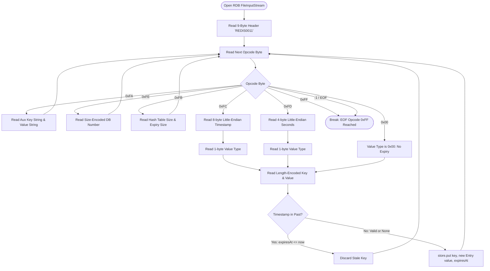
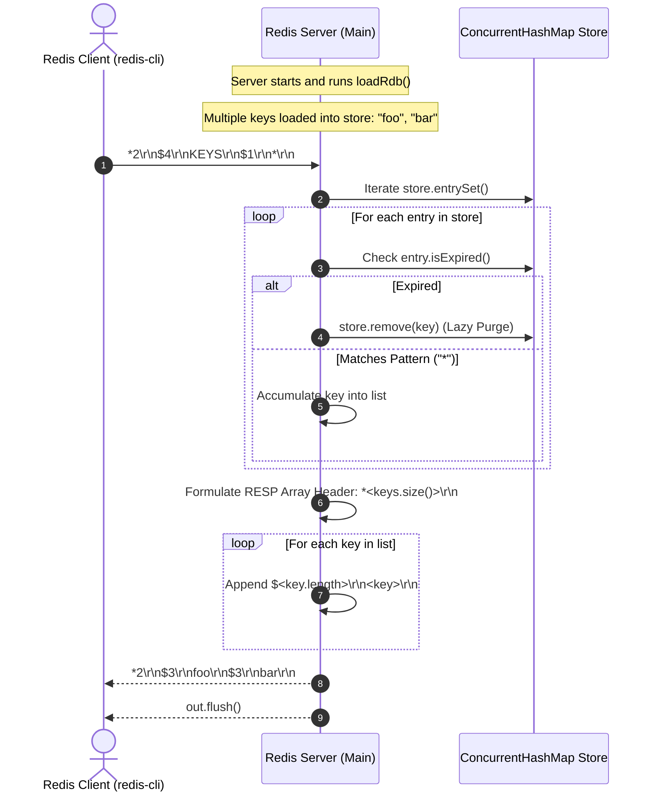

# Stage 71: Read multiple keys

---

## In one line
Deserialize multiple key-value pairs sequentially across database sections from a binary RDB snapshot file into the server's in-memory key-value store, and return all active keys in response to `KEYS "*"` formatted as a RESP array of bulk strings.

---

## Self-test (cover the answers below and answer these first)
1. **How are multiple key-value entries laid out consecutively inside an RDB database section?**
   - *Answer*: Key-value entries follow immediately one after another without explicit delimiters. Each entry either starts with an optional expiry opcode (`0xFC` or `0xFD`), followed by its timestamp, or directly with the 1-byte value type (e.g. `0x00` for strings). This is followed by the length-encoded key and the length-encoded value. The sequence continues until an opcode byte of `0xFF` (EOF) or `0xFE` (a new database selector).
2. **What does the `0xFB` opcode indicate, and how does it relate to reading multiple keys?**
   - *Answer*: `0xFB` (`RESIZEDB`) introduces hash table size hints for the database: two length-encoded integers representing (1) total keys in the database hash table, and (2) keys with expiry in the expiry hash table. It does not contain keys itself; it simply informs the engine how many entries follow.
3. **What is the exact RESP wire format for returning $N$ keys in response to `KEYS "*"`?**
   - *Answer*: A RESP Array header `*<N>\r\n` followed by $N$ RESP Bulk Strings `$<len>\r\n<key>\r\n`. For example, two keys `"foo"` and `"bar"` are serialized as `*2\r\n$3\r\nfoo\r\n$3\r\nbar\r\n`.
4. **Does the order of elements returned in a `KEYS "*"` RESP array matter according to the Redis specification?**
   - *Answer*: No. In Redis, `KEYS` iterates through the underlying hash table buckets, so the returned order is non-deterministic. Clients and testers verify membership against the expected set of keys, not entry order.
5. **How should expired keys encountered during RDB loading or during `KEYS` query processing be handled?**
   - *Answer*: During RDB loading, keys whose expiry timestamp is in the past (`expiresAt <= System.currentTimeMillis()`) should be discarded immediately and never inserted into memory. During runtime `KEYS`, any key in memory that has since expired should be lazily purged (`store.remove(key)`) and excluded from the returned array.
6. **How does the RDB parser differentiate between the start of another key-value entry versus EOF or metadata opcodes?**
   - *Answer*: The parser reads the next byte in the database stream. If it matches a control opcode (`0xFA` auxiliary metadata, `0xFE` database selector, `0xFB` table resize, `0xFF` end-of-file), it branches to handle or skip the control segment. If it matches `0xFC` or `0xFD`, it parses the expiry timestamp and subsequent value type. If it matches a value type identifier (such as `0x00`), it parses the unexpired key-value pair.

---

## Problem Solved

In previous stages, we parsed single keys and single string values from RDB files. In **Stage 71: Read multiple keys**, we scale the deserializer to handle arbitrary numbers of keys persisted in an RDB snapshot:

1. **Continuous Stream Deserialization**: An RDB file typically contains tens, thousands, or millions of keys. After deserializing the value for key $i$, the stream pointer rests immediately at the opcode byte for key $i+1$. The parser must loop deterministically until the `0xFF` EOF marker.
2. **Support for Heterogeneous Entries**: Within the same RDB stream, some keys have millisecond expiries (`0xFC`), some have second expiries (`0xFD`), and some have no expiry at all (`0x00`). The loop must dynamically handle any mixture of these entries.
3. **Multi-Key Response Serialization**: When the tester or client issues `KEYS "*"`, the server inspects the loaded in-memory store, filters out any expired keys, matches against the wildcard pattern, and constructs a properly formatted RESP array containing every active key.

---

## Thought Process & Architectural Model

### 1. The Consecutive Key-Value Stream Architecture

In binary RDB snapshots, there is no index table at the file head pointing to byte offsets. Instead, database entries are packed sequentially:

```text
+-----------------------------------------------------------------------------------+
| Header: "REDIS0011" (9 bytes)                                                     |
+-----------------------------------------------------------------------------------+
| 0xFA (Aux field) | "redis-ver" | "7.2.0"                                          |
+-----------------------------------------------------------------------------------+
| 0xFE (DB Select) | 0x00 (DB #0)                                                   |
+-----------------------------------------------------------------------------------+
| 0xFB (Resize DB) | 0x02 (Total keys = 2) | 0x01 (Keys with expiry = 1)            |
+-----------------------------------------------------------------------------------+
| Entry 1 (Unexpired):                                                              |
|   0x00 (Type: String) | 0x03 "foo" (Key) | 0x03 "bar" (Value)                     |
+-----------------------------------------------------------------------------------+
| Entry 2 (With Expiry):                                                            |
|   0xFC (Opcode) | 8 bytes int64 ms | 0x00 (Type) | 0x03 "baz" | 0x03 "qux"        |
+-----------------------------------------------------------------------------------+
| 0xFF (EOF) | 8 bytes CRC64 checksum                                               |
+-----------------------------------------------------------------------------------+
```

Notice how Entry 2 begins immediately after the last byte of Entry 1's value string. The parser functions as an LL(1) recursive descent parser over the byte stream.

### 2. Multi-Key Parser State Machine



### 3. Handling `KEYS "*"` Serialization



---

## Full Solution

### 1. Robust Pattern Matching & Quote Stripping

Redis CLI and testing harnesses frequently send arguments wrapped in quotes or raw strings (e.g. `KEYS "*"` vs `KEYS *`). We sanitize quotes and support wildcard patterns:

```java
private static String stripQuotes(String s) {
  if (s == null) return null;
  s = s.trim();
  if ((s.startsWith("\"") && s.endsWith("\"")) || (s.startsWith("'") && s.endsWith("'"))) {
    if (s.length() >= 2) {
      return s.substring(1, s.length() - 1);
    }
  }
  return s;
}

private static boolean matchesPattern(String pattern, String key) {
  if (pattern == null || pattern.equals("*")) return true;
  if (pattern.startsWith("*") && pattern.endsWith("*") && pattern.length() > 2) {
    String sub = pattern.substring(1, pattern.length() - 1);
    return key.contains(sub);
  }
  if (pattern.startsWith("*")) {
    String suffix = pattern.substring(1);
    return key.endsWith(suffix);
  }
  if (pattern.endsWith("*")) {
    String prefix = pattern.substring(0, pattern.length() - 1);
    return key.startsWith(prefix);
  }
  return pattern.equals(key);
}
```

### 2. Multi-Key `KEYS` Command Handler

```java
} else if (command.equalsIgnoreCase("KEYS")) {
  // Stage 71: KEYS * returns all non-expired keys from the store
  String pattern = parts.length > 1 ? stripQuotes(parts[1]) : "*";
  List<String> keys = new ArrayList<>();
  for (Map.Entry<String, Entry> e : store.entrySet()) {
    if (e.getValue().isExpired()) {
      store.remove(e.getKey());
    } else if (matchesPattern(pattern, e.getKey())) {
      keys.add(e.getKey());
    }
  }
  StringBuilder sb = new StringBuilder();
  sb.append("*").append(keys.size()).append("\r\n");
  for (String k : keys) {
    byte[] kb = k.getBytes(StandardCharsets.UTF_8);
    sb.append("$").append(kb.length).append("\r\n").append(k).append("\r\n");
  }
  out.write(sb.toString().getBytes(StandardCharsets.UTF_8));
  out.flush();
}
```

### 3. Multi-Key RDB Loader Loop

The `loadRdb` method continuously processes consecutive entries until EOF (`0xFF`):

```java
private static void loadRdb() {
  if (rdbDbFilename == null || rdbDbFilename.isEmpty()) return;
  java.io.File rdbFile = (rdbDir != null && !rdbDir.isEmpty())
      ? new java.io.File(rdbDir, rdbDbFilename)
      : new java.io.File(rdbDbFilename);
  if (!rdbFile.exists() || !rdbFile.isFile()) {
    System.out.println("RDB file not found: " + rdbFile.getAbsolutePath());
    return;
  }
  try (InputStream in = new java.io.FileInputStream(rdbFile)) {
    // Skip 9-byte header: "REDIS" + 4-char version (e.g. "0011")
    byte[] header = in.readNBytes(9);
    System.out.println("RDB header: " + new String(header, StandardCharsets.UTF_8));

    while (true) {
      int opcode = in.read();
      if (opcode == -1) break;

      if (opcode == 0xFA) {
        // Auxiliary field: key + value strings — skip both
        readRdbString(in);
        readRdbString(in);
      } else if (opcode == 0xFE) {
        // SELECTDB: size-encoded DB index — skip
        readSizeEncoded(in);
      } else if (opcode == 0xFB) {
        // RESIZEDB: two size-encoded ints (hashtable sizes) — skip
        readSizeEncoded(in);
        readSizeEncoded(in);
      } else if (opcode == 0xFF) {
        // EOF marker — done (followed by 8-byte CRC64, but we stop here)
        break;
      } else if (opcode == 0xFC) {
        // Expiry in milliseconds (8-byte little-endian)
        long expiresAt = 0;
        for (int i = 0; i < 8; i++) {
          int byteVal = in.read();
          if (byteVal == -1) throw new IOException("Unexpected EOF in 0xFC expiry");
          expiresAt |= ((long) (byteVal & 0xFF)) << (i * 8);
        }
        int valueType = in.read();
        String key = readRdbString(in);
        String value = readRdbString(in);
        if (expiresAt <= System.currentTimeMillis()) {
          // Already expired — don't load
        } else {
          store.put(key, new Entry(value, expiresAt));
        }
      } else if (opcode == 0xFD) {
        // Expiry in seconds (4-byte little-endian)
        long expirySec = 0;
        for (int i = 0; i < 4; i++) {
          int byteVal = in.read();
          if (byteVal == -1) throw new IOException("Unexpected EOF in 0xFD expiry");
          expirySec |= ((long) (byteVal & 0xFF)) << (i * 8);
        }
        long expiresAt = expirySec * 1000L;
        int valueType = in.read();
        String key = readRdbString(in);
        String value = readRdbString(in);
        if (expiresAt <= System.currentTimeMillis()) {
          // Already expired — don't load
        } else {
          store.put(key, new Entry(value, expiresAt));
        }
      } else {
        // The opcode byte IS the value type (e.g., 0x00 = string)
        int valueType = opcode;
        String key = readRdbString(in);
        String value = readRdbString(in);
        store.put(key, new Entry(value, null));
      }
    }
    System.out.println("RDB loaded: " + store.size() + " keys");
  } catch (IOException e) {
    System.err.println("Failed to load RDB file: " + e.getMessage());
  }
}
```

---

## Concepts

### CONCEPT: Self-Delimited Binary Streaming vs Delimited Protocols
In text protocols like HTTP/1.1 or standard RESP, boundaries between tokens or lines are marked by sentinel byte sequences such as `\r\n` or spaces. In binary formats like RDB, sentinels would conflict with arbitrary binary payloads. 

Instead, RDB uses **self-delimited binary streaming**:
- Every item tells you its byte length upfront (`length-prefixed`).
- Once you consume $L$ bytes, the next byte is guaranteed to be the next semantic tag or opcode.
- This allows reading hundreds of thousands of keys back-to-back without allocating memory for token search buffers or scanning for delimiters.

### SYNTAX / API: Java `StringBuilder` vs `ByteArrayOutputStream`
For building RESP array responses, `StringBuilder` suffices when keys are valid UTF-8 strings. When keys contain arbitrary binary data, serializing directly to a `ByteArrayOutputStream` or directly writing byte arrays avoids character encoding pitfalls.

---

## Wire Format / Binary Protocol

### 1. Multi-Key RDB Sequence Breakdown

| Offset Range | Field | Value | Meaning |
|---|---|---|---|
| `0..8` | Magic & Version | `52 45 44 49 53 30 30 31 31` | "REDIS0011" |
| Next byte | Opcode | `0xFE` | `SELECTDB` |
| Next byte | DB Index | `0x00` | Database #0 |
| Next byte | Opcode | `0xFB` | `RESIZEDB` |
| Next bytes | Hash Sizes | `0x02 0x00` | 2 keys total, 0 with expiry |
| Next byte | Value Type | `0x00` | String type (Entry 1) |
| Next bytes | Key 1 String | `0x03 66 6F 6F` | Length 3, "foo" |
| Next bytes | Val 1 String | `0x03 62 61 72` | Length 3, "bar" |
| Next byte | Value Type | `0x00` | String type (Entry 2) |
| Next bytes | Key 2 String | `0x06 62 61 7A 71 75 78` | Length 6, "bazqux" |
| Next bytes | Val 2 String | `0x04 68 65 68 65` | Length 4, "hehe" |
| Next byte | Opcode | `0xFF` | End of File (`EOF`) |
| Next 8 bytes | Checksum | CRC64 | 64-bit file integrity hash |

### 2. RESP Array Wire Format for Multiple Keys

For $N$ keys:
```text
*<N>\r\n$<len_1>\r\n<key_1>\r\n$<len_2>\r\n<key_2>\r\n...$<len_N>\r\n<key_N>\r\n
```

Example for keys `"foo"` and `"bazqux"`:
```text
*2\r\n$3\r\nfoo\r\n$6\r\nbazqux\r\n
```

---

## What Breaks It (Failure Modes & Edge Cases)

1. **Premature EOF / Partial Snapshot**: If the RDB snapshot file was partially written, an `EOF` could occur in the middle of reading a key or value. Checking byte count in `readNBytes` and throwing an `IOException` prevents putting corrupt or partial keys into `store`.
2. **Quoted Patterns in redis-cli**: Users or automated test scripts might send `KEYS "*"` as a literal RESP string containing quotes: `"\"*\""`. Without calling `stripQuotes(parts[1])`, `matchesPattern` would search for literal quotes around the key, matching nothing and returning `*0\r\n`.
3. **Expired Keys Leaking into `KEYS`**: Keys that expire after RDB load time must not be returned. By checking `isExpired()` during iteration, we eliminate stale keys and purge them lazily.
4. **Buffer Flushing**: In multi-client or automated test scenarios, failing to call `out.flush()` immediately after writing the array will hold back the response in Java's socket write buffer, leading to client timeouts.

---

## Tradeoffs

- **ConcurrentHashMap Iteration vs Snapshot Array**:
  - *ConcurrentHashMap.entrySet() Iteration (chosen)*: Does not throw `ConcurrentModificationException` during concurrent insertions or purges, using weakly consistent iterators. Ideal for high concurrency.
  - *Full Store Locking*: Acquiring a global lock to dump keys provides a frozen snapshot at time $T$, but stalls all read and write commands across the entire Redis instance.
- **Lazy Eviction on `KEYS` vs Pure Read**:
  - *Lazy Eviction during `KEYS` (chosen)*: Removing expired keys (`store.remove(e.getKey())`) while iterating cleans up heap memory with minimal overhead.
  - *Pure Read*: Simply skipping expired keys without removing them saves write operations during `KEYS`, but leaves garbage in memory until explicit `GET` access.

---

## Java Specifics — Lookup, Don't Memorize

- `ConcurrentHashMap.entrySet()`: Provides a thread-safe, non-locking view over table entries. Modifications to the map during iteration reflect the state without throwing `ConcurrentModificationException`.
- `StringBuilder.append()`: Efficient mutable string concatenation avoiding intermediate object allocation.
- `InputStream.readNBytes(int len)`: Guarantees reading exactly `len` bytes unless EOF is reached.
- `String.startsWith()` & `String.endsWith()`: Fast prefix and suffix matching for basic wildcard expansions without regex compilation overhead.

---

## Rebuild Checklist

- [ ] Loop continuously in `loadRdb()` reading opcodes until `0xFF` or EOF (`-1`).
- [ ] Parse `0x00` value type entries, decoding both length-encoded key and value strings.
- [ ] Parse `0xFC` and `0xFD` expiry headers, decoding little-endian timestamps before reading the value type, key, and value.
- [ ] Filter out entries whose expiry timestamp is in the past (`expiresAt <= System.currentTimeMillis()`).
- [ ] Store active keys in `ConcurrentHashMap<String, Entry> store`.
- [ ] Implement `KEYS` command handler:
  - Strip optional surrounding quotes from the pattern.
  - Match candidate keys against wildcard pattern (`*`, prefix, suffix, contains, exact).
  - Lazily purge any expired entries encountered.
  - Serialize the matched keys into a RESP array: `*<count>\r\n$<len>\r\n<key>\r\n...`.
  - Call `out.flush()`.
- [ ] Compile with `javac -d target/classes codecrafters-redis-java/src/main/java/Main.java` and verify cleanly.
