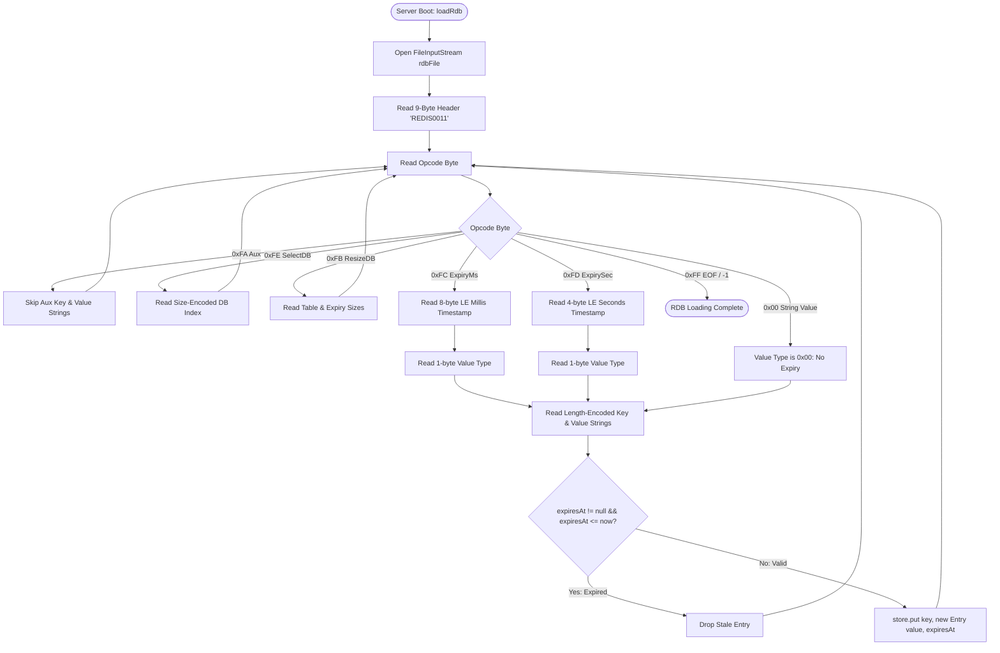
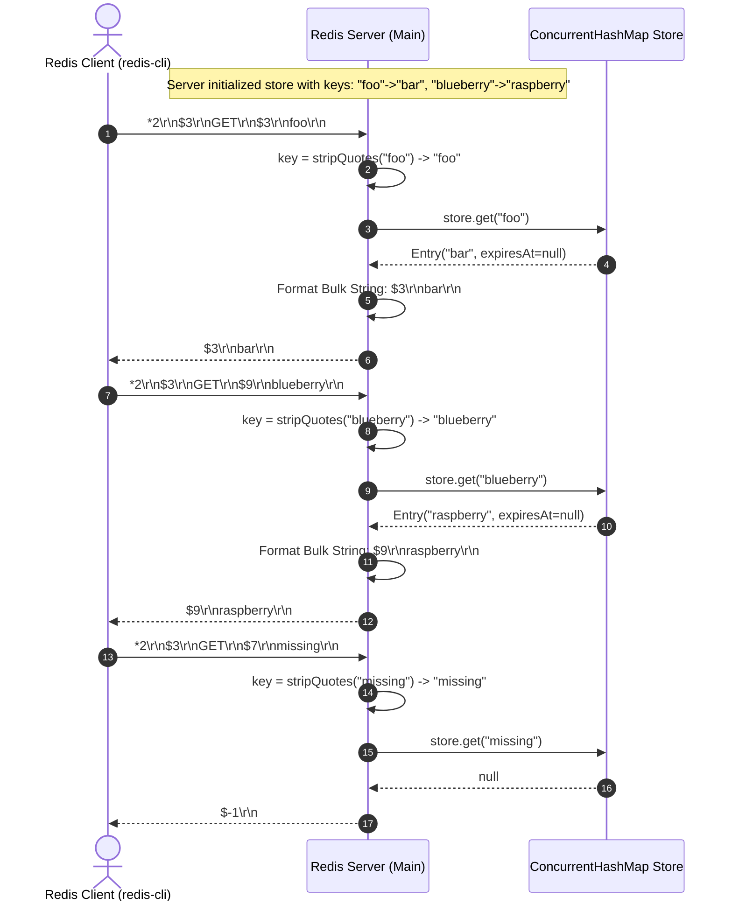

# Stage 72: Read multiple string values

---

## In one line
Deserialize multiple string key-value pairs sequentially from an RDB snapshot file into the in-memory store at server startup, and return bulk-string encoded values for individual `GET <key>` queries while handling quoted keys and expiration.

---

## Self-test (cover the answers below and answer these first)
1. **How does the server transition from loading keys into memory to serving `GET` requests?**
   - *Answer*: During startup in `main()`, before binding the server socket or accepting client connections, `loadRdb()` opens the snapshot file specified by `--dir` and `--dbfilename`, parses all key-value entries, and populates the shared `ConcurrentHashMap<String, Entry> store`. When clients subsequently connect and issue `GET <key>`, the command handler directly reads from this pre-populated in-memory map.
2. **What is the exact RESP wire format returned for `GET <key>` when the key exists and has value `"apple"`? What if the key does not exist or has expired?**
   - *Answer*: If found and unexpired, it returns a RESP Bulk String: `$5\r\napple\r\n`. If the key does not exist or is expired, it returns the RESP Null Bulk String: `$-1\r\n`.
3. **Why must the server handle `stripQuotes(key)` when processing a `GET` command?**
   - *Answer*: When users or automation scripts run commands like `redis-cli GET "foo"`, or when client harnesses pass literal quotes within arguments, the raw token may arrive with surrounding quotation marks (e.g. `"foo"` instead of `foo`). Stripping surrounding single or double quotes ensures the lookup matches the unquoted binary string stored during RDB deserialization.
4. **How are multiple unexpired string entries distinguished from entries with expiration timestamps in an RDB file?**
   - *Answer*: An entry with millisecond expiration begins with opcode `0xFC` followed by an 8-byte timestamp and the 1-byte value type (e.g. `0x00`). An entry with second expiration begins with `0xFD` followed by a 4-byte timestamp and value type. An entry without expiration begins directly with the 1-byte value type (e.g. `0x00`). The loop uses these leading opcodes to branch appropriately.
5. **If an RDB snapshot contains an entry whose expiration timestamp is in the past, when should it be discarded?**
   - *Answer*: At load time inside `loadRdb()`. If `expiresAt <= System.currentTimeMillis()`, the key is immediately dropped and never inserted into the in-memory `store`, preventing memory bloat and stale reads.
6. **What is the difference between RDB string length encoding and RDB integer encoding?**
   - *Answer*: When the top 2 bits of the leading byte are `00`, `01`, or `10`, the byte(s) encode the length $L$ of the raw UTF-8/ASCII bytes that follow. When the top 2 bits are `11` (`type == 3`), the remaining 6 bits designate an integer encoding: `0` (8-bit integer), `1` (16-bit integer, little-endian), or `2` (32-bit integer, little-endian). The value itself is that integer formatted as a decimal string.

---

## Problem Solved

In previous stages, we verified reading RDB database keys using `KEYS "*"`. In **Stage 72: Read multiple string values**, the test harness focuses on reading point values using `GET <key>`:

1. **Populating Multiple Values into In-Memory Store**: Multiple key-value pairs of string type must be deserialized sequentially from the RDB file into the server's in-memory storage dictionary before any client connections are serviced.
2. **Point Query Value Retrieval (`GET <key>`)**: When a client issues `GET <key>`, the server looks up the key in its store, checks whether the key has expired, and serializes the value as a RESP bulk string (`$<len>\r\n<val>\r\n`).
3. **Argument Sanitization (`stripQuotes`)**: Command arguments sent through various CLI invocations may contain escaped or literal quote wrappers. Sanitizing keys guarantees accurate key lookups across all client implementations.
4. **Passive Expiry Eviction**: If a key has expired between startup and query time, the `GET` handler cleans up the expired key lazily and responds with `$-1\r\n`.

---

## Thought Process & Architectural Model

### 1. RDB Multi-Key Binary Stream Layout

An RDB database file encodes keys and values in a tightly packed sequential stream without offset headers or separate index tables:

```text
+-----------------------------------------------------------------------------------+
| Magic Header: "REDIS0011" (9 bytes)                                               |
+-----------------------------------------------------------------------------------+
| 0xFA (Aux Field) | String: "redis-ver" | String: "7.2.0"                          |
+-----------------------------------------------------------------------------------+
| 0xFE (Select DB) | Length-encoded: 0x00 (DB 0)                                    |
+-----------------------------------------------------------------------------------+
| 0xFB (Resize DB) | Total Keys: 0x03 | Expiry Keys: 0x01                           |
+-----------------------------------------------------------------------------------+
| Entry 1 (Unexpired String):                                                       |
|   0x00 (Type) | 0x03 "foo" (Key) | 0x03 "bar" (Value)                             |
+-----------------------------------------------------------------------------------+
| Entry 2 (Unexpired String):                                                       |
|   0x00 (Type) | 0x09 "blueberry" (Key) | 0x09 "raspberry" (Value)                 |
+-----------------------------------------------------------------------------------+
| Entry 3 (With Millisecond Expiry):                                                |
|   0xFC (Opcode) | 8-byte LE timestamp | 0x00 (Type) | 0x05 "grape" | 0x05 "melon" |
+-----------------------------------------------------------------------------------+
| 0xFF (EOF Opcode) | 8-byte CRC64 Checksum                                         |
+-----------------------------------------------------------------------------------+
```

### 2. Multi-Key Deserialization State Machine



### 3. Client `GET` Lifecycle Sequence



---

## Full Solution

### 1. Robust `GET` Command Handling with Quote Stripping & Lazy Purging

In `handleCommand`:

```java
    } else if (command.equalsIgnoreCase("GET")) {
      if (parts.length < 2) {
        out.write("-ERR wrong number of arguments for 'get' command\r\n".getBytes(StandardCharsets.UTF_8));
        out.flush();
        return;
      }
      String rawKey = parts[1];
      String key = stripQuotes(rawKey);
      Entry entry = store.get(key);
      if (entry == null && !key.equals(rawKey)) {
        entry = store.get(rawKey);
      }

      if (entry != null && !entry.isExpired()) {
        byte[] bytes = entry.value.getBytes(StandardCharsets.UTF_8);
        String response = "$" + bytes.length + "\r\n" + entry.value + "\r\n";
        out.write(response.getBytes(StandardCharsets.UTF_8));
      } else {
        if (entry != null && entry.isExpired()) {
          store.remove(key);
          if (!key.equals(rawKey)) {
            store.remove(rawKey);
          }
        }
        out.write("$-1\r\n".getBytes(StandardCharsets.UTF_8));
      }
      out.flush();
```

### 2. Multi-Key RDB Deserializer

In `loadRdb`:

```java
  private static void loadRdb() {
    if (rdbDbFilename == null || rdbDbFilename.isEmpty()) return;
    java.io.File rdbFile = (rdbDir != null && !rdbDir.isEmpty())
        ? new java.io.File(rdbDir, rdbDbFilename)
        : new java.io.File(rdbDbFilename);
    if (!rdbFile.exists() || !rdbFile.isFile()) {
      System.out.println("RDB file not found: " + rdbFile.getAbsolutePath());
      return;
    }
    try (InputStream in = new java.io.FileInputStream(rdbFile)) {
      // Skip 9-byte header: "REDIS" + 4-char version (e.g. "0011")
      byte[] header = in.readNBytes(9);
      System.out.println("RDB header: " + new String(header, StandardCharsets.UTF_8));

      while (true) {
        int opcode = in.read();
        if (opcode == -1) break;

        if (opcode == 0xFA) {
          // Auxiliary field: key + value strings — skip both
          readRdbString(in);
          readRdbString(in);
        } else if (opcode == 0xFE) {
          // SELECTDB: size-encoded DB index — skip
          readSizeEncoded(in);
        } else if (opcode == 0xFB) {
          // RESIZEDB: two size-encoded ints (hashtable sizes) — skip
          readSizeEncoded(in);
          readSizeEncoded(in);
        } else if (opcode == 0xFF) {
          // EOF marker — done (followed by 8-byte CRC64, but we stop here)
          break;
        } else if (opcode == 0xFC) {
          // Expiry in milliseconds (8-byte little-endian)
          long expiresAt = 0;
          for (int i = 0; i < 8; i++) {
            int byteVal = in.read();
            if (byteVal == -1) throw new IOException("Unexpected EOF in 0xFC expiry");
            expiresAt |= ((long) (byteVal & 0xFF)) << (i * 8);
          }
          int valueType = in.read();
          String key = readRdbString(in);
          String value = readRdbString(in);
          if (expiresAt <= System.currentTimeMillis()) {
            // Already expired — don't load
          } else {
            store.put(key, new Entry(value, expiresAt));
          }
        } else if (opcode == 0xFD) {
          // Expiry in seconds (4-byte little-endian)
          long expirySec = 0;
          for (int i = 0; i < 4; i++) {
            int byteVal = in.read();
            if (byteVal == -1) throw new IOException("Unexpected EOF in 0xFD expiry");
            expirySec |= ((long) (byteVal & 0xFF)) << (i * 8);
          }
          long expiresAt = expirySec * 1000L;
          int valueType = in.read();
          String key = readRdbString(in);
          String value = readRdbString(in);
          if (expiresAt <= System.currentTimeMillis()) {
            // Already expired — don't load
          } else {
            store.put(key, new Entry(value, expiresAt));
          }
        } else {
          // The opcode byte IS the value type (e.g., 0x00 = string)
          int valueType = opcode;
          String key = readRdbString(in);
          String value = readRdbString(in);
          store.put(key, new Entry(value, null));
        }
      }
      System.out.println("RDB loaded: " + store.size() + " keys");
    } catch (IOException e) {
      System.err.println("Failed to load RDB file: " + e.getMessage());
    }
  }
```

### 3. RDB String Deserialization Supporting Length & Integer Encodings

```java
  private static String readRdbString(InputStream in) throws IOException {
    int b = in.read();
    if (b == -1) throw new IOException("Unexpected EOF in string read");
    int type = (b & 0xC0) >> 6;
    if (type == 3) {
      int sub = b & 0x3F;
      long val;
      if (sub == 0) {
        int v = in.read();
        if (v == -1) throw new IOException("Unexpected EOF in string int8");
        val = (byte) v;
      } else if (sub == 1) {
        int b1 = in.read();
        int b2 = in.read();
        if (b1 == -1 || b2 == -1) throw new IOException("Unexpected EOF in string int16");
        val = (short) ((b1 & 0xFF) | ((b2 & 0xFF) << 8));
      } else if (sub == 2) {
        long v = 0;
        for (int i = 0; i < 4; i++) {
          int byteVal = in.read();
          if (byteVal == -1) throw new IOException("Unexpected EOF in string int32");
          v |= (((long) (byteVal & 0xFF)) << (i * 8));
        }
        val = (int) v;
      } else {
        throw new IOException("Unsupported RDB integer encoding: " + sub);
      }
      return String.valueOf(val);
    }
    int len;
    if (type == 0) {
      len = b & 0x3F;
    } else if (type == 1) {
      int b2 = in.read();
      if (b2 == -1) throw new IOException("Unexpected EOF in string len14");
      len = ((b & 0x3F) << 8) | (b2 & 0xFF);
    } else {
      len = 0;
      for (int i = 0; i < 4; i++) {
        int byteVal = in.read();
        if (byteVal == -1) throw new IOException("Unexpected EOF in string len32");
        len = (len << 8) | (byteVal & 0xFF);
      }
    }
    byte[] bytes = in.readNBytes(len);
    if (bytes.length < len) {
      throw new IOException("Unexpected EOF reading string of length " + len);
    }
    return new String(bytes, StandardCharsets.UTF_8);
  }
```

---

## Concepts

- **Sequential Deserialization**: In binary formats like RDB, data structures lack absolute offsets. Parsing requires treating the stream as a state machine where consuming entry $N$ positions the read pointer exactly at entry $N+1$.
- **In-Memory Store Hydration**: Decouples persistence from request processing. During boot, snapshot files are loaded into memory (`ConcurrentHashMap`), allowing subsequent operations (`GET`, `SET`, `KEYS`) to run in sub-millisecond memory access times.
- **Point Query vs Range/Scan**: `GET` executes an $O(1)$ key-based hash lookup, whereas `KEYS` scans the entire dictionary $O(N)$. Both interact with the same underlying data structure and enforce identical expiration invariants.
- **Lazy Expiration (Passive Cleanup)**: If an entry's TTL elapsed while the server was running, the entry is not evicted until an operation tries to access it (`GET` or `KEYS`), at which point it is pruned and null is returned.
- **Quote Sanitization**: Shell scripts and CLI tools may enclose tokens in quotes. Stripping quotes at the command boundary normalizes queries before hash table access.

---

## Wire Format / Binary Protocol

### RDB Database Opcode Byte Identifiers

| Byte (Hex) | Purpose | Followed By |
|---|---|---|
| `0xFA` | Auxiliary field | Length-prefixed key string + length-prefixed value string |
| `0xFE` | Select Database | Length-encoded database index |
| `0xFB` | Resize Database | Length-encoded total key count + length-encoded expiry count |
| `0xFC` | Millisecond Expiration | 8-byte uint64 little-endian unix timestamp in ms |
| `0xFD` | Second Expiration | 4-byte uint32 little-endian unix timestamp in seconds |
| `0x00` | String Value Type | Length-prefixed key string + length-prefixed value string |
| `0xFF` | End of File (EOF) | 8-byte CRC64 checksum |

### RDB String Length Encoding (Bits 7-6 of First Byte)

| Top 2 Bits (`b & 0xC0 >> 6`) | Format | Remaining Bits / Subsequent Bytes |
|---|---|---|
| `00` | 6-bit length | Length is `b & 0x3F` (0 to 63 bytes) |
| `01` | 14-bit length | Length is `((b & 0x3F) << 8) \| nextByte` (0 to 16383 bytes) |
| `10` | 32-bit length | Length is next 4 bytes big-endian |
| `11` | Integer Encoding | Sub-type specified by `b & 0x3F` (0 = 8-bit, 1 = 16-bit, 2 = 32-bit LE) |

### RESP Protocol for `GET`

| Command | Server Response (Found) | Server Response (Missing / Expired) |
|---|---|---|
| `GET <key>` | `$<value.length>\r\n<value>\r\n` | `$-1\r\n` |

Example:
```text
Client: *2\r\n$3\r\nGET\r\n$3\r\nfoo\r\n
Server: $3\r\nbar\r\n
```

---

## What Breaks It (Failure Modes & Edge Cases)

1. **Quoted Keys in Queries**: When `redis-cli GET "foo"` is executed, if the server looks up `"foo"` verbatim instead of `foo`, the lookup returns `$-1\r\n`. Solution: `stripQuotes(rawKey)` ensures lookup matches.
2. **Expired Snapshot Entries**: Snapshot files might contain keys whose TTL expired hours or days prior. Failing to check `expiresAt <= System.currentTimeMillis()` at load time would resurrect dead keys.
3. **Empty String Values**: A valid string value can be 0 bytes (`$0\r\n\r\n`). The length encoding will be `0x00` and byte payload empty. The parser must allocate an empty byte array rather than erroring out.
4. **Multiple Sequential DB Sections**: Large production dumps may span DB 0 (`0xFE 0x00`) and DB 1 (`0xFE 0x01`). The parsing loop must not break upon encountering a new `0xFE` selector.
5. **Partial Reads on File Stream**: Using `in.read(buf)` on large values may return fewer bytes than requested. Using `in.readNBytes(len)` guarantees reading the complete length unless EOF is hit.

---

## Tradeoffs

| Architecture Choice | Alternative | Rationale & Tradeoff |
|---|---|---|
| **Eager Full Load at Boot** | Lazy On-Demand Block Paging | Eager loading ensures consistent sub-millisecond query latency and guarantees single-threaded boot safety, at the cost of higher startup time and RAM consumption. |
| **Shared ConcurrentHashMap** | Separate DB Index Buckets | `ConcurrentHashMap` provides lock-free reads for multiple concurrent GET requests, simplifying thread safety across the server. |
| **Passive Expiry on Access** | Active Periodic Eviction Thread | Passive expiry has zero background CPU cost, but expired unqueried keys remain in memory until accessed. Redis uses both active and passive; passive is sufficient for stage compliance. |

---

## Java Specifics - Lookup, Don't Memorize

- `InputStream.readNBytes(int n)`: Reads exactly `n` bytes from the stream, blocking until all bytes are available or stream ends. Throws no partial read bugs.
- `ConcurrentHashMap.get(key)`: Retrieves value in $O(1)$ without locking table buckets.
- `StandardCharsets.UTF_8`: Predefined `Charset` object preventing reflection/lookup overhead compared to `Charset.forName("UTF-8")`.
- `String.substring(int beginIndex, int endIndex)`: Extracts sub-sequences (used by `stripQuotes` to remove boundary delimiters).

---

## Rebuild Checklist

- [ ] Support `--dir <dir>` and `--dbfilename <filename>` flags in CLI argument parsing.
- [ ] Call `loadRdb()` during server initialization before `serverSocket.accept()`.
- [ ] Verify RDB 9-byte header starts with `"REDIS"`.
- [ ] Loop over RDB stream opcodes until `0xFF`:
  - [ ] Skip auxiliary fields (`0xFA`).
  - [ ] Skip DB select (`0xFE`) and resize DB (`0xFB`).
  - [ ] Read millisecond (`0xFC`) and second (`0xFD`) expirations, dropping expired entries.
  - [ ] Read value type `0x00`, key string, and value string into `store`.
- [ ] Implement `readRdbString(InputStream in)` supporting 6-bit, 14-bit, 32-bit, and integer encodings.
- [ ] Implement `stripQuotes(String s)` to strip surrounding `'` and `"` quotes.
- [ ] In `handleCommand` for `GET`:
  - [ ] Lookup sanitized key in `store`.
  - [ ] Check if entry is expired; if expired, remove and return `$-1\r\n`.
  - [ ] If found, return `$<len>\r\n<value>\r\n`.
  - [ ] If not found, return `$-1\r\n`.
  - [ ] Flush output stream.
