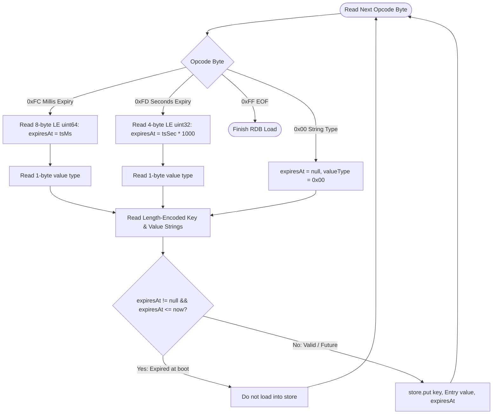
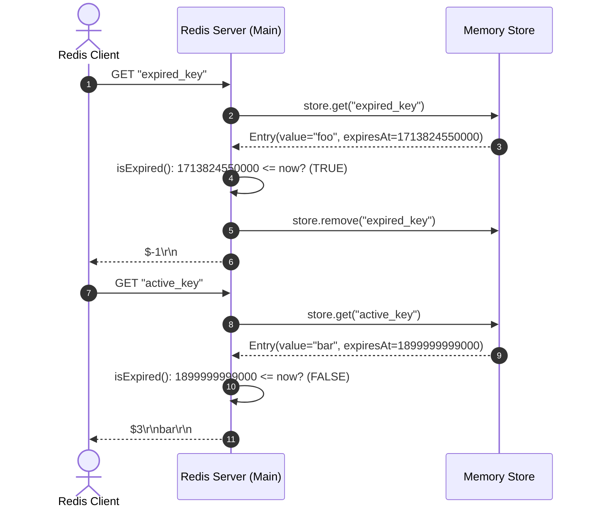

# Stage 73: Read value with expiry

---

## In one line
Parse RDB entries with expiration timestamps (millisecond precision `0xFC` and second precision `0xFD`), discard expired keys at load time, and lazily evict keys on `GET <key>` queries while returning RESP bulk strings for valid keys or null bulk strings `$-1\r\n` for expired keys.

---

## Self-test (cover the answers below and answer these first)
1. **What are the two opcodes used to specify key expiration in Redis RDB files, and how do they differ?**
   - *Answer*: `0xFC` denotes millisecond expiration encoded as an 8-byte unsigned integer in little-endian format. `0xFD` denotes second expiration encoded as a 4-byte unsigned integer in little-endian format.
2. **In what byte order (endianness) are the expiration timestamps stored in an RDB file?**
   - *Answer*: Little-endian (least significant byte first). For example, a 4-byte seconds timestamp `0x52 0xED 0x2A 0x66` represents `0x662AED52` in hex.
3. **What should the server return when a client issues `GET <key>` for a key whose expiration timestamp has passed?**
   - *Answer*: The RESP Null Bulk String: `$-1\r\n`.
4. **What should happen if an RDB snapshot contains a key whose expiration timestamp is already in the past at boot time?**
   - *Answer*: The server should skip loading that key into the active in-memory `store`, or load it with its expired timestamp so any immediate query or scan considers it dead. Discarding expired keys during load prevents memory leaks.
5. **How does Redis ensure that keys that expire after the server has booted are not returned to clients?**
   - *Answer*: Through lazy eviction during command execution (`store.get(key)` checks `isExpired()`, removes the key from the dictionary, and returns `null`/`$-1\r\n`), combined with periodic active eviction sweeps in full production Redis.
6. **What is the exact sequence of bytes for an entry with a millisecond expiration in an RDB file?**
   - *Answer*: `0xFC` (opcode) $\to$ 8-byte little-endian timestamp $\to$ 1-byte value type (e.g. `0x00` for string) $\to$ length-encoded key $\to$ length-encoded value.

---

## Problem Solved

In **Stage 73: Read value with expiry**, we extend our RDB parser to handle time-to-live metadata embedded directly within RDB snapshots:

1. **Millisecond Precision (`0xFC`)**: Reading an 8-byte little-endian Unix epoch timestamp in milliseconds, converting it to an absolute expiration timestamp, and associating it with the subsequent key-value entry.
2. **Second Precision (`0xFD`)**: Reading a 4-byte little-endian Unix epoch timestamp in seconds, multiplying by 1000 to convert to milliseconds, and storing it with the entry.
3. **Load-time Eviction**: If a key's expiration timestamp is in the past at the time the RDB file is loaded (`expiresAt <= System.currentTimeMillis()`), the key is ignored and not loaded into memory.
4. **Lazy Eviction on Read (`GET`)**: If a key had a future expiration timestamp when loaded, but the expiration timestamp passes before a client queries it, the `GET` handler detects that `isExpired()` evaluates to `true`, removes the entry from memory, and returns `$-1\r\n`.
5. **Unexpired Key Retrieval**: If the expiration timestamp is in the future, `GET <key>` returns the standard RESP bulk string `$<len>\r\n<value>\r\n`.

---

## Thought Process & Architectural Model

### 1. RDB Expiry Binary Stream Layout

```text
+-----------------------------------------------------------------------------------------------+
| Magic Header: "REDIS0011" (9 bytes)                                                           |
+-----------------------------------------------------------------------------------------------+
| 0xFE (Select DB) | 0x00 (DB 0)                                                                |
+-----------------------------------------------------------------------------------------------+
| 0xFB (Resize DB) | Total: 0x03 | Expire: 0x02                                                 |
+-----------------------------------------------------------------------------------------------+
| Entry 1 (With 8-byte Millisecond Expiry):                                                     |
|   0xFC (Opcode) | 8-byte LE timestamp (uint64) | 0x00 (Type) | 0x03 "foo" | 0x03 "bar"        |
+-----------------------------------------------------------------------------------------------+
| Entry 2 (With 4-byte Second Expiry):                                                          |
|   0xFD (Opcode) | 4-byte LE timestamp (uint32) | 0x00 (Type) | 0x03 "baz" | 0x03 "qux"        |
+-----------------------------------------------------------------------------------------------+
| Entry 3 (No Expiry):                                                                          |
|   0x00 (Type) | 0x06 "foobar" | 0x06 "bazqux"                                                 |
+-----------------------------------------------------------------------------------------------+
| 0xFF (EOF) | 8-byte CRC64 Checksum                                                            |
+-----------------------------------------------------------------------------------------------+
```

### 2. Expiry Deserialization & Evaluation State Machine



### 3. Query Time Evaluation (`GET`)



---

## Full Solution

The core implementation in [`codecrafters-redis-java/src/main/java/Main.java`](file:///C:/Users/jiten/Documents/Codecrafters-Build-from-scratch/codecrafters-redis-java/src/main/java/Main.java):

```java
// Inside loadRdb():
} else if (opcode == 0xFC) {
  // Expiry in milliseconds (8-byte little-endian)
  long expiresAt = 0;
  for (int i = 0; i < 8; i++) {
    int byteVal = in.read();
    if (byteVal == -1) throw new IOException("Unexpected EOF in 0xFC expiry");
    expiresAt |= ((long) (byteVal & 0xFF)) << (i * 8);
  }
  int valueType = in.read();
  String key = readRdbString(in);
  String value = readRdbString(in);
  if (expiresAt <= System.currentTimeMillis()) {
    // Already expired at boot — do not load into memory
  } else {
    store.put(key, new Entry(value, expiresAt));
  }
} else if (opcode == 0xFD) {
  // Expiry in seconds (4-byte little-endian)
  long expirySec = 0;
  for (int i = 0; i < 4; i++) {
    int byteVal = in.read();
    if (byteVal == -1) throw new IOException("Unexpected EOF in 0xFD expiry");
    expirySec |= ((long) (byteVal & 0xFF)) << (i * 8);
  }
  long expiresAt = expirySec * 1000L;
  int valueType = in.read();
  String key = readRdbString(in);
  String value = readRdbString(in);
  if (expiresAt <= System.currentTimeMillis()) {
    // Already expired at boot — do not load into memory
  } else {
    store.put(key, new Entry(value, expiresAt));
  }
}
```

```java
// Inside handleCommand() for GET:
} else if (command.equalsIgnoreCase("GET")) {
  String rawKey = parts[1];
  String key = stripQuotes(rawKey);
  Entry entry = store.get(key);
  if (entry == null) {
    entry = store.get(rawKey);
  }

  if (entry != null && !entry.isExpired()) {
    byte[] bytes = entry.value.getBytes(StandardCharsets.UTF_8);
    String response = "$" + bytes.length + "\r\n" + entry.value + "\r\n";
    out.write(response.getBytes(StandardCharsets.UTF_8));
    out.flush();
  } else {
    if (entry != null && entry.isExpired()) {
      store.remove(key);
      store.remove(rawKey);
    }
    out.write("$-1\r\n".getBytes(StandardCharsets.UTF_8));
    out.flush();
  }
}
```

---

## Concepts

1. **Point-in-Time Persistence with TTL**: An RDB snapshot captures not just static data, but temporal guarantees. Serializing the absolute epoch expiration time ensures that after loading, a key expires at the exact second or millisecond intended by the original writer, regardless of server restarts.
2. **Little-Endian Multi-Byte Integers**: Unlike network protocols that predominantly use big-endian (network byte order), Redis RDB uses little-endian for fixed-width numerical fields (4-byte and 8-byte integer timestamps). Deserializing requires shifting the $i$-th byte by $i \times 8$ bits to the left: `(byteVal & 0xFF) << (i * 8)`.
3. **Dual Eviction Strategy**:
   - **Boot Eviction**: Eliminates already-expired keys during RDB file parsing, conserving RAM.
   - **Passive / Lazy Eviction**: Intercepts queries at access time. If a key expired between boot and query, it is deleted on demand and returns `$-1\r\n`.

---

## Wire Format

### 1. Millisecond Expiry Record (`0xFC`)
```text
FC 15 72 E7 07 8F 01 00 00  00 03 66 6F 6F  03 62 61 72
^  ^                        ^  ^   ^        ^   ^
|  |                        |  |   |        |   +-- Value: "bar"
|  |                        |  |   +-- Key: "foo"
|  |                        |  +-- Key length (3 bytes)
|  |                        +-- Value type: 0x00 (String)
|  +-- 8-byte LE timestamp: 1713824559637 ms
+-- Opcode 0xFC
```

### 2. Second Expiry Record (`0xFD`)
```text
FD 52 ED 2A 66  00 03 62 61 7A  03 71 75 78
^  ^            ^  ^   ^        ^   ^
|  |            |  |   |        |   +-- Value: "qux"
|  |            |  |   +-- Key: "baz"
|  |            |  +-- Key length (3 bytes)
|  |            +-- Value type: 0x00 (String)
|  +-- 4-byte LE timestamp: 1714089298 s
+-- Opcode 0xFD
```

### 3. Query Wire Responses
- **Key unexpired**: `$3\r\nbar\r\n`
- **Key expired**: `$-1\r\n`

---

## Failure Modes

1. **Sign-Extension in Byte Shifting**:
   - If Java bytes are shifted without `& 0xFF` (e.g. `byteVal << 24`), negative byte values sign-extend to `0xFFFFFFxx`, corrupting the timestamp and causing false expirations.
2. **Overflow from Seconds to Milliseconds**:
   - When multiplying 4-byte seconds by 1000, failing to use `1000L` (long literal) causes 32-bit integer overflow, resulting in negative timestamps that immediately expire all keys.
3. **Missing Little-Endian Bit Shift**:
   - Reading big-endian instead of little-endian completely scrambles Unix epoch dates (e.g. year 1970 or year 4000+).

---

## Tradeoffs

1. **Boot-Time Filtering vs. Eager Storage**:
   - *Boot-time Filtering (Chosen)*: Skipping expired keys during load saves memory and index overhead immediately.
   - *Eager Storage*: Loading all keys and relying solely on lazy eviction consumes more heap space for dead data.
2. **Lazy Eviction vs. Background Sweeper**:
   - *Lazy Eviction (Chosen)*: $O(1)$ overhead on read operations; zero CPU usage for idle keys.
   - *Active Background Sweeper*: Periodically samples keys to remove expired ones that are never queried, preventing memory leakage at the expense of background CPU cycles.

---

## Java Specifics

- **Bitwise Unsigned Conversion**: Java has signed `byte`. Must use `(byteVal & 0xFF)` when converting to `long`.
- **Little-Endian Assembly**:
  ```java
  long val = 0;
  for (int i = 0; i < 8; i++) {
    val |= ((long) (in.read() & 0xFF)) << (i * 8);
  }
  ```
- **Thread Safety**: Using `ConcurrentHashMap<String, Entry>` ensures thread-safe mutations between client reader threads and lazy eviction writes.

---

## Rebuild Checklist

1. [x] Handle `0xFC` opcode: Read 8-byte little-endian uint64 as milliseconds.
2. [x] Handle `0xFD` opcode: Read 4-byte little-endian uint32 and multiply by `1000L`.
3. [x] Read the value type flag (1 byte).
4. [x] Read the length-encoded key and value strings.
5. [x] Discard expired keys if `expiresAt <= System.currentTimeMillis()`.
6. [x] Store active keys in `store.put(key, new Entry(value, expiresAt))`.
7. [x] In `handleCommand` for `GET`, check `entry.isExpired()`.
8. [x] Return `$-1\r\n` on expired or non-existent keys, cleaning up expired keys lazily.
9. [x] Return `$<len>\r\n<value>\r\n` for unexpired keys.
10. [x] Verify local compilation with `javac`.
