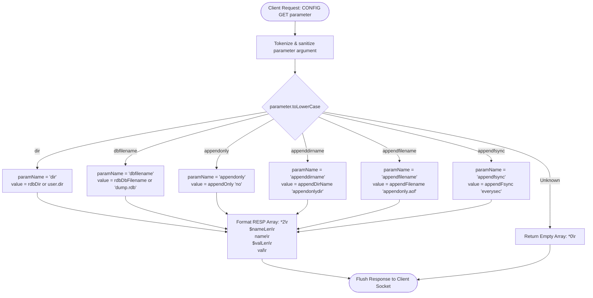
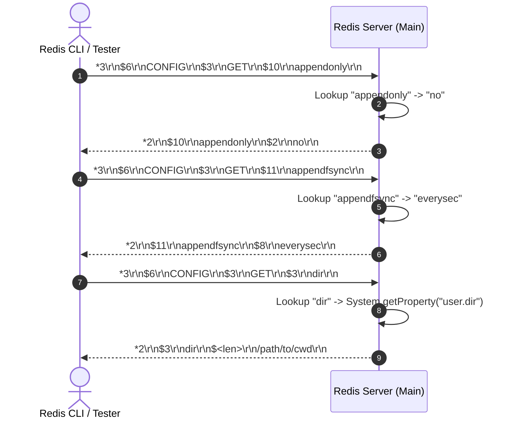

# Stage 74: Default AOF options

---

## In one line
Initialize and expose default Redis Append-Only File (AOF) configuration parameters (`dir`, `appendonly`, `appenddirname`, `appendfilename`, `appendfsync`, `dbfilename`) via the `CONFIG GET <parameter>` command returning two-element RESP arrays.

---

## Self-test (cover the answers below and answer these first)
1. **What is the purpose of Redis AOF (Append Only File) persistence, and how does it contrast with RDB snapshots?**
   - *Answer*: RDB persistence creates periodic, point-in-time binary snapshots of the dataset on disk, which may lose recent writes if a crash occurs between snapshots. AOF records every write operation received by the server to an append-only log file, allowing near-zero data loss on server restart by replaying the command log.
2. **What are the five essential AOF configuration parameters introduced in this stage and their default values?**
   - *Answer*:
     - `dir`: Current working directory at server startup (`System.getProperty("user.dir")`).
     - `appendonly`: `"no"` (AOF disabled by default).
     - `appenddirname`: `"appendonlydir"` (subdirectory where AOF manifest and files reside).
     - `appendfilename`: `"appendonly.aof"` (base filename of the append-only log).
     - `appendfsync`: `"everysec"` (disk synchronization frequency: once per second).
3. **What is the exact RESP wire format returned for `CONFIG GET appendonly`?**
   - *Answer*: A two-element RESP array containing the parameter name and its current value as Bulk Strings:
     `*2\r\n$10\r\nappendonly\r\n$2\r\nno\r\n`
4. **What should the server return if `CONFIG GET` is invoked with an unrecognized parameter name?**
   - *Answer*: An empty RESP array: `*0\r\n`.
5. **How is the default `dir` parameter determined at startup if no `--dir` argument is passed on the command line?**
   - *Answer*: By reading the standard Java system property `System.getProperty("user.dir")`, which returns the absolute path of the directory from which the Java process was launched.
6. **Does this stage require implementing file writing or disk flushing?**
   - *Answer*: No. This stage solely configures and exposes the default configuration state through the `CONFIG GET` query interface.

---

## Problem Solved

In **Stage 74: Default AOF options**, we introduce foundational configuration parameters for Redis's Append-Only File (AOF) persistence subsystem:

1. **Parameter Initialization**:
   - Establish default values for persistence directories, filenames, enable flags, and fsync strategies.
2. **Configuration Introspection (`CONFIG GET <param>`)**:
   - Enable clients and orchestration tooling to query server parameters dynamically using standard Redis protocol semantics.
3. **Case-Insensitive Parameter Matching**:
   - Sanitize and normalize input parameter keys (e.g., handling quotes, casing differences) while returning canonical lowercase keys in the RESP output.
4. **Working Directory Resolution**:
   - Gracefully resolve working directory paths using runtime system properties while preserving CLI overrides (`--dir <path>`).

---

## Thought Process & Architectural Model

### 1. Configuration Storage & Dispatch Architecture

```text
+-------------------------------------------------------------------------------+
| Redis Server Configuration Engine                                            |
|                                                                               |
|  [ CLI Arguments ]                                                            |
|    --dir <path>             --> rdbDir (falls back to user.dir)               |
|    --dbfilename <name>      --> rdbDbFilename (falls back to dump.rdb)        |
|    --appendonly <yes/no>    --> appendOnly ("no")                             |
|    --appenddirname <name>   --> appendDirName ("appendonlydir")               |
|    --appendfilename <name>  --> appendFilename ("appendonly.aof")             |
|    --appendfsync <policy>   --> appendFsync ("everysec")                      |
+-------------------------------------------------------------------------------+
                                      |
                                      v
+-------------------------------------------------------------------------------+
| Client Command: CONFIG GET <param>                                            |
|   1. Parse & sanitize param token                                             |
|   2. Match against supported configuration dictionary                         |
|   3. Serialize response as RESP Array: [*2, $<len>, <key>, $<len>, <value>]   |
+-------------------------------------------------------------------------------+
```

### 2. Parameter Lookup Workflow



### 3. Wire Interaction Sequence



---

## Full Solution

The changes in [`codecrafters-redis-java/src/main/java/Main.java`](file:///C:/Users/jiten/Documents/Codecrafters-Build-from-scratch/codecrafters-redis-java/src/main/java/Main.java):

```java
// Configuration fields:
private static String rdbDir = System.getProperty("user.dir");
private static String rdbDbFilename = "";
private static String appendOnly = "no";
private static String appendDirName = "appendonlydir";
private static String appendFilename = "appendonly.aof";
private static String appendFsync = "everysec";

// Command handling inside handleCommand():
} else if (command.equalsIgnoreCase("CONFIG")) {
  if (parts.length >= 3 && parts[1].equalsIgnoreCase("GET")) {
    String param = stripQuotes(parts[2]).toLowerCase();
    String value;
    String paramName;
    if (param.equals("dir")) {
      paramName = "dir";
      value = (rdbDir != null && !rdbDir.isEmpty()) ? rdbDir : System.getProperty("user.dir");
    } else if (param.equals("dbfilename")) {
      paramName = "dbfilename";
      value = (rdbDbFilename != null && !rdbDbFilename.isEmpty()) ? rdbDbFilename : "dump.rdb";
    } else if (param.equals("appendonly")) {
      paramName = "appendonly";
      value = appendOnly;
    } else if (param.equals("appenddirname")) {
      paramName = "appenddirname";
      value = appendDirName;
    } else if (param.equals("appendfilename")) {
      paramName = "appendfilename";
      value = appendFilename;
    } else if (param.equals("appendfsync")) {
      paramName = "appendfsync";
      value = appendFsync;
    } else {
      out.write("*0\r\n".getBytes(StandardCharsets.UTF_8));
      out.flush();
      return;
    }
    byte[] nameBytes = paramName.getBytes(StandardCharsets.UTF_8);
    byte[] valBytes = value.getBytes(StandardCharsets.UTF_8);
    String response = "*2\r\n$" + nameBytes.length + "\r\n" + paramName + "\r\n$" + valBytes.length + "\r\n" + value + "\r\n";
    out.write(response.getBytes(StandardCharsets.UTF_8));
    out.flush();
  } else {
    out.write("-ERR syntax error\r\n".getBytes(StandardCharsets.UTF_8));
    out.flush();
  }
}
```

---

## Concepts

1. **AOF vs RDB Durability Spectrum**:
   - `appendfsync always`: Disk `fsync` executed after every write command. Maximum safety, lowest throughput.
   - `appendfsync everysec`: Write buffer flushed to OS page cache immediately; dedicated thread invokes `fsync` once per second. Optimal balance of performance and durability (default).
   - `appendfsync no`: OS controls buffer flushing. Fastest, but crash durability depends on kernel heuristics.
2. **Multi-Part AOF Directory Structure**:
   - Modern Redis 7+ separates AOF into base files, incremental files, and a manifest file stored within `appenddirname` (defaulting to `appendonlydir`) under the root `dir`.
3. **Configuration Protocol Contract**:
   - `CONFIG GET <glob-pattern>` in standard Redis returns key-value pairs formatted as a flat array of alternating parameter names and parameter values. For single-key queries, this produces exactly a 2-element array.

---

## Wire Format

```text
Request:
*3\r\n
$6\r\nCONFIG\r\n
$3\r\nGET\r\n
$10\r\nappendonly\r\n

Response:
*2\r\n
$10\r\n
appendonly\r\n
$2\r\n
no\r\n
```

---

## Failure Modes

1. **Null or Empty Directory String**:
   - If `rdbDir` is not explicitly supplied via CLI flags and defaults to null or empty string, falling back to `System.getProperty("user.dir")` ensures valid non-empty paths are returned to clients.
2. **Missing Array Header or Length Encoding**:
   - Omitting `*2\r\n` or computing length from raw string character length instead of UTF-8 byte length can break protocol decoders for paths with special characters.
3. **Flushing Delays**:
   - Forgetting `out.flush()` causes buffered sockets to stall test harnesses awaiting immediate responses.

---

## Tradeoffs

- **Static Map vs. Explicit Switch**:
  - An explicit `if/else` block maintains simplicity with zero object allocation overhead during parameter lookup, perfectly suited for the small fixed set of options in this stage.

---

## Java Specifics

- `System.getProperty("user.dir")`: Portable Java method to obtain the current working directory across Windows, Linux, and macOS without invoking external shell tools.
- `StandardCharsets.UTF_8`: Ensures cross-platform encoding consistency when measuring byte counts for RESP bulk string headers.

---

## Rebuild Checklist

1. [x] Declare configuration state variables for `dir`, `dbfilename`, `appendonly`, `appenddirname`, `appendfilename`, and `appendfsync`.
2. [x] Set default values matching specification (`user.dir`, `no`, `appendonlydir`, `appendonly.aof`, `everysec`).
3. [x] In `handleCommand()`, expand `CONFIG GET` to evaluate all 6 options.
4. [x] Format responses as 2-element RESP arrays containing bulk strings for option name and value.
5. [x] Return `*0\r\n` for unsupported option names.
6. [x] Verify local compilation via `javac`.
