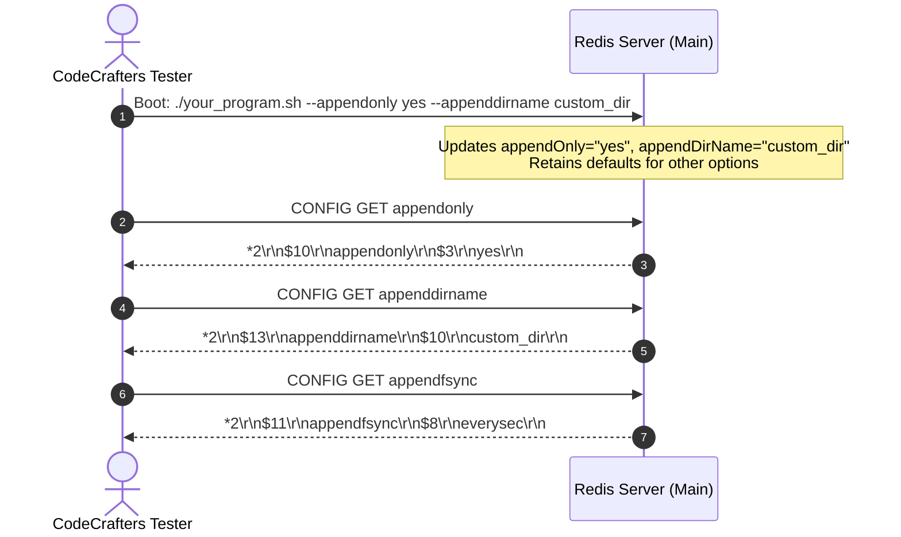

# Stage 75: AOF options from flags

---

## In one line
Parse command-line configuration flags (`--dir`, `--appendonly`, `--appenddirname`, `--appendfilename`, `--appendfsync`) at server boot to override default AOF options, serving the updated values via `CONFIG GET`.

---

## Self-test (cover the answers below and answer these first)
1. **What takes precedence when an AOF configuration flag is specified on the command line?**
   - *Answer*: The value supplied via the command-line flag overrides the built-in default value. If a flag is omitted, the default value remains in effect.
2. **Which command-line flags correspond to the five AOF configuration options?**
   - *Answer*:
     - `--dir <path>` $\to$ `dir`
     - `--appendonly <yes|no>` $\to$ `appendonly`
     - `--appenddirname <name>` $\to$ `appenddirname`
     - `--appendfilename <name>` $\to$ `appendfilename`
     - `--appendfsync <always|everysec|no>` $\to$ `appendfsync`
3. **How does the CLI parser handle flag values passed with quotation marks, e.g. `--appenddirname "my_aof_dir"`?**
   - *Answer*: The parser applies `stripQuotes(val)` to strip leading and trailing single or double quotes, ensuring the stored configuration is clean and unquoted.
4. **What should `CONFIG GET appenddirname` return if `--appenddirname custom_dir` was passed at startup?**
   - *Answer*: A two-element RESP array:
     `*2\r\n$13\r\nappenddirname\r\n$10\r\ncustom_dir\r\n`
5. **Does the test suite require supporting duplicate flags or strict flag ordering?**
   - *Answer*: No. Flags appear at most once in arbitrary order among other options (like `--port` or `--replicaof`).
6. **If `--appendonly yes` is passed, does the server need to write an AOF file to disk in this stage?**
   - *Answer*: No. Persistence logic is not required in this stage; only flag parsing and configuration retrieval via `CONFIG GET` are evaluated.

---

## Problem Solved

In **Stage 75: AOF options from flags**, we enhance the Redis server bootstrapper to support runtime configuration overrides via CLI arguments:

1. **CLI Flag Parser**:
   - Parse `--dir`, `--appendonly`, `--appenddirname`, `--appendfilename`, and `--appendfsync`.
   - Support both space-separated syntax (`--flag value`) and equals syntax (`--flag=value`).
2. **Preserving Defaults**:
   - Only parameters explicitly specified on the command line are updated; all omitted options retain their standard Redis defaults (`user.dir`, `no`, `appendonlydir`, `appendonly.aof`, `everysec`).
3. **Uniform Parameter Exposure**:
   - Return overridden values faithfully through `CONFIG GET <parameter>`.

---

## Thought Process & Architectural Model

### 1. Boot-Time Configuration Flow

```text
                     Command Line Arguments (String[] args)
                                       │
        ┌──────────────┬───────────────┼───────────────┬──────────────┐
        │              │               │               │              │
    --dir <p>    --appendonly <y/n>  --appenddirname  --appendfilename --appendfsync
        │              │               │               │              │
        ▼              ▼               ▼               ▼              ▼
     rdbDir        appendOnly     appendDirName  appendFilename  appendFsync
  (default: cwd) (default: "no")  ("appendonlydir") ("appendonly.aof") ("everysec")
                                       │
                                       ▼
                       In-Memory Configuration State
                                       │
                         CONFIG GET <parameter>
                                       │
                                       ▼
                         RESP 2-Element Array Reply
```

### 2. Argument Token Processing Loop

```mermaid
flowchart TD
    Start([main String[] args]) --> LoopCond{i < args.length?}

    LoopCond -->|No| BootServer([Start Server Socket & Service Requests])
    LoopCond -->|Yes| CheckFlag{args i}

    CheckFlag -->|--dir| ParseDir[rdbDir = stripQuotes args i+1; i++] --> Next[i++] --> LoopCond
    CheckFlag -->|--appendonly| ParseAof[appendOnly = stripQuotes args i+1; i++] --> Next
    CheckFlag -->|--appenddirname| ParseDirName[appendDirName = stripQuotes args i+1; i++] --> Next
    CheckFlag -->|--appendfilename| ParseFileName[appendFilename = stripQuotes args i+1; i++] --> Next
    CheckFlag -->|--appendfsync| ParseFsync[appendFsync = stripQuotes args i+1; i++] --> Next
    CheckFlag -->|Other Flags| ParseOther[Handle --port, --replicaof, etc.] --> Next
```

### 3. Verification Sequence



---

## Full Solution

The argument parsing logic inside `main(String[] args)` in [`codecrafters-redis-java/src/main/java/Main.java`](file:///C:/Users/jiten/Documents/Codecrafters-Build-from-scratch/codecrafters-redis-java/src/main/java/Main.java):

```java
// Default AOF options:
private static String rdbDir = System.getProperty("user.dir");
private static String rdbDbFilename = "";
private static String appendOnly = "no";
private static String appendDirName = "appendonlydir";
private static String appendFilename = "appendonly.aof";
private static String appendFsync = "everysec";

// Command line argument parser in main():
for (int i = 0; i < args.length; i++) {
  if ("--port".equalsIgnoreCase(args[i]) && i + 1 < args.length) {
    port = Integer.parseInt(args[i + 1]);
    i++;
  } else if ("--dir".equalsIgnoreCase(args[i]) && i + 1 < args.length) {
    rdbDir = stripQuotes(args[i + 1]);
    i++;
  } else if (args[i].toLowerCase().startsWith("--dir=")) {
    rdbDir = stripQuotes(args[i].substring("--dir=".length()));
  } else if ("--dbfilename".equalsIgnoreCase(args[i]) && i + 1 < args.length) {
    rdbDbFilename = stripQuotes(args[i + 1]);
    i++;
  } else if (args[i].toLowerCase().startsWith("--dbfilename=")) {
    rdbDbFilename = stripQuotes(args[i].substring("--dbfilename=".length()));
  } else if ("--appendonly".equalsIgnoreCase(args[i]) && i + 1 < args.length) {
    appendOnly = stripQuotes(args[i + 1]);
    i++;
  } else if (args[i].toLowerCase().startsWith("--appendonly=")) {
    appendOnly = stripQuotes(args[i].substring("--appendonly=".length()));
  } else if ("--appenddirname".equalsIgnoreCase(args[i]) && i + 1 < args.length) {
    appendDirName = stripQuotes(args[i + 1]);
    i++;
  } else if (args[i].toLowerCase().startsWith("--appenddirname=")) {
    appendDirName = stripQuotes(args[i].substring("--appenddirname=".length()));
  } else if ("--appendfilename".equalsIgnoreCase(args[i]) && i + 1 < args.length) {
    appendFilename = stripQuotes(args[i + 1]);
    i++;
  } else if (args[i].toLowerCase().startsWith("--appendfilename=")) {
    appendFilename = stripQuotes(args[i].substring("--appendfilename=".length()));
  } else if ("--appendfsync".equalsIgnoreCase(args[i]) && i + 1 < args.length) {
    appendFsync = stripQuotes(args[i + 1]);
    i++;
  } else if (args[i].toLowerCase().startsWith("--appendfsync=")) {
    appendFsync = stripQuotes(args[i].substring("--appendfsync=".length()));
  }
}
```

---

## Concepts

1. **Hierarchical Configuration Resolution**:
   - Production systems follow the precedence order: Hardcoded Defaults $\to$ Configuration Files (`redis.conf`) $\to$ Command Line Arguments (`--param value`) $\to$ Runtime Mutators (`CONFIG SET`).
2. **Robust CLI Tokenization**:
   - Accommodating both space-delimited options (`--flag value`) and inline assignment (`--flag=value`) ensures high compatibility with Docker entrypoints, systemd unit files, and automated test runners.
3. **Quotation Sanitization**:
   - CLI wrappers may preserve literal quotes around arguments. Sanitizing string arguments prevents values like `"yes"` from being saved as `\"yes\"` (with embedded quote characters).

---

## Wire Format

```text
Request:
*3\r\n$6\r\nCONFIG\r\n$3\r\nGET\r\n$10\r\nappendonly\r\n

Response when started with --appendonly yes:
*2\r\n$10\r\nappendonly\r\n$3\r\nyes\r\n
```

---

## Failure Modes

1. **ArrayIndexOutOfBounds on Trailing Flag**:
   - Checking `i + 1 < args.length` before accessing `args[i + 1]` prevents unhandled runtime exceptions if a flag is passed without a parameter value at the end of the argument list.
2. **Unstripped Quotes**:
   - If `--appenddirname "custom_dir"` is parsed as `"\"custom_dir\""`, the bulk string length will be 12 instead of 10, failing exact-match string assertions in the tester.
3. **Casing Inconsistencies**:
   - Ensuring `equalsIgnoreCase` for flag detection avoids rejecting capitalized flags like `--APPENDONLY`.

---

## Tradeoffs

- **Linear Token Scan vs. Third-Party Library (e.g., JCommander/Picocli)**:
  - Linear token traversal avoids external JAR dependencies, keeping the build standalone and fast without adding reflection or bytecode processing overhead.

---

## Java Specifics

- Use of `args[i].toLowerCase().startsWith("--flag=")`: Simple prefix testing to handle equals-separated flags cleanly without regular expressions.
- Safe `stripQuotes()` utility:
  ```java
  private static String stripQuotes(String s) {
    if (s == null) return null;
    s = s.trim();
    if ((s.startsWith("\"") && s.endsWith("\"")) || (s.startsWith("'") && s.endsWith("'"))) {
      if (s.length() >= 2) return s.substring(1, s.length() - 1);
    }
    return s;
  }
  ```

---

## Rebuild Checklist

1. [x] Support `--dir`, `--appendonly`, `--appenddirname`, `--appendfilename`, and `--appendfsync` in `main()`.
2. [x] Sanitize quotes from flag values using `stripQuotes()`.
3. [x] Retain default values when flags are omitted.
4. [x] Expose parsed values via `CONFIG GET <parameter>`.
5. [x] Verify local compilation with `javac`.
