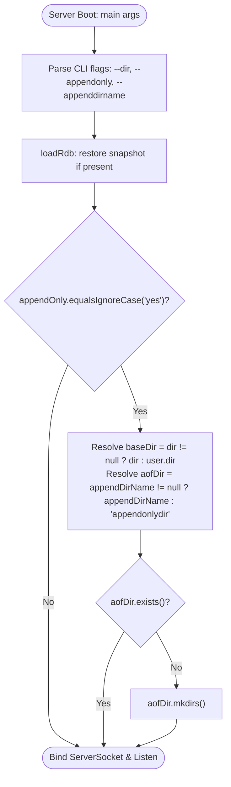
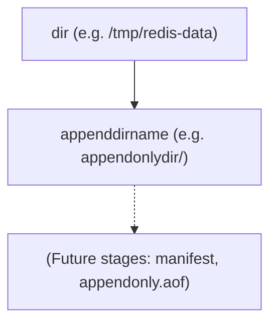

# Stage 76: Create append-only directory

---

## In one line
Conditionally initialize the Redis AOF persistence directory hierarchy (`<dir>/<appenddirname>/`) on disk during server boot if and only if `--appendonly yes` is enabled.

---

## Self-test (cover the answers below and answer these first)
1. **Under what exact condition should the server create the append-only directory on the filesystem?**
   - *Answer*: Only when `appendOnly` evaluates to `"yes"` (case-insensitively). If `appendOnly` is `"no"` or unset, the directory must not be created.
2. **Where does the append-only directory reside in the filesystem?**
   - *Answer*: Inside the base directory configured by `dir` (or `System.getProperty("user.dir")` by default), with the folder name specified by `appenddirname` (default: `"appendonlydir"`).
3. **When during server lifecycle must the directory exist?**
   - *Answer*: At startup, prior to accepting incoming client TCP connections or executing any client commands.
4. **How should the server behave if the specified directory already exists on disk?**
   - *Answer*: It should proceed smoothly without error or exception (`java.io.File.mkdirs()` returns false without throwing if the directory already exists).
5. **What happens if parent paths leading up to the target directory do not exist?**
   - *Answer*: Using `mkdirs()` instead of `mkdir()` creates all necessary nonexistent parent directories along the path.
6. **Are any files (such as manifest or append-only log files) created in this stage?**
   - *Answer*: No. Only the directory structure itself is created.

---

## Problem Solved

In **Stage 76: Create append-only directory**, we transition AOF persistence from static configuration tracking to filesystem interaction:

1. **Conditional Directory Creation**:
   - Inspect the resolved `appendOnly` setting after CLI argument parsing.
   - If `"yes"`, compute the combined target path: `<dir>/<appenddirname>` and instantiate it via `mkdirs()`.
2. **Strict Inactivity on Disabled AOF**:
   - Ensure no filesystem mutations or spurious directory creations occur when `appendonly` is `"no"` (the default).
3. **Idempotency & Resilience**:
   - Handle pre-existing directories gracefully without crashing or throwing I/O exceptions.

---

## Thought Process & Architectural Model

### 1. Boot-Time Filesystem Initialization Flow

```text
       Server Startup (CLI Flags Parsed)
                       │
             Is appendOnly == "yes"?
              /                     \
            YES                      NO
            /                         \
    baseDir = dir || cwd          Do Nothing
    dirName = appenddirname
            │
    target = File(baseDir, dirName)
            │
    target.exists()?
      ├── YES ──> Continue
      └── NO  ──> target.mkdirs()
            │
            ▼
    Open ServerSocket(port)
```

### 2. Startup Decision Workflow



### 3. File Directory Structure



---

## Full Solution

The integration in `main()` of [`codecrafters-redis-java/src/main/java/Main.java`](file:///C:/Users/jiten/Documents/Codecrafters-Build-from-scratch/codecrafters-redis-java/src/main/java/Main.java):

```java
    // Load RDB file at startup
    loadRdb();

    // Stage 76: Create append-only directory if enabled
    if ("yes".equalsIgnoreCase(appendOnly)) {
      String baseDir = (rdbDir != null && !rdbDir.isEmpty()) ? rdbDir : System.getProperty("user.dir");
      java.io.File aofDir = (appendDirName != null && !appendDirName.isEmpty())
          ? new java.io.File(baseDir, appendDirName)
          : new java.io.File(baseDir, "appendonlydir");
      if (!aofDir.exists()) {
        aofDir.mkdirs();
      }
    }

    try {
      ServerSocket serverSocket = new ServerSocket(port);
      // Client handling loop...
```

---

## Concepts

1. **Modern Redis Multi-Part AOF**:
   - Starting with Redis 7.0, AOF transitioned from a monolithic file (`appendfilename`) to a directory structure (`appenddirname`) managed by a manifest file. This separates base snapshots from incremental write appends, eliminating rewrite race conditions.
2. **Startup Ordering Guarantee**:
   - Persistent storage directories must exist *before* listening sockets accept network traffic. If clients submit write commands before storage paths are prepared, disk writes fail or encounter unhandled errors.
3. **Idempotent Filesystem Initialization**:
   - Production daemons frequently restart in existing environments. Storage bootstrap code must be idempotent—safely assuming that directories might already exist from earlier runs.

---

## Wire Format

*This stage does not modify client RESP wire protocol. Existing commands (`CONFIG GET`, `PING`, etc.) continue to function as previously defined.*

---

## Failure Modes

1. **Spurious Directory Creation**:
   - Creating `appendonlydir` when `--appendonly` is not enabled violates the specification and fails automated tests that assert non-existence.
2. **Calling `mkdir()` Instead of `mkdirs()`**:
   - `mkdir()` fails if any intermediate parent directory in the path does not exist (e.g. `/tmp/nested/redis/appendonlydir`). `mkdirs()` creates the full ancestor hierarchy safely.
3. **Unsanitized Directory Path**:
   - Quotes left on `--dir "/path/to/data"` could result in paths containing literal quote characters, causing OS-level `InvalidPathException` or `IOException`. The earlier `stripQuotes()` sanitization prevents this.

---

## Tradeoffs

- **Pre-emptive Directory Creation vs Lazy Creation on First Write**:
  - Pre-emptive creation during boot ensures directory permission errors or disk issues surface immediately at startup rather than during critical write transactions later on.

---

## Java Specifics

- `java.io.File(File parent, String child)` / `java.io.File(String parent, String child)`: Handles platform-specific file separator normalization (`/` vs `\`) automatically across Linux and Windows.
- `File.mkdirs()`: Returns `false` if the directory already exists or could not be created; never throws unchecked runtime exceptions on typical path strings.

---

## Rebuild Checklist

1. [x] Locate startup initialization in `main()` prior to `ServerSocket` binding.
2. [x] Check if `appendOnly` is case-insensitively equal to `"yes"`.
3. [x] Resolve base directory (`rdbDir` or `user.dir`) and target subdirectory (`appendDirName` or `"appendonlydir"`).
4. [x] Execute `mkdirs()` on the target `java.io.File` if it does not already exist.
5. [x] Ensure no directory is created when `appendOnly` is not `"yes"`.
6. [x] Verify local compilation via `javac`.
