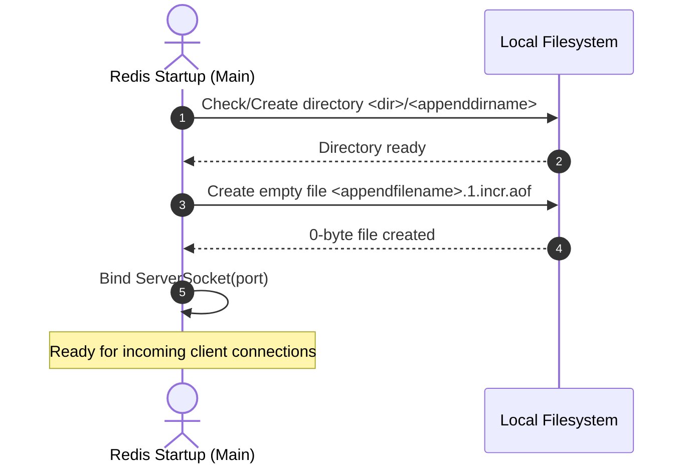

# Stage 77: Create append-only file

---

## In one line
Create an empty initial incremental append-only log file named `<appendfilename>.1.incr.aof` inside the AOF directory (`<dir>/<appenddirname>/`) at server startup when `--appendonly yes` is specified.

---

## Self-test (cover the answers below and answer these first)
1. **What is the exact naming convention for the initial incremental AOF file created at startup?**
   - *Answer*: `<appendfilename>.1.incr.aof` (e.g. `appendonly.aof.1.incr.aof`).
2. **What does the `.1.incr` component of the filename signify in Redis's Multi-Part AOF architecture?**
   - *Answer*: It designates that this file is the first incremental append-only segment in the sequence, designed to record new write commands consecutively.
3. **In which directory must this incremental file reside?**
   - *Answer*: Inside the AOF directory resolved from `dir` and `appenddirname` (defaulting to `<dir>/appendonlydir/`).
4. **When must the file be created?**
   - *Answer*: At server startup prior to handling client commands, not lazily upon the arrival of the first write command.
5. **Should any data be written to `<appendfilename>.1.incr.aof` during this stage?**
   - *Answer*: No. The file must be created as an empty (0-byte) file on disk.
6. **What if the file already exists on disk when the server starts up?**
   - *Answer*: Using `java.io.File.createNewFile()` or checking `if (!incrFile.exists())` guarantees idempotency without corrupting existing files or throwing errors.

---

## Problem Solved

In **Stage 77: Create append-only file**, we implement the creation of the active incremental log file required by modern Multi-Part AOF:

1. **Incremental Log File Allocation**:
   - Resolve the base file name from `--appendfilename` (defaulting to `appendonly.aof`).
   - Construct the canonical filename `<appendfilename>.1.incr.aof` within the AOF subdirectory.
2. **Startup Initialization**:
   - When `--appendonly yes` is present, ensure both the directory and the empty incremental file are created before the TCP server binds to the network port.
3. **Robust Filesystem Handling**:
   - Handle directory creation dependencies and catch potential `IOException` without halting the server unexpectedly.

---

## Thought Process & Architectural Model

### 1. Multi-Part AOF Storage Layout

```text
  /tmp/redis-data/ (dir)
        │
        └── appendonlydir/ (appenddirname)
                 │
                 └── appendonly.aof.1.incr.aof (initial empty incremental AOF)
```

### 2. Startup Lifecycle Workflow

```mermaid
flowchart TD
    Start([main String[] args]) --> ParseFlags[Parse CLI arguments]
    ParseFlags --> CheckAof{"appendOnly.equalsIgnoreCase('yes')?"}

    CheckAof -->|No| BindPort([Bind ServerSocket & Accept Clients])
    CheckAof -->|Yes| ResolveDir["Resolve baseDir (dir || user.dir)<br>Resolve aofDir (baseDir / appenddirname)"]

    ResolveDir --> EnsureDir["aofDir.mkdirs()"]
    EnsureDir --> ResolveFile["Resolve baseFileName (appendfilename || 'appendonly.aof')<br>Construct File(aofDir, baseFileName + '.1.incr.aof')"]
    ResolveFile --> CheckFile{"incrFile.exists()?"}

    CheckFile -->|No| CreateFile["incrFile.createNewFile()"] --> BindPort
    CheckFile -->|Yes| BindPort
```

### 3. File System Creation Sequence



---

## Full Solution

The changes in `main()` in [`codecrafters-redis-java/src/main/java/Main.java`](file:///C:/Users/jiten/Documents/Codecrafters-Build-from-scratch/codecrafters-redis-java/src/main/java/Main.java):

```java
    // Stage 76 & 77: Create append-only directory and initial incremental file if enabled
    if ("yes".equalsIgnoreCase(appendOnly)) {
      String baseDir = (rdbDir != null && !rdbDir.isEmpty()) ? rdbDir : System.getProperty("user.dir");
      java.io.File aofDir = (appendDirName != null && !appendDirName.isEmpty())
          ? new java.io.File(baseDir, appendDirName)
          : new java.io.File(baseDir, "appendonlydir");
      if (!aofDir.exists()) {
        aofDir.mkdirs();
      }
      String baseFileName = (appendFilename != null && !appendFilename.isEmpty())
          ? appendFilename
          : "appendonly.aof";
      java.io.File incrFile = new java.io.File(aofDir, baseFileName + ".1.incr.aof");
      try {
        if (!incrFile.exists()) {
          incrFile.createNewFile();
        }
      } catch (java.io.IOException e) {
        System.err.println("Failed to create incremental AOF file: " + e.getMessage());
      }
    }
```

---

## Concepts

1. **Multi-Part AOF Architecture (Redis 7.0+)**:
   - Monolithic AOF previously required an expensive and complex background rewrite process where concurrent appends were written to an in-memory buffer and flushed to a temporary file.
   - Multi-Part AOF splits data into:
     - **Base file**: A snapshot of data up to the last rewrite (e.g. `*.1.base.aof` or `*.1.base.rdb`).
     - **Incremental files**: Delta streams recording commands applied after the base snapshot (e.g. `*.1.incr.aof`, `*.2.incr.aof`).
     - **Manifest file**: Tracks the sequence and state of base and incremental files.
2. **Deterministic Sequence Numbering**:
   - The `.1.incr.aof` suffix uses 1-based sequential indexing. When a rewrite occurs, a new incremental file with incremented sequence number is opened while previous files are merged.

---

## Wire Format

*This stage does not introduce new network protocol commands. File creation occurs entirely on the server host.*

---

## Failure Modes

1. **Incorrect Suffix or Extension**:
   - Creating `<appendfilename>.incr.aof` instead of `<appendfilename>.1.incr.aof` will fail tests expecting the sequence index `.1.`.
2. **Premature Content Writing**:
   - Writing headers or metadata into the file before the write command recording stage will violate tests expecting an empty 0-byte file at startup.
3. **Missing Parent Directory**:
   - Attempting `incrFile.createNewFile()` before `aofDir.mkdirs()` succeeds can cause `IOException: No such file or directory`.

---

## Tradeoffs

- **Immediate File Creation vs. Lazy Open**:
  - Pre-creating the incremental file during server boot ensures write permissions and filesystem capacity are verified early before serving client transactions.

---

## Java Specifics

- `java.io.File.createNewFile()`: Atomically creates a new, empty file named by this abstract pathname if and only if a file with this name does not yet exist. Returns `true` if file was created, `false` if it already exists.
- Cross-platform path combining: `new java.io.File(aofDir, filename)` safely uses `File.separator` across Unix and Windows environments.

---

## Rebuild Checklist

1. [x] Ensure `appendOnly` check is verified in `main()`.
2. [x] Construct `File(aofDir, baseFileName + ".1.incr.aof")`.
3. [x] Check `incrFile.exists()` and call `incrFile.createNewFile()`.
4. [x] Wrap filesystem calls in a try-catch block for `IOException`.
5. [x] Verify local build succeeds via `javac`.
