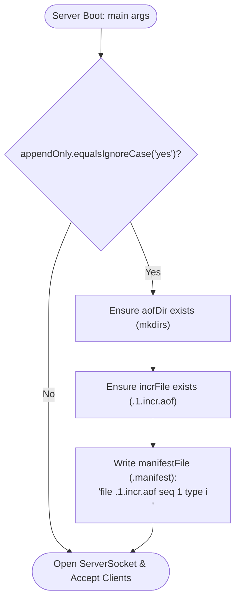
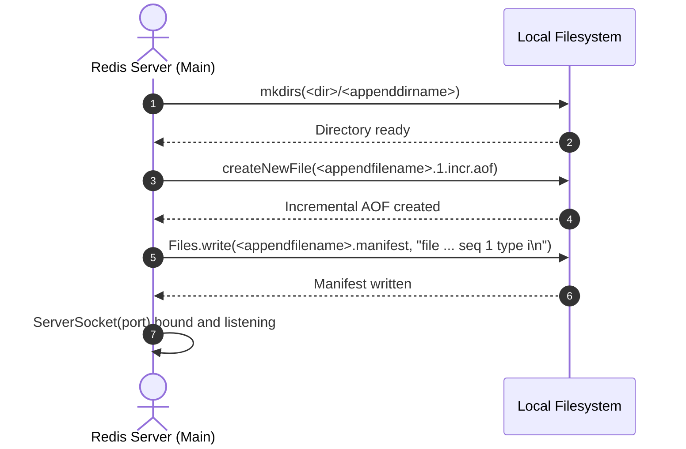

# Stage 78: Create manifest file

---

## In one line
Generate the Multi-Part AOF manifest file (`<appendfilename>.manifest`) during startup containing the descriptor entry `file <appendfilename>.1.incr.aof seq 1 type i\n` within the AOF directory when persistence is enabled.

---

## Self-test (cover the answers below and answer these first)
1. **What is the canonical role of the `.manifest` file in Redis 7+ Multi-Part AOF?**
   - *Answer*: It serves as the master catalog and orchestrator that defines which base and incremental AOF files compose the current dataset, along with their exact sequence numbers and file types.
2. **What is the required naming convention for the manifest file?**
   - *Answer*: `<appendfilename>.manifest` (e.g., `appendonly.aof.manifest`), situated directly inside the AOF directory (`<dir>/<appenddirname>/`).
3. **What is the exact single-line record format written to the manifest file for the initial incremental file?**
   - *Answer*: `file <appendfilename>.1.incr.aof seq 1 type i\n`.
4. **What does each token in `file <name> seq <num> type <t>` mean?**
   - *Answer*:
     - `file`: Key prefix identifying the AOF file segment name.
     - `seq`: Monotonically increasing sequence number for this specific file segment (e.g. `1`).
     - `type`: File category flag, where `i` represents an incremental write log file and `b` represents a base snapshot file.
5. **What delimiter separates tokens, and how must the line terminate?**
   - *Answer*: Each token is separated by exactly a single space (` `), and the record line must terminate with a newline character (`\n`).
6. **When should the manifest file be written during the server lifecycle?**
   - *Answer*: At startup, alongside the creation of the AOF directory and initial incremental file, before client connections are accepted.

---

## Problem Solved

In **Stage 78: Create manifest file**, we complete the bootstrap sequence for Redis 7 Multi-Part AOF:

1. **Manifest File Generation**:
   - Construct `<appendfilename>.manifest` in `<dir>/<appenddirname>/`.
   - Write the initial tracking record for `<appendfilename>.1.incr.aof` with sequence `1` and type `i`.
2. **Deterministic Startup Guarantee**:
   - Both the incremental log file and its manifest description are established on disk before any incoming client connections or write operations occur.
3. **Recovery Readiness**:
   - When the server restarts in future stages, this manifest provides the exact blueprint required to locate, order, and replay incremental commands.

---

## Thought Process & Architectural Model

### 1. Multi-Part AOF Complete Directory Hierarchy

```text
  <dir>/ (e.g. /tmp/redis-data)
    └── <appenddirname>/ (e.g. appendonlydir/)
          ├── appendonly.aof.manifest     <── NEW: tracks AOF files & sequence
          └── appendonly.aof.1.incr.aof   <── initial empty incremental AOF
```

### 2. Manifest File Record Structure

```text
  file appendonly.aof.1.incr.aof seq 1 type i\n
  │    │                         │   │ │    │ │
  │    │                         │   │ │    │ └── Trailing newline (\n)
  │    │                         │   │ │    └──── File type 'i' (incremental)
  │    │                         │   │ └───────── 'type' keyword
  │    │                         │   └─────────── Sequence number 1
  │    │                         └─────────────── 'seq' keyword
  │    └───────────────────────────────────────── Relative filename of incremental AOF
  └────────────────────────────────────────────── 'file' keyword
```

### 3. Startup Initialization Workflow



### 4. Component Interaction Sequence



---

## Full Solution

The integration in `main()` of [`codecrafters-redis-java/src/main/java/Main.java`](file:///C:/Users/jiten/Documents/Codecrafters-Build-from-scratch/codecrafters-redis-java/src/main/java/Main.java):

```java
    // Stage 76 & 77 & 78: Create append-only directory, initial incremental file, and manifest if enabled
    if ("yes".equalsIgnoreCase(appendOnly)) {
      String baseDir = (rdbDir != null && !rdbDir.isEmpty()) ? rdbDir : System.getProperty("user.dir");
      java.io.File aofDir = (appendDirName != null && !appendDirName.isEmpty())
          ? new java.io.File(baseDir, appendDirName)
          : new java.io.File(baseDir, "appendonlydir");
      if (!aofDir.exists()) {
        aofDir.mkdirs();
      }
      String baseFileName = (appendFilename != null && !appendFilename.isEmpty())
          ? appendFilename
          : "appendonly.aof";
      java.io.File incrFile = new java.io.File(aofDir, baseFileName + ".1.incr.aof");
      try {
        if (!incrFile.exists()) {
          incrFile.createNewFile();
        }
      } catch (java.io.IOException e) {
        System.err.println("Failed to create incremental AOF file: " + e.getMessage());
      }

      // Stage 78: Create manifest file
      java.io.File manifestFile = new java.io.File(aofDir, baseFileName + ".manifest");
      try {
        String manifestContent = "file " + baseFileName + ".1.incr.aof seq 1 type i\n";
        java.nio.file.Files.write(manifestFile.toPath(), manifestContent.getBytes(StandardCharsets.UTF_8));
      } catch (java.io.IOException e) {
        System.err.println("Failed to write AOF manifest file: " + e.getMessage());
      }
    }
```

---

## Concepts

1. **Manifest File Decoupling**:
   - In previous monolithic AOF systems, appending and rewriting concurrently risked file corruption or required duplicate in-memory write buffers.
   - The manifest file acts as an atomic pointer. When an AOF rewrite completes, a new base file is finalized and the manifest file is atomically rewritten (`rename` syscall), making the switch instantaneous.
2. **File Types in Redis Manifests**:
   - `b` (base): Snapshot baseline file.
   - `h` (history): Past incremental files preserved temporarily until the next snapshot consolidates them.
   - `i` (incremental): The active write log receiving new command appends.
3. **Atomic File Write Considerations**:
   - In production systems, manifest updates are typically written to a temporary file (`.manifest.tmp`) and atomically renamed over the existing manifest to avoid corruption on unexpected power loss.

---

## Wire Format

*This stage performs local filesystem manifest initialization and does not modify network wire formats.*

---

## Failure Modes

1. **Missing Trailing Newline**:
   - Manifest parser parsers in Redis and CodeCrafters test harnesses split on `\n`. Missing the final newline can result in parsing failures.
2. **Extra Spaces or Delimiters**:
   - Having multiple spaces or tab characters between tokens (`file  ... seq  1`) fails strict parser tokenization.
3. **Path Inconsistencies**:
   - Writing the manifest into `<dir>` instead of `<dir>/<appenddirname>` will cause verification checks to fail to locate the file.

---

## Tradeoffs

- **Direct File Overwrite vs. Atomic Swap**:
  - For server boot initialization, writing directly to the manifest path with `Files.write()` is simple, fast, and sufficient. For live AOF rewrites during runtime, writing to a temp file and renaming (`ATOMIC_MOVE`) is required.

---

## Java Specifics

- `java.nio.file.Files.write(Path, byte[])`: Safely opens, writes the complete byte payload, and closes the file channel in a single call.
- `StandardCharsets.UTF_8`: Ensures cross-platform textual consistency regardless of default system encodings.

---

## Rebuild Checklist

1. [x] Construct `manifestFile` inside `aofDir` named `baseFileName + ".manifest"`.
2. [x] Format content line: `"file " + baseFileName + ".1.incr.aof seq 1 type i\n"`.
3. [x] Write content using `Files.write(manifestFile.toPath(), manifestContent.getBytes(StandardCharsets.UTF_8))`.
4. [x] Enclose in try-catch handling `IOException`.
5. [x] Compile with `javac` and verify 0 errors.
