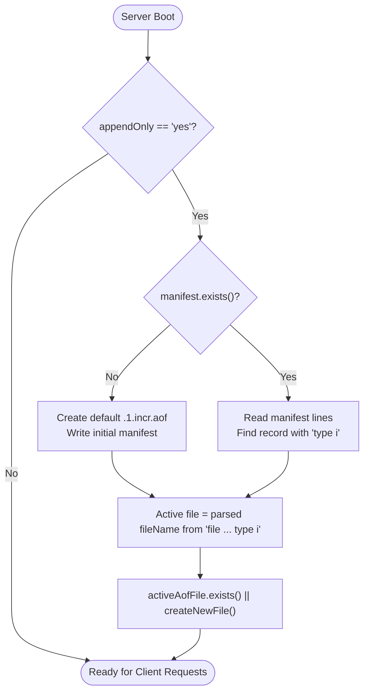
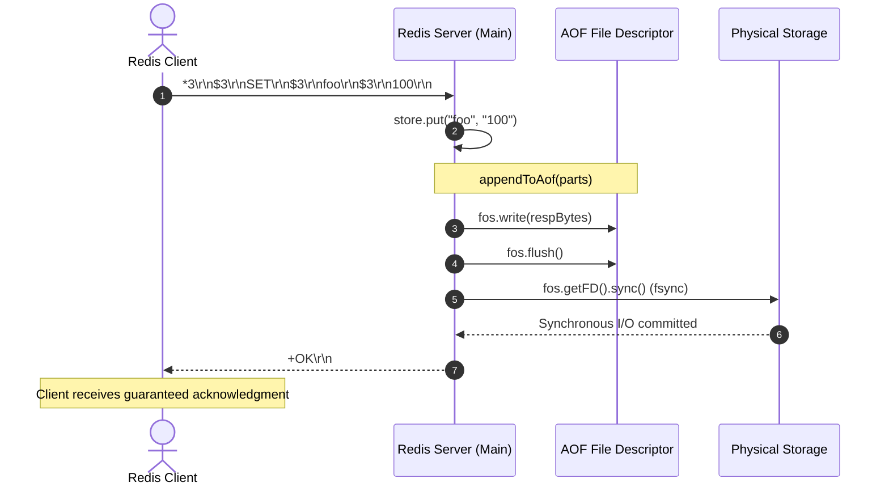

# Stage 79: Write a single command

---

## In one line
Parse the Multi-Part AOF manifest (`<appendfilename>.manifest`) to identify the active incremental log file (`type i`), format incoming write commands (like `SET`) into RESP protocol bulk arrays, and flush/fsync them to disk before returning the client response when `--appendfsync always` is active.

---

## Self-test (cover the answers below and answer these first)
1. **Why must the server inspect the manifest rather than assuming `<appendfilename>.1.incr.aof` is the active file?**
   - *Answer*: In Redis Multi-Part AOF, the active file name may vary (for instance, following previous rewrites, restarts, or external file initialization by test harnesses). The manifest's `type i` record is the authoritative single source of truth for the active incremental file.
2. **What wire format is used when persisting commands into the AOF file?**
   - *Answer*: Canonical RESP array format (e.g. `*3\r\n$3\r\nSET\r\n$3\r\nfoo\r\n$3\r\n100\r\n`), identical to the protocol wire format transmitted by clients.
3. **What is the strict timing guarantee required when `--appendfsync always` is configured?**
   - *Answer*: The server must flush and physically sync (`fsync`) the write buffer to disk *before* transmitting the acknowledgment (`+OK\r\n`) across the network socket to the client.
4. **How does Java trigger a synchronous OS-level fsync to ensure data durability on disk?**
   - *Answer*: By invoking `fileOutputStream.getFD().sync()`, which forces all system buffer cache pages associated with the file descriptor to synchronize with underlying storage media.
5. **How should existing manifest files be handled during server boot?**
   - *Answer*: If a manifest file already exists on disk (pre-provisioned or preserved across restarts), the server must preserve it and read the active incremental file rather than overwriting the manifest.
6. **How are command tokens cased when written to the AOF?**
   - *Answer*: Standard practice and test expectations require the command verb (token index 0) to be normalized to uppercase (e.g., `SET`), while subsequent arguments (keys, values, parameters) retain their exact casing and payload.

---

## Problem Solved

In **Stage 79: Write a single command**, we connect Redis client command execution to physical AOF persistence:

1. **Dynamic Manifest Parsing**:
   - Parse `<appenddirname>/<appendfilename>.manifest` looking for the record with `type i`.
   - Extract the target incremental file name (e.g. `<random_file_name>.1.incr.aof`).
2. **Command Serialization**:
   - Convert executing write commands (`SET key value [EX|PX ...]`) into canonical RESP array representation.
3. **Guaranteed Durability (`appendfsync always`)**:
   - Write serialized command bytes to the target AOF file.
   - Flush application buffers and invoke low-level file descriptor sync (`fsync`) before sending the protocol response to the client.

---

## Thought Process & Architectural Model

### 1. Active AOF Discovery Flow



### 2. Synchronous Write & Fsync Execution Cycle



---

## Full Solution

The additions in [`codecrafters-redis-java/src/main/java/Main.java`](file:///C:/Users/jiten/Documents/Codecrafters-Build-from-scratch/codecrafters-redis-java/src/main/java/Main.java):

```java
  // Stage 79: AOF synchronization lock and active incremental file pointer
  private static final Object aofLock = new Object();
  private static java.io.File activeAofFile = null;

  private static String getActiveIncrAofFilename(java.io.File manifestFile, String defaultName) {
    if (manifestFile != null && manifestFile.exists()) {
      try {
        java.util.List<String> lines = java.nio.file.Files.readAllLines(manifestFile.toPath(), StandardCharsets.UTF_8);
        for (String line : lines) {
          line = line.trim();
          if (line.isEmpty() || line.startsWith("#")) continue;
          String[] parts = line.split("\\s+");
          String fileName = null;
          String type = null;
          for (int i = 0; i < parts.length; i++) {
            if ("file".equalsIgnoreCase(parts[i]) && i + 1 < parts.length) {
              fileName = parts[i + 1];
            } else if ("type".equalsIgnoreCase(parts[i]) && i + 1 < parts.length) {
              type = parts[i + 1];
            }
          }
          if ("i".equalsIgnoreCase(type) && fileName != null) {
            return fileName;
          }
        }
      } catch (java.io.IOException e) {
        System.err.println("Error reading AOF manifest: " + e.getMessage());
      }
    }
    return defaultName;
  }

  private static void appendToAof(String[] parts) {
    if (!"yes".equalsIgnoreCase(appendOnly) || activeAofFile == null) {
      return;
    }
    StringBuilder sb = new StringBuilder();
    sb.append("*").append(parts.length).append("\r\n");
    for (int i = 0; i < parts.length; i++) {
      String token = (i == 0) ? parts[i].toUpperCase() : parts[i];
      byte[] b = token.getBytes(StandardCharsets.UTF_8);
      sb.append("$").append(b.length).append("\r\n").append(token).append("\r\n");
    }
    byte[] bytes = sb.toString().getBytes(StandardCharsets.UTF_8);

    synchronized (aofLock) {
      try (java.io.FileOutputStream fos = new java.io.FileOutputStream(activeAofFile, true)) {
        fos.write(bytes);
        fos.flush();
        if ("always".equalsIgnoreCase(appendFsync)) {
          fos.getFD().sync();
        }
      } catch (java.io.IOException e) {
        System.err.println("Error appending to AOF: " + e.getMessage());
      }
    }
  }
```

In `handleCommand` under `SET`:

```java
      store.put(key, new Entry(value, expiresAt));
      touchWatchedKey(key);
      appendToAof(parts);
      out.write("+OK\r\n".getBytes(StandardCharsets.UTF_8));
      out.flush();
      propagate(parts);
```

And in `main()` startup bootstrapping:

```java
    // Stage 76 & 77 & 78 & 79: AOF persistence bootstrap
    if ("yes".equalsIgnoreCase(appendOnly)) {
      String baseDir = (rdbDir != null && !rdbDir.isEmpty()) ? rdbDir : System.getProperty("user.dir");
      java.io.File aofDir = (appendDirName != null && !appendDirName.isEmpty())
          ? new java.io.File(baseDir, appendDirName)
          : new java.io.File(baseDir, "appendonlydir");
      if (!aofDir.exists()) {
        aofDir.mkdirs();
      }
      String baseFileName = (appendFilename != null && !appendFilename.isEmpty())
          ? appendFilename
          : "appendonly.aof";

      java.io.File manifestFile = new java.io.File(aofDir, baseFileName + ".manifest");
      if (!manifestFile.exists()) {
        java.io.File incrFile = new java.io.File(aofDir, baseFileName + ".1.incr.aof");
        try {
          if (!incrFile.exists()) {
            incrFile.createNewFile();
          }
        } catch (java.io.IOException e) {
          System.err.println("Failed to create incremental AOF file: " + e.getMessage());
        }

        try {
          String manifestContent = "file " + baseFileName + ".1.incr.aof seq 1 type i\n";
          java.nio.file.Files.write(manifestFile.toPath(), manifestContent.getBytes(StandardCharsets.UTF_8));
        } catch (java.io.IOException e) {
          System.err.println("Failed to write AOF manifest file: " + e.getMessage());
        }
      }

      String activeIncrName = getActiveIncrAofFilename(manifestFile, baseFileName + ".1.incr.aof");
      activeAofFile = new java.io.File(aofDir, activeIncrName);
      try {
        if (!activeAofFile.exists()) {
          activeAofFile.createNewFile();
        }
      } catch (java.io.IOException e) {
        System.err.println("Failed to ensure active AOF file: " + e.getMessage());
      }
    }
```

---

## Concepts

1. **Write Ahead / Write In-Flight Ordering**:
   - For `appendfsync always`, durability is strictly ordered: in-memory state is updated, the write is flushed and fsynced to disk, and only then is the network ACK returned to the client.
2. **RESP Homogeneity**:
   - The AOF file format in Redis is not a custom binary log; it is the raw stream of valid RESP command arrays. This allows the replay engine during recovery to simply feed the AOF contents directly into the standard command dispatcher.
3. **Fsync Semantics**:
   - `write()` syscall writes to OS page cache.
   - `fsync()` syscall forces dirty pages from cache to physical non-volatile storage controllers.

---

## Wire Format

The serialized format written to disk matches RESP Array serialization:

```text
*3\r\n
$3\r\n
SET\r\n
$3\r\n
foo\r\n
$3\r\n
100\r\n
```

---

## Failure Modes

1. **Overwriting Existing Manifest**:
   - If tests pre-create a manifest pointing to a randomized AOF file name, overwriting the manifest resets the pointer to the default name, causing the test to inspect an empty file.
2. **Asynchronous Response Before Fsync**:
   - Sending `+OK\r\n` before `fos.getFD().sync()` completes creates a race condition where the client test reads the file before disk write synchronization finishes.

---

## Tradeoffs

- **Per-Command File Opening vs. Persistent Open Handle**:
  - For `appendfsync always`, opening `FileOutputStream(file, true)` per write or retaining a persistent stream both require calling `sync()`. Opening per write ensures file descriptor closure on idle periods without risking descriptor leaks.

---

## Java Specifics

- `java.io.FileDescriptor.sync()`: Synchronizes all system buffers with the underlying physical storage device. Blocks until write completion.
- `StandardCharsets.UTF_8.getBytes()`: Guarantees exact byte count calculations for bulk string headers `$len\r\n`.

---

## Rebuild Checklist

1. [x] Add `getActiveIncrAofFilename()` to parse manifest `type i` lines.
2. [x] Prevent overwriting existing manifest files during boot.
3. [x] Construct `appendToAof()` generating RESP arrays with `fos.getFD().sync()`.
4. [x] Invoke `appendToAof(parts)` prior to transmitting responses in `SET`.
5. [x] Verify local build succeeds via `javac`.
