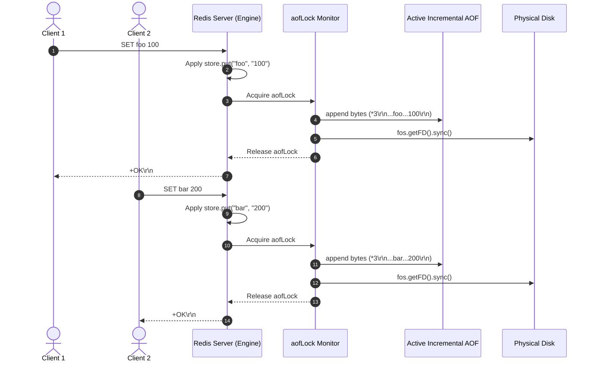
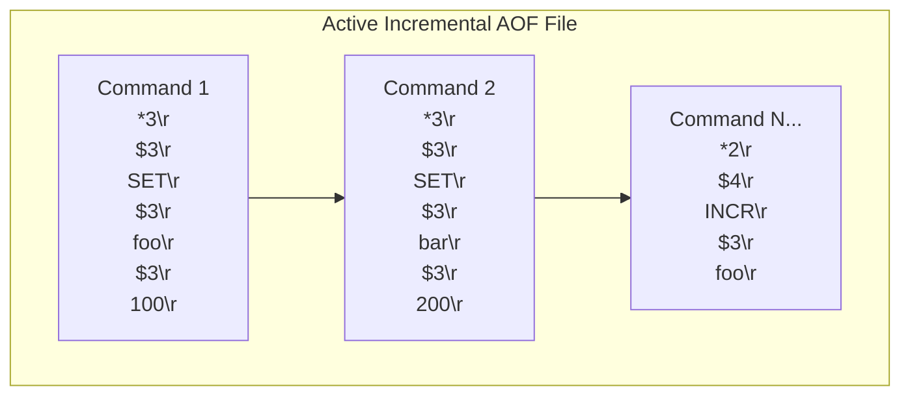

# Stage 80: Write multiple commands

---

## In one line
Append sequential state-modifying Redis commands (`SET`, `DEL`, `INCR`, `LPUSH`, `RPUSH`, `LPOP`) consecutively to the active incremental AOF file in contiguous RESP wire format with strict synchronous `fsync` ordering under `--appendfsync always`.

---

## Self-test (cover the answers below and answer these first)
1. **Are delimiters or separators placed between sequential commands in an AOF file?**
   - *Answer*: No. Each command is appended immediately after the preceding command as a continuous stream of bytes. The self-framing nature of RESP (e.g. `*<count>\r\n$<len>\r\n...`) allows the parser to cleanly identify command boundaries without additional delimiters.
2. **What commands qualify for logging into the AOF?**
   - *Answer*: Any command that alters database state—including `SET`, `DEL`, `INCR`, `LPUSH`, `RPUSH`, `LPOP`, `XADD`, etc. Read-only commands like `GET`, `PING`, `INFO`, and `XRANGE` must never be logged.
3. **What file access mode is required when writing commands to the active AOF log?**
   - *Answer*: Append mode (`new FileOutputStream(file, true)`), which sets the OS `O_APPEND` flag ensuring new writes do not overwrite existing log entries.
4. **How does concurrency control prevent interleaved or corrupted AOF records from multiple client threads?**
   - *Answer*: A dedicated monitor lock (`synchronized (aofLock)`) serializes all file write and fsync operations, guaranteeing atomic byte emission for each command array.
5. **How does Redis replay sequential commands on restart?**
   - *Answer*: Redis parses the continuous byte stream using a standard RESP parser, reading each array and feeding the extracted command and arguments sequentially into its command execution engine.
6. **If a modifying command fails validation (e.g. `INCR` on a non-integer value), should it be written to the AOF?**
   - *Answer*: No. Modifying commands that fail validation or abort with an error (e.g. `-ERR`) do not change state and must not be logged to the AOF.

---

## Problem Solved

In **Stage 80: Write multiple commands**, we extend AOF logging from a single write command to an ongoing, sequential command log:

1. **Continuous Multi-Command Logging**:
   - Each state-modifying command is serialized to RESP and appended consecutively to the active AOF incremental file.
2. **Deterministic Sequence Preservation**:
   - The ordering of writes in the AOF precisely mirrors the execution order across clients.
3. **Multi-Command Coverage**:
   - In addition to `SET`, commands like `INCR`, `LPUSH`, `RPUSH`, `LPOP`, and `DEL` are routed through `appendToAof(parts)`.

---

## Thought Process & Architectural Model

### 1. Sequential Write Pipeline



### 2. AOF File Byte Layout



---

## Full Solution

Relevant additions in [`codecrafters-redis-java/src/main/java/Main.java`](file:///C:/Users/jiten/Documents/Codecrafters-Build-from-scratch/codecrafters-redis-java/src/main/java/Main.java):

```java
  private static void appendToAof(String[] parts) {
    if (!"yes".equalsIgnoreCase(appendOnly) || activeAofFile == null) {
      return;
    }
    StringBuilder sb = new StringBuilder();
    sb.append("*").append(parts.length).append("\r\n");
    for (int i = 0; i < parts.length; i++) {
      String token = (i == 0) ? parts[i].toUpperCase() : parts[i];
      byte[] b = token.getBytes(StandardCharsets.UTF_8);
      sb.append("$").append(b.length).append("\r\n").append(token).append("\r\n");
    }
    byte[] bytes = sb.toString().getBytes(StandardCharsets.UTF_8);

    synchronized (aofLock) {
      try (java.io.FileOutputStream fos = new java.io.FileOutputStream(activeAofFile, true)) {
        fos.write(bytes);
        fos.flush();
        if ("always".equalsIgnoreCase(appendFsync)) {
          fos.getFD().sync();
        }
      } catch (java.io.IOException e) {
        System.err.println("Error appending to AOF: " + e.getMessage());
      }
    }
  }
```

Integration across mutating commands:

1. **`SET`**:
   ```java
   store.put(key, new Entry(value, expiresAt));
   touchWatchedKey(key);
   appendToAof(parts);
   out.write("+OK\r\n".getBytes(StandardCharsets.UTF_8));
   out.flush();
   propagate(parts);
   ```
2. **`INCR`**:
   ```java
   if (isNaN[0]) {
     out.write("-ERR value is not an integer or out of range\r\n".getBytes(StandardCharsets.UTF_8));
   } else {
     touchWatchedKey(key);
     appendToAof(parts);
     out.write((":" + resultVal[0] + "\r\n").getBytes(StandardCharsets.UTF_8));
   }
   ```
3. **`LPUSH` / `RPUSH`**:
   ```java
   touchWatchedKey(key);
   appendToAof(parts);
   String response = ":" + newLength + "\r\n";
   out.write(response.getBytes(StandardCharsets.UTF_8));
   ```
4. **`LPOP`**:
   ```java
   touchWatchedKey(key);
   appendToAof(parts);
   byte[] bytes = removedElement.getBytes(StandardCharsets.UTF_8);
   String response = "$" + bytes.length + "\r\n" + removedElement + "\r\n";
   out.write(response.getBytes(StandardCharsets.UTF_8));
   ```
5. **`DEL`**:
   ```java
   if (count > 0) {
     appendToAof(parts);
   }
   out.write((":" + count + "\r\n").getBytes(StandardCharsets.UTF_8));
   ```

---

## Concepts

1. **Continuous Write Log**:
   - An append-only log functions without internal chunk headers or magic byte separators. The self-describing framing of RESP elements guarantees lossless token boundary detection during forward sequential scanning.
2. **Atomic Serialization**:
   - All client worker threads route AOF writes through a unified synchronization primitive (`aofLock`). Even with hundreds of concurrent connections, commands are never interleaved at the byte level.
3. **Idempotent Replay Readiness**:
   - Appending exact command payloads guarantees that replaying the log from byte 0 reproduces identical server state.

---

## Wire Format

Sequential commands in file:

```text
*3\r\n$3\r\nSET\r\n$3\r\nfoo\r\n$3\r\n100\r\n*3\r\n$3\r\nSET\r\n$3\r\nbar\r\n$3\r\n200\r\n
```

---

## Failure Modes

1. **Truncated Writes**:
   - Handled by atomic array buffering: entire RESP byte sequence is constructed in memory (`StringBuilder` -> `byte[]`) before issuing the `fos.write(bytes)` call.
2. **Missing `append = true` Flag**:
   - Creating `FileOutputStream` without `true` truncates the file to 0 bytes on each command, leaving only the most recent write.

---

## Tradeoffs

- **Synchronous Flush Overhead**:
  - `appendfsync always` incurs a disk sync penalty on every write operation, providing maximum durability at the expense of peak throughput.
- **Append-Only Simplicity**:
  - Eliminates random I/O and complex file reorganization during logging.

---

## Java Specifics

- `new FileOutputStream(File, boolean append)`: Passing `true` ensures that all writes automatically seek to `EOF`.
- `FileDescriptor.sync()`: Enforces page cache flushing to disk before returning to caller.

---

## Rebuild Checklist

1. [x] Confirm `FileOutputStream` uses append mode (`true`).
2. [x] Wire `appendToAof(parts)` into all state-altering commands (`SET`, `INCR`, `LPUSH`, `RPUSH`, `LPOP`, `DEL`).
3. [x] Protect file writes with synchronization lock to prevent byte interleaving.
4. [x] Verify local build with `javac`.
