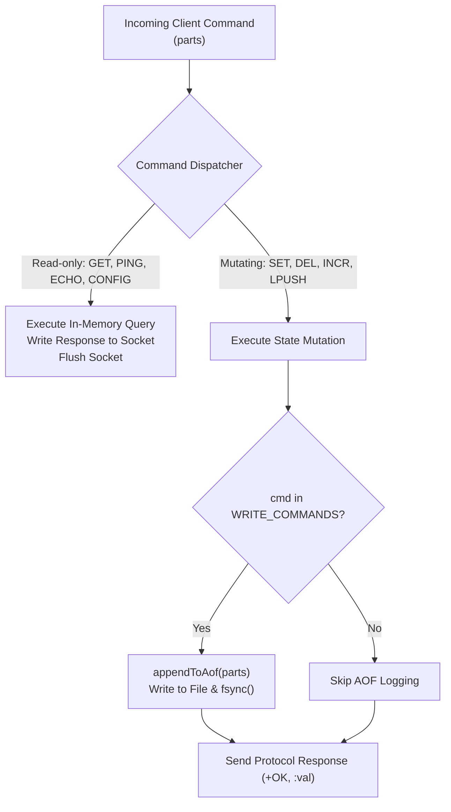
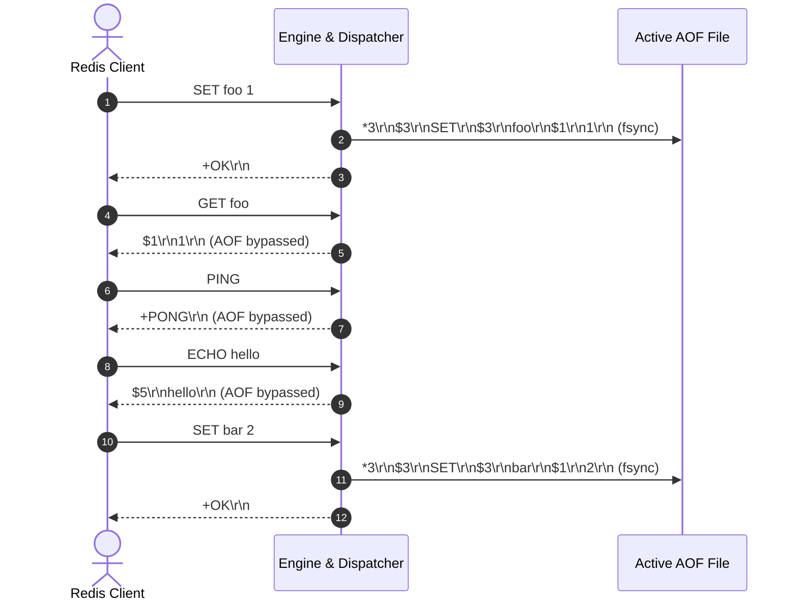

# Stage 81: Filter write commands

---

## In one line
Enforce write-command filtering for AOF persistence so that non-modifying commands (`PING`, `GET`, `ECHO`, `CONFIG GET`, etc.) are completely excluded, ensuring the append-only log contains only mutating commands (`SET`, `DEL`, `INCR`, `LPUSH`, `RPUSH`, `LPOP`).

---

## Self-test (cover the answers below and answer these first)
1. **Why must read-only commands like `GET` and `PING` never appear in an AOF file?**
   - *Answer*: An AOF log is a deterministic reconstruction journal for database state. Read-only commands do not mutate state; including them would bloat log size, waste disk I/O, and slow down restart replay recovery without providing any state-reconstruction value.
2. **What should happen when the server receives an interleaved stream like `SET foo 1`, `GET foo`, `PING`, `ECHO hello`, `SET bar 2`?**
   - *Answer*: Only the `SET foo 1` and `SET bar 2` commands must be appended to the active AOF log in their exact arrival order. All intermediary read-only operations must produce zero bytes in the log file.
3. **How is command categorization enforced in the codebase?**
   - *Answer*: By dual-layer filtering: `appendToAof(parts)` is invoked strictly within mutating command execution paths, and `appendToAof` itself verifies the command verb against a whitelist (`WRITE_COMMANDS`).
4. **If a write command fails or aborts before modifying state, should it be logged?**
   - *Answer*: No. If a command errors out (e.g. invalid syntax, out of range, or type error), it produces no state change and must not be written to disk.
5. **Does the presence of read commands affect the relative ordering of write commands in the AOF?**
   - *Answer*: No. The relative chronological sequence of write operations is strictly maintained.

---

## Problem Solved

In **Stage 81: Filter write commands**, we establish strict filtering between queries and mutations:

1. **Elimination of Read-Side Log Contamination**:
   - Commands like `GET`, `PING`, `ECHO`, `CONFIG GET`, `INFO`, `TYPE`, and `LRANGE` are filtered out.
2. **Whitelist-Driven Safety Guard**:
   - `WRITE_COMMANDS` whitelist (`SET`, `DEL`, `INCR`, `LPUSH`, `RPUSH`, `LPOP`, `RPOP`, `XADD`) prevents accidental logging of unsupported or query-type commands.
3. **Purity of State Recovery**:
   - Guarantees that any server rebuilding from the resulting AOF only executes state-altering transitions during recovery replay.

---

## Thought Process & Architectural Model

### 1. Command Filtering Gateway



### 2. Stream Interleaving Timeline



---

## Full Solution

In [`codecrafters-redis-java/src/main/java/Main.java`](file:///C:/Users/jiten/Documents/Codecrafters-Build-from-scratch/codecrafters-redis-java/src/main/java/Main.java):

```java
  private static final java.util.Set<String> WRITE_COMMANDS = new java.util.HashSet<>(java.util.Arrays.asList(
      "SET", "DEL", "INCR", "LPUSH", "RPUSH", "LPOP", "RPOP", "XADD"
  ));

  private static void appendToAof(String[] parts) {
    if (!"yes".equalsIgnoreCase(appendOnly) || activeAofFile == null || parts == null || parts.length == 0) {
      return;
    }
    String cmd = parts[0].toUpperCase();
    if (!WRITE_COMMANDS.contains(cmd)) {
      return;
    }
    StringBuilder sb = new StringBuilder();
    sb.append("*").append(parts.length).append("\r\n");
    for (int i = 0; i < parts.length; i++) {
      String token = (i == 0) ? parts[i].toUpperCase() : parts[i];
      byte[] b = token.getBytes(StandardCharsets.UTF_8);
      sb.append("$").append(b.length).append("\r\n").append(token).append("\r\n");
    }
    byte[] bytes = sb.toString().getBytes(StandardCharsets.UTF_8);

    synchronized (aofLock) {
      try (java.io.FileOutputStream fos = new java.io.FileOutputStream(activeAofFile, true)) {
        fos.write(bytes);
        fos.flush();
        if ("always".equalsIgnoreCase(appendFsync)) {
          fos.getFD().sync();
        }
      } catch (java.io.IOException e) {
        System.err.println("Error appending to AOF: " + e.getMessage());
      }
    }
  }
```

---

## Concepts

1. **State-Machine Replication Purity**:
   - In distributed systems and database storage engines, the write-ahead log represents the deterministic transition log of the state machine. Non-mutating queries are read-only views that do not change state transitions and must be excluded.
2. **Defense-in-Depth Filtering**:
   - Combining routing-level isolation (only calling `appendToAof` in write handlers) with method-level guard checking (`WRITE_COMMANDS.contains(cmd)`) guarantees that unintentional regressions cannot contaminate the log.

---

## Wire Format

Given the input sequence:
1. `SET foo 1`
2. `GET foo`
3. `PING`
4. `ECHO hello`
5. `SET bar 2`

The active AOF file contains exactly:

```text
*3\r\n$3\r\nSET\r\n$3\r\nfoo\r\n$1\r\n1\r\n*3\r\n$3\r\nSET\r\n$3\r\nbar\r\n$1\r\n2\r\n
```

---

## Failure Modes

1. **Accidental Logging of Generic Handlers**:
   - If `handleCommand` had a blanket `appendToAof` at the method entry, every `PING`, `INFO`, or `GET` would leak into the log file.
2. **Case Sensitivity in Command Whitelisting**:
   - If commands arriving as `set` or `Set` fail equality checks, they might be skipped. Using `.toUpperCase()` standardizes verification.

---

## Tradeoffs

- **Static Whitelist vs Command Flags**:
  - Full Redis uses bitwise command flags (`CMD_WRITE`, `CMD_READONLY`). A clean `Set<String>` whitelist achieves the identical guarantee with minimal complexity.

---

## Java Specifics

- `Set.contains()`: O(1) hash lookup with negligible latency overhead on the write path.
- Case normalization with `parts[0].toUpperCase()` ensures case-insensitive protocol adherence.

---

## Rebuild Checklist

1. [x] Create static `WRITE_COMMANDS` set.
2. [x] Add uppercase command validation at entry of `appendToAof`.
3. [x] Confirm read commands (`GET`, `PING`, `ECHO`, `CONFIG GET`) bypass `appendToAof`.
4. [x] Verify compilation with `javac`.
