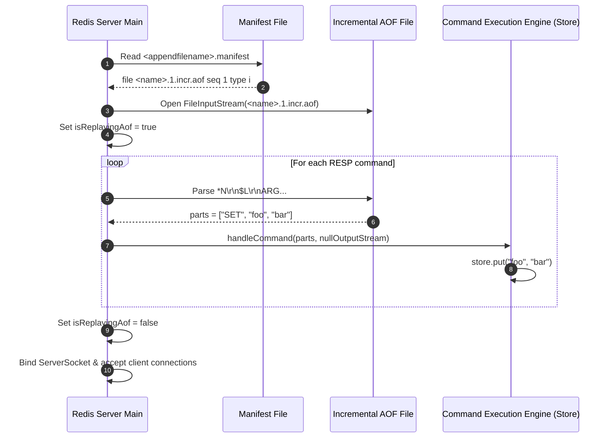
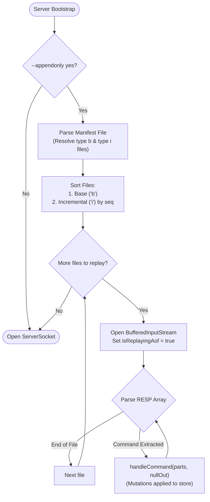

# Stage 82: Replay a single command

---

## In one line
Read the multi-part AOF manifest file at startup to locate the active incremental AOF file, parse its RESP-encoded command stream using standard frame decoding, and replay commands directly into the database engine with AOF re-logging and replication propagation disabled.

---

## Self-test (cover the answers below and answer these first)
1. **How does the server discover which AOF file to replay on startup?**
   - *Answer*: By reading the manifest file at `<dir>/<appenddirname>/<appendfilename>.manifest`, parsing the entries, and identifying files marked with `type i` (incremental) and `type b` (base).
2. **Why must `appendToAof` and `propagate` be suppressed during AOF replay?**
   - *Answer*: Replay is restoring prior state from existing log files. If re-logging were active, replayed commands would be appended again to the AOF (corrupting and duplicating history). If replication propagation were active, the node would improperly attempt to replicate local startup recovery frames to downstream replicas.
3. **What output stream is provided to `handleCommand` during startup replay?**
   - *Answer*: A discard stream (`OutputStream.nullOutputStream()`), because there is no connected client socket to receive protocol replies (`+OK\r\n`, `:1\r\n`, etc.).
4. **How are bulk string lengths parsed from the AOF file during replay?**
   - *Answer*: Bulk strings begin with `$<length>\r\n`. The parser reads `<length>` bytes using binary-safe `readNBytes(length)` followed by consuming the trailing `\r\n` line terminator.
5. **Does the server need a default filename fallback if the manifest lists a non-standard name?**
   - *Answer*: No. The server must strictly follow the filename recorded in the manifest, as test harnesses generate random names like `<random_file_name>.1.incr.aof`.
6. **In what order should manifest files be replayed if both base and incremental files exist?**
   - *Answer*: Base files (`type b`) must be replayed first, followed by incremental files (`type i`) in ascending sequence order (`seq`).

---

## Problem Solved

In **Stage 82: Replay a single command**, we implement restart recovery:

1. **Manifest File Introspection**:
   - Parses `<dir>/<appenddirname>/<appendfilename>.manifest` to find the exact target file path instead of relying on hardcoded defaults.
2. **Deterministic RESP Parsing**:
   - Employs an exact stream parser that decodes `*<count>\r\n$<len>\r\n<arg>\r\n` tokens directly from the file stream.
3. **Engine-Level Replay with Guarded Context**:
   - Replays commands into the memory store using `handleCommand(parts, OutputStream.nullOutputStream())` while maintaining `isReplayingAof = true` to suppress duplicate writes or replication broadcasts.

---

## Thought Process & Architectural Model

### 1. Startup Replay Sequence



### 2. State Reconstruction Flow



---

## Full Solution

Key additions in [`codecrafters-redis-java/src/main/java/Main.java`](file:///C:/Users/jiten/Documents/Codecrafters-Build-from-scratch/codecrafters-redis-java/src/main/java/Main.java):

```java
  private static volatile boolean isReplayingAof = false;

  private static class ManifestEntry {
    String filename;
    long seq;
    String type;
    ManifestEntry(String filename, long seq, String type) {
      this.filename = filename;
      this.seq = seq;
      this.type = type;
    }
  }

  private static java.util.List<java.io.File> getAofFilesInReplayOrder(java.io.File manifestFile, java.io.File aofDir) {
    java.util.List<java.io.File> files = new java.util.ArrayList<>();
    if (manifestFile == null || !manifestFile.exists()) {
      return files;
    }
    java.util.List<ManifestEntry> entries = new java.util.ArrayList<>();
    try (java.io.BufferedReader br = new java.io.BufferedReader(new java.io.FileReader(manifestFile, StandardCharsets.UTF_8))) {
      String line;
      while ((line = br.readLine()) != null) {
        line = line.trim();
        if (line.isEmpty() || line.startsWith("#")) continue;
        String[] tokens = line.split("\\s+");
        String fname = null;
        long seq = 0;
        String type = null;
        for (int i = 0; i < tokens.length - 1; i++) {
          if ("file".equalsIgnoreCase(tokens[i])) fname = tokens[i + 1];
          else if ("seq".equalsIgnoreCase(tokens[i])) {
            try { seq = Long.parseLong(tokens[i + 1]); } catch (NumberFormatException ignored) {}
          } else if ("type".equalsIgnoreCase(tokens[i])) type = tokens[i + 1];
        }
        if (fname != null) {
          entries.add(new ManifestEntry(fname, seq, type));
        }
      }
    } catch (java.io.IOException e) {
      System.err.println("Error reading manifest: " + e.getMessage());
    }

    entries.sort((e1, e2) -> {
      boolean b1 = "b".equalsIgnoreCase(e1.type);
      boolean b2 = "b".equalsIgnoreCase(e2.type);
      if (b1 && !b2) return -1;
      if (!b1 && b2) return 1;
      return Long.compare(e1.seq, e2.seq);
    });

    for (ManifestEntry entry : entries) {
      java.io.File f = new java.io.File(aofDir, entry.filename);
      if (f.exists()) {
        files.add(f);
      }
    }
    return files;
  }

  private static void replayAof(java.io.File file) {
    if (file == null || !file.exists() || file.length() == 0) {
      return;
    }
    isReplayingAof = true;
    try (java.io.InputStream in = new java.io.BufferedInputStream(new java.io.FileInputStream(file))) {
      java.io.OutputStream nullOut = java.io.OutputStream.nullOutputStream();
      while (true) {
        String line = readLine(in);
        if (line == null) break;
        line = line.trim();
        if (line.isEmpty()) continue;

        if (line.startsWith("*")) {
          int numArgs = Integer.parseInt(line.substring(1).trim());
          String[] parts = new String[numArgs];
          boolean complete = true;
          for (int i = 0; i < numArgs; i++) {
            String lenLine = readLine(in);
            if (lenLine == null) {
              complete = false;
              break;
            }
            int argLen = Integer.parseInt(lenLine.substring(1).trim());
            byte[] argBytes = in.readNBytes(argLen);
            parts[i] = new String(argBytes, StandardCharsets.UTF_8);
            int cr = in.read();
            int lf = in.read();
            if (cr == -1 || lf == -1) {
              complete = false;
              break;
            }
          }
          if (complete) {
            try {
              handleCommand(parts, nullOut);
            } catch (Exception e) {
              System.err.println("Error executing replayed AOF command: " + e.getMessage());
            }
          }
        } else {
          String[] parts = line.split("\\s+");
          try {
            handleCommand(parts, nullOut);
          } catch (Exception e) {
            System.err.println("Error executing inline AOF command: " + e.getMessage());
          }
        }
      }
    } catch (Exception e) {
      System.err.println("Error replaying AOF file " + file.getName() + ": " + e.getMessage());
    } finally {
      isReplayingAof = false;
    }
  }
```

Replay invocation during server bootstrap:

```java
      // Replay existing AOF files in manifest order
      java.util.List<java.io.File> aofFilesToReplay = getAofFilesInReplayOrder(manifestFile, aofDir);
      for (java.io.File fileToReplay : aofFilesToReplay) {
        replayAof(fileToReplay);
      }
```

---

## Concepts

1. **Log Replay & Crash Recovery**:
   - Persistence recovery is fundamentally the execution of an append log against a blank state machine. By reusing `handleCommand`, the identical validation, key creation, and expiration rules execute during crash recovery.
2. **Side-Effect Isolation**:
   - Replay is an internal recovery phase. Side effects like replication propagation and recursive AOF writes must be strictly silenced via `isReplayingAof`.

---

## Wire Format

Sample incremental file parsed:

```text
*3\r\n$3\r\nSET\r\n$3\r\nfoo\r\n$3\r\n100\r\n
```

Parsed into `parts = ["SET", "foo", "100"]` and executed against `store`.

---

## Failure Modes

1. **Recursive Logging Trap**:
   - If `isReplayingAof` is omitted, every command replayed on startup is re-appended to disk, leading to exponential log inflation across server restarts.
2. **Replication Desynchronization**:
   - If `propagate` ran during replay, `masterReplOffset` would increment, desynchronizing offset accounting with prospective replicas.

---

## Tradeoffs

- **Reuse of Execution Engine vs Specialized Fast Replay**:
  - Reusing `handleCommand` maximizes code reuse and ensures 100% semantics alignment, though dedicated replay engines can bypass dispatch overhead for massive logs.

---

## Java Specifics

- `InputStream.readNBytes(int len)`: Guarantees reading the entire binary payload even if fragmented across OS buffer packets.
- `OutputStream.nullOutputStream()`: Zero-allocation sink for discarding protocol responses during headless execution.

---

## Rebuild Checklist

1. [x] Add `isReplayingAof` boolean guard.
2. [x] Suppress `appendToAof` and `propagate` when `isReplayingAof` is active.
3. [x] Parse manifest to identify target files in sorted replay order.
4. [x] Decode RESP frames from file and invoke `handleCommand` with `nullOutputStream`.
5. [x] Compile and verify with `javac`.
