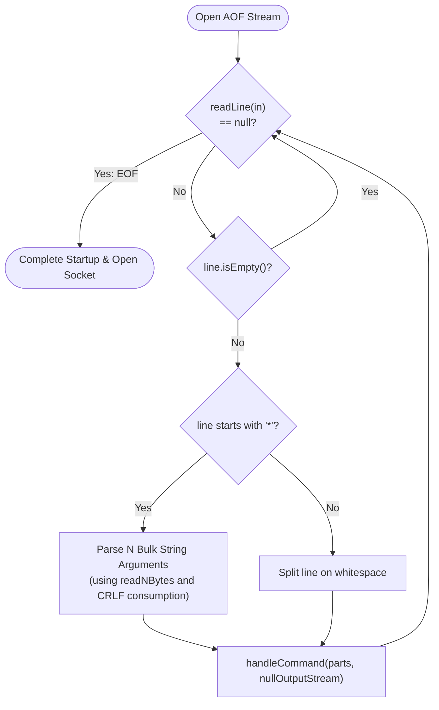
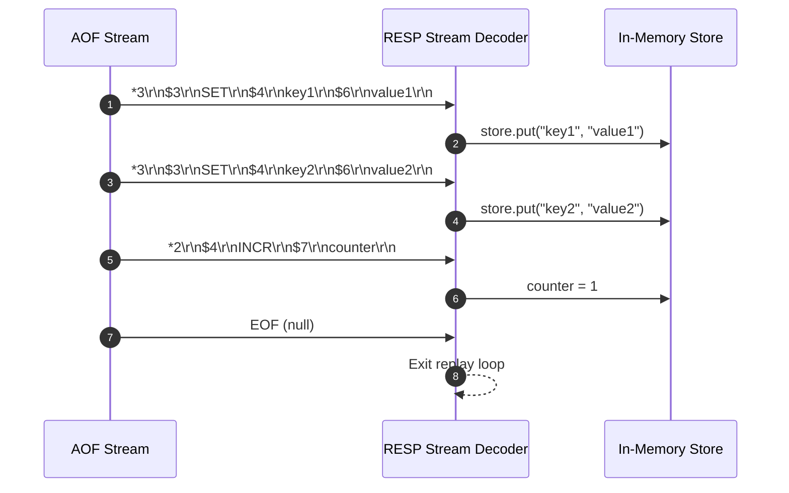

# Stage 83: Replay multiple commands

---

## In one line
Parse consecutive self-framing RESP arrays from the active AOF log in sequence until EOF, applying mutations iteratively against the in-memory database to restore full historical state.

---

## Self-test (cover the answers below and answer these first)
1. **Why do append-only files not require separators or boundary markers between consecutive commands?**
   - *Answer*: RESP is a self-framing protocol. The array header `*<count>\r\n` specifies the exact number of elements, and each bulk string `$<length>\r\n` specifies the exact byte count. Once a command's arguments and delimiters are read, the very next byte starts the subsequent command.
2. **What happens if multiple `SET` commands for the same key exist in an AOF file during replay?**
   - *Answer*: Commands are executed sequentially in temporal order. Later `SET` commands overwrite earlier values, leaving the database in the exact final state expected.
3. **How does the parser know when the replay is finished?**
   - *Answer*: When `readLine(in)` returns `null`, indicating an end-of-stream (EOF) condition on the underlying file stream.
4. **How should empty lines or line-ending variations (`\r\n` vs `\n`) between commands be handled?**
   - *Answer*: Trailing empty lines are trimmed and ignored via `if (line.isEmpty()) continue;`, and bulk string terminators flexibly consume either `\r\n` or single `\n` without eating into the next command header.
5. **If an AOF contains an interleaved sequence of writes like `SET k1 v1`, `INCR c`, `RPUSH list a b`, `DEL k1`, what is the outcome?**
   - *Answer*: Each command triggers its state transition through `handleCommand(parts, nullOut)` in exact sequential order, restoring `c`, `list`, and removing `k1`.

---

## Problem Solved

In **Stage 83: Replay multiple commands**, we support arbitrary-length command sequences in AOF files:

1. **Continuous Stream Processing**:
   - Loops through the byte stream decoding command boundaries continuously until EOF.
2. **Cumulative State Reconstruction**:
   - Reconstructs complex database state spanning multiple keys, collections (lists, streams), counters, and deletions.
3. **Delimiter Resilience**:
   - Confirms robust frame parsing across different operating system line terminators (`CRLF` vs `LF`).

---

## Thought Process & Architectural Model

### 1. Multi-Command Replay Pipeline



### 2. Sequential State Evolution



---

## Full Solution

In [`codecrafters-redis-java/src/main/java/Main.java`](file:///C:/Users/jiten/Documents/Codecrafters-Build-from-scratch/codecrafters-redis-java/src/main/java/Main.java):

```java
  private static void replayAof(java.io.File file) {
    if (file == null || !file.exists() || file.length() == 0) {
      return;
    }
    isReplayingAof = true;
    try (java.io.InputStream in = new java.io.BufferedInputStream(new java.io.FileInputStream(file))) {
      java.io.OutputStream nullOut = java.io.OutputStream.nullOutputStream();
      while (true) {
        String line = readLine(in);
        if (line == null) break;
        line = line.trim();
        if (line.isEmpty()) continue;

        if (line.startsWith("*")) {
          int numArgs = Integer.parseInt(line.substring(1).trim());
          String[] parts = new String[numArgs];
          boolean complete = true;
          for (int i = 0; i < numArgs; i++) {
            String lenLine = readLine(in);
            if (lenLine == null) {
              complete = false;
              break;
            }
            int argLen = Integer.parseInt(lenLine.substring(1).trim());
            byte[] argBytes = in.readNBytes(argLen);
            parts[i] = new String(argBytes, StandardCharsets.UTF_8);
            int b1 = in.read();
            if (b1 == '\r') {
              int b2 = in.read();
              if (b2 == -1) {
                complete = false;
                break;
              }
            } else if (b1 == -1) {
              complete = false;
              break;
            }
          }
          if (complete) {
            try {
              handleCommand(parts, nullOut);
            } catch (Exception e) {
              System.err.println("Error executing replayed AOF command: " + e.getMessage());
            }
          }
        } else {
          String[] parts = line.split("\\s+");
          try {
            handleCommand(parts, nullOut);
          } catch (Exception e) {
            System.err.println("Error executing inline AOF command: " + e.getMessage());
          }
        }
      }
    } catch (Exception e) {
      System.err.println("Error replaying AOF file " + file.getName() + ": " + e.getMessage());
    } finally {
      isReplayingAof = false;
    }
  }
```

---

## Concepts

1. **Self-Framing Protocols**:
   - Because each message declares its own boundary information (both element count and byte length), multiple frames can be packed end-to-end without extra delimiters or separators.
2. **Order-Dependent Convergence**:
   - AOF recovery guarantees eventual state consistency by relying on total chronological ordering: every mutating event is applied in the exact sequence it originally occurred.

---

## Wire Format

Consecutive frames in the file:

```text
*3\r\n$3\r\nSET\r\n$4\r\nfoo1\r\n$3\r\nbar\r\n*3\r\n$3\r\nSET\r\n$4\r\nfoo2\r\n$3\r\nbaz\r\n
```

- Decoded as Command 1: `["SET", "foo1", "bar"]`
- Decoded as Command 2: `["SET", "foo2", "baz"]`

---

## Failure Modes

1. **Premature Termination on First Command**:
   - If the replay loop exits after a single command rather than looping until EOF, only the first key is restored while remaining data is silently lost.
2. **Buffer Over-Read Corruption**:
   - Reading more bytes than the bulk string length eats into subsequent command headers, corrupting all downstream command parsing.

---

## Tradeoffs

- **Buffered Stream vs MappedByteBuffer**:
  - `BufferedInputStream` provides simple, memory-efficient sequential reading with constant RAM overhead, whereas memory-mapping (`FileChannel.map`) can be faster for gigabyte-scale logs at the expense of virtual memory address space.

---

## Java Specifics

- `BufferedInputStream`: Wraps `FileInputStream` to buffer disk I/O in 8KB chunks, reducing system calls during byte-by-byte delimiter scanning.
- Robust boundary consumption: `int b1 = in.read(); if (b1 == '\r') in.read();` handles CRLF cleanly across operating system boundaries.

---

## Rebuild Checklist

1. [x] Loop `while (true)` until `readLine(in) == null`.
2. [x] Parse consecutive array headers and bulk string payloads.
3. [x] Apply each command iteratively to `handleCommand`.
4. [x] Reset `isReplayingAof = false` in `finally` block.
5. [x] Verify compilation with `javac`.
