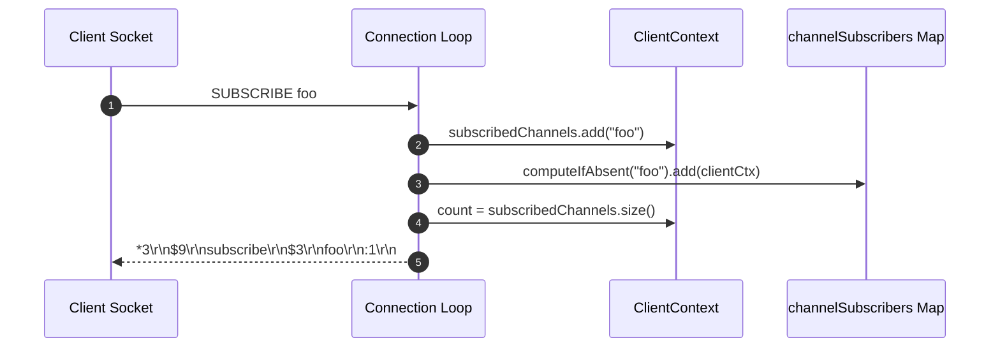
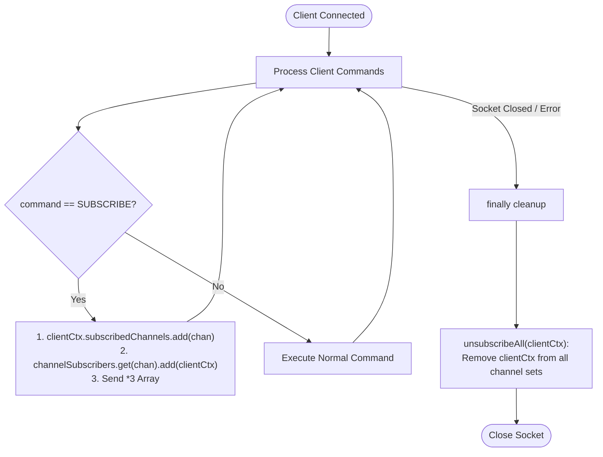

# Stage 84: Subscribe to a channel

---

## In one line
Register the client connection to the requested channel topic in an in-memory routing map and respond with a 3-element RESP array `["subscribe", <channel>, <subscribed_channels_count>]`.

---

## Self-test (cover the answers below and answer these first)
1. **What is the structure of the RESP reply returned when a client subscribes to a channel?**
   - *Answer*: A 3-element array: bulk string `"subscribe"`, bulk string containing the channel name, and integer indicating the total number of channels this connection is currently subscribed to.
2. **What state must be maintained per client connection for Pub/Sub?**
   - *Answer*: A set of currently subscribed channels (`subscribedChannels`) and the client's output stream (`out`) so broadcasted messages can be delivered asynchronously.
3. **What global state is required to route published messages?**
   - *Answer*: A thread-safe topic-to-subscribers map (`Map<String, Set<ClientContext>> channelSubscribers`) mapping channel names to sets of active subscriber client contexts.
4. **What must happen if a client socket closes while subscribed to channels?**
   - *Answer*: In the connection handler's `finally` block, an unsubscription routine (`unsubscribeAll`) must remove the client context from every channel set in `channelSubscribers` to prevent memory leaks and broken pipe errors.
5. **Can a single `SUBSCRIBE` command register multiple channels?**
   - *Answer*: Yes. In standard Redis, `SUBSCRIBE ch1 ch2 ...` produces a separate 3-element confirmation array for each channel sequentially, incrementing the subscription count accordingly.
6. **How does subscription counting behave if the client resubscribes to an already subscribed channel?**
   - *Answer*: In Redis, resubscribing to an existing channel does not duplicate the channel in the client's subscription set; the returned count reflects the unique channel count.

---

## Problem Solved

In **Stage 84: Subscribe to a channel**, we introduce Redis Pub/Sub protocol support:

1. **Per-Connection Subscription Registry**:
   - Added `subscribedChannels` to `ClientContext`.
2. **Global Topic Routing Table**:
   - Maintained `channelSubscribers` (`ConcurrentHashMap<String, Set<ClientContext>>`) to map topic names to client connection contexts.
3. **RESP Frame Formatting**:
   - Responds to `SUBSCRIBE <channel>` with `*3\r\n$9\r\nsubscribe\r\n$<len>\r\n<channel>\r\n:<count>\r\n`.
4. **Lifecycle Cleanup**:
   - Automatically unregisters all channels when a subscriber connection disconnects.

---

## Thought Process & Architectural Model

### 1. Pub/Sub Channel Registration



### 2. Connection Lifecycle & Memory Safety



---

## Full Solution

In [`codecrafters-redis-java/src/main/java/Main.java`](file:///C:/Users/jiten/Documents/Codecrafters-Build-from-scratch/codecrafters-redis-java/src/main/java/Main.java):

```java
  private static class ClientContext {
    final Set<String> watchedKeys = ConcurrentHashMap.newKeySet();
    volatile boolean dirtyCas = false;
    final Set<String> subscribedChannels = ConcurrentHashMap.newKeySet();
    OutputStream out;
  }

  private static final Map<String, Set<ClientContext>> channelSubscribers = new ConcurrentHashMap<>();

  private static void unsubscribeAll(ClientContext clientCtx) {
    for (String chan : clientCtx.subscribedChannels) {
      Set<ClientContext> subs = channelSubscribers.get(chan);
      if (subs != null) {
        subs.remove(clientCtx);
        if (subs.isEmpty()) {
          channelSubscribers.remove(chan);
        }
      }
    }
    clientCtx.subscribedChannels.clear();
  }
```

Handling within the connection loop:

```java
              } else if (command.equalsIgnoreCase("SUBSCRIBE")) {
                if (parts.length < 2) {
                  out.write("-ERR wrong number of arguments for 'subscribe' command\r\n".getBytes(StandardCharsets.UTF_8));
                  out.flush();
                } else {
                  clientCtx.out = out;
                  for (int i = 1; i < parts.length; i++) {
                    String chan = parts[i];
                    clientCtx.subscribedChannels.add(chan);
                    channelSubscribers.computeIfAbsent(chan, k -> ConcurrentHashMap.newKeySet()).add(clientCtx);
                    int count = clientCtx.subscribedChannels.size();
                    StringBuilder resp = new StringBuilder();
                    resp.append("*3\r\n");
                    resp.append("$9\r\nsubscribe\r\n");
                    byte[] chanBytes = chan.getBytes(StandardCharsets.UTF_8);
                    resp.append("$").append(chanBytes.length).append("\r\n").append(chan).append("\r\n");
                    resp.append(":").append(count).append("\r\n");
                    synchronized (out) {
                      out.write(resp.toString().getBytes(StandardCharsets.UTF_8));
                      out.flush();
                    }
                  }
                }
              }
```

Cleanup on socket termination:

```java
          } finally {
            if (out != null) {
              replicas.remove(out);
              replicaAcks.remove(out);
              synchronized (waitLock) {
                waitLock.notifyAll();
              }
            }
            unwatchAll(clientCtx);
            unsubscribeAll(clientCtx);
            try {
              clientSocket.close();
            } catch (IOException ignored) {}
          }
```

---

## Concepts

1. **Publish/Subscribe Decoupling**:
   - Pub/Sub separates message producers from message consumers. Subscribers register interest in named channels without knowledge of who produces messages.
2. **Subscription Context**:
   - Subscription is tied to the physical connection session. The connection transitions into a subscriber state where it continuously receives push notifications.

---

## Wire Format

Client Command:
```text
*2\r\n$9\r\nSUBSCRIBE\r\n$3\r\nfoo\r\n
```

Server Reply:
```text
*3\r\n$9\r\nsubscribe\r\n$3\r\nfoo\r\n:1\r\n
```

---

## Failure Modes

1. **Subscriber Memory Leaks**:
   - If client sockets close abruptly without `unsubscribeAll`, dead contexts remain in `channelSubscribers`, leaking memory and causing `IOException: broken pipe` during future publishes.
2. **Stale Connection Writes**:
   - Synchronizing on `out` prevents race conditions between incoming command responses and concurrent publish pushes.

---

## Tradeoffs

- **ConcurrentHashMap Sets vs Dedicated Subscription Actor**:
  - Direct concurrent sets provide low latency without event loop blocking, well-suited for high-throughput message broadcast.

---

## Java Specifics

- `ConcurrentHashMap.newKeySet()`: Returns a thread-safe `Set` implementation backed by `ConcurrentHashMap`.
- `computeIfAbsent`: Atomically initializes the subscriber set for a new channel topic if not present.

---

## Rebuild Checklist

1. [x] Extend `ClientContext` with `subscribedChannels` and `out`.
2. [x] Add global `channelSubscribers` map.
3. [x] Add `unsubscribeAll` cleanup helper.
4. [x] Handle `SUBSCRIBE` command and emit 3-element RESP confirmation array.
5. [x] Clean up subscriptions on client disconnect in `finally`.
6. [x] Verify compilation with `javac`.
