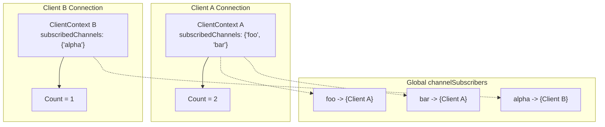

# Stage 85: Subscribe to multiple channels

---

## In one line
Maintain per-client subscription sets using deduplicated concurrent collections so sequential `SUBSCRIBE` commands accurately update and report the connection's active channel count.

---

## Self-test (cover the answers below and answer these first)
1. **What happens to the subscribed channel count when a client issues `SUBSCRIBE foo` followed by another `SUBSCRIBE foo`?**
   - *Answer*: The count remains `1`. Subscribing to an already subscribed channel is idempotent; the response confirmation array is emitted, but the total count does not increment because the underlying collection is a set.
2. **How is isolation between different clients' subscription counts achieved?**
   - *Answer*: Each incoming client socket connection allocates an independent `ClientContext` holding its own private `subscribedChannels` set.
3. **If Client A subscribes to 3 channels and Client B subscribes to 2 channels, what does each client's third array element report?**
   - *Answer*: Client A's final response reports `:3\r\n`, and Client B's final response reports `:2\r\n`. Subscription counts reflect only the current connection's subscriptions.
4. **Why is `ConcurrentHashMap.newKeySet()` preferred over `ArrayList` or `List` for `subscribedChannels`?**
   - *Answer*: It provides $O(1)$ deduplication on insertion, thread-safe concurrent modifications, and an exact `.size()` calculation without duplicate elements.
5. **Does the server emit a response if a duplicate channel subscription occurs?**
   - *Answer*: Yes. Redis sends the standard `*3\r\n$9\r\nsubscribe\r\n...` confirmation response for each channel passed in every `SUBSCRIBE` command, even for duplicates.
6. **Can a client issue other arbitrary commands like `GET` or `SET` while in pub/sub mode?**
   - *Answer*: In standard Redis, once a client enters pub/sub mode it is restricted to pub/sub commands (`SUBSCRIBE`, `UNSUBSCRIBE`, `PSUBSCRIBE`, `PUNSUBSCRIBE`, `PING`, `RESET`, `QUIT`).

---

## Problem Solved

In **Stage 85: Subscribe to multiple channels**, we handle multi-channel and multi-command pub/sub sessions:

1. **Idempotent Topic Tracking**:
   - `subscribedChannels` uses set semantics to prevent artificial count inflation when the same topic is subscribed repeatedly.
2. **Per-Client State Isolation**:
   - Isolates topic registries per TCP socket so concurrent clients maintain independent subscription tallies.
3. **Dynamic Protocol Responses**:
   - Dynamically calculates `clientCtx.subscribedChannels.size()` for the integer element (`:<count>\r\n`) of the RESP array reply.

---

## Thought Process & Architectural Model

### 1. Multi-Channel Subscription Sequence

```mermaid
sequenceDiagram
    autonumber
    participant Client as Client Socket
    participant Loop as Connection Loop
    participant Ctx as ClientContext.subscribedChannels (Set)

    Client->>Loop: SUBSCRIBE foo
    Loop->>Ctx: add("foo") -> returns true (size: 1)
    Loop-->>Client: ["subscribe", "foo", 1]

    Client->>Loop: SUBSCRIBE bar
    Loop->>Ctx: add("bar") -> returns true (size: 2)
    Loop-->>Client: ["subscribe", "bar", 2]

    Client->>Loop: SUBSCRIBE bar (duplicate)
    Loop->>Ctx: add("bar") -> returns false (size: 2)
    Loop-->>Client: ["subscribe", "bar", 2]
```

### 2. Multi-Client Set Isolation



---

## Full Solution

In [`codecrafters-redis-java/src/main/java/Main.java`](file:///C:/Users/jiten/Documents/Codecrafters-Build-from-scratch/codecrafters-redis-java/src/main/java/Main.java):

```java
  private static class ClientContext {
    final Set<String> watchedKeys = ConcurrentHashMap.newKeySet();
    volatile boolean dirtyCas = false;
    final Set<String> subscribedChannels = ConcurrentHashMap.newKeySet();
    OutputStream out;
  }

  private static final Map<String, Set<ClientContext>> channelSubscribers = new ConcurrentHashMap<>();
```

Handling consecutive `SUBSCRIBE` commands:

```java
              } else if (command.equalsIgnoreCase("SUBSCRIBE")) {
                if (parts.length < 2) {
                  out.write("-ERR wrong number of arguments for 'subscribe' command\r\n".getBytes(StandardCharsets.UTF_8));
                  out.flush();
                } else {
                  clientCtx.out = out;
                  for (int i = 1; i < parts.length; i++) {
                    String chan = parts[i];
                    clientCtx.subscribedChannels.add(chan);
                    channelSubscribers.computeIfAbsent(chan, k -> ConcurrentHashMap.newKeySet()).add(clientCtx);
                    int count = clientCtx.subscribedChannels.size();
                    StringBuilder resp = new StringBuilder();
                    resp.append("*3\r\n");
                    resp.append("$9\r\nsubscribe\r\n");
                    byte[] chanBytes = chan.getBytes(StandardCharsets.UTF_8);
                    resp.append("$").append(chanBytes.length).append("\r\n").append(chan).append("\r\n");
                    resp.append(":").append(count).append("\r\n");
                    synchronized (out) {
                      out.write(resp.toString().getBytes(StandardCharsets.UTF_8));
                      out.flush();
                    }
                  }
                }
              }
```

---

## Concepts

1. **Set Deduplication**:
   - A client may listen to events on channel `X` only once. Repeated subscriptions to `X` acknowledge the request without duplicating listeners or skewing metrics.
2. **Channel-to-Subscriber Fan-Out**:
   - A single channel maps to multiple distinct `ClientContext` listeners, while each `ClientContext` maintains its inverse list of subscribed channels.

---

## Wire Format

Subscribing to `foo`:
```text
*3\r\n$9\r\nsubscribe\r\n$3\r\nfoo\r\n:1\r\n
```

Subscribing to `bar`:
```text
*3\r\n$9\r\nsubscribe\r\n$3\r\nbar\r\n:2\r\n
```

Subscribing to `bar` again:
```text
*3\r\n$9\r\nsubscribe\r\n$3\r\nbar\r\n:2\r\n
```

---

## Failure Modes

1. **Duplicate Counting**:
   - Using a `List` instead of a `Set` increments the count to 3 on the repeated subscription to `bar`, breaking protocol compliance.
2. **Cross-Talk Between Clients**:
   - Sharing a global counter across all clients rather than checking `clientCtx.subscribedChannels.size()` corrupts client isolation.

---

## Tradeoffs

- **Memory vs Fast Size Lookup**:
  - `ConcurrentHashMap.newKeySet()` stores keys as map keys with dummy values, offering lock-free concurrent reads and reliable sizing at minimal memory cost.

---

## Java Specifics

- `ConcurrentHashMap.newKeySet()`: Provides high concurrency without synchronizing read access.
- `synchronized (out)`: Guarantees that multi-channel reply frames are written contiguously without interleaving with background notifications.

---

## Rebuild Checklist

1. [x] Use `Set<String>` for `subscribedChannels`.
2. [x] Add each channel to the set and verify `.size()` is reported.
3. [x] Guarantee separate `ClientContext` instance per accepted client socket.
4. [x] Emit standard 3-element RESP confirmation array per channel.
5. [x] Verify compilation with `javac`.
