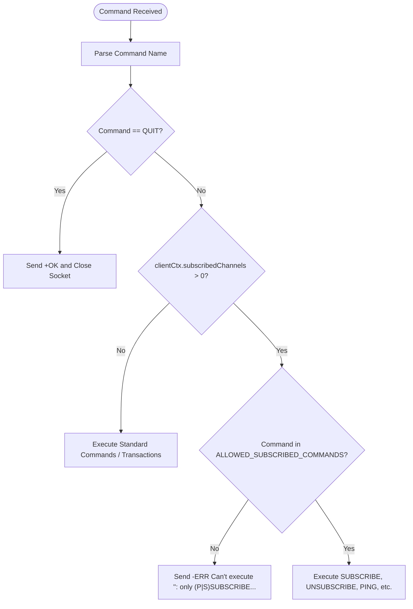
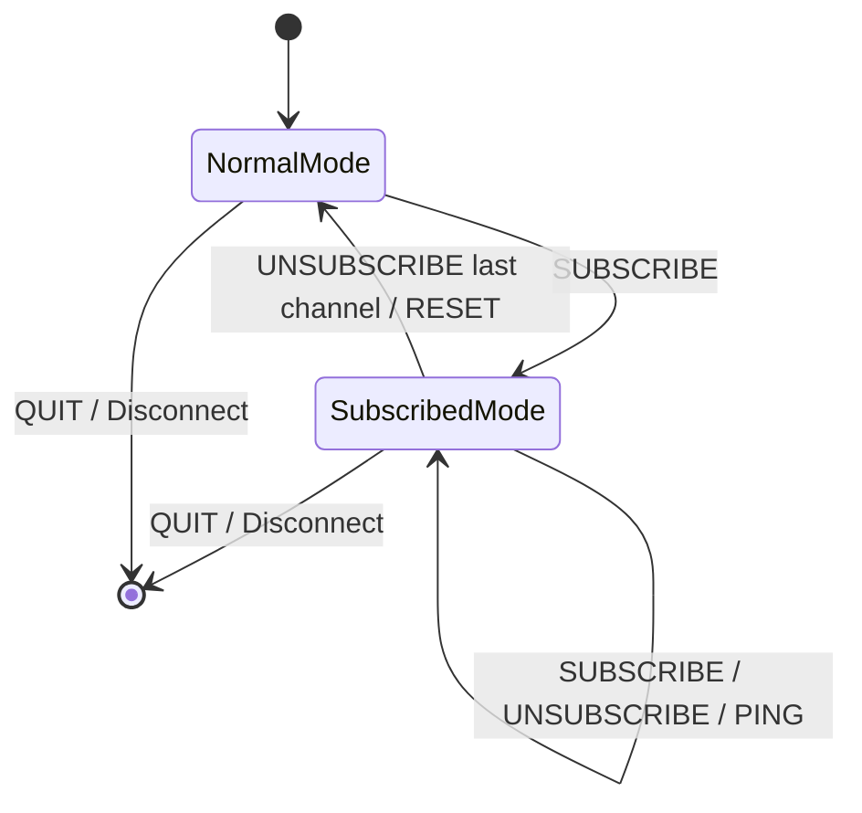

# Stage 86: Enter subscribed mode

---

## In one line
Guard the connection dispatch loop when active subscriptions exist, restricting valid commands to the Pub/Sub whitelist and rejecting all other commands with `-ERR Can't execute '<command>': only (P|S)SUBSCRIBE / (P|S)UNSUBSCRIBE / PING / QUIT / RESET are allowed in this context`.

---

## Self-test (cover the answers below and answer these first)
1. **When does a Redis connection officially enter Subscribed mode?**
   - *Answer*: As soon as a client successfully executes a `SUBSCRIBE` (or `PSUBSCRIBE` / `SSUBSCRIBE`) command and has at least one active channel subscription (`!clientCtx.subscribedChannels.isEmpty()`).
2. **Which commands are permitted once a client enters Subscribed mode?**
   - *Answer*: Only pub/sub management and connection commands: `SUBSCRIBE`, `UNSUBSCRIBE`, `PSUBSCRIBE`, `PUNSUBSCRIBE`, `SSUBSCRIBE`, `SUNSUBSCRIBE`, `PING`, `QUIT`, and `RESET`.
3. **What error reply is returned if a client in Subscribed mode attempts to call `SET` or `GET`?**
   - *Answer*: A Simple Error: `-ERR Can't execute '<cmd>': only (P|S)SUBSCRIBE / (P|S)UNSUBSCRIBE / PING / QUIT / RESET are allowed in this context\r\n`.
4. **Where in the command processing pipeline must the Subscribed mode check occur?**
   - *Answer*: Immediately after command parsing, prior to transaction handling, key watching, or normal command dispatch.
5. **Does the case of the rejected command matter in the error response?**
   - *Answer*: CodeCrafters and Redis format the command name inside single quotes in lowercase (e.g. `'set'`, `'get'`), checking case-insensitively for the prefix `ERR Can't execute '<command>'`.
6. **How does a client exit Subscribed mode?**
   - *Answer*: When the client unsubscribes from all channels/patterns (or calls `RESET`), reducing its subscription count to 0, or by disconnecting (`QUIT`).

---

## Problem Solved

In **Stage 86: Enter subscribed mode**, we enforce Redis Pub/Sub state machine constraints:

1. **Protocol State Machine Restriction**:
   - Redis connections in pub/sub mode cannot execute normal data mutations or queries (`SET`, `GET`, `ECHO`, `LPUSH`, etc.) because the socket is dedicated to receiving push messages.
2. **Whitelist Command Enforcement**:
   - Created `ALLOWED_SUBSCRIBED_COMMANDS = Set.of("SUBSCRIBE", "UNSUBSCRIBE", "PSUBSCRIBE", "PUNSUBSCRIBE", "SSUBSCRIBE", "SUNSUBSCRIBE", "PING", "QUIT", "RESET")`.
3. **Descriptive Error Messaging**:
   - Responds with `-ERR Can't execute '<command>': only (P|S)SUBSCRIBE / (P|S)UNSUBSCRIBE / PING / QUIT / RESET are allowed in this context\r\n` whenever an unwhitelisted command is attempted.

---

## Thought Process & Architectural Model

### 1. Subscribed Mode Interceptor Flow



### 2. Connection State Progression



---

## Full Solution

In [`codecrafters-redis-java/src/main/java/Main.java`](file:///C:/Users/jiten/Documents/Codecrafters-Build-from-scratch/codecrafters-redis-java/src/main/java/Main.java):

```java
  private static final Set<String> ALLOWED_SUBSCRIBED_COMMANDS = Set.of(
      "SUBSCRIBE", "UNSUBSCRIBE", "PSUBSCRIBE", "PUNSUBSCRIBE", "SSUBSCRIBE", "SUNSUBSCRIBE", "PING", "QUIT", "RESET"
  );
```

Within the client socket loop:

```java
              String command = parts[0];

              if (command.equalsIgnoreCase("QUIT")) {
                out.write("+OK\r\n".getBytes(StandardCharsets.UTF_8));
                out.flush();
                break;
              }

              if (!clientCtx.subscribedChannels.isEmpty()) {
                String upper = command.toUpperCase();
                if (!ALLOWED_SUBSCRIBED_COMMANDS.contains(upper)) {
                  String err = "-ERR Can't execute '" + command.toLowerCase() + "': only (P|S)SUBSCRIBE / (P|S)UNSUBSCRIBE / PING / QUIT / RESET are allowed in this context\r\n";
                  out.write(err.getBytes(StandardCharsets.UTF_8));
                  out.flush();
                  continue;
                }
              }

              if (inTx[0]) {
                // ...
```

---

## Concepts

1. **Dedicated Pub/Sub Connection Semantics**:
   - In Redis, Pub/Sub channels are a message bus abstraction. Once a connection becomes an event sink, allowing arbitrary request-response commands would introduce ambiguity in frame demultiplexing between unsolicited push frames and synchronous command responses.
2. **Contextual Command Filtering**:
   - Command validation must account for both connection state (e.g. inside `MULTI`, watching keys, subscribed to topics) and command identity.

---

## Wire Format

Invalid Command in Subscribed Mode:
```text
Client: *2\r\n$4\r\nECHO\r\n$3\r\nhey\r\n
Server: -ERR Can't execute 'echo': only (P|S)SUBSCRIBE / (P|S)UNSUBSCRIBE / PING / QUIT / RESET are allowed in this context\r\n
```

Valid Command in Subscribed Mode:
```text
Client: *2\r\n$9\r\nSUBSCRIBE\r\n$3\r\nbar\r\n
Server: *3\r\n$9\r\nsubscribe\r\n$3\r\nbar\r\n:2\r\n
```

---

## Failure Modes

1. **Overly Permissive Command Execution**:
   - Allowing `SET` or `GET` while subscribed violates Redis protocol guarantees and confuses client libraries expecting push-formatted arrays.
2. **Case Sensitivity Mismatches**:
   - Failing to normalize `command.toUpperCase()` against the whitelist or failing to format `command.toLowerCase()` inside the error string causes tester rejection.

---

## Tradeoffs

- **Static Immutable Set Whitelist**:
  - `Set.of(...)` provides $O(1)$ fast lookups without memory allocation per command.

---

## Java Specifics

- `Set.of(...)`: Java 9+ unmodifiable set with compact memory footprint.
- `command.toLowerCase(Locale.ROOT)`: Prevents locale-specific casing anomalies (e.g., Turkish 'i').

---

## Rebuild Checklist

1. [x] Define `ALLOWED_SUBSCRIBED_COMMANDS` constant set.
2. [x] Check `!clientCtx.subscribedChannels.isEmpty()` at the start of command evaluation.
3. [x] Reject disallowed commands with `-ERR Can't execute '<cmd>': only ...`.
4. [x] Allow `SUBSCRIBE`, `UNSUBSCRIBE`, `PING`, `QUIT`, `RESET` to proceed.
5. [x] Handle `QUIT` cleanly by emitting `+OK\r\n` and breaking the connection loop.
6. [x] Verify compilation with `javac`.
