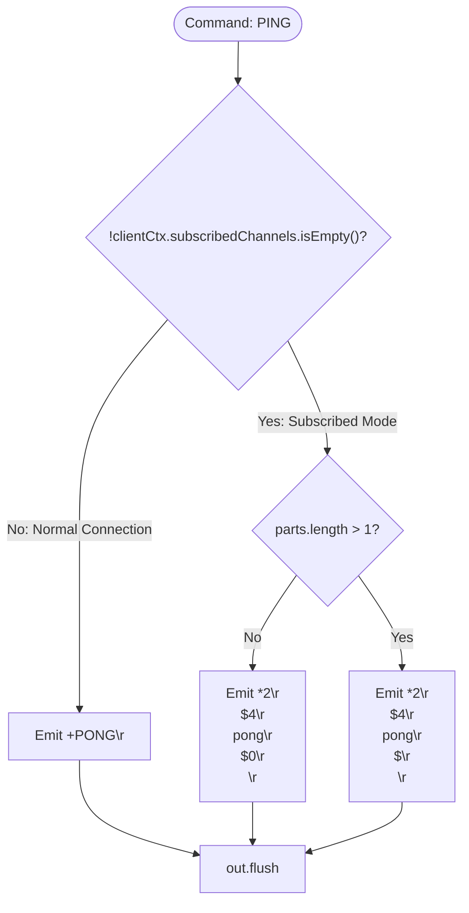
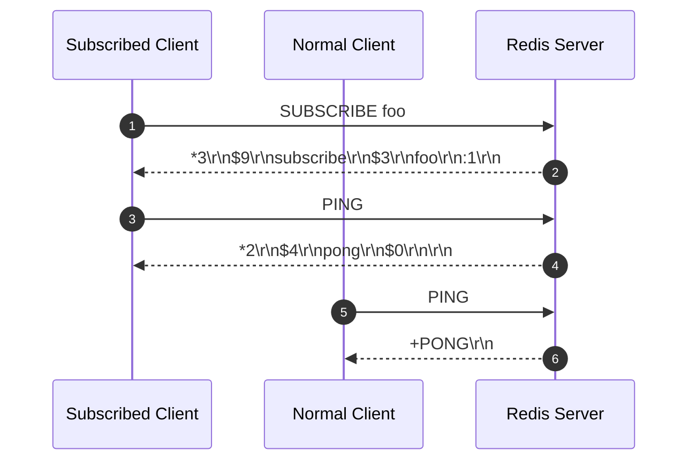

# Stage 87: PING in subscribed mode

---

## In one line
Differentiate connection context on `PING`: return standard simple string `+PONG\r\n` in normal mode, but return a 2-element RESP bulk string array `["pong", ""]` (`*2\r\n$4\r\npong\r\n$0\r\n\r\n`) when in Subscribed mode.

---

## Self-test (cover the answers below and answer these first)
1. **Why does Redis change the response format of `PING` in Subscribed mode?**
   - *Answer*: Clients in Pub/Sub mode expect messages formatted as RESP arrays. Emitting a simple string (`+PONG\r\n`) would violate the framing assumptions of pub/sub client message parsers.
2. **What is the exact RESP frame structure returned by `PING` with no arguments in Subscribed mode?**
   - *Answer*: A 2-element array: `*2\r\n$4\r\npong\r\n$0\r\n\r\n` containing the bulk string `"pong"` and an empty bulk string `""`.
3. **If a client provides an argument like `PING hello` while in Subscribed mode, what is returned?**
   - *Answer*: A 2-element array containing `"pong"` and the provided argument: `*2\r\n$4\r\npong\r\n$5\r\nhello\r\n`.
4. **Does a client outside Subscribed mode receive the 2-element array?**
   - *Answer*: No. Non-subscribed clients continue to receive the standard simple string `+PONG\r\n` (or bulk string reply if an argument was supplied).
5. **How does the server determine whether the current connection is in Subscribed mode?**
   - *Answer*: By checking if `!clientCtx.subscribedChannels.isEmpty()`.
6. **Can `PING` be used as a heartbeat in Pub/Sub mode without dropping the connection?**
   - *Answer*: Yes. Pub/Sub clients frequently send `PING` frames to keep TCP connections alive and detect network partitions without leaving subscribed mode.

---

## Problem Solved

In **Stage 87: PING in subscribed mode**, we implement contextual response formatting for connection health checks:

1. **Context-Sensitive PING Dispatch**:
   - Checks `!clientCtx.subscribedChannels.isEmpty()` before delegating `PING`.
2. **Pub/Sub Array Framing**:
   - Translates `PING` in subscribed mode to a 2-element array `["pong", ""]`.
3. **Backward Compatibility**:
   - Preserves standard `+PONG\r\n` simple string responses for regular transactional and standalone connections.

---

## Thought Process & Architectural Model

### 1. Context-Sensitive PING Dispatch Flow



### 2. Dual Client Behavior



---

## Full Solution

In [`codecrafters-redis-java/src/main/java/Main.java`](file:///C:/Users/jiten/Documents/Codecrafters-Build-from-scratch/codecrafters-redis-java/src/main/java/Main.java):

```java
              if (!clientCtx.subscribedChannels.isEmpty()) {
                String upper = command.toUpperCase();
                if (!ALLOWED_SUBSCRIBED_COMMANDS.contains(upper)) {
                  String err = "-ERR Can't execute '" + command.toLowerCase() + "': only (P|S)SUBSCRIBE / (P|S)UNSUBSCRIBE / PING / QUIT / RESET are allowed in this context\r\n";
                  out.write(err.getBytes(StandardCharsets.UTF_8));
                  out.flush();
                  continue;
                }
                if (upper.equals("PING")) {
                  if (parts.length > 1) {
                    byte[] msgBytes = parts[1].getBytes(StandardCharsets.UTF_8);
                    String resp = "*2\r\n$4\r\npong\r\n$" + msgBytes.length + "\r\n" + parts[1] + "\r\n";
                    out.write(resp.getBytes(StandardCharsets.UTF_8));
                  } else {
                    out.write("*2\r\n$4\r\npong\r\n$0\r\n\r\n".getBytes(StandardCharsets.UTF_8));
                  }
                  out.flush();
                  continue;
                }
              }
```

---

## Concepts

1. **Homogeneous Framing in Event Streams**:
   - In event-driven protocols like Redis Pub/Sub, client libraries read all inbound messages using a unified multi-bulk parser. Returning an out-of-band simple string (`+PONG\r\n`) breaks stream deserializers.
2. **Empty Bulk String Serialization**:
   - `$0\r\n\r\n` represents a bulk string with length 0, distinct from null bulk string `$-1\r\n`.

---

## Wire Format

Subscribed Mode PING:
```text
Client: *1\r\n$4\r\nPING\r\n
Server: *2\r\n$4\r\npong\r\n$0\r\n\r\n
```

Subscribed Mode PING with message:
```text
Client: *2\r\n$4\r\nPING\r\n$5\r\nhello\r\n
Server: *2\r\n$4\r\npong\r\n$5\r\nhello\r\n
```

Standard Connection PING:
```text
Client: *1\r\n$4\r\nPING\r\n
Server: +PONG\r\n
```

---

## Failure Modes

1. **Protocol Mismatch (Returning `+PONG\r\n`)**:
   - Returning simple string `+PONG\r\n` when subscribed causes client-side decoding errors.
2. **Missing Empty Bulk Terminator**:
   - Emitting `$0\r\n` without the terminating `\r\n` corrupts subsequent stream frames.

---

## Tradeoffs

- **Early Loop Interception**:
  - Intercepting `PING` directly inside the subscribed check avoids passing connection state parameters down through `handleCommand`.

---

## Java Specifics

- `StandardCharsets.UTF_8`: Ensures cross-platform consistent binary encoding of wire characters.
- String concatenation with byte arrays for dynamic arguments.

---

## Rebuild Checklist

1. [x] Intercept `PING` within the `!clientCtx.subscribedChannels.isEmpty()` condition.
2. [x] Check for optional message arguments.
3. [x] Format response as 2-element RESP array `["pong", ""]`.
4. [x] Ensure normal non-subscribed `PING` remains `+PONG\r\n`.
5. [x] Verify compilation with `javac`.
