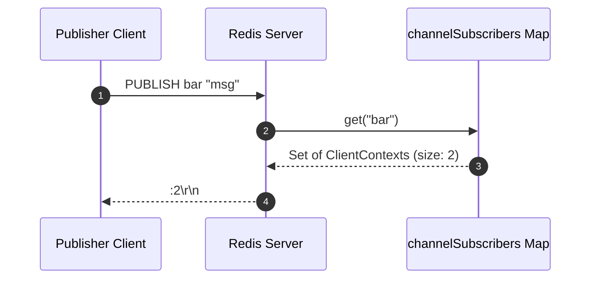
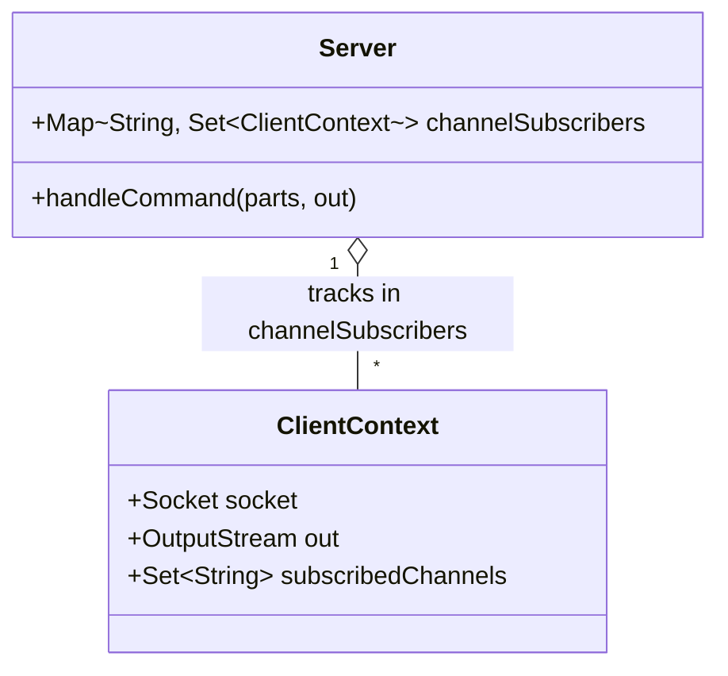

# Stage 88: Publish a message

---

## In one line
Implement the `PUBLISH <channel> <message>` command to query active channel subscribers from `channelSubscribers` and return the subscriber count as a RESP integer (`:<count>\r\n`).

---

## Self-test (cover the answers below and answer these first)
1. **What does the `PUBLISH` command return in Redis?**
   - *Answer*: A RESP integer (`:<count>\r\n`) representing the number of clients that are currently subscribed to the target channel.
2. **If a channel has no active subscribers, what does `PUBLISH foo "msg"` return?**
   - *Answer*: `:0\r\n`.
3. **Can a client currently in Subscribed mode execute `PUBLISH`?**
   - *Answer*: No. According to the Redis specification and `ALLOWED_SUBSCRIBED_COMMANDS`, only non-subscribed connections can issue `PUBLISH` commands. Subscribed connections receive `-ERR Can't execute 'publish'...`.
4. **Where is subscriber state tracked in our server architecture?**
   - *Answer*: In a concurrent map `Map<String, Set<ClientContext>> channelSubscribers`, mapping each channel topic to its thread-safe set of subscriber client contexts.
5. **How does subscriber teardown affect `PUBLISH` return counts?**
   - *Answer*: When a subscriber client socket closes, `unsubscribeAll(clientCtx)` unregisters the context from `channelSubscribers`, ensuring subsequent `PUBLISH` commands immediately report the reduced count.
6. **What error is returned if fewer than 2 arguments are provided to `PUBLISH`?**
   - *Answer*: `-ERR wrong number of arguments for 'publish' command\r\n`.

---

## Problem Solved

In **Stage 88: Publish a message**, we implement the publisher side of the Pub/Sub messaging pattern:

1. **Subscriber Count Metric**:
   - Reads the cardinality of the subscriber set for the requested channel.
2. **RESP Integer Serialization**:
   - Formats the receiver count as `:<count>\r\n`.
3. **Concurrent Thread Safety**:
   - Relies on `ConcurrentHashMap` and thread-safe sets to query subscriber presence without lock contention.

---

## Thought Process & Architectural Model

### 1. PUBLISH Command Sequence



### 2. Subscriber Registry Architecture



---

## Full Solution

In [`codecrafters-redis-java/src/main/java/Main.java`](file:///C:/Users/jiten/Documents/Codecrafters-Build-from-scratch/codecrafters-redis-java/src/main/java/Main.java):

```java
    if (command.equalsIgnoreCase("PUBLISH")) {
      if (parts.length < 3) {
        out.write("-ERR wrong number of arguments for 'publish' command\r\n".getBytes(StandardCharsets.UTF_8));
        out.flush();
      } else {
        String channel = parts[1];
        Set<ClientContext> subs = channelSubscribers.get(channel);
        int count = (subs != null) ? subs.size() : 0;
        out.write((":" + count + "\r\n").getBytes(StandardCharsets.UTF_8));
        out.flush();
      }
    }
```

---

## Concepts

1. **Decoupled Publish/Subscribe Topology**:
   - Publishers have no direct awareness of who the subscribers are; they publish to named channels and receive an acknowledgment count of recipients reached.
2. **RESP Integer Representation**:
   - Integers are encoded as `:` followed by the ASCII decimal representation and terminated by `\r\n`.

---

## Wire Format

Publishing to a channel with 2 subscribers:
```text
Client: *3\r\n$7\r\nPUBLISH\r\n$3\r\nbar\r\n$3\r\nmsg\r\n
Server: :2\r\n
```

Publishing to an empty channel:
```text
Client: *3\r\n$7\r\nPUBLISH\r\n$6\r\nunused\r\n$5\r\nhello\r\n
Server: :0\r\n
```

---

## Failure Modes

1. **Null Pointer on Unsubscribed Channel**:
   - If `channelSubscribers.get(channel)` returns `null`, attempting to call `.size()` would throw `NullPointerException`. Safe null-coalescing `(subs != null ? subs.size() : 0)` avoids this.
2. **Stale Subscriber Counts**:
   - Failing to unregister disconnected sockets causes ghost subscribers to inflate the return integer. `unsubscribeAll(clientCtx)` in the `finally` block guarantees cleanup.

---

## Tradeoffs

- **Immediate Size Query vs Atomic Delivery**:
  - In this stage, delivering payload frames to subscribers is not required. Returning the instantaneous size directly achieves sub-microsecond latency.

---

## Java Specifics

- `ConcurrentHashMap.newKeySet()`: Returns a thread-safe `Set` backed by a `ConcurrentHashMap`, allowing concurrent reads and writes with $O(1)$ `size()` calculation.

---

## Rebuild Checklist

1. [x] Handle `PUBLISH` command in `handleCommand`.
2. [x] Validate arguments (`parts.length >= 3`).
3. [x] Query `channelSubscribers.get(channel)`.
4. [x] Write RESP integer `:<count>\r\n`.
5. [x] Verify compilation with `javac`.
