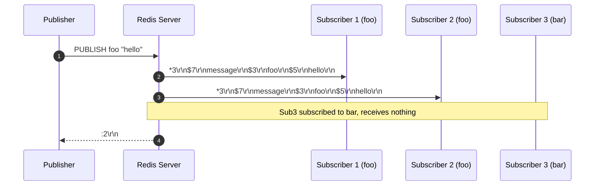
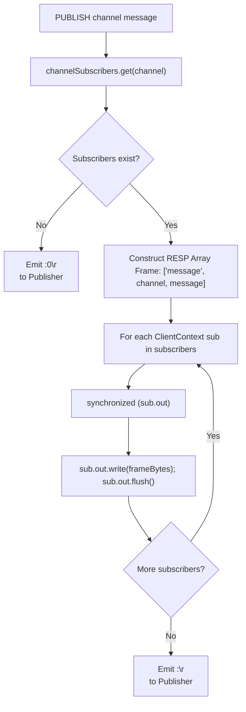

# Stage 89: Deliver messages

---

## In one line
Fan out published payload frames `["message", <channel>, <content>]` across all active subscribers in `channelSubscribers.get(channel)` using synchronized socket output streams before returning the subscriber count to the publisher.

---

## Self-test (cover the answers below and answer these first)
1. **What is the exact RESP frame structure delivered to a subscriber when a message is published?**
   - *Answer*: A 3-element RESP array: `*3\r\n$7\r\nmessage\r\n$<chanLen>\r\n<channel>\r\n$<msgLen>\r\n<content>\r\n`.
2. **Does the publishing client receive the message push frame?**
   - *Answer*: No. The publisher only receives the integer subscriber count (`:<count>\r\n`), unless the publisher itself is also subscribed to that channel on the same connection (which Redis forbids anyway as `PUBLISH` is not allowed in subscribed mode).
3. **Why must writes to `sub.out` be synchronized?**
   - *Answer*: Subscribers may concurrently receive multiple messages from different publishing threads or perform heartbeats (`PING`). Synchronizing on `sub.out` guarantees atomic frame delivery without byte interleaving.
4. **If a subscriber socket throws an `IOException` during message delivery, what should happen?**
   - *Answer*: Catch the exception gracefully to prevent aborting fanout to other subscribers; the broken client will be cleaned up during its connection teardown.
5. **How are channels with no active subscribers handled?**
   - *Answer*: If `channelSubscribers.get(channel)` is `null` or empty, no message frames are pushed and `:0\r\n` is returned to the publisher.
6. **When is a client's output stream registered in its context?**
   - *Answer*: Immediately upon socket connection acceptance (`clientCtx.out = out`), ensuring any subscription registration has a valid stream pointer.

---

## Problem Solved

In **Stage 89: Deliver messages**, we complete the core Redis Pub/Sub message broker functionality:

1. **Fanout Broadcast**:
   - Iterates through the thread-safe subscriber set for the published channel and delivers framed messages to all matching subscribers.
2. **Standard Push Framing**:
   - Encodes messages as RESP arrays containing literal `"message"`, channel name, and message payload.
3. **Thread Safety & Frame Isolation**:
   - Uses per-client stream monitors (`synchronized(sub.out)`) to prevent packet corruption during high-throughput concurrent publishes.

---

## Thought Process & Architectural Model

### 1. Fanout Delivery Sequence



### 2. Message Fanout Architecture



---

## Full Solution

In [`codecrafters-redis-java/src/main/java/Main.java`](file:///C:/Users/jiten/Documents/Codecrafters-Build-from-scratch/codecrafters-redis-java/src/main/java/Main.java):

Connection initialization:
```java
          ClientContext clientCtx = new ClientContext();
          OutputStream out = null;
          try {
            out = clientSocket.getOutputStream();
            clientCtx.out = out;
```

PUBLISH implementation in `handleCommand`:
```java
    if (command.equalsIgnoreCase("PUBLISH")) {
      if (parts.length < 3) {
        out.write("-ERR wrong number of arguments for 'publish' command\r\n".getBytes(StandardCharsets.UTF_8));
        out.flush();
      } else {
        String channel = parts[1];
        String message = parts[2];
        Set<ClientContext> subs = channelSubscribers.get(channel);
        int count = (subs != null) ? subs.size() : 0;
        if (subs != null) {
          byte[] chanBytes = channel.getBytes(StandardCharsets.UTF_8);
          byte[] msgBytes = message.getBytes(StandardCharsets.UTF_8);
          StringBuilder frame = new StringBuilder();
          frame.append("*3\r\n");
          frame.append("$7\r\nmessage\r\n");
          frame.append("$").append(chanBytes.length).append("\r\n").append(channel).append("\r\n");
          frame.append("$").append(msgBytes.length).append("\r\n").append(message).append("\r\n");
          byte[] frameBytes = frame.toString().getBytes(StandardCharsets.UTF_8);

          for (ClientContext sub : subs) {
            if (sub.out != null) {
              try {
                synchronized (sub.out) {
                  sub.out.write(frameBytes);
                  sub.out.flush();
                }
              } catch (IOException ignored) {
              }
            }
          }
        }
        out.write((":" + count + "\r\n").getBytes(StandardCharsets.UTF_8));
        out.flush();
      }
    }
```

---

## Concepts

1. **At-Most-Once Fanout Delivery**:
   - Standard Redis Pub/Sub implements "fire-and-forget" semantics. If a subscriber is disconnected or slow, messages are dropped or discarded without persistence.
2. **Synchronized Socket Writing**:
   - Sockets in Java are full duplex, but multiple threads writing to the same `OutputStream` simultaneously will corrupt stream frames without synchronization.

---

## Wire Format

Subscriber notification frame:
```text
*3\r\n
$7\r\n
message\r\n
$3\r\n
foo\r\n
$5\r\n
hello\r\n
```

Publisher command & acknowledgment:
```text
Client: *3\r\n$7\r\nPUBLISH\r\n$3\r\nfoo\r\n$5\r\nhello\r\n
Server: :2\r\n
```

---

## Failure Modes

1. **Interleaved Multi-Publisher Frames**:
   - Without `synchronized (sub.out)`, two publishers sending to the same subscriber concurrently can interleave their RESP tokens, causing parse errors.
2. **Fanout Blocking on Failed Clients**:
   - Catching `IOException` on individual subscriber writes prevents a single broken connection from killing the publisher request or starving other subscribers.

---

## Tradeoffs

- **Synchronous Fanout vs Message Queue**:
  - Direct synchronous fanout delivers lowest latency for local subscribers but blocks the publisher thread during socket I/O. Redis in production uses non-blocking event loops with output buffers.

---

## Java Specifics

- `synchronized (sub.out)`: Establishes a monitor on the specific client socket output stream.
- `StandardCharsets.UTF_8`: Prevents character set encoding differences across operating systems.

---

## Rebuild Checklist

1. [x] Bind `clientCtx.out = out` upon connection startup.
2. [x] Construct RESP array frame `["message", channel, message]`.
3. [x] Loop over `channelSubscribers.get(channel)`.
4. [x] Write and flush frame within `synchronized (sub.out)`.
5. [x] Catch `IOException` on broken subscriber connections.
6. [x] Return subscriber count `:<count>\r\n` to the publisher.
7. [x] Verify compilation with `javac`.
