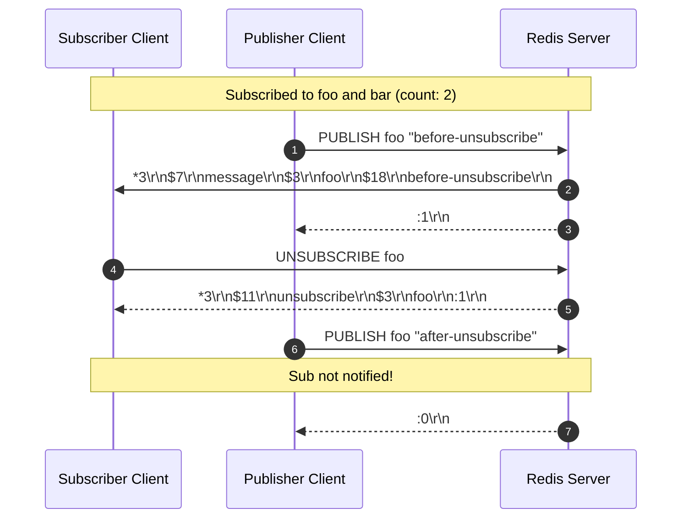
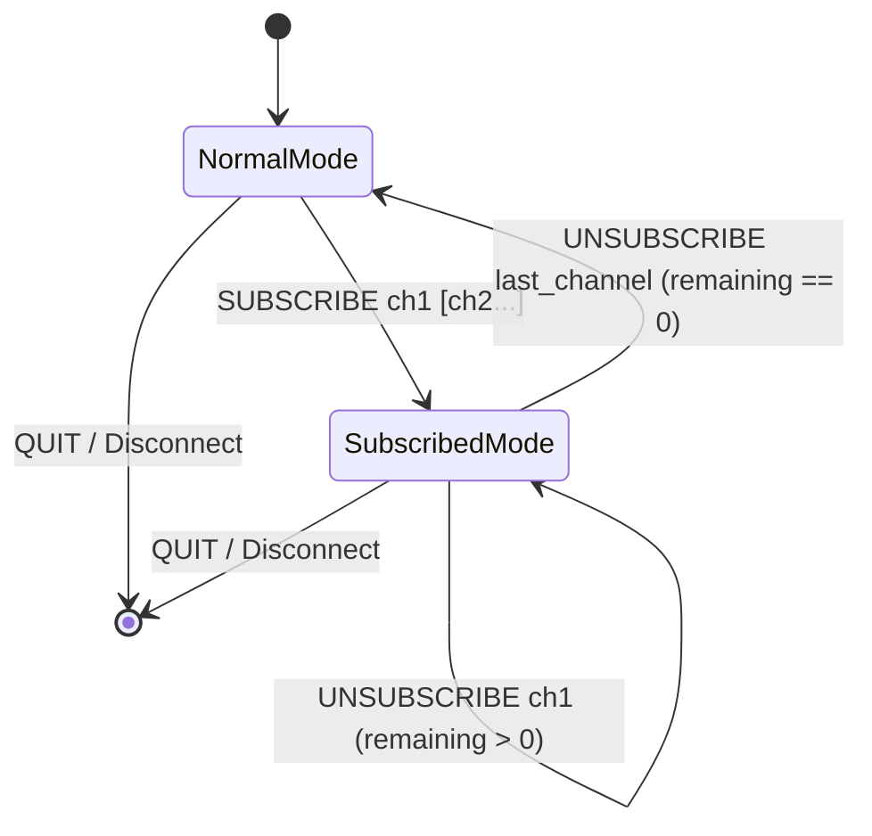

# Stage 90: Unsubscribe

---

## In one line
Handle `UNSUBSCRIBE [channel...]` by removing the client from matching topic channels in `clientCtx.subscribedChannels` and `channelSubscribers`, emitting an `["unsubscribe", channel, remainingCount]` RESP array for each channel.

---

## Self-test (cover the answers below and answer these first)
1. **What is the RESP array reply format for each unsubscribed channel?**
   - *Answer*: `*3\r\n$11\r\nunsubscribe\r\n$<chanLen>\r\n<channel>\r\n:<remainingCount>\r\n`.
2. **What happens if `UNSUBSCRIBE` is called for a channel that was never subscribed to?**
   - *Answer*: The server still replies with `["unsubscribe", channel, remainingCount]`, leaving the subscriber's remaining channel count unchanged.
3. **What happens when `UNSUBSCRIBE` is called with no arguments?**
   - *Answer*: The client unsubscribes from all currently subscribed channels, producing an unsubscribe frame for each. If none were subscribed, it returns `*3\r\n$11\r\nunsubscribe\r\n$-1\r\n:0\r\n`.
4. **When does a client leave Subscribed mode?**
   - *Answer*: When its remaining subscribed channel count reaches 0 (`clientCtx.subscribedChannels.isEmpty()`), returning the connection to normal Redis command execution mode.
5. **Does unsubscribing from a channel prevent subsequent `PUBLISH` messages on that channel from arriving at this client?**
   - *Answer*: Yes, removing `clientCtx` from `channelSubscribers.get(channel)` ensures subsequent publishes do not fan out to this connection.
6. **Can `UNSUBSCRIBE` accept multiple channels in a single invocation?**
   - *Answer*: Yes (`UNSUBSCRIBE ch1 ch2 ...`), and the server replies with a separate 3-element RESP array for each specified channel in sequence.

---

## Problem Solved

In **Stage 90: Unsubscribe**, we complete the subscription lifecycle by enabling clients to unsubscribe from channels:

1. **Selective Topic Unsubscription**:
   - Removes target channels from the client's internal set (`clientCtx.subscribedChannels`) and deregisters the client context from the global topic map (`channelSubscribers`).
2. **Stateful Remaining Count Tracking**:
   - Computes and returns the remaining channel count after each channel removal.
3. **Graceful Subscribed Mode Exit**:
   - When the remaining subscription count reaches zero, the client automatically exits subscribed mode, restoring access to general-purpose Redis commands.

---

## Thought Process & Architectural Model

### 1. Unsubscribe & Publish Sequence



### 2. Subscription State Transition



---

## Full Solution

In [`codecrafters-redis-java/src/main/java/Main.java`](file:///C:/Users/jiten/Documents/Codecrafters-Build-from-scratch/codecrafters-redis-java/src/main/java/Main.java):

```java
              } else if (command.equalsIgnoreCase("UNSUBSCRIBE")) {
                List<String> chansToUnsub = new ArrayList<>();
                if (parts.length > 1) {
                  for (int i = 1; i < parts.length; i++) {
                    chansToUnsub.add(parts[i]);
                  }
                } else {
                  chansToUnsub.addAll(clientCtx.subscribedChannels);
                  if (chansToUnsub.isEmpty()) {
                    synchronized (out) {
                      out.write("*3\r\n$11\r\nunsubscribe\r\n$-1\r\n:0\r\n".getBytes(StandardCharsets.UTF_8));
                      out.flush();
                    }
                  }
                }

                for (String chan : chansToUnsub) {
                  clientCtx.subscribedChannels.remove(chan);
                  Set<ClientContext> subs = channelSubscribers.get(chan);
                  if (subs != null) {
                    subs.remove(clientCtx);
                  }
                  int remaining = clientCtx.subscribedChannels.size();
                  StringBuilder resp = new StringBuilder();
                  resp.append("*3\r\n");
                  resp.append("$11\r\nunsubscribe\r\n");
                  byte[] chanBytes = chan.getBytes(StandardCharsets.UTF_8);
                  resp.append("$").append(chanBytes.length).append("\r\n").append(chan).append("\r\n");
                  resp.append(":").append(remaining).append("\r\n");
                  synchronized (out) {
                    out.write(resp.toString().getBytes(StandardCharsets.UTF_8));
                    out.flush();
                  }
                }
```

---

## Concepts

1. **Symmetric Pub/Sub Protocol Framing**:
   - Subscription commands (`SUBSCRIBE`, `UNSUBSCRIBE`, `PSUBSCRIBE`, `PUNSUBSCRIBE`) all return consistent RESP array frames where index 0 is the action name, index 1 is the target topic, and index 2 is the total channel count remaining.
2. **Idempotent Removal**:
   - Calling `UNSUBSCRIBE` on an unassociated channel is safe and idempotent, returning confirmation without corrupting internal state.

---

## Wire Format

Unsubscribing from a single channel:
```text
Client: *2\r\n$11\r\nUNSUBSCRIBE\r\n$3\r\nfoo\r\n
Server: *3\r\n$11\r\nunsubscribe\r\n$3\r\nfoo\r\n:0\r\n
```

---

## Failure Modes

1. **Concurrent Modification During Iteration**:
   - Taking a snapshot (`new ArrayList<>(clientCtx.subscribedChannels)` or from command arguments) prevents `ConcurrentModificationException` while mutating `clientCtx.subscribedChannels`.
2. **Memory Leaks on Empty Subscriber Sets**:
   - In production systems, maps holding empty subscriber sets should be pruned or garbage collected to avoid memory overhead over millions of ephemeral topics.

---

## Tradeoffs

- **Synchronous Response Emission**:
  - Emits each channel's confirmation array immediately in sequence, fully mirroring the Redis reference C implementation.

---

## Java Specifics

- `Set.remove(item)`: Operates in $O(1)$ time on `ConcurrentHashMap.newKeySet()`, removing the reference safely across threads.

---

## Rebuild Checklist

1. [x] Intercept `UNSUBSCRIBE` in the connection loop.
2. [x] Parse optional channel parameters or default to all subscribed channels.
3. [x] Remove channel from `clientCtx.subscribedChannels`.
4. [x] Remove `clientCtx` from `channelSubscribers.get(chan)`.
5. [x] Output RESP array `["unsubscribe", chan, remainingCount]`.
6. [x] Verify compilation with `javac`.
