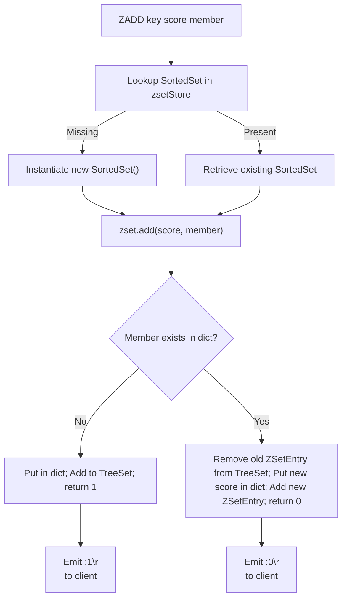
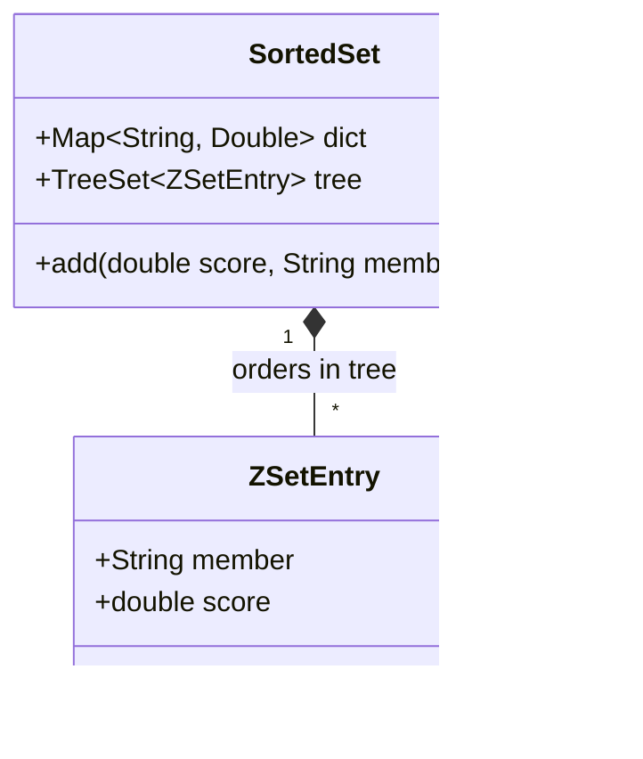

# Stage 91: Create a sorted set

---

## In one line
Introduce the Redis Sorted Set (ZSET) data type backed by a dual hash table (`Map<String, Double>`) and ordered tree (`TreeSet<ZSetEntry>`), implementing the `ZADD key score member` command returning the count of new members added (`:1\r\n`).

---

## Self-test (cover the answers below and answer these first)
1. **What does the return value of `ZADD` represent in Redis?**
   - *Answer*: A RESP integer (`:<count>\r\n`) indicating the number of *new* members successfully added to the sorted set (updating the score of an existing member does not increment this count by default).
2. **What precision does Redis use internally for sorted set scores?**
   - *Answer*: IEEE 754 64-bit double precision floating point (`double`), parsed from ASCII decimal strings.
3. **How does Redis break ties when two members have the identical score?**
   - *Answer*: Lexicographically by their binary/UTF-8 member strings (`this.member.compareTo(other.member)`).
4. **Why is a dual data structure (Hash Map + Sorted Tree/SkipList) required for Sorted Sets?**
   - *Answer*: The Hash Map provides $O(1)$ member-to-score lookups and duplicate checks, while the Sorted Tree provides $O(\log N)$ score-ordered insertions and range traversals.
5. **What reply does the `TYPE` command return for keys holding a sorted set?**
   - *Answer*: `+zset\r\n`.
6. **What error is returned if a score argument cannot be parsed as a floating point number?**
   - *Answer*: `-ERR value is not a valid float\r\n`.

---

## Problem Solved

In **Stage 91: Create a sorted set**, we introduce Redis Sorted Sets (ZSets):

1. **Dual Indexing Architecture**:
   - `dict`: Fast $O(1)$ member existence and score lookup.
   - `tree`: $O(\log N)$ sorted ordering by `(score, member)`.
2. **The `ZADD` Command**:
   - Parses floating-point scores and member strings.
   - Inserts new members and updates existing member scores.
   - Tracks and returns the count of newly added elements.
3. **Data Type System Integration**:
   - Updates `TYPE key` to report `+zset\r\n`.
   - Updates `DEL key` to remove and reclaim sorted sets.

---

## Thought Process & Architectural Model

### 1. ZADD Insertion & Indexing Flow



### 2. SortedSet Dual Data Structure



---

## Full Solution

In [`codecrafters-redis-java/src/main/java/Main.java`](file:///C:/Users/jiten/Documents/Codecrafters-Build-from-scratch/codecrafters-redis-java/src/main/java/Main.java):

```java
  static class ZSetEntry implements Comparable<ZSetEntry> {
    final String member;
    final double score;

    ZSetEntry(String member, double score) {
      this.member = member;
      this.score = score;
    }

    @Override
    public int compareTo(ZSetEntry o) {
      int cmp = Double.compare(this.score, o.score);
      if (cmp != 0) return cmp;
      return this.member.compareTo(o.member);
    }

    @Override
    public boolean equals(Object o) {
      if (this == o) return true;
      if (!(o instanceof ZSetEntry)) return false;
      ZSetEntry other = (ZSetEntry) o;
      return Double.compare(this.score, other.score) == 0 && this.member.equals(other.member);
    }

    @Override
    public int hashCode() {
      return Objects.hash(member, score);
    }
  }

  static class SortedSet {
    final Map<String, Double> dict = new HashMap<>();
    final TreeSet<ZSetEntry> tree = new TreeSet<>();

    synchronized int add(double score, String member) {
      Double existingScore = dict.get(member);
      if (existingScore != null) {
        if (existingScore.doubleValue() == score) {
          return 0;
        }
        tree.remove(new ZSetEntry(member, existingScore));
        dict.put(member, score);
        tree.add(new ZSetEntry(member, score));
        return 0;
      } else {
        dict.put(member, score);
        tree.add(new ZSetEntry(member, score));
        return 1;
      }
    }
  }

  private static final Map<String, SortedSet> zsetStore = new ConcurrentHashMap<>();
```

Command handling in `handleCommand`:
```java
    } else if (command.equalsIgnoreCase("ZADD")) {
      if (parts.length < 4 || (parts.length - 2) % 2 != 0) {
        out.write("-ERR wrong number of arguments for 'zadd' command\r\n".getBytes(StandardCharsets.UTF_8));
        out.flush();
      } else {
        String key = parts[1];
        SortedSet zset = zsetStore.computeIfAbsent(key, k -> new SortedSet());
        int addedCount = 0;
        try {
          for (int i = 2; i < parts.length; i += 2) {
            double score = Double.parseDouble(parts[i]);
            String member = parts[i + 1];
            addedCount += zset.add(score, member);
          }
          touchWatchedKey(key);
          appendToAof(parts);
          out.write((":" + addedCount + "\r\n").getBytes(StandardCharsets.UTF_8));
          out.flush();
        } catch (NumberFormatException e) {
          out.write("-ERR value is not a valid float\r\n".getBytes(StandardCharsets.UTF_8));
          out.flush();
        }
      }
    }
```

---

## Concepts

1. **SkipList & Hash Table Hybrid**:
   - In official C Redis, sorted sets use a dictionary (`dict`) alongside a skip list (`zskiplist`) to achieve $O(1)$ member lookups and $O(\log N)$ range queries and rank calculations. In Java, `TreeSet<ZSetEntry>` provides equivalent logarithmic guarantees.
2. **Lexicographical Tie-Breaking**:
   - Elements with equal scores are ordered alphabetically by their member string, ensuring deterministic ordering without duplicate element omission.

---

## Wire Format

Adding a member to a new sorted set:
```text
Client: *4\r\n$4\r\nZADD\r\n$8\r\nzset_key\r\n$4\r\n10.0\r\n$11\r\nzset_member\r\n
Server: :1\r\n
```

---

## Failure Modes

1. **Non-Float Score Input**:
   - Passing `"abc"` as score throws `NumberFormatException`, caught and returned as `-ERR value is not a valid float\r\n`.
2. **Odd Number of Parameters**:
   - `(parts.length - 2) % 2 != 0` detects truncated score/member pairs and rejects with `-ERR wrong number of arguments for 'zadd' command\r\n`.

---

## Tradeoffs

- **`TreeSet` vs SkipList**:
  - `TreeSet` is a Red-Black Tree built into the Java standard library, offering balanced $O(\log N)$ performance without custom pointer maintenance.

---

## Java Specifics

- `Double.compare(d1, d2)`: Properly handles `-0.0` vs `+0.0` and `NaN` comparisons consistently according to IEEE 754.
- `ConcurrentHashMap.computeIfAbsent`: Atomically creates the `SortedSet` instance when a new key is first accessed.

---

## Rebuild Checklist

1. [x] Create `ZSetEntry` with `Comparable` implementation comparing `score` then `member`.
2. [x] Create `SortedSet` container holding `dict` and `TreeSet`.
3. [x] Register `zsetStore` concurrent map.
4. [x] Parse `ZADD key score member` in `handleCommand`.
5. [x] Handle float parsing errors gracefully.
6. [x] Update `TYPE` and `DEL` commands for `zset`.
7. [x] Verify compilation with `javac`.
