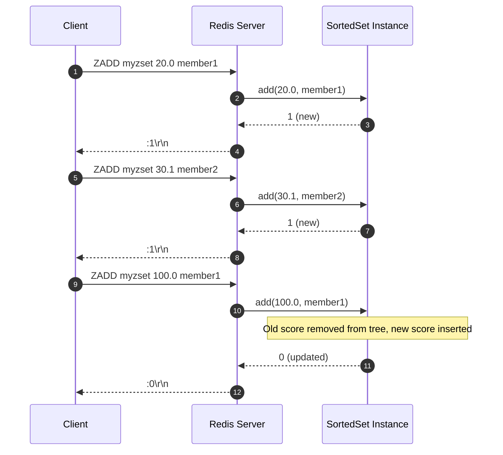

# Stage 92: Add members

---

## In one line
Extend `ZADD` to support adding subsequent members to existing sorted sets and updating scores of existing members, returning `:1\r\n` when a member is new and `:0\r\n` when an existing member's score is modified.

---

## Self-test (cover the answers below and answer these first)
1. **What is returned by `ZADD` when an existing member's score is updated?**
   - *Answer*: `:0\r\n` (RESP integer 0), because no *new* member was added to the sorted set.
2. **How is an element's position in `TreeSet<ZSetEntry>` updated when its score changes?**
   - *Answer*: The old `ZSetEntry(member, oldScore)` must be removed first, the dictionary updated, and a new `ZSetEntry(member, newScore)` added so the tree re-balances correctly.
3. **Why cannot an element's score in `TreeSet` be updated in-place?**
   - *Answer*: In Java, mutating fields that determine `compareTo` ordering while an object resides inside a `TreeSet` corrupts the binary search tree invariants and makes future lookups fail.
4. **What is the time complexity of updating an existing member's score in this dual-structure implementation?**
   - *Answer*: $O(\log N)$ — $O(1)$ dictionary lookup for `oldScore`, $O(\log N)$ tree removal, $O(1)$ dictionary update, and $O(\log N)$ tree re-insertion.
5. **Does updating a member's score alter its ordering relative to other members?**
   - *Answer*: Yes, changing its score re-indexes the member to its new sorted rank within the tree.
6. **What happens if `ZADD` is called with multiple (score, member) pairs in a single command?**
   - *Answer*: Each pair is processed in turn, and the total count of *newly added* members across all pairs is returned as the single integer reply.

---

## Problem Solved

In **Stage 92: Add members**, we enable full CRUD mutations on Redis Sorted Sets:

1. **Incremental Member Insertion**:
   - Appending new members into an existing `SortedSet` maintains overall score ordering without rebuilding the set.
2. **Score Mutation & Re-indexing**:
   - Safely removes the stale `(member, oldScore)` entry from the Red-Black tree and re-inserts `(member, newScore)` at its proper sorted rank.
3. **Accurate Semantics**:
   - Correctly distinguishes between inserts (incrementing added count) and updates (retaining score without incrementing added count).

---

## Thought Process & Architectural Model

### 1. Existing Member Score Update Flow

```mermaid
flowchart TD
    ZADD["ZADD zset_key new_score member"] --> LookupDict["dict.get(member)"]
    LookupDict --> Found{"Score found in dict?"}

    Found -->|No (New Member)| AddDict["dict.put(member, new_score)"]
    AddDict --> AddTree["tree.add(ZSetEntry(member, new_score))"]
    AddTree --> RetOne["return 1 (new member added)"]

    Found -->|Yes (Existing Member)| CheckScore{"new_score == old_score?"}
    CheckScore -->|Identical| RetZero["return 0 (no op)"]
    CheckScore -->|Different| RemoveOld["tree.remove(ZSetEntry(member, old_score))"]
    RemoveOld --> UpdateDict["dict.put(member, new_score)"]
    UpdateDict --> InsertNew["tree.add(ZSetEntry(member, new_score))"]
    InsertNew --> RetZero
```

### 2. Multi-Member Ingestion Sequence



---

## Full Solution

In [`codecrafters-redis-java/src/main/java/Main.java`](file:///C:/Users/jiten/Documents/Codecrafters-Build-from-scratch/codecrafters-redis-java/src/main/java/Main.java):

```java
  static class SortedSet {
    final Map<String, Double> dict = new HashMap<>();
    final TreeSet<ZSetEntry> tree = new TreeSet<>();

    synchronized int add(double score, String member) {
      Double existingScore = dict.get(member);
      if (existingScore != null) {
        if (existingScore.doubleValue() == score) {
          return 0;
        }
        tree.remove(new ZSetEntry(member, existingScore));
        dict.put(member, score);
        tree.add(new ZSetEntry(member, score));
        return 0;
      } else {
        dict.put(member, score);
        tree.add(new ZSetEntry(member, score));
        return 1;
      }
    }
  }
```

---

## Concepts

1. **Tree Mutation Invariance**:
   - Modifying a key in a balanced search tree in-place violates tree ordering guarantees. Explicit removal of the old descriptor followed by re-insertion guarantees tree balance and search consistency.
2. **Dual Representation Coherence**:
   - `dict` stores member $\to$ score, enabling $O(1)$ detection of whether an operation is an insert or an update.

---

## Wire Format

Inserting and updating members:
```text
Client: *4\r\n$4\r\nZADD\r\n$8\r\nzset_key\r\n$4\r\n20.0\r\n$12\r\nzset_member1\r\n
Server: :1\r\n

Client: *4\r\n$4\r\nZADD\r\n$8\r\nzset_key\r\n$5\r\n100.0\r\n$12\r\nzset_member1\r\n
Server: :0\r\n
```

---

## Failure Modes

1. **Tree Desynchronization from In-Place Mutation**:
   - Changing `score` on an existing entry object inside `tree` without re-inserting corrupts the Red-Black tree root and node navigation. Always construct a new immutable `ZSetEntry`.

---

## Tradeoffs

- **Synchronized SortedSet Methods**:
  - Encapsulating `add` within a `synchronized` method provides fine-grained per-key concurrency while maintaining strict coherence between `dict` and `tree`.

---

## Java Specifics

- `TreeSet.remove(Object)`: Relies on `Comparable.compareTo == 0` to find the exact node in $O(\log N)$ time.

---

## Rebuild Checklist

1. [x] Maintain existing `SortedSet` instance across multiple `ZADD` calls using `computeIfAbsent`.
2. [x] Handle new member additions returning 1.
3. [x] Handle existing member score updates returning 0.
4. [x] Remove old `ZSetEntry` and insert new `ZSetEntry` to preserve tree ordering.
5. [x] Verify compilation with `javac`.
