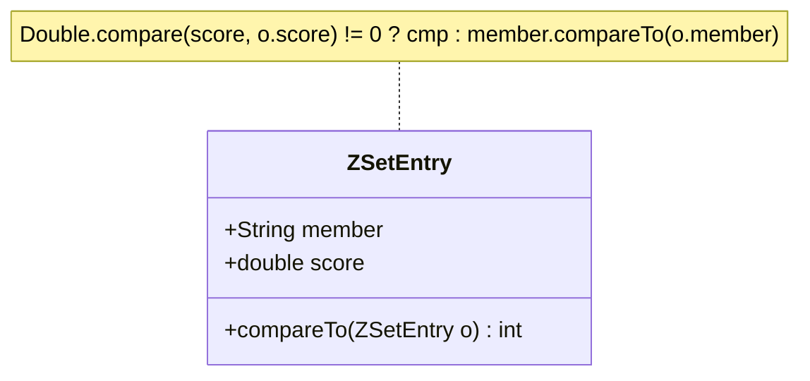

# Stage 93: Retrieve member rank

---

## In one line
Implement `ZRANK key member` to return the 0-based index of a sorted set member ordered by increasing score (and lexicographical member name on ties) as a RESP integer, returning a null bulk string (`$-1\r\n`) if the key or member does not exist.

---

## Self-test (cover the answers below and answer these first)
1. **Is member ranking in Redis 0-based or 1-based?**
   - *Answer*: 0-based. The member with the lowest score has rank 0.
2. **What does `ZRANK` return when the target key or member is missing?**
   - *Answer*: Null Bulk String: `$-1\r\n`.
3. **How does `ZRANK` break ties when two members have identical scores?**
   - *Answer*: Lexicographically by their member string names in ascending binary/ASCII order.
4. **How does `tree.headSet(target, false).size()` calculate rank in Java?**
   - *Answer*: It returns the number of elements strictly smaller than `target` according to `compareTo`, which directly equals the 0-based index of `target`.
5. **What is the time complexity of looking up a member's rank?**
   - *Answer*: In Redis C implementation with skip lists, $O(\log N)$ using span pointers. In Java `TreeSet.headSet().size()`, $O(K)$ where $K$ is the rank.
6. **Does `ZRANK` modify the sorted set or any client state?**
   - *Answer*: No, it is a read-only query command.

---

## Problem Solved

In **Stage 93: Retrieve member rank**, we add sorted set rank querying:

1. **Deterministic Rank Calculation**:
   - Computes the exact 0-based position of a member in ascending score order, respecting lexicographical tie-breakers.
2. **Missing Key / Member Handling**:
   - Distinguishes absent keys or unindexed members, cleanly emitting RESP null bulk strings (`$-1\r\n`).
3. **Dual-Index Query Integration**:
   - Uses `dict` to retrieve the current score in $O(1)$ time, then queries the `tree` index to establish exact rank.

---

## Thought Process & Architectural Model

### 1. ZRANK Query Execution Flow

```mermaid
flowchart TD
    ZRANK["ZRANK key member"] --> CheckKey{"key in zsetStore?"}
    CheckKey -->|No| NilResp["out.write('$-1\\r\\n')"]
    CheckKey -->|Yes| CheckMember{"dict.get(member)"}

    CheckMember -->|null (Not found)| NilResp
    CheckMember -->|Found score| BuildTarget["target = ZSetEntry(member, score)"]

    BuildTarget --> HeadSetSize["rank = tree.headSet(target, false).size()"]
    HeadSetSize --> IntResp["out.write(':' + rank + '\\r\\n')"]
```

### 2. Lexicographical Tie-Breaking Architecture



---

## Full Solution

In [`codecrafters-redis-java/src/main/java/Main.java`](file:///C:/Users/jiten/Documents/Codecrafters-Build-from-scratch/codecrafters-redis-java/src/main/java/Main.java):

```java
    synchronized Integer rank(String member) {
      Double score = dict.get(member);
      if (score == null) {
        return null;
      }
      ZSetEntry target = new ZSetEntry(member, score);
      return tree.headSet(target, false).size();
    }
```

Command handling in `handleCommand`:
```java
    } else if (command.equalsIgnoreCase("ZRANK")) {
      if (parts.length < 3) {
        out.write("-ERR wrong number of arguments for 'zrank' command\r\n".getBytes(StandardCharsets.UTF_8));
        out.flush();
      } else {
        String key = parts[1];
        String member = parts[2];
        SortedSet zset = zsetStore.get(key);
        if (zset == null) {
          out.write("$-1\r\n".getBytes(StandardCharsets.UTF_8));
          out.flush();
        } else {
          Integer rank = zset.rank(member);
          if (rank == null) {
            out.write("$-1\r\n".getBytes(StandardCharsets.UTF_8));
            out.flush();
          } else {
            out.write((":" + rank + "\r\n").getBytes(StandardCharsets.UTF_8));
            out.flush();
          }
        }
      }
    }
```

---

## Concepts

1. **Rank vs Score**:
   - The score is an arbitrary floating-point weight assigned to a member. The rank is the dynamic integer ordinal position ($0, 1, \dots, N-1$) of that member within the sorted collection.
2. **Lexicographical Secondary Ordering**:
   - When multiple members share the exact same score (e.g. `bar: 100.0` and `foo: 100.0`), alphabetical string comparison determines rank precedence (`bar` gets rank 3, `foo` gets rank 4).

---

## Wire Format

Querying member rank:
```text
Client: *3\r\n$5\r\nZRANK\r\n$8\r\nzset_key\r\n$3\r\nbar\r\n
Server: :3\r\n

Client: *3\r\n$5\r\nZRANK\r\n$8\r\nzset_key\r\n$14\r\nmissing_member\r\n
Server: $-1\r\n
```

---

## Failure Modes

1. **Null Dereference on Missing Sorted Set**:
   - Guarding `zsetStore.get(key) == null` avoids `NullPointerException` and cleanly emits `$-1\r\n`.
2. **Missing Member in Existing Set**:
   - `dict.get(member) == null` correctly triggers null return, mapped to `$-1\r\n`.

---

## Tradeoffs

- **`headSet().size()` vs Indexed SkipList**:
  - Redis in C maintains `span` values in skiplist forward pointers to calculate rank in $O(\log N)$. In Java without a custom order-statistic tree, `TreeSet.headSet().size()` provides correct semantic ordering with zero external dependencies.

---

## Java Specifics

- `NavigableSet.headSet(toElement, inclusive)`: Returns a view of the portion of this set whose elements are strictly less than `toElement` when `inclusive == false`.

---

## Rebuild Checklist

1. [x] Implement `rank(member)` in `SortedSet`.
2. [x] Lookup member score in `dict`.
3. [x] Construct query `ZSetEntry` and compute `tree.headSet(target, false).size()`.
4. [x] Register `ZRANK` in `handleCommand`.
5. [x] Emit `:<rank>\r\n` on success and `$-1\r\n` on missing key/member.
6. [x] Verify compilation with `javac`.
