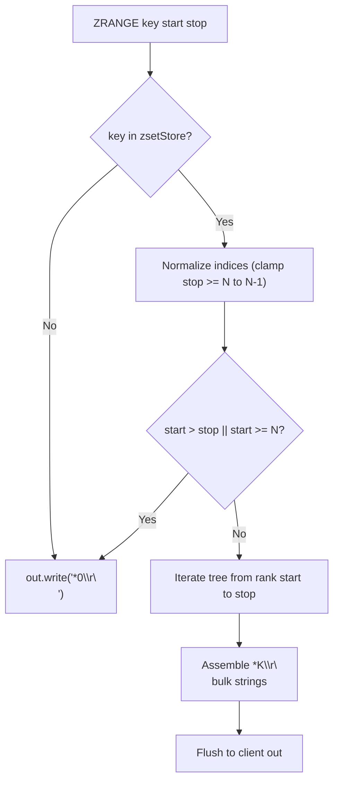
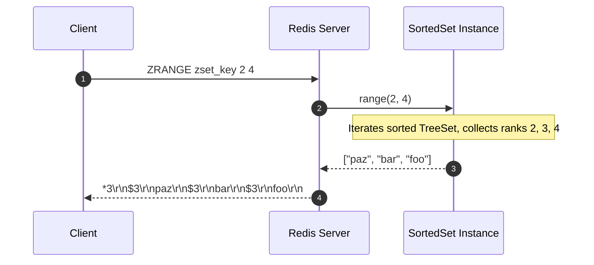

# Stage 94: List sorted set members

---

## In one line
Implement `ZRANGE key start stop` to return an inclusive range of sorted set members ordered by score and lexicographically as a RESP array of bulk strings, handling boundary clamping and missing keys gracefully with `*0\r\n`.

---

## Self-test (cover the answers below and answer these first)
1. **Is the `stop` index in `ZRANGE key start stop` inclusive or exclusive?**
   - *Answer*: Inclusive. The element at `stop` is included in the output array.
2. **What does `ZRANGE` return if the specified key does not exist?**
   - *Answer*: An empty RESP array: `*0\r\n`.
3. **What occurs if `start > stop` or `start >= cardinality`?**
   - *Answer*: An empty RESP array `*0\r\n` is returned.
4. **What occurs if `stop` exceeds the sorted set size?**
   - *Answer*: `stop` is automatically clamped to the last element index ($N - 1$).
5. **How are elements ordered in the returned `ZRANGE` slice?**
   - *Answer*: In ascending score order; elements with identical scores are sorted lexicographically by member string.
6. **What is the RESP encoding of a 3-element ZRANGE response?**
   - *Answer*: An array header `*3\r\n` followed by 3 bulk strings (`$<len>\r\n<member>\r\n`).

---

## Problem Solved

In **Stage 94: List sorted set members**, we implement range iteration for sorted sets:

1. **Rank-based Slicing**:
   - Extracts a contiguous sub-range of members by rank from `[start, stop]`.
2. **Boundary Normalization**:
   - Clamps out-of-range stop indexes to `N - 1` and rejects inverted intervals (`start > stop`) with empty arrays.
3. **RESP Array Serialization**:
   - Packages extracted members into standard Redis RESP array bulk strings.

---

## Thought Process & Architectural Model

### 1. ZRANGE Index Normalization & Slicing



### 2. TreeSet Ordered Traversal



---

## Full Solution

In [`codecrafters-redis-java/src/main/java/Main.java`](file:///C:/Users/jiten/Documents/Codecrafters-Build-from-scratch/codecrafters-redis-java/src/main/java/Main.java):

```java
    synchronized List<String> range(int start, int stop) {
      int n = tree.size();
      if (n == 0) return Collections.emptyList();
      if (start < 0) start = n + start;
      if (stop < 0) stop = n + stop;
      if (start < 0) start = 0;
      if (stop >= n) stop = n - 1;
      if (start > stop || start >= n) return Collections.emptyList();

      List<String> result = new ArrayList<>(stop - start + 1);
      int idx = 0;
      for (ZSetEntry entry : tree) {
        if (idx >= start && idx <= stop) {
          result.add(entry.member);
        }
        if (idx > stop) {
          break;
        }
        idx++;
      }
      return result;
    }
```

Command handling in `handleCommand`:
```java
    } else if (command.equalsIgnoreCase("ZRANGE")) {
      if (parts.length < 4) {
        out.write("-ERR wrong number of arguments for 'zrange' command\r\n".getBytes(StandardCharsets.UTF_8));
        out.flush();
      } else {
        String key = parts[1];
        try {
          int start = Integer.parseInt(parts[2]);
          int stop = Integer.parseInt(parts[3]);
          SortedSet zset = zsetStore.get(key);
          if (zset == null) {
            out.write("*0\r\n".getBytes(StandardCharsets.UTF_8));
            out.flush();
          } else {
            List<String> members = zset.range(start, stop);
            StringBuilder sb = new StringBuilder();
            sb.append("*").append(members.size()).append("\r\n");
            for (String m : members) {
              sb.append("$").append(m.getBytes(StandardCharsets.UTF_8).length).append("\r\n").append(m).append("\r\n");
            }
            out.write(sb.toString().getBytes(StandardCharsets.UTF_8));
            out.flush();
          }
        } catch (NumberFormatException e) {
          out.write("-ERR value is not an integer or out of range\r\n".getBytes(StandardCharsets.UTF_8));
          out.flush();
        }
      }
    }
```

---

## Concepts

1. **Inclusive End Semantics**:
   - Like `LRANGE`, `ZRANGE` treats both boundaries as inclusive. An interval `0 2` yields 3 items: ranks 0, 1, and 2.
2. **Cardinality Clamping**:
   - If a client requests a stop index beyond cardinality (e.g. `stop = 100` on a 5-element set), Redis caps `stop` at `N - 1` without throwing an error.

---

## Wire Format

Querying sorted set range:
```text
Client: *4\r\n$6\r\nZRANGE\r\n$8\r\nzset_key\r\n$1\r\n2\r\n$1\r\n4\r\n
Server: *3\r\n$3\r\npaz\r\n$3\r\nbar\r\n$3\r\nfoo\r\n

Client: *4\r\n$6\r\nZRANGE\r\n$11\r\nmissing_key\r\n$1\r\n0\r\n$1\r\n2\r\n
Server: *0\r\n
```

---

## Failure Modes

1. **Non-Integer Indexes**:
   - Attempting to pass non-integers (e.g. `ZRANGE key a b`) throws `NumberFormatException`, returned as `-ERR value is not an integer or out of range\r\n`.
2. **Inverted Ranges**:
   - `start > stop` yields an empty list and produces `*0\r\n`.

---

## Tradeoffs

- **Linear Slicing vs SkipList Traversal**:
  - In C Redis, skip list pointers allow skipping directly to `start` in $O(\log N)$ time, then traversing sequentially to `stop`. With `TreeSet`, iterator traversal is $O(start + (stop - start))$, which is optimal in Java without maintaining custom order-statistic trees.

---

## Java Specifics

- `StandardCharsets.UTF_8.length`: String length is determined by UTF-8 byte length to correctly encode multi-byte characters in RESP bulk strings.

---

## Rebuild Checklist

1. [x] Implement `range(start, stop)` in `SortedSet`.
2. [x] Clamp `stop >= n` to `n - 1`.
3. [x] Return empty array `*0\r\n` on missing key or inverted range.
4. [x] Register `ZRANGE` in `handleCommand`.
5. [x] Encode response as RESP array of bulk strings.
6. [x] Verify compilation with `javac`.
