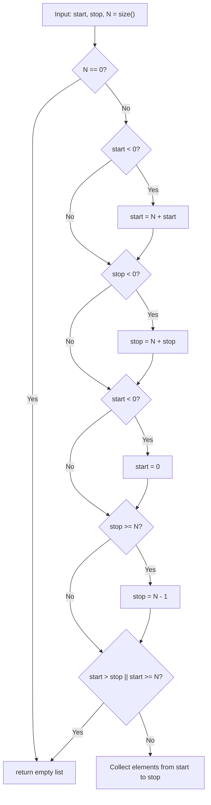

# Stage 95: ZRANGE with negative indexes

---

## In one line
Support negative indexing in `ZRANGE key start stop` where `-1` represents the last element and out-of-bounds negative start indexes clamp to `0`, correctly returning empty arrays when the normalized range is inverted.

---

## Self-test (cover the answers below and answer these first)
1. **What does a negative index `-1` represent in `ZRANGE`?**
   - *Answer*: The last element of the sorted set (index $N - 1$).
2. **What does a negative index `-2` represent in `ZRANGE`?**
   - *Answer*: The second-to-last element of the sorted set (index $N - 2$).
3. **How is a negative index whose absolute value exceeds cardinality handled (e.g. `start = -100` on a 5-element set)?**
   - *Answer*: It clamps to `0` (the start of the sorted set).
4. **What does `ZRANGE key 0 -3` return on a 5-element sorted set?**
   - *Answer*: Elements at indices `0, 1, 2` (all elements except the last 2).
5. **What does `ZRANGE key 3 1` or `ZRANGE key 0 -10` return?**
   - *Answer*: An empty RESP array `*0\r\n`.
6. **Are negative indexes evaluated before or after bounds checking?**
   - *Answer*: Before. Negative indexes are first offset by $N$ (`start = N + start`), then clamped to $[0, N-1]$ or checked for $start > stop$.

---

## Problem Solved

In **Stage 95: ZRANGE with negative indexes**, we ensure robust negative index normalization:

1. **End-relative Offsetting**:
   - Translates negative indexes from the right: $idx = N + idx$.
2. **Underflow Clamping**:
   - If $|start| \ge N$ (i.e. $start < 0$ after addition), clamps `start` to $0$.
3. **Inversion Detection**:
   - If $start > stop$ (such as when $stop$ refers to an index before $start$), safely returns an empty RESP array `*0\r\n`.

---

## Thought Process & Architectural Model

### 1. Index Normalization State Machine



---

## Full Solution

In [`codecrafters-redis-java/src/main/java/Main.java`](file:///C:/Users/jiten/Documents/Codecrafters-Build-from-scratch/codecrafters-redis-java/src/main/java/Main.java):

```java
    synchronized List<String> range(int start, int stop) {
      int n = tree.size();
      if (n == 0) return Collections.emptyList();
      if (start < 0) start = n + start;
      if (stop < 0) stop = n + stop;
      if (start < 0) start = 0;
      if (stop >= n) stop = n - 1;
      if (start > stop || start >= n) return Collections.emptyList();

      List<String> result = new ArrayList<>(stop - start + 1);
      int idx = 0;
      for (ZSetEntry entry : tree) {
        if (idx >= start && idx <= stop) {
          result.add(entry.member);
        }
        if (idx > stop) {
          break;
        }
        idx++;
      }
      return result;
    }
```

---

## Concepts

1. **Pythonic / Redis Negative Slicing**:
   - Negative indices allow querying relative to the tail of the sorted collection without knowing its explicit cardinality in advance.
2. **Deterministic Clamping**:
   - Unlike programming languages where negative slicing out of range might throw `IndexOutOfBoundsException`, Redis guarantees defensive clamping and empty responses.

---

## Wire Format

Querying with negative indexes:
```text
Client: *4\r\n$6\r\nZRANGE\r\n$8\r\nzset_key\r\n$2\r\n-2\r\n$2\r\n-1\r\n
Server: *2\r\n$5\r\nRoyce\r\n$8\r\nPrickett\r\n

Client: *4\r\n$6\r\nZRANGE\r\n$8\r\nzset_key\r\n$1\r\n2\r\n$2\r\n-1\r\n
Server: *3\r\n$3\r\npaz\r\n$3\r\nbar\r\n$3\r\nbaz\r\n
```

---

## Failure Modes

1. **Double Negative Underflow**:
   - When both `start` and `stop` are extremely negative (e.g. `-100`), `start` clamps to 0 while `stop` remains negative (`-95`), correctly causing `start > stop` and returning `*0\r\n`.
2. **Empty Set Query**:
   - When $N = 0$, returns immediately without executing index arithmetic.

---

## Tradeoffs

- **Pre-filtering vs Slice-during-iteration**:
  - Normalizing indices upfront guarantees that iteration terminates immediately once `idx > stop`, saving CPU cycles on large sorted sets.

---

## Java Specifics

- `Collections.emptyList()`: An immutable singleton list returned when results are empty, avoiding unnecessary object allocations.

---

## Rebuild Checklist

1. [x] Calculate `n = tree.size()`.
2. [x] Offset negative `start` and `stop` by `n`.
3. [x] Clamp `start < 0` to 0.
4. [x] Clamp `stop >= n` to `n - 1`.
5. [x] Return empty list if `start > stop` or `start >= n`.
6. [x] Verify compilation with `javac`.
