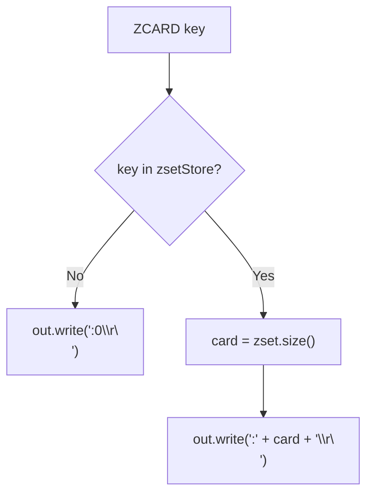
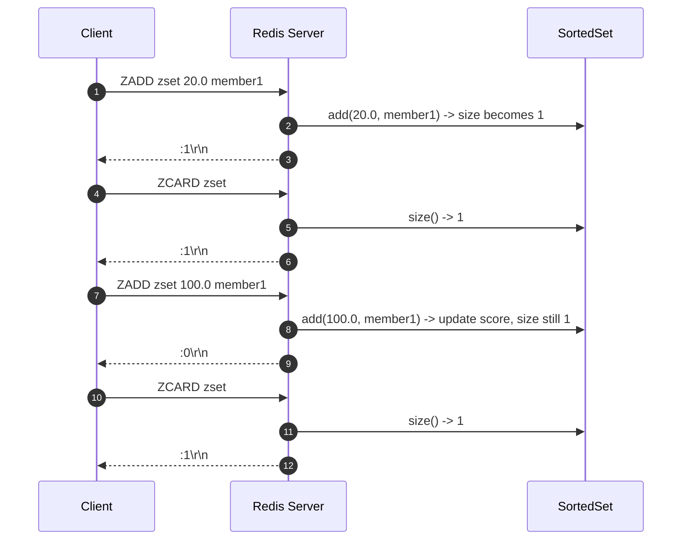

# Stage 96: Count sorted set members

---

## In one line
Implement `ZCARD key` to return the integer cardinality of a sorted set in $O(1)$ time, returning `:0\r\n` if the key does not exist.

---

## Self-test (cover the answers below and answer these first)
1. **What does `ZCARD key` return if `key` does not exist?**
   - *Answer*: Integer `0`: `:0\r\n`.
2. **What does `ZCARD key` return after updating an existing member's score with `ZADD`?**
   - *Answer*: The cardinality remains unchanged because score updates do not alter set membership.
3. **What is the time complexity of `ZCARD`?**
   - *Answer*: $O(1)$, as the size of the underlying hash map is maintained and tracked in constant time.
4. **How does `ZCARD` format its response in RESP?**
   - *Answer*: As a RESP Integer: `:<size>\r\n`.
5. **Does `ZCARD` modify the sorted set?**
   - *Answer*: No, it is a read-only metadata query.
6. **What error is returned if `ZCARD` is invoked without a key argument?**
   - *Answer*: `-ERR wrong number of arguments for 'zcard' command\r\n`.

---

## Problem Solved

In **Stage 96: Count sorted set members**, we implement sorted set cardinality reporting:

1. **Constant-time Cardinality**:
   - Directly inspects `dict.size()` to report the exact number of distinct members in $O(1)$ time.
2. **Missing Key Handling**:
   - Safely handles uninitialized or missing keys, returning `:0\r\n`.
3. **Score Update Invariance**:
   - Correctly reflects that score replacements for existing members do not increment the cardinality.

---

## Thought Process & Architectural Model

### 1. ZCARD Execution Flow



### 2. Cardinality Lifecycle



---

## Full Solution

In [`codecrafters-redis-java/src/main/java/Main.java`](file:///C:/Users/jiten/Documents/Codecrafters-Build-from-scratch/codecrafters-redis-java/src/main/java/Main.java):

```java
    synchronized int size() {
      return dict.size();
    }
```

Command handling in `handleCommand`:
```java
    } else if (command.equalsIgnoreCase("ZCARD")) {
      if (parts.length < 2) {
        out.write("-ERR wrong number of arguments for 'zcard' command\r\n".getBytes(StandardCharsets.UTF_8));
        out.flush();
      } else {
        String key = parts[1];
        SortedSet zset = zsetStore.get(key);
        int card = (zset == null) ? 0 : zset.size();
        out.write((":" + card + "\r\n").getBytes(StandardCharsets.UTF_8));
        out.flush();
      }
    }
```

---

## Concepts

1. **Cardinality vs Rank**:
   - Cardinality represents the total count of elements within a set ($N$). Rank represents the position ($0 \le rank < N$) of an individual element.
2. **Idempotence of Updates**:
   - Updating scores via `ZADD` modifies the tree ordering but keeps cardinality constant.

---

## Wire Format

Querying sorted set cardinality:
```text
Client: *2\r\n$5\r\nZCARD\r\n$8\r\nzset_key\r\n
Server: :4\r\n

Client: *2\r\n$5\r\nZCARD\r\n$11\r\nmissing_key\r\n
Server: :0\r\n
```

---

## Failure Modes

1. **Argument Underflow**:
   - Validates `parts.length >= 2` to prevent `ArrayIndexOutOfBoundsException`.
2. **Missing Key Null Check**:
   - Ternary check `(zset == null) ? 0 : zset.size()` guards against `NullPointerException`.

---

## Tradeoffs

- **`dict.size()` vs `tree.size()`**:
  - Both structures remain synchronized under the same lock, but `dict.size()` operates in $O(1)$ without traversing the Red-Black tree.

---

## Java Specifics

- `Map.size()`: In Java `HashMap`, `size()` returns a cached integer field, making lookups $O(1)$.

---

## Rebuild Checklist

1. [x] Add `synchronized int size()` method to `SortedSet`.
2. [x] Handle missing key by returning `:0\r\n`.
3. [x] Handle present key by returning `:<cardinality>\r\n`.
4. [x] Register `ZCARD` in `handleCommand`.
5. [x] Verify compilation with `javac`.
