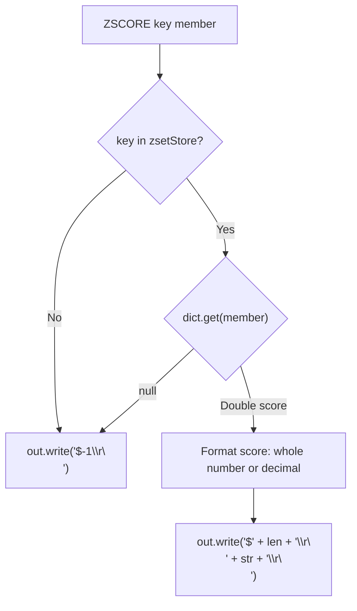
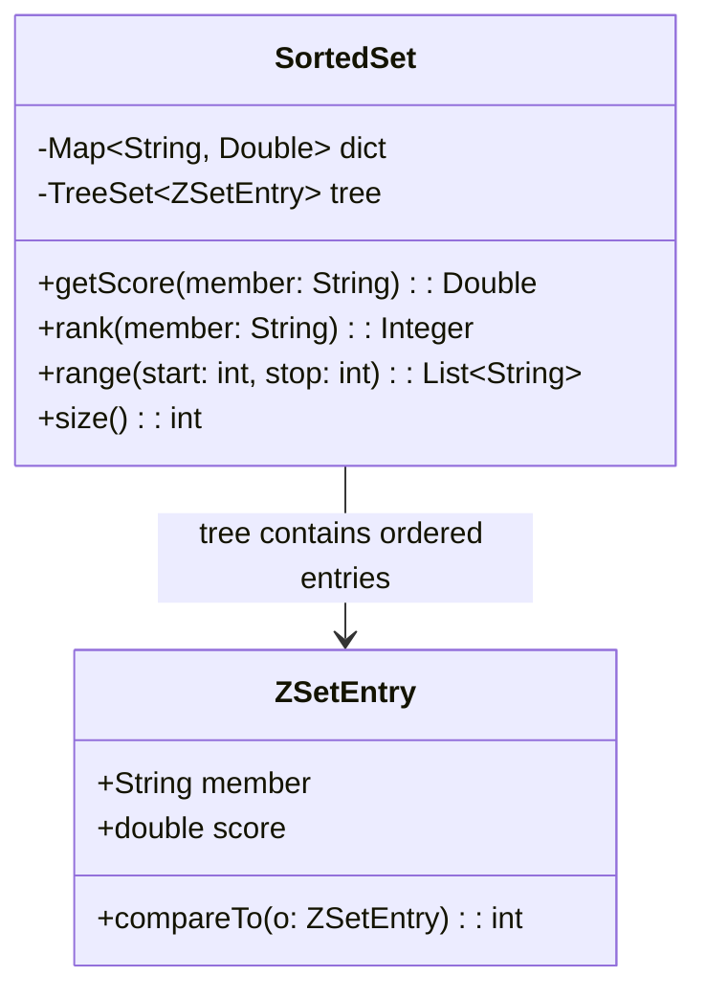

# Stage 97: Retrieve member score

---

## In one line
Implement `ZSCORE key member` to return the score associated with a member formatted as a RESP bulk string, or `$-1\r\n` if the key or member does not exist.

---

## Self-test (cover the answers below and answer these first)
1. **What is the return type of `ZSCORE` in RESP2?**
   - *Answer*: Bulk string (`$<len>\r\n<score>\r\n`) or null bulk string (`$-1\r\n`).
2. **What does `ZSCORE` return if the member or key does not exist?**
   - *Answer*: RESP null bulk string: `$-1\r\n`.
3. **What is the time complexity of `ZSCORE key member`?**
   - *Answer*: $O(1)$, because member $\to$ score lookups query the hash dictionary directly.
4. **How are whole-number floating-point scores (e.g. `20.0`) formatted in Redis RESP output?**
   - *Answer*: Trailing decimal zeros are omitted according to Redis serialization conventions (e.g., `"20"`).
5. **Does `ZSCORE` traverse the Red-Black tree (`TreeSet`)?**
   - *Answer*: No, the tree is only needed for rank and range queries; score retrieval uses `Map.get()`.
6. **What error is returned if `ZSCORE` is provided with fewer than two arguments (key and member)?**
   - *Answer*: `-ERR wrong number of arguments for 'zscore' command\r\n`.

---

## Problem Solved

In **Stage 97: Retrieve member score**, we add support for member score querying:

1. **Direct Hash Map Lookup**:
   - Queries `dict.get(member)` in $O(1)$ without navigating the sorted tree.
2. **Null Safe Responses**:
   - Returns null bulk string (`$-1\r\n`) when either the sorted set does not exist or the member is absent.
3. **Redis Score String Formatting**:
   - Correctly formats floating-point values into bulk strings, stripping redundant trailing zeros for whole numbers while preserving exact decimals (e.g., `100.99` $\to$ `"100.99"`, `20.0` $\to$ `"20"`).

---

## Thought Process & Architectural Model

### 1. ZSCORE Command Resolution



### 2. Duality of SortedSet Architecture



---

## Full Solution

In [`codecrafters-redis-java/src/main/java/Main.java`](file:///C:/Users/jiten/Documents/Codecrafters-Build-from-scratch/codecrafters-redis-java/src/main/java/Main.java):

```java
    synchronized Double getScore(String member) {
      return dict.get(member);
    }
```

Command handling in `handleCommand`:
```java
    } else if (command.equalsIgnoreCase("ZSCORE")) {
      if (parts.length < 3) {
        out.write("-ERR wrong number of arguments for 'zscore' command\r\n".getBytes(StandardCharsets.UTF_8));
        out.flush();
      } else {
        String key = parts[1];
        String member = parts[2];
        SortedSet zset = zsetStore.get(key);
        Double score = (zset == null) ? null : zset.getScore(member);
        if (score == null) {
          out.write("$-1\r\n".getBytes(StandardCharsets.UTF_8));
        } else {
          String scoreStr = (score == (long) (double) score)
              ? Long.toString((long) (double) score)
              : Double.toString(score);
          out.write(("$" + scoreStr.length() + "\r\n" + scoreStr + "\r\n").getBytes(StandardCharsets.UTF_8));
        }
        out.flush();
      }
    }
```

---

## Concepts

1. **Dual Storage Model**:
   - Sorted sets combine a dictionary for $O(1)$ member lookups and a skiplist/tree for $O(\log N)$ ordering operations.
2. **Double String Serialization**:
   - Redis outputs scores as bulk strings in RESP2, allowing clients without 64-bit IEEE 754 precision issues to parse exact decimal strings.

---

## Wire Format

Querying member scores:
```text
Client: *3\r\n$6\r\nZSCORE\r\n$8\r\nzset_key\r\n$12\r\nzset_member2\r\n
Server: $4\r\n30.1\r\n

Client: *3\r\n$6\r\nZSCORE\r\n$8\r\nzset_key\r\n$14\r\nzset_member100\r\n
Server: $-1\r\n
```

---

## Failure Modes

1. **Unboxing Null `Double`**:
   - Returning `Double` (object) from `getScore` rather than primitive `double` prevents `NullPointerException` when member is not found.
2. **Missing Key**:
   - Short-circuits cleanly when `zsetStore.get(key)` is null.

---

## Tradeoffs

- **Memory vs Speed**:
  - Keeping both `dict` and `tree` duplicates the string member reference and score, but enables $O(1)$ score retrieval alongside $O(\log N)$ ranking.

---

## Java Specifics

- `(score == (long) (double) score)`: Tests whether a floating-point number has zero fractional value without incurring string parsing overhead.

---

## Rebuild Checklist

1. [x] Add `synchronized Double getScore(String member)` to `SortedSet`.
2. [x] Return `Double` (wrapper) to allow null detection.
3. [x] Return `$-1\r\n` if key or member missing.
4. [x] Format whole numbers cleanly (`"20"` vs `"20.0"`).
5. [x] Register `ZSCORE` in `handleCommand`.
6. [x] Verify compilation with `javac`.
