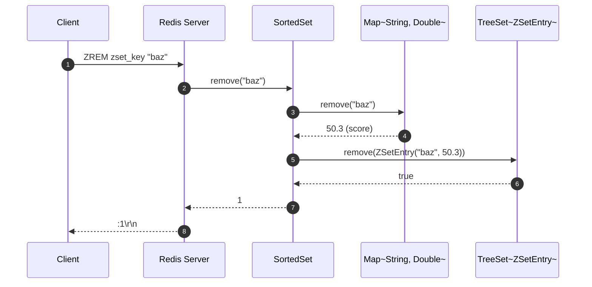
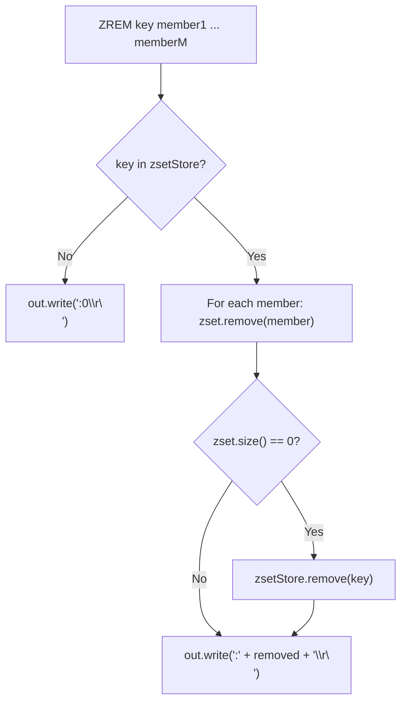

# Stage 98: Remove a member

---

## In one line
Implement `ZREM key member [member ...]` to delete members from both the sorted tree and hash dictionary, returning the integer count of actually removed members and removing empty sorted sets from the keyspace.

---

## Self-test (cover the answers below and answer these first)
1. **What is the return type and value of `ZREM` when a member is successfully removed?**
   - *Answer*: RESP Integer representing count of removed members: `:1\r\n` (or `:N\r\n` for multi-member deletion).
2. **What does `ZREM key missing_member` return?**
   - *Answer*: Integer `0`: `:0\r\n`.
3. **What happens to the key when all members of a sorted set are removed with `ZREM`?**
   - *Answer*: In Redis, a sorted set is deleted from the database keyspace when its cardinality reaches zero.
4. **Why must the member's score be looked up before removing it from the `TreeSet`?**
   - *Answer*: Because `TreeSet` compares entries using both `score` and `member`. Without the existing score, constructing the matching `ZSetEntry` to find and delete the node in the Red-Black tree is impossible.
5. **What is the time complexity of `ZREM key member`?**
   - *Answer*: $O(\log N)$ to rebalance and remove the entry from the Red-Black tree, plus $O(1)$ dictionary removal.
6. **Does `ZREM` support removing multiple members in a single invocation?**
   - *Answer*: Yes, `ZREM key member [member ...]` parses all member arguments and returns the total sum of removed members.

---

## Problem Solved

In **Stage 98: Remove a member**, we implement member deletion across dual data structures:

1. **Synchronized Tree and Map Pruning**:
   - Safely removes the member's score mapping from `dict`.
   - Uses the retrieved score to construct `ZSetEntry(member, score)` and remove the corresponding node from `tree`.
2. **Keyspace Garbage Collection**:
   - Automatically removes empty `SortedSet` instances from `zsetStore` when `zset.size() == 0`.
3. **Accurate Deletion Counting**:
   - Accumulates successful removals across single or multi-member command arguments.

---

## Thought Process & Architectural Model

### 1. Dual-Structure Deletion Protocol



### 2. ZREM Command Flow



---

## Full Solution

In [`codecrafters-redis-java/src/main/java/Main.java`](file:///C:/Users/jiten/Documents/Codecrafters-Build-from-scratch/codecrafters-redis-java/src/main/java/Main.java):

```java
    synchronized int remove(String member) {
      Double score = dict.remove(member);
      if (score != null) {
        tree.remove(new ZSetEntry(member, score));
        return 1;
      }
      return 0;
    }
```

Command handling in `handleCommand`:
```java
    } else if (command.equalsIgnoreCase("ZREM")) {
      if (parts.length < 3) {
        out.write("-ERR wrong number of arguments for 'zrem' command\r\n".getBytes(StandardCharsets.UTF_8));
        out.flush();
      } else {
        String key = parts[1];
        SortedSet zset = zsetStore.get(key);
        if (zset == null) {
          out.write(":0\r\n".getBytes(StandardCharsets.UTF_8));
        } else {
          int removed = 0;
          for (int i = 2; i < parts.length; i++) {
            removed += zset.remove(parts[i]);
          }
          if (zset.size() == 0) {
            zsetStore.remove(key);
          }
          out.write((":" + removed + "\r\n").getBytes(StandardCharsets.UTF_8));
        }
        out.flush();
      }
    }
```

---

## Concepts

1. **Dual Structure Consistency**:
   - Because `ZSetEntry` orders by `score` then `member`, deleting an entry from `TreeSet` requires knowing its `score`. Querying `dict.remove(member)` atomically provides both the score and removes the member from the map.
2. **Key Eviction on Empty**:
   - In Redis, data types that become empty are automatically reclaimed from the top-level keyspace dictionary.

---

## Wire Format

Removing members from sorted sets:
```text
Client: *3\r\n$4\r\nZREM\r\n$8\r\nzset_key\r\n$3\r\nbaz\r\n
Server: :1\r\n

Client: *3\r\n$4\r\nZREM\r\n$8\r\nzset_key\r\n$14\r\nmissing_member\r\n
Server: :0\r\n
```

---

## Failure Modes

1. **Partial Removals**:
   - When some members exist and others do not (e.g. `ZREM key a missing_b c`), only existing members are deleted and the return integer reflects the exact count of removed elements.
2. **Missing Key Query**:
   - If `key` is absent in `zsetStore`, safely returns `:0\r\n`.

---

## Tradeoffs

- **Immediate vs Deferred Deletion**:
  - Evicting empty keys immediately keeps memory tidy and ensures commands like `EXISTS` and `TYPE` accurately report `0` and `none`.

---

## Java Specifics

- `Map.remove(key)`: Returns the previous value associated with `key`, or `null` if there was no mapping. This avoids an extra `containsKey` or `get` lookup.

---

## Rebuild Checklist

1. [x] Implement `synchronized int remove(String member)` on `SortedSet`.
2. [x] Use returned `Double score` to remove `ZSetEntry` from `tree`.
3. [x] Iterate over all member arguments to support multi-member deletion.
4. [x] Evict key from `zsetStore` if `zset.size() == 0`.
5. [x] Register `ZREM` in `handleCommand`.
6. [x] Verify compilation with `javac`.
