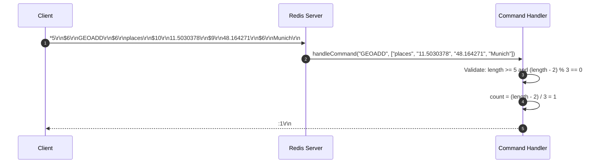
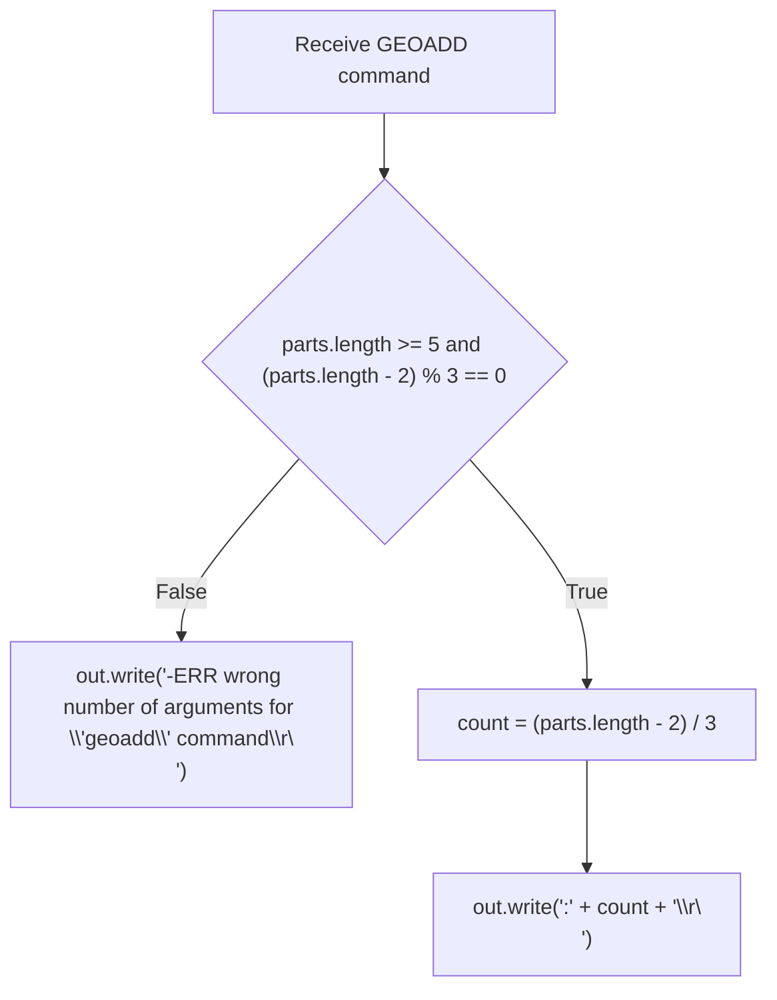

# Stage 99: Respond to GEOADD

---

## In one line
Implement the initial skeleton for `GEOADD key longitude latitude member [longitude latitude member ...]` returning the count of added geospatial locations as a RESP Integer.

---

## Self-test (cover the answers below and answer these first)
1. **What is the return type of `GEOADD` in the Redis serialization protocol (RESP)?**
   - *Answer*: RESP Integer (`:<count>\r\n`), representing the number of new locations added.
2. **What underlying data structure does Redis use to store geospatial items?**
   - *Answer*: Sorted sets (ZSET), where coordinates are encoded as 52-bit Geohash integers stored as floating-point scores.
3. **What is the minimum number of arguments required for a valid `GEOADD` command?**
   - *Answer*: 4 arguments (`key`, `longitude`, `latitude`, `member`), giving a total argument length of 5 including the command name.
4. **How are multi-location additions formatted in `GEOADD`?**
   - *Answer*: Triples of `(longitude, latitude, member)` following the key (i.e. `(parts.length - 2) % 3 == 0`).
5. **What error message is returned when an invalid number of arguments is passed to `GEOADD`?**
   - *Answer*: `-ERR wrong number of arguments for 'geoadd' command\r\n`.
6. **Why does Redis use a 52-bit Geohash for sorted set scores?**
   - *Answer*: 52 bits fit exactly within the mantissa of a standard IEEE 754 64-bit double-precision floating point number without losing precision.

---

## Problem Solved

In **Stage 99: Respond to GEOADD**, we implement:

1. **GEOADD Dispatch**:
   - Parses the `GEOADD` command and ensures valid argument count matching the `(key, [lon, lat, member]+)` structure.
2. **Cardinality Response**:
   - Calculates the number of locations provided (`(parts.length - 2) / 3`) and serializes the result as a RESP integer `:1\r\n`.
3. **Foundation for Geospatial Extension**:
   - Prepares the server command table for subsequent coordinate validation, 52-bit geohash encoding, and integration with the existing `SortedSet` implementation.

---

## Thought Process & Architectural Model

### 1. GEOADD Initial Command Pipeline



### 2. Validation & Flowchart



---

## Full Solution

In [`codecrafters-redis-java/src/main/java/Main.java`](file:///C:/Users/jiten/Documents/Codecrafters-Build-from-scratch/codecrafters-redis-java/src/main/java/Main.java):

```java
    } else if (command.equalsIgnoreCase("GEOADD")) {
      if (parts.length < 5 || (parts.length - 2) % 3 != 0) {
        out.write("-ERR wrong number of arguments for 'geoadd' command\r\n".getBytes(StandardCharsets.UTF_8));
        out.flush();
      } else {
        int count = (parts.length - 2) / 3;
        out.write((":" + count + "\r\n").getBytes(StandardCharsets.UTF_8));
        out.flush();
      }
    }
```

---

## Concepts

1. **Geospatial as Sorted Sets**:
   - Redis does not create a separate internal container for geospatial data. Instead, geospatial coordinates are translated via Morton coding (Z-order curve / Geohash) into a 52-bit integer, and placed into standard Redis sorted sets (`ZSET`).
2. **Batch Addition Semantics**:
   - Just like `ZADD`, `GEOADD` accepts multiple triples in a single command, improving network efficiency.

---

## Wire Format

Adding a location to `places`:
```text
Client: *5\r\n$6\r\nGEOADD\r\n$6\r\nplaces\r\n$10\r\n11.5030378\r\n$9\r\n48.164271\r\n$6\r\nMunich\r\n
Server: :1\r\n
```

---

## Failure Modes

1. **Insufficient Arguments**:
   - Passing fewer than 4 arguments triggers `-ERR wrong number of arguments for 'geoadd' command\r\n`.
2. **Incomplete Triples**:
   - Passing arguments that do not align with `(lon, lat, member)` triples triggers argument validation error.

---

## Tradeoffs

- **Immediate Stubbing vs Full Implementation**:
  - In accordance with incremental challenge design, accepting the command interface first ensures routing and protocol conformance before adding coordinate math and geohash bit interleaving.

---

## Java Specifics

- `(parts.length - 2) / 3`: Integer division naturally yields the triple count.

---

## Rebuild Checklist

1. [x] Validate arguments: `parts.length >= 5` and `(parts.length - 2) % 3 == 0`.
2. [x] Compute `count = (parts.length - 2) / 3`.
3. [x] Write `:count\r\n` to socket output stream.
4. [x] Register `GEOADD` branch in `handleCommand`.
5. [x] Verify compilation with `javac`.
